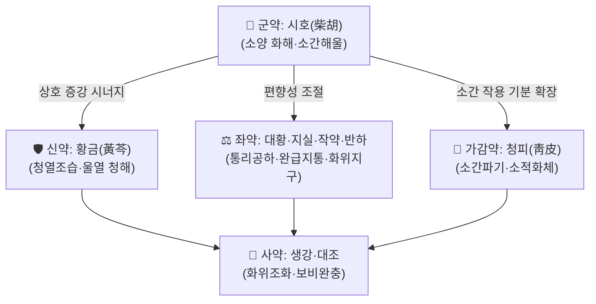

# 🍵 [[청심탕]] (淸心湯, Cheongsim-tang / Qingxin Tang)

> **핵심 3줄 요약 (Key Summary)**:
> - 🌿 **모체 처방**: [[대시호탕]](大柴胡湯)에 **[[청피]](靑皮)를 가(加)**한 방제로 정리된 처방 — 즉 [[시호]]·[[황금]]의 소양 화해(和解) 작용에 [[대황]]·[[지실]]의 통리공하(通裏攻下)를 결합하고, 청피로 소간파기(疏肝破氣)·파체(破滯)를 보강한 **화해사하(和解瀉下) + 이기(理氣)** 구조.
> - 🎯 **임상 최적 표적**: 소양 병위(半表半裏)에 실열(實熱)이 결합된 **실증(實證)·기체(氣滯)** 환자 — 상복부 충만·압통, 변비 또는 변조(便燥), 흉협고만(胸脇苦滿), 구고(口苦)·인건(咽乾), 정서적 억울·스트레스성 기체 소견. 본 vault 분류상 **치풍·안신·개규제(治風·安神·開竅劑) 중풍 항목**에 배속되어 있음.
> - 🔬 **확인된 분자약리 기전(모체 처방 [[대시호탕]] 기준)**: ① **PI3K/AKT/STAT3 신호 조절**을 통한 세포주기 정지(cell cycle arrest) 및 세포자멸사(apoptosis) 유도로 HepG2 간세포암의 진행·전이 억제(PMID 38705430), ② **PPARα 활성화**를 통한 간내 염증 억제 및 담즙 축적(bile accumulation) 억제로 급성 간내 담즙정체(acute intrahepatic cholestasis) 보호(PMID 35370715).
> - ⚠️ 주의사항: [[대황]] 함유 **사하제**이므로 허약자·노약자·임산부·수유부 및 만성 설사·탈수 환자에게는 신중 투여. 소양·실열이 아닌 **한증(寒證)·허증(虛證)** 및 무열성 담음 병증에는 부적합. 장기 복용 시 전해질 불균형·설사·복통 및 간기능 모니터링 필요.

---
## 📌 목차
1. [기본 처방 정보 & 군신좌사 구성](#1-기본-처방-정보--군신좌사-구성)
2. [방제학적 약재 상호작용 & 시너지 네트워크](#2-방제학적-약재-상호작용--시너지-네트워크)
3. [현대 분자약리학적 효능 & 작용 기전](#3-현대-분자약리학적-효능--작용-기전)
4. [적응 병증 및 체질별 감별 (Sweet Spot vs 금기)](#4-적응-병증-및-체질별-감별-sweet-spot-vs-금기)
5. [유사 처방군 감별 매트릭스](#5-유사-처방군-감별-매트릭스)
6. [임상 가감례 & 현대 질환별 응용](#6-임상-가감례--현대-질환별-응용)
7. [💡 사용자 진료실 핵심 필기 & 임상 팁 (원문 보존)](#7--사용자-진료실-핵심-필기--임상-팁-원문-보존)
8. [출처 및 학술 참고 문헌 (References)](#8-출처-및-학술-참고-문헌-references)

---
## 1. 기본 처방 정보 & 군신좌사 구성

* **출전**: 본 vault 분류상 **『[[청강의감]](淸江醫鑑)』** 계열 처방으로 태깅되어 있으며, 별칭에 **대시호탕 가청피(大柴胡湯加靑皮)**로 기재되어 있다. 모체 처방 [[대시호탕]]은 장중경(張仲景) 『[[상한론]](傷寒論)』·『[[금궤요략]](金匱要略)』 출전이다. **청심탕 자체의 원문 조문·출전 페이지는 제공된 자료에서 확인되지 않음(근거 미확인)** — 원전 조문 확인 시 본 항목 보완 필요.
* **치법**: **화해소양(和解少陽) · 통리실열(通裏泄熱) · 소간이기(疏肝理氣)** — 즉 반표반리(半表半裏)의 사열(邪熱)을 화해하면서 동시에 내결(內結)한 실체(實滯)를 설하(泄下)하고, 청피로 간기(肝氣)의 울체를 풀어주는 **화해사하(和解瀉下)** 치법.

| 구분 | 약재명 | 표준 용량 | 본초 효능 & 방제 내 역할 |
| :--- | :--- | :--- | :--- |
| **군약 (君藥)** | [[시호]] (柴胡) | 8~12g | 소양 반표반리(半表半裏)의 사기를 화해·해화(和解解火)하며 간담(肝膽)을 소통시켜 흉협고만·구고의 주증을 직접 공략. 방제 전체의 축을 담당. |
| **신약 (臣藥)** | [[황금]] (黃芩) | 6~9g | 청열조습(淸熱燥濕). 시호의 승산(升散)과 배합되어 소양 울열(鬱熱)을 청해(淸解)하며, 담열(膽熱)·구고·번열(煩熱)을 억제. |
| **좌약 (佐藥)** | [[대황]] (大黃) | 4~6g | 통리공하(通裏攻下) 작용으로 내결한 실열·조시(燥屎)를 배출. 시호와 배합 시 '화해 + 공하'의 대시호탕 핵심 구조를 형성. |
| **좌약 (佐藥)** | [[지실]] (枳實) | 4~6g | 파기소적(破氣消積)·행담(行痰). 상복부 창만·압통을 완화하고 대황의 공하를 보조하여 기체성 실증을 풀어줌. |
| **좌약 (佐藥)** | [[작약]] (芍藥, 백작약) | 6~9g | 유간완급지통(柔肝緩急止痛). 대황·지실의 급격한 공하 작용을 완충하고 복부 긴장·경련성 통증을 완화하며 진액 손상을 방지. |
| **좌약 (佐藥)** | [[반하]] (半夏) | 6~9g | 화위지구(和胃止嘔)·강역산결(降逆散結). 구역·오심 및 담음(痰飮) 결체를 풀어 위기(胃氣)를 조화. |
| **좌약 (佐藥·가감 핵심)** | [[청피]] (靑皮) | 4~6g | **본 처방의 가감 핵심 약재**. 소간파기(疏肝破氣)·소적화체(消積化滯)·행기산결. 시호의 소간(疏肝) 작용을 기(氣) 분(分)에서 강화하여 흉협·완복의 기체성 창만과 정서성 억울을 겨냥. |
| **사약 (使藥)** | [[생강]] (生薑) | 3~5g | 화위산음(和胃散飮)·조화제약. 반하의 독성을 제어하고 약성의 승강을 조절하며 위기를 보호. |
| **사약 (使藥)** | [[대조]] (大棗) | 3~4g | 보비화중(補脾和中)·완화약성(緩和藥性). 사하(瀉下)로 인한 비위 손상을 완충하고 제약(諸藥)을 조화. |

> **배오 특징**: [[시호]]–[[황금]]의 **화해(和解) 축**과 [[대황]]–[[지실]]의 **공하(攻下) 축**이 1:1로 대립·보완되는 것이 대시호탕의 골격이며, [[작약]]·[[반하]]·[[생강]]·[[대조]]가 이 두 축 사이에서 완급(緩急)·화위(和胃) 작용으로 균형을 잡는다. 여기에 [[청피]]를 가(加)함으로써 ① 시호의 소간 작용을 기분(氣分)으로 확장하고 ② 대황·지실의 공하가 미치지 못하는 **기체성(氣滯性) 상복부 팽만·흉협 자통(刺痛)**을 직접 겨냥한다. 전체적으로 **승(升, 시호)과 강(降, 대황·지실·반하)의 승강출입(升降出入)**이 병존하는 방제로, 표를 풀지 않고 리(裏)로 끌어내리는 하법(下法) 계열에 속한다.
> ⚠️ 청심탕 고유의 **정확한 용량 배합비·수치 근거는 제공 자료에서 확인되지 않음(근거 미확인)**. 위 용량은 대시호탕 계열의 관용량 범위이며, 실제 처방 시 원전 용량 확인이 필요하다.

---
## 2. 방제학적 약재 상호작용 & 시너지 네트워크

* **[[시호]] + [[황금]] 배오(相使)**: 시호의 승산(升散)과 황금의 청강(淸降)이 짝을 이루어 반표반리(半表半裏)의 울열을 밖으로 흩어지게도, 안으로 청해(淸解)하게도 하는 **소양 화해의 정석 배합**. 한쪽만 쓰면 울열이 남거나 진액이 손상되기 쉬우므로 두 약의 병용이 필수적이다.
* **[[시호]] + [[대황]] + [[지실]] 배오**: 화해(和解)와 공하(攻下)를 동시에 수행하는 구조. 시호가 기기(氣機)를 열어주면 대황·지실이 그 틈으로 내결(內結)을 배출한다는 방제학적 설계로, 단순 사하제(대승기탕 등)와 달리 **표증(表證) 잔존 시에도 사용 가능**하다는 점이 차별점이다.
* **[[대황]] + [[작약]] 배오(상제·완충)**: 대황의 맹렬한 공하·자극성을 작약의 산수(酸收)·완급(緩急) 작용이 완충하여, 설사·복통 부작용을 줄이고 복직근 긴장·경련성 통증을 함께 해소한다.
* **[[반하]] + [[생강]] 배오(相畏·상살 제어)**: 반하의 자극성·독성을 생강이 제어(생강제반하독)하면서 두 약이 함께 화위지구(和胃止嘔) 작용을 강화 — 구역·오심·담음성 어지럼을 담당하는 소배합.
* **[[청피]] + [[시호]] 배오**: 청피는 기분(氣分)의 약, 시호는 반표반리 해화의 약. 청피가 간기 울체를 기계적으로 풀어주면 시호의 승산이 막힘 없이 작동하여, **정서적 스트레스 동반 소화기 증상(간위불화)** 에 대한 시너지가 형성된다. 다만 이 조합의 개별 분자 기전은 **근거 미확인**.
* **[[생강]] + [[대조]] 배오(사약 조화)**: 영위(營衛)를 조화하고 비위(脾胃)를 보호하여, 공하(攻下) 약물로 인한 위기 손상을 완충하는 전형적 **조화제약(調和諸藥) 장치**.

---
## 3. 현대 분자약리학적 효능 & 작용 기전

> ⚠️ 아래 기전은 모두 **모체 처방 [[대시호탕]](Da-Chai-Hu-Tang, DCHT) 자체를 대상으로 한 연구 결과**이다. **청심탕(대시호탕 가청피) 및 [[청피]]의 개별 기전에 대한 직접적 연구 근거는 제공된 논문에서 확인되지 않음(근거 미확인)** — 해석 시 반드시 모체 처방 근거로 한정할 것.

### 1) 항종양·항전이 기전 — PI3K/AKT/STAT3 축 조절 (PMID 38705430)
* **연구 모델**: HepG2 간세포암 세포주 대상. DCHT가 **PI3K/AKT/STAT3 신호전달 경로를 조절**하여 종양의 진행(progression) 및 전이(metastasis)를 억제하는 것으로 보고됨.
* **기전 요약**:
  * **세포주기 정지(cell cycle arrest)** 유도 → 종양세포의 증식 회전 정지.
  * **세포자멸사(apoptosis) 유도** → 프로그램화 세포사 경로 활성화.
  * PI3K/AKT는 세포 생존·증식의 핵심 상류 경로이고, STAT3는 염증–종양 미세환경 연결 전사인자로서, 이 두 축을 동시에 조절한다는 점이 본 연구의 핵심 포인트.
* **임상적 함의**: 간암 세포주 수준의 **in vitro 근거**이므로, 실제 임상에서 간종양 치료에 사용할 수 있음을 의미하지 않는다. 간담 계통 실열·기체 병증에 대한 방제학적 운용과는 별개의 **기초연구 수준 근거**로 이해할 것.

### 2) 간보호·담즙정체 개선 기전 — PPARα 활성화 (PMID 35370715)
* **연구 모델**: 급성 간내 담즙정체(acute intrahepatic cholestasis) 동물/실험 모델. DCHT가 보호 효과를 나타냄.
* **기전 요약**:
  * **PPARα(peroxisome proliferator-activated receptor α) 활성화** → 담즙산 대사·수송 관련 유전자 조절.
  * **간내 염증 억제(hepatic inflammation)** → 염증성 사이토카인·면역세포 침윤 억제를 통한 간조직 보호.
  * **담즙 축적(bile accumulation) 억제** → 담즙정체성 손상 완화.
* **방제학적 해석**: 시호·황금·대황 배합이 간담(肝膽)의 소통을 돕고 열을 내리는 전통 치법(화해소양·소간이담)과 방향성이 일치하는 현대적 근거로 볼 수 있다. 단, 이는 **전임상 수준 근거**이다.

### 3) 항염증·면역 조절 (일반)
* 제공된 논문의 범위 내에서 확인되는 염증 관련 기술은 위 **간내 염증 억제(PMID 35370715)** 및 **STAT3 경로 조절(PMID 38705430)** 이다.
* 그 외 TNF-α·IL-6·IL-1β 등 개별 사이토카인 수치, NF-κB/MAPK 경로 억제 여부를 청심탕 또는 대시호탕에 대해 직접 정량한 근거는 **제공 자료에서 확인되지 않음(근거 미확인)** → 해당 항목은 추후 문헌 검색 후 보완.

### 4) 순환기·미세순환 및 대사 개선
* **근거 미확인** — 제공된 2편의 논문(PMID 38705430, 35370715)에는 혈관 이완, eNOS 활성화, 미세혈류 개선, 미토콘드리아 에너지 대사 관련 데이터가 포함되어 있지 않다.

### 5) 신경계·근골격계 및 자율신경 조절
* **근거 미확인** — 본 처방이 vault 분류상 **치풍·안신·개규제(중풍)** 로 태깅되어 있음에도, 중풍·신경계 관련 분자 기전 또는 임상 지표를 다룬 논문은 제공되지 않았다. 해당 항목은 별도 문헌 확보 전까지 비워 두고, 임상 적용 시에는 **전통 방제 이론에 근거한 사용**임을 명확히 인지할 것.

---
## 4. 적응 병증 및 체질별 감별 (Sweet Spot vs 금기)

[✅ 최적 적응증 (Sweet Spot)]
* **원전·방제학적 주치 축**: 모체 처방 [[대시호탕]]의 주치(소양 병위 + 내실(內實))에 [[청피]]의 소간파기(疏肝破氣)가 더해진 구성. 즉 **흉협고만(胸脇苦滿) + 상복부 실만(實滿)·압통 + 구고(口苦)·인건(咽乾)·번조(煩躁) + 변비 또는 변조(便燥) 또는 열리(熱利)** 의 조합이 핵심 표적.
  * ⚠️ 청심탕 고유의 원전 주치 조문은 **근거 미확인**. 위 주치는 대시호탕 계열의 방제 이론에서 유추한 것이다.
  * ⚠️ 본 vault에서 **중풍(治風)·개규(開竅)** 항목에 배속된 처방이지만, **중풍에 대한 청심탕의 임상 근거는 제공 자료에 없음(근거 미확인)**.
* **체질 소견(방제 이론 기반, 근거 미확인)**:
  * **태음인 실증형**: 골격·근육이 발달하고 복부(특히 우상복부·심하부)에 긴장과 저항이 있는 체형. 피부는 비교적 두껍고 유분감, 안면 홍조·번열 경향.
  * **소양인**: 상체 발달·하체 상대적 왜소, 예민·다혈성·흥분 경향, 스트레스에 소화기 증상이 직결되는 유형.
  * **소음인에게는 원칙적으로 부적합** — 사하(瀉下) 작용이 비위(脾胃) 허약자에게 부담이 될 수 있음. 반드시 실증(實證)·열증(熱證) 확인 후 투여.
* **임상 주치(진료실 적중 양상)**: 스트레스성 소화불량 + 변비 + 우상복부 압통, 담낭·간담 계통 불편감, 변비형 과민성 장증후군(실열·기체형), 담즙정체·간수치 상승 동반 실열 증상 등. 단 이는 **방제 이론 및 모체 처방 근거에 기반한 유추**이며 청심탕 자체 임상시험 근거는 아님.
* **설진/맥진(대시호탕 계열 기준)**:
  * **설진**: 설질(舌質) 홍(紅) 또는 암홍, 설태(舌苔) 황(黃) 또는 황니(黃膩). 설태 백활(白滑)·담백(淡白)이면 부적합.
  * **맥진**: 현(弦)·활(滑)·삭(數)·실(實) 계열. 침(沈)·세(細)·지(遲)한 허한맥이면 금기 방향.

[⚠️ 신중 투여 및 금기 (Caution / Contraindication)]
* **허증·한증 금기**: 무열(無熱)·음허(陰虛)·기허(氣虛) 및 만성 설사·복냉(腹冷) 환자에게 [[대황]]·[[지실]]의 공하 작용은 비위를 손상시키고 증상을 악화시킬 수 있다.
* **임산부·수유부**: [[대황]] 함유 사하제로 자궁 자극·유즙 이행 위험이 있어 원칙적으로 신중 투여(필요 시 반드시 전문가 판단).
* **노약자·소아·쇠약자**: 체중·체력 대비 감량 및 단기 사용. 탈수·전해질 불균형 위험.
* **소화성 궤양·위장 출혈 병력**: 대황의 자극성 및 지실의 위산 자극 가능성 고려.
* **장기 복용 주의**: 설사·복통·권태, 전해질 이상(특히 저칼륨혈증), 간기능 이상 모니터링. 담즙정체 보호 기전(PPARα, PMID 35370715)이 보고되었더라도 **자가 복용·장기 복용의 근거가 되지는 않는다**.
* **양약 병용 주의**: 항응고제(와파린 등)와 대황 병용 시 출혈 경향 변화 가능성, 혈당강하제·이뇨제와 병용 시 전해질·혈당 변동 가능성 — 병용 시 모니터링 필요(일반 방제학적 주의사항, 개별 상호작용 연구 근거 미확인).
* **중풍 관련 적용 시**: 본 처방이 개규제로 분류되어 있으나, **급성 중풍 등 응급 상황에서의 사용 근거는 제공 자료에 없음(근거 미확인)**. 의식 변화·신경학적 결손이 있는 환자는 반드시 감별 진단 및 응급 처치 우선.

---
## 5. 유사 처방군 감별 매트릭스

| 처방명 | 핵심 구성 차이 | 주치 및 체질 차이 | 맥진/설진 차이 |
| :--- | :--- | :--- | :--- |
| [[청심탕]] | [[대시호탕]] + [[청피]] (소간파기 가) | 기준 구성. 소양 실열 + **기체성 상복부 창만·흉협 자통·정서성 억울**이 두드러지는 실증 | 기준: 설질 홍·설태 황니, 맥 현·실, 상복부 압통 및 기체감 |
| [[대시호탕]] | [[시호]] [[황금]] [[대황]] [[지실]] [[작약]] [[반하]] [[생강]] [[대조]] | 소양 + 내실(內實)의 전형. 변비·구고·흉협고만 중심. 청피가 없어 기분(氣分) 소통력이 상대적으로 약함 | 설질 홍·설태 황조, 맥 현·삭·실, 심하 압통 |
| [[소시호탕]] | [[대황]] [[지실]] 없음 ([[시호]] [[황금]] [[인삼]] [[반하]] [[감초]] [[생강]] [[대조]]) | 소양 반표반리 단독. **내실(裏實)이 없어 공하가 불필요**한 경우, 허약자·소음인에도 비교적 적용 가능 | 설태 백·박, 맥 현·세, 심하 압통 약함, 변비 조(燥) 소견 없음 |
| [[시호계지탕]] | [[시호]] [[황금]] + [[계지]] [[작약]] 등, 사하약 없음 | 소양 + 태양 겸증(발열·오한·지절번통). 실열 내결이 없는 경우 | 설태 백, 맥 부(浮)·현, 자한·오한 소견 |

> ⚠️ 표 내부는 파이프(`|`) 충돌 방지를 위해 순수한 [[위키링크]] 단독 형태로만 기재하였다. 청심탕 고유의 감별 포인트 중 일부(개규·중풍 관련)는 **근거 미확인** 상태로, 문헌 확보 후 보완이 필요하다.

---
## 6. 임상 가감례 & 현대 질환별 응용

### 1) 수반 증상별 가감법 (대시호탕 계열 전통 가감, 청심탕 고유 조문 근거 미확인)
* **흉협·완복 창만 및 기체감 심화** → + [[청피]] 또는 [[향부자]] · [[목향]] (기체성 창만 집중)
* **변비·조시(燥屎) 현저** → + [[망초]] · [[후박]] (공하력 강화, 대승기탕 방향으로 이동)
* **구역·오심·구토** → + [[반하]] · [[죽여]] ([[생강]] 배합 강화, 온담탕 계열 응용)
* **담음·어지럼·두중(頭重)** → + [[천마]] · [[백출]] (담음성 현훈 가감)
* **정서 불안·불면·번조** → + [[용골]] · [[모려]] · [[산조인]] (안신 방향)
* **황달·담즙정체 소견 시** → + [[인진]] · [[치자]] (청열이습 방향)
* **통증(협통·복통) 현저** → + [[작약]] 증량 · [[감초]] (작약감초탕 배오 개념)
* ⚠️ 위 가감은 **전통 방제 이론에 근거한 임상 관행**이며, 각 조합의 청심탕 차원 임상 연구 근거는 **근거 미확인**.

### 2) 현대 질환별 임상 매핑
* **간담도계 (제공 논문 직접 연관)**
  * **간세포암(HepG2) 모델에서의 종양 진행·전이 억제** — 모체 처방 [[대시호탕]]의 **in vitro 연구 결과(PMID 38705430)**. 실제 임상 적용 근거 아님.
  * **급성 간내 담즙정체(acute intrahepatic cholestasis)** — 모체 처방이 PPARα 활성화를 통해 간 염증·담즙 축적을 억제한 **전임상 연구 결과(PMID 35370715)**.
  * 담석·담낭염·지방간 등 간담 실열 병증에 대한 전통적 운용은 방제 이론 차원에서 설명되나, 청심탕 자체 임상 근거는 **근거 미확인**.
* **소화기계 (방제 이론 기반, 근거 미확인)**
  * 변비형 과민성 장증후군(실열·기체형), 담즙 역류성 위염, 기능성 소화불량(스트레스 연관), 위하수 동반 실만감 등.
* **신경계·정신과적 응용 (vault 태그상 '중풍', '안신' 연관, 근거 미확인)**
  * 스트레스성 자율신경실조, 긴장성 두통, 불면·불안 등 — 청피의 소간해울 작용과 대시호탕의 화해 작용에 근거한 방제학적 운용. **임상 연구 근거는 제공 자료에 없음.**
* **호흡기계** — 제공 논문 및 본 처방의 전통 주치와 직접 연결되는 근거 **미확인**. 해당 항목은 추후 검토.

> 🔎 **정리**: 본 노트에서 **학술적 근거가 확인된 적응 영역은 간담도계(간암 세포주, 담즙정체) 전임상 연구 2건뿐**이다. 나머지 영역은 방제 이론 기반 유추이므로, 임상 적용 시 환자별 변증을 우선하고 근거 수준을 명확히 구분할 것.

---
## 7. 💡 사용자 진료실 핵심 필기 & 임상 팁 (원문 보존)

> [!tip] **진료실 실전 노하우 (User Clinical Insight)**
> - **(현재 등록된 사용자 원문 메모 없음)** — 본 항목은 원장님의 진료실 필기 원문을 100% 보존하기 위한 자리이다. 메모가 확보되는 즉시 삭제·요약 없이 그대로 이관할 것.
> - 아래는 위 필기가 입력되기 전까지의 **일반적 복약 관찰 포인트**이며, 사용자 경험 기록이 아님을 명시한다.

**복약 반응 관찰 포인트 (일반 원칙, 근거 미확인)**
* **초회 복용 후 1~3일**: 배변 횟수·성상 변화 확인(1일 1~2회 무른 변이 나타나는 범위가 통상적 관리 범위). 심한 복통·수양성 설사 시 감량 또는 중단.
* **1주 단위**: 상복부 팽만·압통의 감소 여부, 구고·번열·수면 상태 변화 기록.
* **장기 복약 시**: 전해질(특히 K), 간기능, 체중 변화 모니터링.
* **중단 기준**: 증상 소실 후에는 유지 없이 중단하는 것이 원칙(사하제 특성상 '중병즉지(中病則止)' 원칙 적용).
* **환자 티칭**: "변비 처방이 아니라 기(氣) 막힘과 열을 내려보내는 처방"이라는 설명이 순응도 향상에 도움이 됨. 자가 증량 금지 안내 필수.
* **변증 재확인 트리거**: 복약 후 무기력·식욕 저하·복냉감이 나타나면 실증 판단이 틀렸을 가능성 → 즉시 중단·재변증.

---
## 8. 출처 및 학술 참고 문헌 (References)

1. **Duan ZW, Liu Y (2024)**. *Da-Chai-Hu-Tang Formula inhibits the progression and metastasis in HepG2 cells through modulation of the PI3K/AKT/STAT3-induced cell cycle arrest and apoptosis*. **J Ethnopharmacol**. PMID: 38705430. https://pubmed.ncbi.nlm.nih.gov/38705430/
   - **[연구 요약]**: HepG2 간세포암 세포주에서 [[대시호탕]]이 **PI3K/AKT/STAT3 신호 경로를 조절**하여 **세포주기 정지 및 세포자멸사를 유도**하고, 그 결과 종양의 진행과 전이가 억제됨을 보고. **세포주 수준(in vitro) 기초연구**로, 임상 효능 근거가 아님.
2. **Xu S, Qiao X (2022)**. *Da-Chai-Hu-Tang Protects From Acute Intrahepatic Cholestasis by Inhibiting Hepatic Inflammation and Bile Accumulation via Activation of PPARα*. **Front Pharmacol**. PMID: 35370715. https://pubmed.ncbi.nlm.nih.gov/35370715/
   - **[연구 요약]**: 급성 간내 담즙정체 모델에서 [[대시호탕]]이 **PPARα를 활성화**하여 **간내 염증 억제** 및 **담즙 축적 억제**를 통해 간보호 효과를 나타냄을 보고. **전임상 수준 근거**.
3. **장중경 (200년경)**. 『[[상한론]]』 / 『[[금궤요략]]』.
   - **[고전 원전]**: 모체 처방 [[대시호탕]]의 출전으로, 소양·내실 병증에 대한 화해겸공하(和解兼攻下) 처방 구성의 근거. **청심탕 자체 조문은 본 노트에서 미확인.**
4. **허준 (1613)**. 『[[동의보감]]』.
   - **[임상 문헌]**: 처방 분류 및 임상 배오 참고용으로 기재. 본 노트에서 청심탕 관련 구체 조문은 **근거 미확인**.
5. **『[[청강의감]](淸江醫鑑)』** — 본 vault의 처방 분류 태그상 출전으로 기재되어 있음.
   - **[출전 표기]**: 원문 조문·구성·용량은 **확인되지 않음(근거 미확인)**. 원전 확보 시 Section 1·4·6 보완 필요.

> 📝 **근거 수준 요약표**
> | 구분 | 근거 수준 | 비고 |
> | :--- | :--- | :--- |
> | 간암 세포주 진행·전이 억제 | in vitro 기초연구 | PMID 38705430 (모체 처방) |
> | 급성 간내 담즙정체 보호 | 전임상 연구 | PMID 35370715 (모체 처방) |
> | 청심탕(가청피) 자체 기전·임상 | **근거 미확인** | 제공 논문 없음 |
> | 중풍·개규 적응 | **근거 미확인** | vault 분류 태그만 존재 |
> | 순환기·신경계·근골격계 기전 | **근거 미확인** | 제공 논문 범위 외 |

<!-- 보관 태그(1회용·링크오류, 필요시 복원): 화해사하 -->
