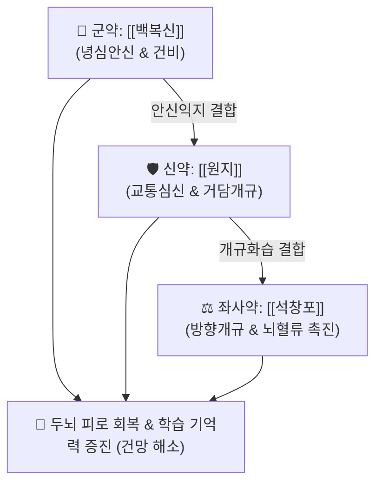

# 🍵 [[총명탕]] (聰明湯, Cong-Ming-Tang / Somyonto)

> **핵심 3줄 요약 (Key Summary)**:
> - 🌿 기본 구성: [[백복신]] (군), [[원지]] (거심) (신), [[석창포]] (좌사) (심신을 자양하고 담탁을 맑혀 뇌규를 열어주는 3미 등분 배합의 안신개규 대표 방제).
> - 🎯 수험생 기억력 감퇴, 건망증(健忘症), 두뇌 피로, 집중력 저하, 머리가 맑지 않고 무거운 두중감.
> - 🔬 아세틸콜린에스테라제(AChE) 억제로 뇌내 아세틸콜린 농도 증가, 해마(Hippocampus) 내 BDNF 및 CREB 인산화 촉진, 뇌세포 산화 스트레스 방어.
> - ⚠️ 주의사항: 원지는 반드시 거심(去心)하여 심번과 인후 자극을 방지하며, 석창포 정유 성분의 휘발을 막기 위해 장시간 과도한 전탕을 피함.

---

## 📌 목차
1. [기본 처방 정보 & 군신좌사 구성](#1-기본-처방-정보--군신좌사-구성)
2. [방제학적 약재 상호작용 & 시너지 네트워크](#2-방제학적-약재-상호작용--시너지-네트워크)
3. [현대 분자약리학적 효능 & 작용 기전](#3-현대-분자약리학적-효능--작용-기전)
4. [적응 병증 및 체질별 감별 (Sweet Spot vs 금기)](#4-적응-병증-및-체질별-감별-sweet-spot-vs-금기)
5. [유사 처방군 감별 매트릭스](#5-유사-처방군-감별-매트릭스)
6. [임상 가감례 & 현대 질환별 응용](#6-임상-가감례--현대-질환별-응용)
7. [💡 사용자 진료실 핵심 필기 & 임상 팁 (원문 보존)](#7--사용자-진료실-핵심-필기--임상-팁-원문-보존)
8. [출처 및 학술 참고 문헌 (References)](#8-출처-및-학술-참고-문헌-references)

---

## 1. 기본 처방 정보 & 군신좌사 구성

* **출전**: 명대 공정현 『[[종행선방]]』(種杏仙方) / 『[[동의보감]]』(東醫寶鑑) 신형편 신 (다망, 건망)
* **치법**: 보심안신(補心安神), 거담개규(祛痰開竅), 건비익지(健脾益智)

| 구분 | 약재명 | 표준 용량 | 본초 효능 & 방제 내 역할 |
| :--- | :--- | :--- | :--- |
| **군약 (君藥)** | [[백복신]] | 4.0~8.0g | **녕심안신·건비익위**: 심기를 편안히 안정시키고 비위를 튼튼하게 하여 정기를 보강 |
| **신약 (臣藥)** | [[원지]] (거심·포) | 4.0~8.0g | **거담개규·안신익지**: 심신(心腎)을 소통시키고 담탁을 제거하여 뇌수를 맑힘 |
| **좌사약 (佐使藥)** | [[석창포]] | 4.0~8.0g | **방향화습·개규영신**: 청량한 방향성으로 오관(五官)과 구규(九竅)를 뚫고 뇌혈류를 촉진 |

> **배오 특징**: 3가지 약재를 동일 분량(1:1:1)으로 분말 내어 찻물에 타 마시거나 탕전하여 복용하며, **안신(복신) + 거담교통(원지) + 방향개규(석창포)**의 삼위일체 구조로 두뇌의 담음(痰飮)을 제거하고 기억력을 극대화합니다.

---

## 2. 방제학적 약재 상호작용 & 시너지 네트워크

* **원지 + 석창포의 개규익지 대련**: 원지가 심장과 신장의 기운을 연결하고 담음을 삭이면, 석창포가 방향성 정유 성분으로 뇌규(腦竅)를 열어 뇌 신경 신호전달을 원활하게 합니다.
* **복신의 영심 배오**: 원지와 석창포의 발산성을 완충하고 심기(心氣)를 든든하게 받쳐줍니다.

---

## 3. 현대 분자약리학적 효능 & 작용 기전

### 1) 콜린성 신경계 활성화 (AChE 억제)
* 석창포의 아사론(Asarone)과 원지의 테누이폴린(Tenuifolin) 성분이 아세틸콜린 분해 효소(AChE)를 억제하여 시냅스 틈새의 아세틸콜린 농도를 높이고 장기기억 형성(LTP)을 촉진합니다.
### 2) 신경영양인자(BDNF) 발현 촉진 및 시냅스 가소성 강화
* 해마(Hippocampus) 신경세포에서 BDNF 및 CREB 인산화를 유도하여 신경망 재생과 학습 능력을 증진합니다.
### 3) 항산화 및 뇌세포 보호 작용
* 과도한 두뇌 활동과 스트레스로 발생하는 활성산소종(ROS)을 소거하고 신경세포의 산화적 손상 및 세포사를 억제합니다.

---

## 4. 적응 병증 및 체질별 감별 (Sweet Spot vs 금기)

### [✅ 최적 적응증 (Sweet Spot)]
* **수험생 및 고시생 두뇌 피로**: 오랜 학습으로 머리가 무겁고(두중), 암기가 잘 안 되며, 집중력이 현저히 저하된 경우.
* **노인성 건망증 및 초기 인지기능 저하**: 최근 일을 자주 잊어버리고 멍해지는 신경 쇠약 상태.
* **심담허겁성 불안 건망**: 가슴이 두근거리고 쉽게 놀라며 생각이 많아 머리가 맑지 않은 상태.

### [⚠️ 신중 투여 및 금기 (Caution / Contraindication)]
* **원지 거심(去心) 필수**: 원지의 속 심(Core)을 제거하지 않으면 목구멍을 찌르는 자극감과 심번(心煩)을 유발할 수 있으므로 반드시 감초 달인 물에 담가 거심한 약재를 사용.
* **야간 복용 주의**: 각성 및 뇌혈류 촉진 효과로 인해 늦은 밤 복용 시 불면이 발생할 수 있으므로 아침과 낮 시간대에 복용하도록 지도.

---

## 5. 유사 처방군 감별 매트릭스

| 처방명 | 병기 | 핵심 약재 구성 | 적합한 환자 양상 |
| :--- | :--- | :--- | :--- |
| [[총명탕]] | **심기허 + 담탁조규** | 백복신, 원지, 석창포 | **단순 기억력 저하, 머리가 무겁고 멍한 수험생 (기본방)** |
| [[귀비탕]] | **심비양허 기혈부족** | 인삼, 황기, 당귀, 용안육, 산조인 | **만성 피로, 소화불량, 빈혈, 불안·불면 동반 건망** |
| [[천왕보심단]] | **심신불교 음허화왕** | 생지황, 현삼, 맥문동, 산조인, 백자인 | **입마름, 도한, 손발 열감, 혀끝 붉음 동반 불면·건망** |
| [[주자독서환]] | **신정부족 간신음허** | 숙지황, 토사자, 당귀, 원지, 석창포 | **눈이 침침하고 허리가 시큰거리며 장기 수험에 지친 상태** |

---

## 6. 임상 가감례 & 현대 질환별 응용

* **담음 두통 및 어지럼증 동반**:
  * [[반하백출천마탕]]에 총명탕 3미([[복신]], [[원지]], [[석창포]])를 합방하여 위장관 담음과 뇌 순환 장애를 동시 치료.
* **기혈 부족 및 쇠약 동반**:
  * [[보중익기탕]] 또는 [[사물탕]]에 총명탕을 합방하여 복용(익기총명탕 등).

---

## 7. 💡 사용자 진료실 핵심 필기 & 임상 팁 (원문 보존)

* **사용자 원문 필기**:
  * [[반하백출천마탕]] + [[복신]] [[원지]] [[석창포]]
* **임상 실전 합방 노하우**:
  * **수험생 담음형 두통·건망의 특효 합방**: 수험생 중 소화가 잘 안 되고, 어지럼증과 두통이 잦으며, 머리가 안개 낀 듯 멍한 브레인 포그(Brain Fog)를 호소할 때 [[반하백출천마탕]]에 총명탕 3미([[복신]], [[원지]], [[석창포]])를 합방하면 소화 기능 개선과 뇌혈류 개규 효과가 극대화되어 탁월한 치료 성적을 보인다.
* **복용법 지도**:
  * 탕제로 전탕할 때는 석창포의 방향성 정유 성분을 보존하기 위해 40~50분 이내로 은은하게 달이고, 환제(총명환)나 과립제로 상복시키는 것도 순응도를 높이는 좋은 방법이다.

---

## 8. 출처 및 학술 참고 문헌 (References)

1. 종행선방(種杏仙方).
2. 동의보감(東醫寶鑑) 신형편 신 다망.
3. * **Saba E et al. (2017)**. Black ginseng-enriched Chong-Myung-Tang extracts improve spatial learning behavior in rats and elicit anti-inflammatory effects in vitro. *Journal of ginseng research*, 41: 151-158. [PMID: 28413319](https://pubmed.ncbi.nlm.nih.gov/28413319/)
