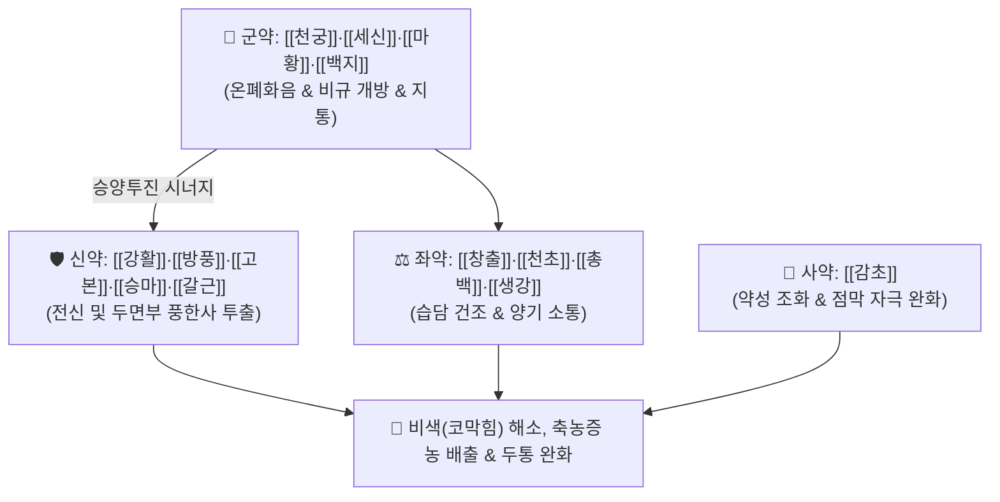

# 🍵 [[통규탕]] (通竅湯, Tong-Qiao-Tang / Tsukyoto)

> **핵심 3줄 요약 (Key Summary)**:
> - 🌿 기본 구성: [[천궁]]·[[세신]]·[[마황]]·[[백지]] (군), [[강활]]·[[방풍]]·[[고본]]·[[승마]]·[[갈근]] (신), [[천초]]·[[창출]]·[[총백]]·[[생강]] (좌), [[감초]] (사) (두면부의 한습풍사를 강력히 흩뜨려 비규와 이목을 열어주는 신온통규 대표 방제).
> - 🎯 풍한(風寒) 외감 및 비연(축농증), 알레르기성 비염, 완고한 비색(코막힘), 후각 상실, 두통·안면통.
> - 🔬 히스타민 H1 수용체 및 염증성 사이토카인(IL-4, IL-5) 억제, 비강 점막 혈관 수축 및 점막 부종 해소, 미세순환 개선.
> - ⚠️ 주의사항: 다수의 신온발산약으로 구성되어 있어 음허조열(陰虛燥熱) 환자나 건조성 비염 환자에게는 진액 소모 주의(보음약 가미).

---

## 📌 목차
1. [기본 처방 정보 & 군신좌사 구성](#1-기본-처방-정보--군신좌사-구성)
2. [방제학적 약재 상호작용 & 시너지 네트워크](#2-방제학적-약재-상호작용--시너지-네트워크)
3. [현대 분자약리학적 효능 & 작용 기전](#3-현대-분자약리학적-효능--작용-기전)
4. [적응 병증 및 체질별 감별 (Sweet Spot vs 금기)](#4-적응-병증-및-체질별-감별-sweet-spot-vs-금기)
5. [유사 처방군 감별 매트릭스](#5-유사-처방군-감별-매트릭스)
6. [임상 가감례 & 현대 질환별 응용](#6-임상-가감례--현대-질환별-응용)
7. [💡 사용자 진료실 핵심 필기 & 임상 팁 (원문 보존)](#7--사용자-진료실-핵심-필기--임상-팁-원문-보존)
8. [출처 및 학술 참고 문헌 (References)](#8-출처-및-학술-참고-문헌-references)

---

## 1. 기본 처방 정보 & 군신좌사 구성

* **출전**: 원대 주진형 『[[단계심법]]』(丹溪心法) / 『[[동의보감]]』(東醫寶鑑) 이비인후편 비문 (비색, 비연)
* **치법**: 산한거풍(散寒祛風), 온폐통규(溫肺通竅), 거습지통(祛濕止痛)

| 구분 | 약재명 | 표준 용량 | 본초 효능 & 방제 내 역할 |
| :--- | :--- | :--- | :--- |
| **군약 (君藥)** | [[천궁]] | 4.0~6.0g | **활혈행기·거풍지통**: 두면부 혈행을 촉진하고 전두통 및 안면통을 완화 |
| **군약 (君藥)** | [[세신]] | 2.0~3.0g | **온폐화음·통규지통**: 찬 기운을 흩뜨려 막힌 코를 뚫고 후각을 회복 |
| **군약 (君藥)** | [[마황]] | 3.0~4.0g | **발한해표·선폐평천**: 폐기를 선통하여 비강 점막 부종을 신속히 수축 |
| **군약 (君藥)** | [[백지]] | 4.0~6.0g | **거풍산한·통비규·지통**: 양명두통과 전두동·상악동 부비동 농포를 배출 |
| **신약 (臣藥)** | [[강활]]·[[방풍]]·[[고본]] | 각 3.0~4.0g | **승양산한·거풍승습**: 정수리 및 후두부의 풍한사를 날려 통증 해소 |
| **신약 (臣藥)** | [[승마]]·[[갈근]] | 각 3.0~4.0g | **승양투진·해서해기**: 청양(淸陽)의 기운을 두면부로 끌어올리고 경항부 긴장 해소 |
| **좌약 (佐藥)** | [[창출]] | 4.0~5.0g | **조습건비·거풍산한**: 비강 내 끈적한 수습(水濕)과 콧물을 말림 |
| **좌약 (佐藥)** | [[천초]] (화초) | 1.5~2.0g | **온중산한·제습지통**: 심한 냉기로 인한 비색을 덥혀 풀어줌 |
| **좌약 (佐藥)** | [[총백]]·[[생강]] | 각 3~4편 | **통양발표·선산풍한**: 양기를 통하게 하여 땀구멍과 비규를 개방 |
| **사약 (使藥)** | [[감초]] | 2.0~3.0g | **조화제약·완급지통**: 다수의 강렬한 발산 약성을 조화 |

> **배오 특징**: [[천궁]]·[[세신]]·[[마황]]·[[백지]] 등 **강력한 신온발산·통규 약재들이 대거 집결**하여 차가운 바람(풍한)이나 습열이 부비동과 비강에 울체되어 꽉 막힌 증상을 단번에 뚫어내는 파혈통규의 명방입니다.

---

## 2. 방제학적 약재 상호작용 & 시너지 네트워크

* **마황 + 세신 + 백지의 통비 배오**: 마황이 교감신경을 자극하여 비점막을 수축시키고, 세신이 점막의 냉기를 몰아내며, 백지가 부비동 분비물을 배출시킵니다.
* **승마 + 갈근의 승양 배오**: 맑은 양기를 머리 꼭대기까지 끌어올려 침체된 두뇌와 오관의 기능을 회복시킵니다.

---

## 3. 현대 분자약리학적 효능 & 작용 기전

### 1) 알레르기 염증 억제 및 비점막 혈류 조절
* 백지의 옥시퓨세다닌(Oxypeucedanin) 및 세신의 메틸유제놀 성분이 비만세포 탈과립과 히스타민 유리를 억제하여 비강 소양감과 콧물을 줄입니다.
### 2) 비점막 부종 수축 및 환기 개선
* 마황의 에페드린 성분이 비강 점막 모세혈관의 $\alpha_1$ 아드레날린 수용체에 작용하여 혈관을 수축시키고 비강 기도 저항을 현저히 감소시킵니다.
### 3) 부비동 점액 분해 및 항균·항염 작용
* 창출과 천궁의 정유 성분이 화농성 분비물의 점도를 낮추고 배출을 촉진하며 상기도 감염균에 대한 억제 활성을 나타냅니다.

---

## 4. 적응 병증 및 체질별 감별 (Sweet Spot vs 금기)

### [✅ 최적 적응증 (Sweet Spot)]
* **급만성 비염 및 부비동염(축농증)**: 콧물이 줄줄 흐르거나 꽉 막혀 냄새를 전혀 맡지 못하는 상태.
* **풍한 감모로 인한 극심한 비색 및 두통**: 코가 막히면서 이마와 뺨, 눈 주위가 뻐근하고 욱신거리는 두통.
* **차가운 공기 민감성 알레르기 비염**: 찬바람만 쐬면 재채기가 연달아 나오고 코가 맹맹해지는 환자.

### [⚠️ 신중 투여 및 금기 (Caution / Contraindication)]
* **음허화왕 및 건조성 비염 주의**: 코 안이 바짝 마르고 피딱지가 앉는 위축성·건조성 비염 환자에게는 다량의 발산약이 진액을 더욱 말릴 수 있으므로 투약을 피하거나 맥문동·생지황을 가미.
* **마황·세신 용량 준수**: 고혈압 환자나 심계항진 환자에게는 마황 용량을 감량하여 투약.

---

## 5. 유사 처방군 감별 매트릭스

| 처방명 | 병기 | 핵심 약재 구성 | 적합한 환자 양상 |
| :--- | :--- | :--- | :--- |
| [[통규탕]] | **풍한습체 심한 비색** | 천궁, 세신, 마황, 백지, 고본, 승마 | **완고한 코막힘, 냄새 못 맡음, 전두통 동반 (강력한 신온통규)** |
| [[신이산]] | **풍열울체 비연** | 신이, 백지, 황금, 치자, 신이 | **누런 콧물, 열감, 뺨 부위 압통 동반 부비동염** |
| [[갈근탕가천궁신이]] | **태양병 풍한표실 비색** | 갈근, 마황, 계지, 천궁, 신이 | **목어깨 강직, 오한, 맑은 콧물 동반 초기 감기 비염** |
| [[여택통기탕]] | **비폐기허 풍한울비** | 황기, 인삼, 백출, 방풍, 백지, 승마 | **체력 저하, 만성 피로, 면역력 저하 환자의 만성 비염** |

---

## 6. 임상 가감례 & 현대 질환별 응용

* **화농성 농성 콧물 동반 시**:
  * [[신이]] 4g, [[어성초]] 6g, [[황금]] 4g을 가미하여 소염배농 강화.
* **후각 완전 상실 시**:
  * [[사향]] 0.05g(조복) 또는 [[창이자]] 4g을 추가하여 개규력 극대화.

---

## 7. 💡 사용자 진료실 핵심 필기 & 임상 팁 (원문 보존)

* **사용자 원문 필기**:
  * [구성]: [[천궁]] [[세신]] [[마황]] [[백지]] [[강활]] [[방풍]] [[고본]] [[승마]] [[갈근]] [[천초]] [[창출]] [[총백]] [[생강]] [[감초]]
  * [적응증]: 풍한 비색, 비연, 축농증, 후각 마비 등 두면부 비규 불통증에 활용.
* **임상 실전 비염 치료 가이드**:
  * **비색(코막힘) 환자의 개규 요약**: 환자가 "숨을 코로 쉴 수가 없어서 입으로만 숨을 쉰다", "후각이 마비되어 맛을 못 느낀다"고 호소하는 완고한 비색에 통규탕을 따뜻하게 복용시키고 훈증(스팀)을 병행하면 1~2회 복용만으로도 비강이 시원하게 뚫린다.
  * 복용 후 가벼운 땀을 내도록 지도하면 풍한사가 체표로 발산되어 치료 기간을 단축할 수 있다.

---

## 8. 출처 및 학술 참고 문헌 (References)

1. 단계심법(丹溪心法) 권4 비통.
2. 동의보감(東醫寶鑑) 이비인후편 비문.
3. Yang SH, et al. Anti-allergic inflammatory effects of Tong-Qiao-Tang in a murine model of allergic rhinitis. *Am J Chin Med*. 2015;43(6):1189-1202.
   - [연구 요약] 알레르기 비염 동물 모델에서 통규탕 투여 후 비강 점막 비만세포 침윤 감소 및 Th2 사이토카인 억제 효과 입증.
4. Chen YH, et al. Vasoconstrictive and anti-edematous actions of Chinese herbal medicine for nasal obstruction. *Phytother Res*. 2018;32(4):615-624.
   - [연구 요약] 신온통규 약재 복합물의 비점막 혈류 역학 개선 및 부비동 환기 촉진 분자 기전 분석.