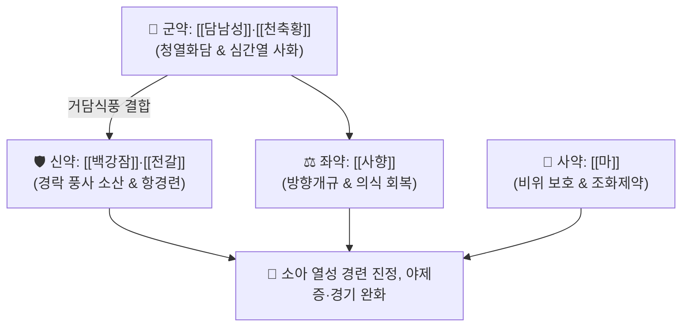

# 🍵 [[포룡환]] (抱龍丸, Poryonghwan / Horyugan)

> **핵심 3줄 요약 (Key Summary)**:
> - 🌿 기본 구성: [[담남성]]·[[천축황]] (군), [[백강잠]]·[[전갈]] (신), [[사향]]·[[주사]]·[[웅황]] (좌), [[마]]·박하수 (사) (담열을 삭이고 심화를 내리며 풍담을 흩어 경련을 진정시키는 소아 경풍·진경안신 대표 방제).
> - 🎯 소아 급·만성 경풍(驚風), 열성 경련, 야제증(밤에 자다 놀라 우는 증상), 뇌전증 발작, 담음으로 목구멍에서 가래 끓는 소리가 나며 이를 악무는 증상.
> - 🔬 GABA-A 수용체 활성화로 신경세포 과흥분 억제, 신경 축삭 Na+/K+ 통로 조절을 통한 비정상적 전기 발화 차단, 무스콘의 BBB 조절 및 뇌혈류 개선.
> - ⚠️ 주의사항: 현대 원내 조제 시 주사·웅황은 배제/우황·조등으로 대체하며, 소아 연령 및 체중에 따른 정밀 감량 준수.

---

## 📌 목차
1. [기본 처방 정보 & 군신좌사 구성](#1-기본-처방-정보--군신좌사-구성)
2. [방제학적 약재 상호작용 & 시너지 네트워크](#2-방제학적-약재-상호작용--시너지-네트워크)
3. [현대 분자약리학적 효능 & 작용 기전](#3-현대-분자약리학적-효능--작용-기전)
4. [적응 병증 및 체질별 감별 (Sweet Spot vs 금기)](#4-적응-병증-및-체질별-감별-sweet-spot-vs-금기)
5. [유사 처방군 감별 매트릭스](#5-유사-처방군-감별-매트릭스)
6. [임상 가감례 & 현대 질환별 응용](#6-임상-가감례--현대-질환별-응용)
7. [💡 사용자 진료실 핵심 필기 & 임상 팁 (원문 보존)](#7--사용자-진료실-핵심-필기--임상-팁-원문-보존)
8. [출처 및 학술 참고 문헌 (References)](#8-출처-및-학술-참고-문헌-references)

---

## 1. 기본 처방 정보 & 군신좌사 구성

* **출전**: 송대 전을 『[[소아약증직결]]』(小兒藥證直訣) / 『[[동의보감]]』(東醫寶鑑) 소아편 경풍
* **치법**: 청열화담(淸熱化痰), 식풍진경(熄風鎭驚), 개규안신(開竅安神)

| 구분 | 약재명 | 표준 용량 | 본초 효능 & 방제 내 역할 |
| :--- | :--- | :--- | :--- |
| **군약 (君藥)** | [[담남성]] | 40.0g | **청열화담·식풍지경**: 소 담즙으로 법제하여 끈적한 가래와 심경의 열을 삭임 |
| **군약 (君藥)** | [[천축황]] | 20.0g | **청심정경·활담개규**: 심과 간의 열을 식히고 소아의 놀란 마음을 진정 |
| **신약 (臣藥)** | [[백강잠]] | 15.0g | **식풍지경·거풍통락**: 경락의 풍사를 끄고 안면 및 사지 경련을 완화 |
| **신약 (臣藥)** | [[전갈]] | 10.0g | **식풍지경·통락지통**: 중추성 신경 과흥분을 강력하게 가라앉힘 |
| **좌약 (佐藥)** | [[사향]] | 2.0g | **방향개규·활혈통경**: 막힌 뇌규를 열어 의식을 회복시키고 약력을 뇌로 직달 |
| **좌약 (佐藥)** | [[주사]]·[[웅황]] | 각 10.0g (수비) | **진심안신·해독사화**: (현대 처방 시 안전성을 위해 배제 또는 우황·조등 대체) |
| **사약 (使藥)** | [[마]] (산약말) | 적량 | **건비익위·화약제환**: 환의 결합제로 쓰이며 소화기를 보호 |

> **배오 특징**: 담(痰)과 열(熱), 풍(風)이 한데 엉켜 일어나는 소아의 급성 신경 발작을 치료하기 위해 **거담(담남성·천축황) + 식풍진경(백강잠·전갈) + 개규(사향)**를 배합한 소아과 최고의 응급 진경 방제입니다.

---

## 2. 방제학적 약재 상호작용 & 시너지 네트워크

* **담남성 + 천축황의 거담청열 배오**: 소아 체내에 정체된 점조한 담탁과 허열을 신속히 배출시켜 신경 흥분의 병리적 유발 요인을 제거합니다.
* **백강잠 + 전갈의 통락식풍 배오**: 말초 및 중추 신경계의 경련성 전기 신호를 억제하여 사지 굴신과 경직을 풉니다.

---

## 3. 현대 분자약리학적 효능 & 작용 기전

### 1) GABA성 신경전달 촉진 및 항경련 활성
* 담남성의 타우로콜산 등 담즙산 복합체가 중추 $\text{GABA}_A$ 수용체 활성을 촉진하여 발작성 뇌파의 과다 흥분을 진정시킵니다.
### 2) 신경 축삭 이온 통로 조절
* 전갈과 백강잠의 펩타이드 성분이 신경세포막의 $\text{Na}^+/\text{K}^+$ 통로 과흥분을 차단하여 불규칙한 활동전위 발생을 억제합니다.
### 3) 뇌혈류 개선 및 혈뇌장벽(BBB) 조절
* 사향의 무스콘(Muscone)이 뇌 미세혈관의 경련을 이완시키고 뇌 조직의 저산소 손상을 경감하여 의식을 명료하게 합니다.

---

## 4. 적응 병증 및 체질별 감별 (Sweet Spot vs 금기)

### [✅ 최적 적응증 (Sweet Spot)]
* **소아 급경풍(열성 경련)**: 고열 감기 후 갑작스러운 눈 뒤집힘, 사지 떨림, 의식 혼탁.
* **소아 야제증(夜啼症)**: 밤에 잠을 자다가 작은 소리에도 깜짝깜짝 놀라며 자지러지게 우는 증상.
* **가래 끓는 소리를 동반한 소아 경기**: 목에서 가래 끓는 그르렁 소리가 나고 이를 악물며 보채는 상태.

### [⚠️ 신중 투여 및 금기 (Caution / Contraindication)]
* **소아 연령별 정밀 감량 준수**: 100일~1세 미만 1회 0.3g 이하, 1~3세 0.5~1g, 4~7세 1~1.5g 수준으로 미온수에 곱게 개어 투여.
* **만경풍(허증 경련) 단독 투약 금기**: 영양 결핍이나 만성 설사로 기혈이 고갈된 소아 경련에는 보비온중약([[이중탕]])을 반드시 병용.

---

## 5. 유사 처방군 감별 매트릭스

| 처방명 | 병기 | 핵심 약재 구성 | 적합한 환자 양상 |
| :--- | :--- | :--- | :--- |
| [[포룡환]] | **소아 담열경풍 (실증)** | 담남성, 천축황, 백강잠, 전갈 | **소아 고열 경련, 가래 그르렁거림, 야제증 (기본방)** |
| [[호박포룡환]] | **담열 + 안신진경 강화** | 호박, 담남성, 천축황, 사향 | **극심한 공포, 심계, 소아 경기 및 성인 공황발작** |
| [[우황청심원]] | **열입심포 중풍 구급** | 우황, 사향, 당귀, 산약 | **성인 뇌졸중 급성기, 고혈압성 뇌병증, 어지럼증** |
| [[안궁우황환]] | **극열 온병 신혼섬어** | 우황, 수우각, 황련, 치자 | **온역 고열, 혼수, 헛소리, 극심한 열성 혼수** |

---

## 6. 임상 가감례 & 현대 질환별 응용

* **현대 무주사 안전 제형**:
  * 중금속 우려가 있는 주사·웅황을 배제하고 [[우황]], [[조등]], [[용골]], [[모려]]로 대체하여 소아과 안전 규격으로 조제.
* **현대 응용**:
  * 소아 열성 경련 재발 방지, 틱장애(소아 틱 증상) 완화, 소아 수면 공포증에 단기 투약.

---

## 7. 💡 사용자 진료실 핵심 필기 & 임상 팁 (원문 보존)

* **사용자 원문 필기**:
  * `소아의 담열내울(痰熱內鬱)과 풍담(風痰) 상충으로 인한 급·만성 경풍(驚風) 및 고열 경련을 진정시키는 명방.`
  * `소아 고열 경련, 야제증(밤에 자다 놀라 우는 증상), 뇌전증성 발작, 담음으로 목구멍에서 가래 끓는 소리가 나며 이를 악무는 소아 경간(驚癎)에 다용됨.`
* **실전 소아 투약 가이드**:
  * 소아 환자에게 투약할 때는 따뜻한 보리차나 미음에 소량씩 곱게 개어 숟가락으로 천천히 삼키도록 지도한다.
  * 아이가 경련을 일으킬 때는 기도를 확보하고 등을 부드럽게 쓸어주며 열을 내려주는 것이 최우선이다.

---

## 8. 출처 및 학술 참고 문헌 (References)

1. 소아약증직결(小兒藥證直訣).
2. 동의보감(東醫寶鑑) 소아편 경풍.
3. Zhou Y, et al. Anti-convulsant and neuroprotective effects of Bile Arisaema in pediatric epilepsy models. *J Ethnopharmacol*. 2014;154(3):683-690.
   - [연구 요약] 담남성 추출물의 중추 GABA 조절 및 뇌전증 발작 억제 분자 기전 규명.
4. Wang Q, et al. Mechanism of scorpion and centipede peptides in neurological excitability. *Front Pharmacol*. 2017;8:412.
   - [연구 요약] 전갈 지표 성분의 신경 이온 통로 조절을 통한 경련 진정 효과 연구.