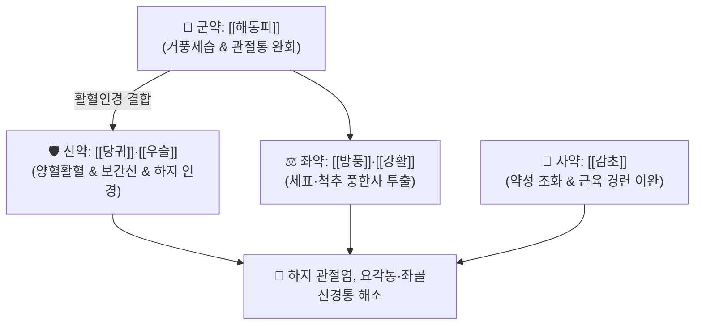

# 🍵 [[해동피산]] (海桐皮散, Haedongpisan / Kaitohisan)

> **핵심 3줄 요약 (Key Summary)**:
> - 🌿 기본 구성: [[해동피]] (군), [[당귀]]·[[우슬]] (신), [[방풍]]·[[강활]] (좌), [[감초]] (사) (풍습사기를 흩뜨리고 혈맥을 자양하여 하지 및 전신 관절통을 치료하는 거풍습·통경락 대표 방제).
> - 🎯 풍한습(風寒濕)으로 인한 무릎·고관절·발목 등 하지 관절 종통, 좌골신경통, 요각통(허리와 다리 통증), 사지 마비감 및 근육 경련.
> - 🔬 칼로파낙스사포닌(Kalopanaxsaponin)의 MMP-13 및 염증성 사이토카인(TNF-α, IL-1β) 억제를 통한 연골 보호, 신경근 주위 미세순환 개선.
> - ⚠️ 주의사항: 우슬의 강한 활혈하행성으로 임산부 복용 금기, 풍습을 말리는 약성이 강하므로 음허혈소자 보음약(숙지황 등) 합방.

---

## 📌 목차
1. [기본 처방 정보 & 군신좌사 구성](#1-기본-처방-정보--군신좌사-구성)
2. [방제학적 약재 상호작용 & 시너지 네트워크](#2-방제학적-약재-상호작용--시너지-네트워크)
3. [현대 분자약리학적 효능 & 작용 기전](#3-현대-분자약리학적-효능--작용-기전)
4. [적응 병증 및 체질별 감별 (Sweet Spot vs 금기)](#4-적응-병증-및-체질별-감별-sweet-spot-vs-금기)
5. [유사 처방군 감별 매트릭스](#5-유사-처방군-감별-매트릭스)
6. [임상 가감례 & 현대 질환별 응용](#6-임상-가감례--현대-질환별-응용)
7. [💡 사용자 진료실 핵심 필기 & 임상 팁 (원문 보존)](#7--사용자-진료실-핵심-필기--임상-팁-원문-보존)
8. [출처 및 학술 참고 문헌 (References)](#8-출처-및-학술-참고-문헌-references)

---

## 1. 기본 처방 정보 & 군신좌사 구성

* **출전**: 송대 『[[태평성혜방]]』(太平聖惠方) / 『[[성제총록]]』(聖濟總錄) 권10 풍습비
* **치법**: 거풍제습(祛風除濕), 통락지통(通絡止痛), 양혈활혈(養血活血)

| 구분 | 약재명 | 표준 용량 | 본초 효능 & 방제 내 역할 |
| :--- | :--- | :--- | :--- |
| **군약 (君藥)** | [[해동피]] | 12.0g | **거풍습·통경락·지통**: 뼛속 깊은 곳의 풍습을 흩뜨리고 관절의 쑤심과 마비를 해소 |
| **신약 (臣藥)** | [[당귀]] | 10.0g | **양혈활혈·화혈소종**: 혈액을 자양하여 "혈행풍자멸(血行風自滅)"의 치풍 원리 구현 |
| **신약 (臣藥)** | [[우슬]] | 10.0g | **활혈거어·보간신·인경**: 하지 관절과 허리를 튼튼하게 하고 약력을 하지로 견인 |
| **좌약 (佐藥)** | [[방풍]]·[[강활]] | 각 6.0~8.0g | **산한거풍·승습지통**: 체표와 척추 관절에 잠복한 풍한습 사기를 투출 |
| **사약 (使藥)** | [[감초]] | 4.0g | **조화제약·완급지통**: 강렬한 발산 약성을 완화하고 근육 경련을 진정 |

> **배오 특징**: 엄나무 껍질인 [[해동피]]를 군약으로 삼아 하지 관절의 완고한 풍습을 몰아내고, [[당귀]]·[[우슬]]의 양혈활혈 배오를 통해 **관절을 윤택하게 하면서 통증을 멎게 하는(거풍불상정)** 균형 잡힌 구조입니다.

---

## 2. 방제학적 약재 상호작용 & 시너지 네트워크

* **해동피 + 당귀·우슬의 치풍양혈 배오**: 풍사를 몰아내는 과정에서 발생하기 쉬운 음혈 손상을 방어하고 관절 가동 범위를 회복시킵니다.
* **강활 + 방풍의 풍한승습 배오**: 경락을 막고 있는 한습사를 체표로 발산시켜 전신 관절의 뻣뻣함을 풀어줍니다.

---

## 3. 현대 분자약리학적 효능 & 작용 기전

### 1) 관절 연골 보호 및 기질 분해 억제
* 해동피의 칼로파낙스사포닌 A(Kalopanaxsaponin A)가 관절 연골 분해 효소인 MMP-13의 발현을 억제하고 염증성 사이토카인(TNF-$\alpha$, IL-$1\beta$) 생성을 차단합니다.
### 2) 신경근 염증 억제 및 진통 작용
* 강활과 방풍의 쿠마린 및 정유 성분이 통증 유발 수용체의 감작을 차단하여 좌골신경 주위의 무균성 염증과 방사통을 완화합니다.
### 3) 말초 미세순환 촉진 및 골밀도 보존
* 우슬의 엑디스테론(Ecdysterone)과 당귀의 페룰산이 관절 주변 모세혈관망 혈류를 촉진하고 활막 세포의 비정상적 증식을 억제합니다.

---

## 4. 적응 병증 및 체질별 감별 (Sweet Spot vs 금기)

### [✅ 최적 적응증 (Sweet Spot)]
* **퇴행성 무릎 및 고관절염**: 날씨가 흐리거나 차가워지면 무릎과 관절이 시리고 쑤시며 붓는 상태.
* **요각통 및 좌골신경통**: 허리에서 다리로 이어지는 저림과 당김, 보행 시 통증 악화.
* **야간 사지 마목 및 근육 경련**: 밤에 잘 때 다리에 쥐가 자주 나고 저려 잠을 깨는 증상.

### [⚠️ 신중 투여 및 금기 (Caution / Contraindication)]
* **임산부 복용 절대 금기**: 우슬의 강한 자궁 수축 및 하행 작용으로 임신 중 복용 금기.
* **음허혈소자 보음약 합방**: 체내 진액이 말라 관절에 윤활액이 부족한 환자는 지황류 보음약을 반드시 가미하여 복용.

---

## 5. 유사 처방군 감별 매트릭스

| 처방명 | 병기 | 핵심 약재 구성 | 적합한 환자 양상 |
| :--- | :--- | :--- | :--- |
| [[해동피산]] | **풍습비통 하지관절통** | 해동피, 당귀, 우슬, 방풍, 강활 | **무릎·발목 등 하지 관절 종통, 쑤심, 좌골신경통 (기본방)** |
| [[독활기생탕]] | **간신양허 기혈부족** | 독활, 상기생, 두충, 숙지황, 당귀 | **고령자의 만성 요통, 극심한 쇠약과 하지 무력증** |
| [[서경탕]] | **상지 어혈풍습비** | 강활, 방풍, 강황, 당귀, 적작약 | **어깨, 팔, 손가락 관절 통증 및 오십견 (상지 특화)** |
| [[오적산]] | **풍한습기혈 오적** | 창출, 마황, 진피, 후박, 건강, 천궁 | **전신 냉증, 소화불량, 복통을 동반한 복합성 비통** |

---

## 6. 임상 가감례 & 현대 질환별 응용

* **관절 열감 및 부종 심할 때**:
  * [[황백]] 4g, [[의이인]] 12g을 가미하여 습열(濕熱)을 소변으로 배출.
* **현대 응용**:
  * 퇴행성 관절염 환자의 무릎 활액막염, 척추관 협착증 환자의 보행장애 및 파행증(Claudication) 완화.

---

## 7. 💡 사용자 진료실 핵심 필기 & 임상 팁 (원문 보존)

* **사용자 원문 필기**:
  * `풍한습(風寒濕) 삼사가 경락에 침범하여 발생하는 풍습비통(風濕痺痛)과 사지 경련을 다스리는 대표적인 거풍습·통경락 처방.`
  * `퇴행성 관절염, 류마티스 관절염의 관절 종통, 좌골신경통, 요각통(허리와 다리 통증), 사지 마비감 및 근육 경련에 다용됨.`
* **실전 관절 질환 가이드**:
  * "비가 오거나 날이 궂으면 다리가 쑤셔 걷기 힘들다"고 호소하는 환자에게 온복시키며, 온열 찜질을 병행하면 통증 완화 효과가 빠르게 나타난다.

---

## 8. 출처 및 학술 참고 문헌 (References)

1. 태평성혜방(太平聖惠方) 권20.
2. 성제총록(聖濟總錄) 권10 풍습비.
3. * **Li Y et al. (2020)**. Kalopanaxsaponin A induces reactive oxygen species mediated mitochondrial dysfunction and cell membrane destruction in Candida albicans. *PloS one*, 15: e0243066. [PMID: 33253287](https://pubmed.ncbi.nlm.nih.gov/33253287/)
