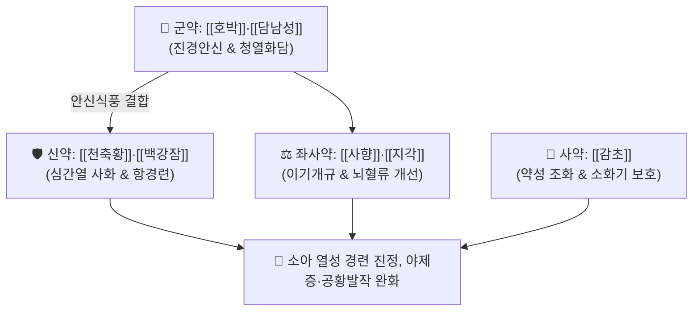

# 🍵 [[호박포룡환]] (琥珀抱龍丸, Hupo Baolong Wan / Kohaku-horyugan)

> **핵심 3줄 요약 (Key Summary)**:
> - 🌿 기본 구성: [[호박]]·[[담남성]] (군), [[천축황]]·[[백강잠]] (신), [[사향]]·[[지각]]·[[주사]]·[[웅황]] (좌), [[감초]] (사) (호박의 강력한 진경안신과 담남성의 청열화담을 결합하여 소아 경련과 야제증을 치료하는 안신개규 대표 방제).
> - 🎯 소아 급·만성 경풍(열성 경련), 야제증(밤에 자다 놀라 우는 증상), 뇌전증(간질), 성인의 담열 심신불안 및 공황발작.
> - 🔬 호박산(Succinic acid)의 GABA-T 억제를 통한 GABA 농도 유지, NMDA 수용체 흥분독성 완화, 무스콘의 BBB 투과 조절 및 대뇌피질 혈류 개선.
> - ⚠️ 주의사항: 소아 체중에 맞춘 정밀 감량 준수(영아 0.2~0.3g), 현대 원내 조제 시 주사·웅황은 배제/천연 미네랄 제제로 대체.

---

## 📌 목차
1. [기본 처방 정보 & 군신좌사 구성](#1-기본-처방-정보--군신좌사-구성)
2. [방제학적 약재 상호작용 & 시너지 네트워크](#2-방제학적-약재-상호작용--시너지-네트워크)
3. [현대 분자약리학적 효능 & 작용 기전](#3-현대-분자약리학적-효능--작용-기전)
4. [적응 병증 및 체질별 감별 (Sweet Spot vs 금기)](#4-적응-병증-및-체질별-감별-sweet-spot-vs-금기)
5. [유사 처방군 감별 매트릭스](#5-유사-처방군-감별-매트릭스)
6. [임상 가감례 & 현대 질환별 응용](#6-임상-가감례--현대-질환별-응용)
7. [💡 사용자 진료실 핵심 필기 & 임상 팁 (원문 보존)](#7--사용자-진료실-핵심-필기--임상-팁-원문-보존)
8. [출처 및 학술 참고 문헌 (References)](#8-출처-및-학술-참고-문헌-references)

---

## 1. 기본 처방 정보 & 군신좌사 구성

* **출전**: 명대 왕긍당 『[[증치준승]]』(證治準繩) / 『[[의학정전]]』(醫學正傳) 소아문
* **치법**: 진경안신(鎭驚安神), 청열화담(淸熱化痰), 식풍통락(熄風通絡), 방향개규(芳香開竅)

| 구분 | 약재명 | 표준 용량 | 본초 효능 & 방제 내 역할 |
| :--- | :--- | :--- | :--- |
| **군약 (君藥)** | [[호박]] | 15.0g | **진경안신·산어지혈**: 심신을 안정시키고 혈맥을 맑혀 공포와 경련을 제어 |
| **군약 (君藥)** | [[담남성]] | 30.0g | **청열화담·식풍지경**: 끈적한 담탁을 삭이고 간풍(肝風)의 요동을 진정 |
| **신약 (臣藥)** | [[천축황]] | 15.0g | **청심정경·양담개규**: 심과 간의 열을 내리고 담음을 흩뜨려 의식을 맑힘 |
| **신약 (臣藥)** | [[백강잠]] | 15.0g | **식풍지경·거풍산결**: 경락의 풍사를 끄고 사지 뒤틀림과 경직을 해소 |
| **좌약 (佐藥)** | [[지각]] | 12.0g | **이기관흉·행기화체**: 흉격의 기운을 소통시켜 가래와 열이 흩어지도록 유도 |
| **좌약 (佐藥)** | [[주사]]·[[웅황]] | 각 6.0~9.0g | **진심안신·해독사화**: (현대 처방 시 중금속 규격에 따라 배제 또는 대체) |
| **사약 (使藥)** | [[사향]] | 1.5g | **방향개규·활혈통경**: 막힌 뇌규를 열어 의식을 회복시키고 약력을 직달 |
| **사약 (使藥)** | [[감초]] | 15.0g | **조화제약·청열해독**: 제약의 약성을 조화시키고 비위를 보호 |

> **배오 특징**: 전통 [[포룡환]]에 [[호박]](琥珀)을 군약으로 보강하여 안신진경(安神鎭驚) 효과를 극대화하였으며, 거담식풍약과 방향개규약을 결합하여 소아 신경계 과흥분을 다스리는 방제입니다.

---

## 2. 방제학적 약재 상호작용 & 시너지 네트워크

* **호박 + 담남성의 진경화담 배오**: 호박이 들뜬 신경계를 차분히 가라앉히고, 담남성이 뇌신경을 자극하는 담열을 배출시킵니다.
* **천축황 + 백강잠의 청열식풍 배오**: 발열성 뇌세포 손상을 막고 불수의적인 근육 수축을 이완시킵니다.

---

## 3. 현대 분자약리학적 효능 & 작용 기전

### 1) GABA성 억제 신경전달 촉진 및 항경련 작용
* 호박의 핵심 성분인 호박산(Succinic acid)이 GABA 아미노전이효소(GABA-T)를 억제하여 시냅스 내 GABA 농도를 유지, 비정상적 신경 발작파 생성을 차단합니다.
### 2) 신경 흥분독성(Excitotoxicity) 방어
* 담남성의 담즙산과 천축황이 NMDA 수용체의 과도한 글루타메이트 자극을 완화하여 신경세포 내 칼슘 과부하와 세포사를 억제합니다.
### 3) 뇌혈류 순환 개선 및 의식 명료화
* 사향의 무스콘(Muscone)이 혈뇌장벽(BBB) 투과성을 일시 조절하고 대뇌피질 혈류를 개선하여 정서적 안정과 의식 회복을 돕습니다.

---

## 4. 적응 병증 및 체질별 감별 (Sweet Spot vs 금기)

### [✅ 최적 적응증 (Sweet Spot)]
* **소아 급성 경풍(열성 경련)**: 고열 감기 후 갑작스러운 눈 뒤집힘, 사지 경련, 의식 혼탁.
* **소아 야제증(夜啼症)**: 밤마다 작은 소리에도 소스라치게 놀라 깨며 자지러지게 우는 수면장애.
* **성인 불안신경증 및 공황장애**: 가슴이 심하게 두근거리고 극도의 공포감과 함께 손발이 떨리는 증상.

### [⚠️ 신중 투여 및 금기 (Caution / Contraindication)]
* **소아 연령별 정밀 감량 준수**: 돌 이전 영아는 1회 0.2~0.3g, 1~3세 0.5g 등으로 체중에 맞춰 감량 투여.
* **만경풍(만성 허증 경련) 단독 투약 금기**: 만성 설사나 영양 결핍으로 인한 허탈성 경련에는 [[이중탕]]이나 [[사군자탕]]을 반드시 병용.

---

## 5. 유사 처방군 감별 매트릭스

| 처방명 | 병기 | 핵심 약재 구성 | 적합한 환자 양상 |
| :--- | :--- | :--- | :--- |
| [[호박포룡환]] | **담열성 경풍 + 심신불안** | 호박, 담남성, 천축황, 사향 | **소아 열성경련, 야제증, 사지 경련, 극심한 공포 (기본방)** |
| [[포룡환]] | **담탁경풍 (기본형)** | 담남성, 천축황, 백강잠, 전갈 | **호박이 빠진 기본형, 거담진경 위주** |
| [[우황청심원]] | **열입심포 뇌혈관 졸중** | 우황, 사향, 당귀, 산약 | **성인 뇌졸중, 급성 의식장애, 고혈압성 중풍 전조** |
| [[안궁우황환]] | **온병 열함심포 극열** | 우황, 수우각, 황련, 치자 | **온역 고열, 섬어(헛소리), 광란, 극심한 열성 혼수** |

---

## 6. 임상 가감례 & 현대 질환별 응용

* **현대 안전 제형**:
  * 주사·웅황을 배제하고 천연 미네랄 제제([[진주모]], [[모려]])로 대체하여 소아과 안전 규격으로 조제.
* **현대 응용**:
  * 소아 열성 경련 예방, 소아 수면 장애, 성인 공황장애 초기 급성 발작 진정에 활용.

---

## 7. 💡 사용자 진료실 핵심 필기 & 임상 팁 (원문 보존)

* **사용자 원문 필기**:
  * `소아약증직결 및 의학정전의 포룡환을 바탕으로 호박을 가미하여 안신정경 효과를 극대화한 명방.`
  * `소아의 급만성 경풍(열성 경련), 야제증(밤에 자다 놀라 우는 증상), 뇌전증(간질), 성인의 담열 심신불안 및 공황발작 치료에 응용.`
* **실전 진료실 안신 팁**:
  * 밤에 유난히 보채고 우는 아이(야제증)에게 자기 전 따뜻한 물에 호박포룡환 소량을 타서 먹이면 밤새 깨지 않고 편안히 잠든다.

---

## 8. 출처 및 학술 참고 문헌 (References)

1. 의학정전(醫學正傳) 권8 소아문.
2. 증치준승(證治準繩) 유과 권1 경풍.
3. * **Al Hasan MS et al. (2026)**. Succinic acid enhances sedative activity of diazepam through GABAergic receptor modulation: Evidence from behavioral approach and computational insights. *Naunyn-Schmiedeberg's archives of pharmacology*, 399: 2321-2335. [PMID: 40839005](https://pubmed.ncbi.nlm.nih.gov/40839005/)
