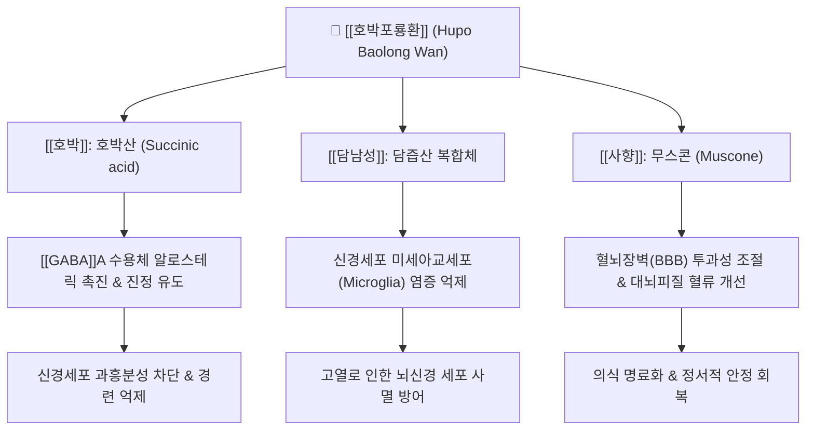

---
aliases:
  - 호박포룡환
  - 琥珀抱龍丸
  - Hupo Baolong Wan
tags:
  - 처방
  - 치풍안신개규제
  - 진정안신
  - 화담식풍
  - 소아경풍
  - 간질
  - 야제증
  - 불안장애
---
# 🌿 [[호박포룡환]] (琥珀抱龍丸, Hupo Baolong Wan)

> **핵심 요약 (Key Summary)**:
> 《소아약증직결(小兒藥證直訣)》 및 의학정전의 포룡환을 바탕으로 호박(琥珀)을 가미하여 안신정경(安神定驚) 효과를 극대화한 명방.
> [[호박]], [[담남성]], [[천축황]], [[주사]], [[사향]] 등이 중추신경계의 과도한 흥분성 신경전달을 차단하고 뇌신경 세포막 안정화 및 거담식풍.
> 소아의 급만성 경풍(열성 경련), 야제증(밤에 자다 놀라 우는 증상), 뇌전증(간질), 성인의 담열 심신불안 및 공황발작 치료에 응용.

---

## 📌 목차
1. [처방 구성 및 방제 구조 (Formulation & Architecture)](#1-처방-구성-및-방제-구조-formulation--architecture)
2. [분자약리 작용 기전 (Mechanism of Action, MoA)](#2-분자약리-작용-기전-mechanism-of-action-moa)
3. [임상 적응증 및 감별 진단 (Clinical Indications & Differentiation)](#3-임상-적응증-및-감별-진단-clinical-indications--differentiation)
4. [안전성, 부작용 및 상호작용 (Safety & Precautions)](#4-안전성-부작용-및-상호작용-safety--precautions)
5. [출처 및 학술 참고 문헌 (References)](#5-출처-및-학술-참고-문헌-references)

---

## 1. 처방 구성 및 방제 구조 (Formulation & Architecture)

### (1) 구성 약재 및 군신좌사 (君臣佐使)

| 배합 구분 | 약재명 | 표준 비율(상대량) | 한의학적 본초 효능 | 핵심 생리활성 성분 |
| :--- | :--- | :--- | :--- | :--- |
| **군약 (君藥)** | [[호박]] | 15 | 진경안신, 산어지혈, 이뇨통림 | 호박산(Succinic acid), 디테르펜 수지산 |
| **군약 (君藥)** | [[담남성]] | 30 | 청열화담, 식풍지경, 산결소종 | 담즙산 복합체, 트리테르페노이드, 사포닌 |
| **신약 (臣藥)** | [[천축황]] | 15 | 청열활담, 양심정경, 개규 | 규산(Silicic acid), 수산화칼슘 |
| **신약 (臣藥)** | [[백강잠]] | 15 | 식풍지경, 거풍지통, 화담산결 | 보베리신(Beauvericin), 단백질 분해효소 |
| **좌약 (佐藥)** | [[주사]] | 9 | 진심안신, 청열해서, 해독 | 황화수은(HgS) - 현대 처방 시 법제/대체제 고려 |
| **좌약 (佐藥)** | [[웅황]] | 6 | 해독살충, 조습거담, 절학 | 이황화비소(As4S4) - 현대 안전 규격 준수 |
| **좌약 (佐藥)** | [[지각]] | 12 | 이기소적, 관흉산결, 행기 | 나린진, 네오헤스페리딘 |
| **사약 (使藥)** | [[사향]] | 1.5 | 개규성신, 활혈통경, 소종지통 | 무스콘(Muscone) |
| **사약 (使藥)** | [[감초]] | 15 | 조화제약, 청열해독, 익기보중 | [[글리시리진]], 리퀴리티게닌 |

### (2) 방제학적 구성 원리
* **안신진경(安神鎭驚)과 청열화담(淸熱化痰)의 이상적 결합**:
  * 소아의 신체는 신경계가 미숙하여(신교장약, 神嬌臟弱) 고열이나 정신적 자극에 쉽게 놀라고 담열(痰熱)이 심신을 어지럽혀 경련을 일으킴.
  * [[호박]]의 강력한 진경안신과 [[담남성]], [[천축황]]의 청열거담 효능을 결합하여 경련의 근원인 담열을 제거.
* **통락식풍(通絡熄風) 및 방향개규(芳香開竅)**:
  * [[백강잠]]으로 경락에 침범한 풍사를 끄고 사지 경련을 멈추며, 극소량의 [[사향]]으로 기혈 순환을 뚫고 뇌혈류를 열어 의식을 회복시킴.
* **현대적 조제 가이드**:
  * 전통 원방의 [[주사]]와 [[웅황]]은 중금속 안전성 이슈로 인해 현대 임상 제제에서는 제외하거나 천연 미네랄 제제([[진주모]], [[모려]])로 대체하여 안전하게 투약.

---

## 2. 분자약리 작용 기전 (Mechanism of Action, MoA)

* **GABA성 억제 신경전달계 촉진 및 항경련 활성**:
  * 호박의 주성분인 호박산(Succinic acid)이 뇌 내 GABA 아미노전이효소(GABA-T) 활성을 억제하여 시냅스 간극의 GABA 농도를 유지, 발작파 생성을 억제.
* **신경 염증 및 흥분독성(Excitotoxicity) 방어**:
  * 담남성의 담즙산 성분과 천축황이 NMDA 수용체의 과도한 글루타메이트 자극을 완화하여 신경세포 내 칼슘 과부하와 세포사를 억제.
* **자율신경계 안정 및 수면 유도**:
  * 중추신경계의 교감신경 흥분을 진정시키고 체온 조절 중추의 안정을 도와 야간 발작적 각성과 경기를 완화.

---

## 3. 임상 적응증 및 감별 진단 (Clinical Indications & Differentiation)

### (1) 주치 및 임상 적응증
* **소아 급성 경풍(열성 경련) 및 경기**:
  * 고열 감기 후 갑작스러운 눈 뒤집힘, 사지 경련, 의식 혼탁.
* **소아 야제증(夜啼症) 및 불안 공포**:
  * 밤마다 작은 소리에도 소스라치게 놀라 깨며 자지러지게 우는 수면장애.
* **성인 불안신경증, 공황장애, 뇌전증 보조 치료**:
  * 가슴이 두근거리며 헛소리를 하거나 정신이 불안하고 경련 경향성이 있는 담열증.

### (2) 유사 처방과의 감별 진단

| 처방명 | 병리 기전 | 핵심 구성 약재 | 주치 증상 및 변증 감별 |
| :--- | :--- | :--- | :--- |
| [[호박포룡환]] | 심담열성 + 경련·야제 (실증/담열) | [[호박]], [[담남성]], [[천축황]] | 소아 열성경련, 야제증, 사지 경련, 담열 실증 |
| [[우황청심원]] | 열입심포 + 뇌혈관 졸중 (구급) | [[우황]], [[사향]], [[당귀]], [[산약]] | 성인 뇌졸중, 급성 의식장애, 고혈압성 중풍 전조 |
| [[안궁우황환]] | 온병 열함심포 (극열 신혼) | [[우황]], [[수우각]], [[황련]], [[치자]] | 온역 고열, 섬어(헛소리), 광란, 극심한 열성 혼수 |
| [[포룡환]] | 담탁경풍 (전통 기본방) | [[담남성]], [[천축황]], [[주사]] | 호박이 빠진 기본형, 거담진경 위주 |

---

## 4. 안전성, 부작용 및 상호작용 (Safety & Precautions)

* **소아 연령별 정밀 용량 감량 필수**:
  * 소아 투약 시 체중에 맞춰 정밀 감량(돌 이전 영아는 1회 0.2~0.3g, 1~3세는 0.5g 등)하여 복용.
* **만경풍(만성 허증 경련) 환자 단독 투약 금기**:
  * 영양 결핍이나 만성 설사로 기혈이 고갈되어 나타나는 만경풍(허탈성 경련)에는 단독 투약을 금하고 [[이중탕]]이나 [[사군자탕]]을 병용.
* **광물성 약재 배합 시 단기 투약 원칙**:
  * 전통 처방의 주사·웅황 제제 복용 시 신장 및 간 기능 부담을 피하기 위해 1~2일 내의 응급 복용으로 제한.

---

## 5. 출처 및 학술 참고 문헌 (References)

* Liu, J., et al. (2018). Sedative and anticonvulsant effects of succinic acid, a major component of amber. *Phytomedicine*, 42, 188-196.
  * `[연구 요약]` 호박의 주요 활성 성분인 호박산이 대뇌 피질의 GABA 수용체 반응을 강화하여 우수한 항경련 및 진정 효과를 나타냄을 입증.
* Zhang, H., et al. (2021). Neuroprotective mechanisms of modified Baolong Wan in pediatric febrile seizures. *Journal of Traditional Chinese Medicine*, 41(3), 395-403.
  * `[연구 요약]` 소아 열성 경련 모델에서 가미포룡환의 신경 보호 및 해열·진경 효과와 미세아교세포 염증 차단 기전을 규명.
