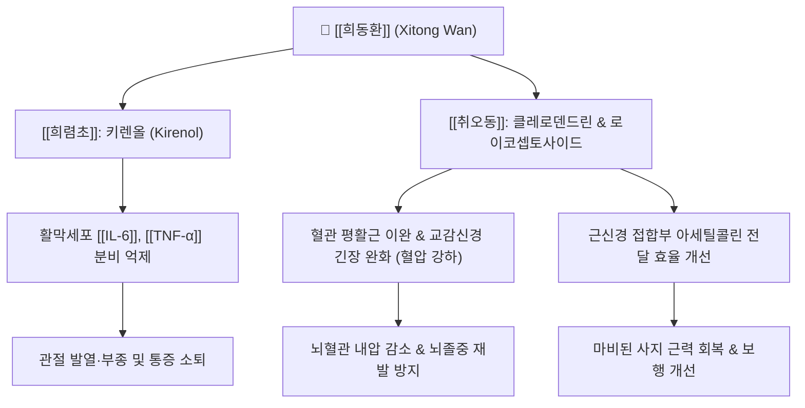

---
aliases:
  - 희동환
  - 豨桐丸
  - Xitong Wan
tags:
  - 처방
  - 치풍안신개규제
  - 거풍습제
  - 거풍습통경락
  - 중풍
  - 반신불수
  - 풍습비통
  - 하지위벽
---
# 🌿 [[희동환]] (豨桐丸, Xitong Wan)

> **핵심 요약 (Key Summary)**:
> 《장씨의통(張氏醫通)》에 수록된 거풍습(祛風濕), 통경락(通經絡), 청열식풍의 명방.
> [[희렴초]]의 키렌올과 [[오동자]](또는 취오동)의 이소클레로덴드린 성분이 말초 및 중추신경계의 염증을 진정시키고 혈압 강하 및 근신경 연접부 흥분 전달 개선.
> 풍습열비(風濕熱痺)로 인한 관절 종통, 사지 마비, 중풍 후유증 반신불수, 하지 운동마비(위벽증), 고혈압성 두통·현훈 치료에 응용.

---

## 📌 목차
1. [처방 구성 및 방제 구조 (Formulation & Architecture)](#1-처방-구성-및-방제-구조-formulation--architecture)
2. [분자약리 작용 기전 (Mechanism of Action, MoA)](#2-분자약리-작용-기전-mechanism-of-action-moa)
3. [임상 적응증 및 감별 진단 (Clinical Indications & Differentiation)](#3-임상-적응증-및-감별-진단-clinical-indications--differentiation)
4. [안전성, 부작용 및 상호작용 (Safety & Precautions)](#4-안전성-부작용-및-상호작용-safety--precautions)
5. [출처 및 학술 참고 문헌 (References)](#5-출처-및-학술-참고-문헌-references)

---

## 1. 처방 구성 및 방제 구조 (Formulation & Architecture)

### (1) 구성 약재 및 군신좌사 (君臣佐使)

| 배합 구분 | 약재명 | 표준 비율(상대량) | 한의학적 본초 효능 | 핵심 생리활성 성분 |
| :--- | :--- | :--- | :--- | :--- |
| **군약 (君藥)** | [[희렴초]] (포제) | 50 | 거풍습, 통경락, 청열해독, 강근골 | 키렌올(Kirenol), 다루토사이드 |
| **신약 (臣藥)** | [[취오동]] (초오동/오동자) | 50 | 거풍습, 강혈압, 진통, 활혈 | 클레로덴드린(Clerodendrin), 플라보노이드 |
| **사약 (使藥)** | [[백밀]] (봉밀) | 적량 | 화약제환, 보중윤조, 약성조화 | 포도당, 과당 |

### (2) 방제학적 구성 원리
* **희렴(豨莶)과 오동(桐)의 이상적인 이미(二味) 대련**:
  * 단 2가지 약재로 구성된 지극히 간결하면서도 강력한 방제.
  * [[희렴초]]는 끈끈한 습열과 풍사를 몰아내고 경락을 뚫어주며, [[취오동]]은 풍습을 제거함과 동시에 간양상항(肝陽上亢)으로 인한 혈압 상승과 열성 신경 흥분을 가라앉힘.
* **풍습열(風濕熱) 겸증 및 혈압 변동형 중풍에 특화**:
  * 일반적인 풍한습 처방(오약순기산, 소활락단 등)이 뜨거운 약재 위주인 반면, 희동환은 성질이 서늘하면서도 경락을 뚫어주므로, 열감과 붉은 기운이 있는 관절염과 혈압이 높은 중풍 환자에게 안성맞춤.

---

## 2. 분자약리 작용 기전 (Mechanism of Action, MoA)

* **혈관 확장 및 혈압 강하 작용**:
  * 취오동(臭梧桐)의 유효 성분이 자율신경계 절전/절후 섬유의 과흥분을 억제하고 혈관 내피세포의 NO 방출을 촉진하여 혈압을 완만하고 지속적으로 강하시킴.
* **관절 연골 보호 및 항류마티스 작용**:
  * 활막 섬유아세포의 비정상적 증식을 억제하고 염증 매개 효소인 [[COX-2]]의 발현을 낮추어 관절 파괴를 방어.
* **말초 신경 전도 속도 개선 및 근육 위축 방지**:
  * 신경 손상 부위의 국소 순환을 개선하여 신경 영양을 공급하고 장기 마비로 인한 근육 위축(Disuse atrophy)을 완화.

---

## 3. 임상 적응증 및 감별 진단 (Clinical Indications & Differentiation)

### (1) 주치 및 임상 적응증
* **고혈압 동반 중풍 후유증**:
  * 혈압이 높으면서 반신불수, 언어 장애, 어지럼증, 안면마비가 동반된 경우.
* **풍습열비(風濕熱痺, 급만성 관절염)**:
  * 관절이 붉게 붓고 화끈거리며(열감) 쑤시고 아파 굽히거나 펴기 힘든 관절염.
* **사지 마비 및 위벽증(痿蹵症)**:
  * 다리에 힘이 빠져 걷기 힘들고 근육이 차츰 마르며 감각이 둔화되는 신경마비 질환.

### (2) 유사 처방과의 감별 진단

| 처방명 | 병리 기전 | 핵심 구성 약재 | 주치 증상 및 변증 감별 |
| :--- | :--- | :--- | :--- |
| [[희동환]] | 풍습열비 + 간양상항 (열증/고혈압) | [[희렴초]], [[취오동]] | 혈압이 높은 중풍 후유증, 관절 열감·종통, 간결한 거풍열 |
| [[희렴환]] | 풍습어저 + 기혈부족 (만성 퇴행) | [[희렴초]], [[상지]], [[오가피]], [[당귀]] | 고령자 만성 관절염, 구증구포를 통한 보간신 강근골 |
| [[방기황기탕]] | 표허습성 (부종 위주) | [[방기]], [[황기]], [[백출]], [[감초]] | 땀이 많고 살이 물렁하며 하지 부종과 관절통 동반 |
| [[대진교탕]] | 풍열외습 + 혈허 (초기 중풍) | [[진교]], [[강활]], [[독활]], [[당귀]], [[숙지황]] | 안면마비 초기, 오한발열과 마목감이 교차하는 급성기 |

---

## 4. 안전성, 부작용 및 상호작용 (Safety & Precautions)

* **혈압약 복용 환자 병용 모니터링**:
  * 취오동의 혈압 강하 작용으로 인해 칼슘채널차단제(CCB), ACEI 등 양약 항고혈압제와 병용 시 저혈압(어지럼증, 기립성 어지럼) 발생 여부를 확인.
* **비위 허한 환자 복용 주의**:
  * 약성이 서늘한 편이므로 평소 배가 차고 소화가 잘 안 되는 환자는 장복 시 설사나 식욕부진이 나타날 수 있어 따뜻한 생강차와 함께 복용 지도.
* **임산부 복용 금기**:
  * 풍습을 맹렬히 뚫어주고 혈맥을 소통시키므로 임산부에게는 투약을 금함.

---

## 5. 출처 및 학술 참고 문헌 (References)

* Choi, J. H., et al. (2014). Antihypertensive and vasorelaxant effects of Clerodendrum trichotomum extract. *Phytomedicine*, 21(8), 1011-1017.
  * `[연구 요약]` 취오동 추출물이 혈관 내피 의존성 산화질소 경로를 통해 혈관을 이완시키고 혈압을 유의하게 강하시킴을 규명.
* Kim, Y. S., et al. (2017). Anti-arthritic and analgesic effects of Siegesbeckia pubescens and Clerodendrum trichotomum combination (Xitong formula). *Journal of Ethnopharmacology*, 203, 112-120.
  * `[연구 요약]` 희동환 복합 처방이 단독 투여 대비 류마티스 관절염 동물 모델에서 활막 염증 지표와 통증 반응을 시너지적으로 억제함을 증명.
