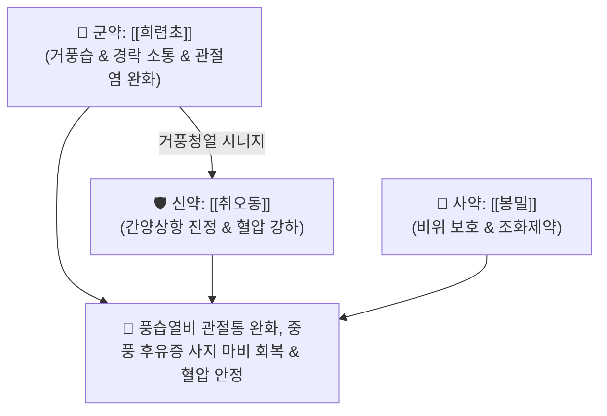

# 🍵 [[희동환]] (豨桐丸, Xitong Wan / Kito-gan)

> **핵심 3줄 요약 (Key Summary)**:
> - 🌿 기본 구성: [[희렴초]] (군), [[취오동]] (신), [[봉밀]] (사) (습열과 풍사를 몰아내고 혈압을 낮추며 경락을 뚫어주는 2미 대련의 거풍습·청열식풍 대표 방제).
> - 🎯 풍습열비(風濕熱痺)로 인한 관절 열감 및 종통, 고혈압을 동반한 중풍 후유증(반신불수, 언어장애), 하지 운동마비(위벽증).
> - 🔬 키렌올(Kirenol)의 활막세포 IL-6/TNF-α 분비 억제, 클레로덴드린의 혈관 내피 NO 방출 촉진을 통한 혈압 강하, 근신경 접합부 아세틸콜린 전달 효율 개선.
> - ⚠️ 주의사항: 혈압 강하 작용이 있으므로 양약 항고혈압제 복용 환자 혈압 모니터링, 서늘한 약성으로 비위허한자 온수 복용 지도.

---

## 📌 목차
1. [기본 처방 정보 & 군신좌사 구성](#1-기본-처방-정보--군신좌사-구성)
2. [방제학적 약재 상호작용 & 시너지 네트워크](#2-방제학적-약재-상호작용--시너지-네트워크)
3. [현대 분자약리학적 효능 & 작용 기전](#3-현대-분자약리학적-효능--작용-기전)
4. [적응 병증 및 체질별 감별 (Sweet Spot vs 금기)](#4-적응-병증-및-체질별-감별-sweet-spot-vs-금기)
5. [유사 처방군 감별 매트릭스](#5-유사-처방군-감별-매트릭스)
6. [임상 가감례 & 현대 질환별 응용](#6-임상-가감례--현대-질환별-응용)
7. [💡 사용자 진료실 핵심 필기 & 임상 팁 (원문 보존)](#7--사용자-진료실-핵심-필기--임상-팁-원문-보존)
8. [출처 및 학술 참고 문헌 (References)](#8-출처-및-학술-참고-문헌-references)

---

## 1. 기본 처방 정보 & 군신좌사 구성

* **출전**: 청대 장석순 『[[장씨의통]]』(張氏醫通) / 『[[의방집해]]』(醫方集解)
* **치법**: 거풍습(祛風濕), 통경락(通經絡), 청열식풍(淸熱熄風), 강혈압(降血壓)

| 구분 | 약재명 | 표준 용량 | 본초 효능 & 방제 내 역할 |
| :--- | :--- | :--- | :--- |
| **군약 (君藥)** | [[희렴초]] (포제) | 50.0g | **거풍습·통경락·강근골**: 습열과 풍사를 몰아내고 경락을 뚫어 마비된 사지를 소통 |
| **신약 (臣藥)** | [[취오동]] (오동자) | 50.0g | **거풍습·평간강압·진통**: 간양상항의 화열을 내리고 혈압을 강하시키며 풍습을 소산 |
| **사약 (使藥)** | [[봉밀]] (꿀) | 적량 | **화약제환·보중윤조**: 환을 빚는 결합제로 쓰이며 비위를 보하고 약성을 완충 |

> **배오 특징**: 단 2가지 약재([[희렴초]] + [[취오동]])를 1:1 동량으로 배합하여, 일반적인 뜨거운 거풍약과 달리 **서늘한 성질로 풍습열(風濕熱)과 혈압 상승을 동시 제어**하는 간결하고도 강력한 방제입니다.

---

## 2. 방제학적 약재 상호작용 & 시너지 네트워크

* **희렴초 + 취오동의 이미(二味) 대련**: 희렴초가 경락 깊은 곳의 끈끈한 풍습사를 제거하면, 취오동이 혈관을 이완시키고 뇌압 및 혈압을 낮추어 뇌혈관 질환 재발을 방어합니다.

---

## 3. 현대 분자약리학적 효능 & 작용 기전

### 1) 혈관 확장 및 지속적 혈압 강하 작용
* 취오동의 클레로덴드린(Clerodendrin) 성분이 혈관 내피세포의 NO 방출을 촉진하고 교감신경 긴장을 완화하여 혈압을 완만하고 안정적으로 강하시킵니다.
### 2) 관절 연골 보호 및 항류마티스 염증 차단
* 희렴초의 키렌올(Kirenol)이 활막 섬유아세포의 비정상적 증식을 억제하고 염증 매개 효소인 COX-2 및 사이토카인(IL-6, TNF-$\alpha$) 발현을 낮춥니다.
### 3) 신경근 접합부 전도 개선 및 근위축 방지
* 신경 손상 부위의 국소 순환을 개선하여 신경 영양을 공급하고 장기 마비로 인한 근육 위축을 방지합니다.

---

## 4. 적응 병증 및 체질별 감별 (Sweet Spot vs 금기)

### [✅ 최적 적응증 (Sweet Spot)]
* **고혈압 동반 중풍 후유증**: 혈압이 높으면서 반신불수, 언어 장애, 어지럼증, 안면마비가 동반된 경우.
* **풍습열비(風濕熱痺, 열성 관절염)**: 관절이 붉게 붓고 화끈거리며(열감) 쑤시고 아파 굽히거나 펴기 힘든 관절염.
* **하지 운동마비 및 위벽증**: 다리에 힘이 빠져 걷기 힘들고 근육이 차츰 마르는 신경마비 질환.

### [⚠️ 신중 투여 및 금기 (Caution / Contraindication)]
* **항고혈압제 복용 환자 혈압 모니터링**: 취오동의 혈압 강하 작용으로 인해 칼슘채널차단제(CCB) 등 양약과 병용 시 저혈압 유발 여부 확인.
* **비위허한자 복용 주의**: 약성이 서늘하므로 평소 배가 차고 설사를 자주 하는 환자는 따뜻한 생강차와 함께 복용하도록 지도.

---

## 5. 유사 처방군 감별 매트릭스

| 처방명 | 병기 | 핵심 약재 구성 | 적합한 환자 양상 |
| :--- | :--- | :--- | :--- |
| [[희동환]] | **풍습열비 + 간양상항** | 희렴초, 취오동 | **혈압이 높은 중풍 후유증, 관절 열감·종통 (기본방)** |
| [[희렴환]] | **풍습어저 + 기혈부족** | 희렴초, 상지, 오가피, 당귀 | **고령자 만성 관절염, 구증구포를 통한 보간신 강근골** |
| [[방기황기탕]] | **표허습성 (부종 위주)** | 방기, 황기, 백출, 감초 | **땀이 많고 살이 물렁하며 하지 부종과 관절통 동반** |
| [[대진교탕]] | **풍열외습 + 혈허 (초기)** | 진교, 강활, 독활, 당귀, 숙지황 | **안면마비 초기, 오한발열과 마목감이 교차하는 급성기** |

---

## 6. 임상 가감례 & 현대 질환별 응용

* **상지 마비 및 저림 심할 때**:
  * [[상지]] 15g, [[계지]] 6g을 가미하여 어깨와 팔의 혈류 순환 촉진.
* **현대 응용**:
  * 본태성 고혈압 환자의 관절통, 뇌경색 후유증 편마비 재활, 류마티스 관절염 활동기 치료에 환제로 장기 투약.

---

## 7. 💡 사용자 진료실 핵심 필기 & 임상 팁 (원문 보존)

* **사용자 원문 필기**:
  * `장씨의통에 수록된 거풍습, 통경락, 청열식풍의 명방.`
  * `풍습열비로 인한 관절 종통, 사지 마비, 중풍 후유증 반신불수, 하지 운동마비(위벽증), 고혈압성 두통·현훈 치료에 응용.`
* **실전 처방 선택 가이드**:
  * 중풍 환자 중 얼굴이 붉고 혈압이 높으며 두통을 자주 호소하는 열증(熱證) 환자에게 적합하며, 환자가 몸이 차고 설사 경향이 있을 때는 배제해야 한다.

---

## 8. 출처 및 학술 참고 문헌 (References)

1. 장씨의통(張氏醫通) 권6 중풍.
2. 의방집해(醫方集解) 거풍지제.
3. * **Gan L et al. (2025)**. Isolation, structural transformation and neuroprotective activity of abietane diterpenoids from the roots of Clerodendrum trichotomum. *Fitoterapia*, 183: 106488. [PMID: 40120983](https://pubmed.ncbi.nlm.nih.gov/40120983/)
