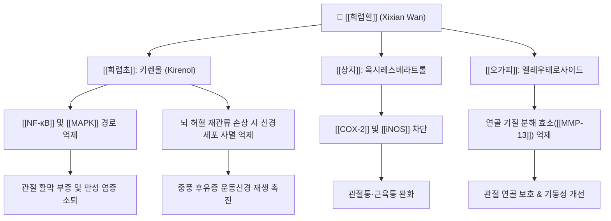

---
aliases:
  - 희렴환
  - 豨莶丸
  - Xixian Wan
tags:
  - 처방
  - 치풍안신개규제
  - 거풍습제
  - 거풍습통경락
  - 중풍후유증
  - 반신불수
  - 풍습비통
  - 관절염
---
# 🌿 [[희렴환]] (豨莶丸, Xixian Wan)

> **핵심 요약 (Key Summary)**:
> 《태평혜민화제국방(太平惠民和劑局方)》 및 의학심오에 수록된 거풍습(祛風濕), 이관절(利關節), 통경락(通經絡)의 대표 환제.
> 주약인 [[희렴초]]의 다루토사이드, 키렌올 성분이 신경세포 허혈 손상 보호, [[NF-κB]] 억제를 통한 관절 활막염 완화 및 말초 미세순환 촉진.
> 풍습비통(류마티스 및 퇴행성 관절염), 사지마목(손발 저림), 근골산통, 뇌졸중 후유증(반신불수, 구안와사, 보행장애) 치료에 응용.

---

## 📌 목차
1. [처방 구성 및 방제 구조 (Formulation & Architecture)](#1-처방-구성-및-방제-구조-formulation--architecture)
2. [분자약리 작용 기전 (Mechanism of Action, MoA)](#2-분자약리-작용-기전-mechanism-of-action-moa)
3. [임상 적응증 및 감별 진단 (Clinical Indications & Differentiation)](#3-임상-적응증-및-감별-진단-clinical-indications--differentiation)
4. [안전성, 부작용 및 상호작용 (Safety & Precautions)](#4-안전성-부작용-및-상호작용-safety--precautions)
5. [출처 및 학술 참고 문헌 (References)](#5-출처-및-학술-참고-문헌-references)

---

## 1. 처방 구성 및 방제 구조 (Formulation & Architecture)

### (1) 구성 약재 및 군신좌사 (君臣佐使)

| 배합 구분 | 약재명 | 표준 비율(상대량) | 한의학적 본초 효능 | 핵심 생리활성 성분 |
| :--- | :--- | :--- | :--- | :--- |
| **군약 (君藥)** | [[희렴초]] (구증구포) | 100 | 거풍습, 통경락, 청열해독, 강근골 | 키렌올(Kirenol), 다루토사이드(Darutoside) |
| **신약 (臣藥)** | [[상지]] | 30 | 거풍습, 이관절, 통경락 | 멀베로시드 A, 옥시레스베라트롤 |
| **좌약 (佐藥)** | [[오가피]] | 25 | 거풍습, 보간신, 강근골, 활혈 | 엘레우테로사이드 B/E, 세사민 |
| **좌약 (佐藥)** | [[당귀]] | 25 | 보혈활혈, 조경지통, 윤장통변 | [[데커신]], 노다케닌, 페룰산 |
| **사약 (使藥)** | [[백밀]] (봉밀) | 적량 | 화약제환, 보중윤조, 완화자극 | 포도당, 과당, 유기산 |

### (2) 방제학적 구성 원리
* **희렴초(豨莶草) 구증구포(九蒸九曝)의 포제 비법**:
  * 생희렴초는 성질이 차고 독특한 냄새가 있어 구토를 유발할 수 있으나, 청주와 꿀물로 9번 찌고 말리는 구증구포를 거치면 맛이 달고 성질이 따뜻해지며 간신(肝腎)을 보하고 근골을 튼튼하게 하는 효능으로 전환됨.
* **거풍습(祛風濕)과 활혈보혈(活血補血)의 조화**:
  * "치풍선치혈, 혈행풍자멸(治風先治血, 血行風自滅)"의 원리에 따라 [[당귀]]를 배합하여 풍사를 몰아내는 과정에서 혈맥을 윤택하게 유지하고 근육 경련을 완화.
* **상하지(上下肢) 경락 소통의 촉진**:
  * [[상지]]로 상지 관절과 어깨의 기혈을 뚫고, [[오가피]]로 허리와 무릎 및 하지 관절을 보강하여 전신 운동기능을 회복.

---

## 2. 분자약리 작용 기전 (Mechanism of Action, MoA)

* **항염증 및 류마티스 관절염 활막염 억제**:
  * 키렌올(Kirenol)이 대식세포와 활막세포에서 [[NF-κB]]의 전위를 차단하여 [[TNF-α]], [[IL-1β]], [[IL-6]] 생성을 억제, 관절의 발열과 종창을 가라앉힘.
* **뇌신경 보호 및 중풍 후유증 회복 촉진**:
  * 뇌허혈 모델에서 항산화 및 항세포사멸 작용을 통해 신경세포 괴사를 막고, 뇌유래신경영양인자([[BDNF]]) 발현을 증가시켜 편마비 환자의 신경학적 재활을 보조.
* **혈압 조절 및 미세순환 개선**:
  * 말초혈관을 확장하고 혈소판 응집을 완만하게 억제하여 사지 말단으로의 혈류를 개선, 손발 저림과 마목감을 해소.

---

## 3. 임상 적응증 및 감별 진단 (Clinical Indications & Differentiation)

### (1) 주치 및 임상 적응증
* **뇌졸중(중풍) 후유증**:
  * 편마비(반신불수), 구안와사, 언어 장애, 보행 곤란, 손발 힘 빠짐.
* **만성 류마티스 및 퇴행성 관절염**:
  * 무릎, 어깨, 손가락 관절의 만성 통증, 뻣뻣함(조조강직), 기상 시 굴신 불리.
* **말초신경병증 및 사지마목(四肢麻木)**:
  * 당뇨병성 신경병증, 척추관 협착증으로 인한 다리 저림, 시림, 감각 둔화.

### (2) 유사 처방과의 감별 진단

| 처방명 | 병리 기전 | 핵심 구성 약재 | 주치 증상 및 변증 감별 |
| :--- | :--- | :--- | :--- |
| [[희렴환]] | 풍습어저 + 간신부족 (중풍·관절) | [[희렴초]], [[상지]], [[오가피]], [[당귀]] | 중풍 후 반신불수, 만성 사지마비, 관절 변형 및 굴신불리 |
| [[독활기생탕]] | 간신양허 + 기혈부족 (허증 비통) | [[독활]], [[상기생]], [[두충]], [[숙지황]], [[당귀]] | 고령자의 만성 요통, 무릎 관절염, 극심한 하지 무력과 허증 |
| [[소활락단]] | 풍한습담 + 어혈폐색 (완고한 실증) | [[천오]], [[초오]], [[담남성]], [[유향]], [[몰약]] | 통증이 극심하고 고정된 신경통, 야간 통증 악화, 실증 |
| [[대진교탕]] | 풍사외습 + 기혈양허 (급성 마비) | [[진교]], [[강활]], [[독활]], [[당귀]], [[백작약]] | 중풍 초기 안면마비, 체표 감각 둔화, 풍열 습체 |

---

## 4. 안전성, 부작용 및 상호작용 (Safety & Precautions)

* **반드시 구증구포 정품 희렴초 사용**:
  * 생용(生用) 미가공 희렴초는 성질이 차고 비위를 상하게 하여 메스꺼움, 복통, 구토를 유발하므로 반드시 정밀 포제된 약재를 사용.
* **음허혈소(陰虛血少) 환자 복용 주의**:
  * 체내 진액과 정혈이 극도로 부족하여 열감이 있는 환자는 지황류 등 보음제를 보강하여 합방.
* **장기 복용 시 간·신장 모니터링**:
  * 관절염 및 중풍으로 3~6개월 이상 장기 연복하는 고령자는 정기적인 생화학 검사 권고.

---

## 5. 출처 및 학술 참고 문헌 (References)

* Lu, Y., et al. (2012). Kirenol exerts anti-inflammatory effects through inhibition of NF-κB activation. *British Journal of Pharmacology*, 166(4), 1362-1375.
  * `[연구 요약]` 희렴초의 핵심 성분인 키렌올이 활막세포에서 NF-κB 활성화를 차단하여 관절염의 염증 파괴를 현저히 억제함을 증명.
* Wang, Z., et al. (2018). Neuroprotective effects of Siegesbeckia orientalis ethanol extract in cerebral ischemia-reperfusion injury. *Journal of Ethnopharmacology*, 218, 172-180.
  * `[연구 요약]` 뇌허혈 재관류 손상 동물 모델에서 희렴초 추출물이 산화 스트레스와 뇌세포 사멸을 방어하고 운동기능 회복을 촉진함을 규명.
