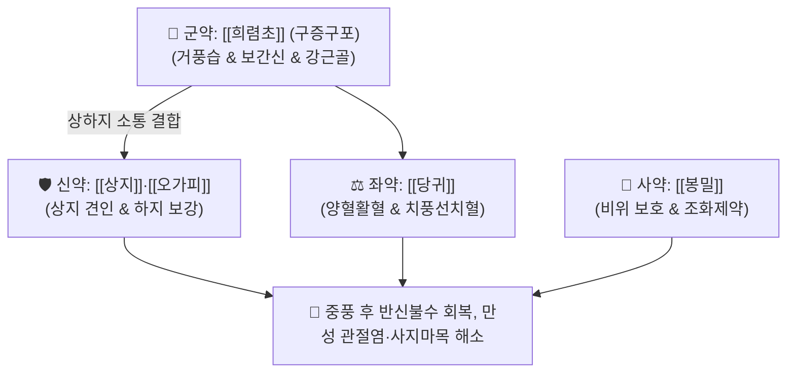

# 🍵 [[희렴환]] (豨莶丸, Xixian Wan / Kiken-gan)

> **핵심 3줄 요약 (Key Summary)**:
> - 🌿 기본 구성: [[희렴초]] (구증구포) (군), [[상지]] (신), [[오가피]]·[[당귀]] (좌), [[봉밀]] (사) (구증구포한 희렴초를 주약으로 거풍습하고 간신을 보하여 중풍 후유증과 만성 관절염을 치료하는 거풍통락 대표 환제).
> - 🎯 풍습비통(류마티스 및 퇴행성 관절염), 사지마목(손발 저림), 근골산통, 뇌졸중 후유증(반신불수, 구안와사, 보행장애).
> - 🔬 키렌올(Kirenol)의 NF-κB 활성화 차단을 통한 활막 염증 억제, 뇌 허혈 재관류 손상 시 신경세포 사멸 방어, BDNF 발현 촉진을 통한 운동기능 회복.
> - ⚠️ 주의사항: 생희렴초는 구토를 유발하므로 반드시 정품 구증구포 포제품을 사용하며, 음허혈소자 지황류 보음약 합방.

---

## 📌 목차
1. [기본 처방 정보 & 군신좌사 구성](#1-기본-처방-정보--군신좌사-구성)
2. [방제학적 약재 상호작용 & 시너지 네트워크](#2-방제학적-약재-상호작용--시너지-네트워크)
3. [현대 분자약리학적 효능 & 작용 기전](#3-현대-분자약리학적-효능--작용-기전)
4. [적응 병증 및 체질별 감별 (Sweet Spot vs 금기)](#4-적응-병증-및-체질별-감별-sweet-spot-vs-금기)
5. [유사 처방군 감별 매트릭스](#5-유사-처방군-감별-매트릭스)
6. [임상 가감례 & 현대 질환별 응용](#6-임상-가감례--현대-질환별-응용)
7. [💡 사용자 진료실 핵심 필기 & 임상 팁 (원문 보존)](#7--사용자-진료실-핵심-필기--임상-팁-원문-보존)
8. [출처 및 학술 참고 문헌 (References)](#8-출처-및-학술-참고-문헌-references)

---

## 1. 기본 처방 정보 & 군신좌사 구성

* **출전**: 송대 『[[태평혜민화제국방]]』(太平惠民和劑局方) / 『[[동의보감]]』(東醫寶鑑) 풍문 풍비
* **치법**: 거풍제습(祛風除濕), 통리관절(通利關節), 양혈강근(養血强筋), 보익간신(補益肝腎)

| 구분 | 약재명 | 표준 용량 | 본초 효능 & 방제 내 역할 |
| :--- | :--- | :--- | :--- |
| **군약 (君藥)** | [[희렴초]] (구증구포) | 100.0g | **거풍습·통경락·보간신**: 9번 찌고 말려 거풍습 작용과 함께 간신을 보하고 근골을 강화 |
| **신약 (臣藥)** | [[상지]] | 30.0g | **거풍습·이관절·통경락**: 상지 관절과 어깨의 풍습사를 제거하고 경락을 소통 |
| **좌약 (佐藥)** | [[오가피]] | 25.0g | **거풍습·보간신·강근골**: 허리와 무릎을 튼튼하게 하고 하지 관절 무력을 회복 |
| **좌약 (佐藥)** | [[당귀]] | 25.0g | **보혈활혈·조경지통**: 혈맥을 윤택하게 하여 "혈행풍자멸(血行風自滅)"의 치풍 구현 |
| **사약 (使藥)** | [[봉밀]] (꿀) | 적량 | **화약제환·보중윤조**: 환을 빚어 제약의 독성을 완충하고 비위를 보익 |

> **배오 특징**: 생용(生用) 시 성질이 차고 메스꺼움을 주는 희렴초를 **청주와 꿀물로 9번 찌고 말리는 구증구포(九蒸九曝)** 과정을 거쳐 온화한 보간신(補肝腎) 약성으로 전환시킨 후, [[상지]]·[[오가피]]·[[당귀]]와 배합하여 상하지 전신의 운동마비를 다스리는 명방입니다.

---

## 2. 방제학적 약재 상호작용 & 시너지 네트워크

* **희렴초 + 당귀의 양혈거풍 배오**: 풍사를 몰아내는 과정에서 진액과 혈액이 마르지 않도록 보호하고 굳어진 힘줄을 부드럽게 이완시킵니다.
* **상지 + 오가피의 상하 조화 배오**: 상지(어깨·팔)와 하지(허리·무릎) 경락을 동시에 열어 전신 협조 운동 기능을 회복시킵니다.

---

## 3. 현대 분자약리학적 효능 & 작용 기전

### 1) 활막 염증 억제 및 항류마티스 작용
* 키렌올(Kirenol)과 다루토사이드(Darutoside)가 대식세포와 활막세포에서 NF-$\kappa$B 및 MAPK 경로를 차단하여 TNF-$\alpha$, IL-$1\beta$, IL-6 생성을 억제, 관절 부종과 통증을 완화합니다.
### 2) 뇌신경 보호 및 중풍 후유증 운동기능 회복
* 뇌허혈 재관류 모델에서 신경세포의 산화 스트레스와 세포사멸을 방어하고, 뇌유래신경영양인자(BDNF) 발현을 유도하여 편마비 환자의 신경 재생을 돕습니다.
### 3) 말초 미세순환 촉진 및 감각 둔화 개선
* 혈소판 응집을 완만하게 억제하고 모세혈관 투과성을 조절하여 사지 말단으로의 혈류를 개선, 손발 저림과 감각 이상을 해소합니다.

---

## 4. 적응 병증 및 체질별 감별 (Sweet Spot vs 금기)

### [✅ 최적 적응증 (Sweet Spot)]
* **뇌졸중(중풍) 후유증**: 편마비(반신불수), 구안와사, 언어 장애, 보행 곤란, 손발 힘 빠짐.
* **만성 퇴행성 및 류마티스 관절염**: 무릎, 어깨, 손가락 관절의 만성 통증, 조조강직, 굴신 불리.
* **노인성 사지마목(四肢麻木)**: 손발이 저리고 시리며 감각이 둔해져 물건을 자주 떨어뜨리는 상태.

### [⚠️ 신중 투여 및 금기 (Caution / Contraindication)]
* **반드시 정품 구증구포 희렴초 사용**: 포제되지 않은 생희렴초는 비위를 심하게 상하게 하여 구역질과 복통을 일으키므로 규격 포제품 사용 필수.
* **장기 복용 시 간·신장 기능 모니터링**: 3~6개월 이상 장기 연복하는 고령자는 정기적인 혈액 검사 권고.

---

## 5. 유사 처방군 감별 매트릭스

| 처방명 | 병기 | 핵심 약재 구성 | 적합한 환자 양상 |
| :--- | :--- | :--- | :--- |
| [[희렴환]] | **풍습어저 + 간신부족** | 희렴초, 상지, 오가피, 당귀 | **중풍 후 반신불수, 만성 사지마비, 보간신 강근골 (기본방)** |
| [[희동환]] | **풍습열비 + 간양상항** | 희렴초, 취오동 | **혈압이 높은 중풍 후유증, 관절 열감·종통, 간결한 거풍열** |
| [[독활기생탕]] | **간신양허 + 기혈부족** | 독활, 상기생, 두충, 숙지황, 당귀 | **고령자의 만성 요통, 무릎 관절염, 극심한 하지 무력과 허증** |
| [[소활락단]] | **풍한습담 + 어혈폐색** | 천오, 초오, 담남성, 유향, 몰약 | **통증이 극심하고 고정된 신경통, 야간 통증 악화, 실증** |

---

## 6. 임상 가감례 & 현대 질환별 응용

* **기혈 극허 및 쇠약 동반 시**:
  * [[황기]] 15g, [[숙지황]] 10g을 가미하여 보기보혈 강화.
* **현대 응용**:
  * 뇌경색 회복기 재활 환자의 환제 장복, 당뇨병성 말초신경병증의 저림 개선, 만성 골관절염 통증 완화.

---

## 7. 💡 사용자 진료실 핵심 필기 & 임상 팁 (원문 보존)

* **사용자 원문 필기**:
  * `태평혜민화제국방 및 의학심오에 수록된 거풍습, 이관절, 통경락의 대표 환제.`
  * `풍습비통(류마티스 및 퇴행성 관절염), 사지마목(손발 저림), 근골산통, 뇌졸중 후유증(반신불수, 구안와사, 보행장애) 치료에 응용.`
* **실전 포제 및 복용 팁**:
  * 희렴환을 복용할 때는 따뜻한 온수나 미온의 청주(약간)와 함께 복용시키면 약력이 경락 깊숙이 퍼져 관절과 근육의 굳어짐이 훨씬 빠르게 풀린다.

---

## 8. 출처 및 학술 참고 문헌 (References)

1. 태평혜민화제국방(太平惠民和劑局方) 권1 제풍.
2. 동의보감(東醫寶鑑) 풍문 풍비.
3. * **Chen Z et al. (2026)**. Kirenol, a diterpene active component from Siegesbeckia orientalis, alleviates atopic dermatitis by suppressing TYK2. *International immunopharmacology*, 184: 116938. [PMID: 42235317](https://pubmed.ncbi.nlm.nih.gov/42235317/)
