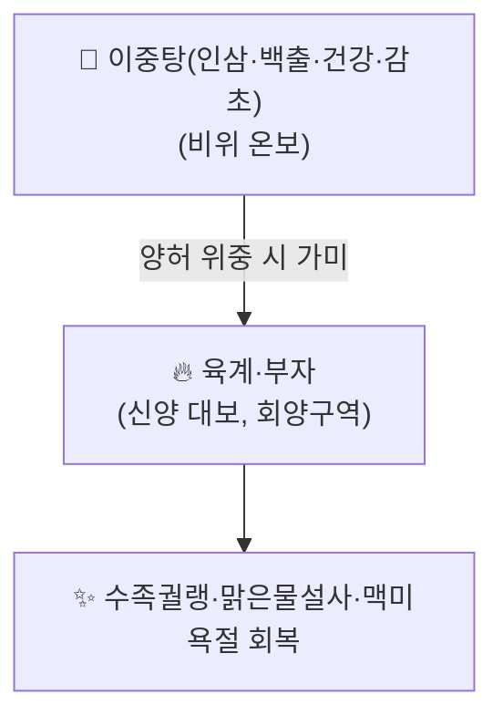

---
aliases:
  - 官桂附子理中湯
  - Gwan-gye-buja-yijung-tang
tags:
  - 처방
  - 사상체질방
  - 소음인
  - 이중탕
---

# 🍵 관계부자이중탕 (官桂附子理中湯)

> **핵심 3줄 요약 (Key Summary)**:
> - 🌿 모체/기원 처방: 『상한론』 [[이중탕]](인삼·백출·건강·감초)에 육계(관계)와 부자를 더한 처방. 이제마(李濟馬)가 『동의수세보원』에서 소음인(少陰人) 전용 처방으로 정립.
> - 🎯 임상 적응증: 소음인 태음증(太陰證)의 극심한 양허(陽虛) — 수족궐랭(손발이 얼음장처럼 참), 맑은 물 설사, 극심한 오한, 맥침미욕절(脈沈微欲絶, 맥이 가라앉고 미약해 끊어질 듯함).
> - 🔬 현대적 관점: 부자·육계의 강심·혈관확장 작용을 통한 심박출량 회복 및 교감신경 흥분 유도가 사지 냉감·설사 개선의 기전으로 제시됨.
> - ⚠️ 주의사항: 부자를 포함하므로 반드시 법제된 포부자를 정량 사용해야 하며, 심한 열증·실열 병증에는 절대 금기. 태음인·소양인 등 타 체질의 유사 증상(하지마비 등)에 오용하지 않도록 체질 감별이 필수.

---

## 📌 목차
1. [기본 처방 정보 & 구성](#1-기본-처방-정보--구성)
2. [방제학적 약재 상호작용 & 시너지 네트워크](#2-방제학적-약재-상호작용--시너지-네트워크)
3. [현대 분자약리학적 효능 & 작용 기전](#3-현대-분자약리학적-효능--작용-기전)
4. [적응 병증 및 체질별 감별 (Sweet Spot vs 금기)](#4-적응-병증-및-체질별-감별-sweet-spot-vs-금기)
5. [유사 처방군 감별 매트릭스](#5-유사-처방군-감별-매트릭스)
6. [임상 가감례 & 현대 질환별 응용](#6-임상-가감례--현대-질환별-응용)
7. [💡 사용자 진료실 핵심 필기 & 임상 팁 (원문 보존)](#7--사용자-진료실-핵심-필기--임상-팁-원문-보존)
8. [출처 및 학술 참고 문헌 (References)](#8-출처-및-학술-참고-문헌-references)

---

## 1. 기본 처방 정보 & 구성

* **출전**: 이제마(李濟馬) 『동의수세보원(東醫壽世保元)』 — 소음인 태음증 처방. 상한론 [[이중탕]]에 [[육계]](관계)와 [[부자]]를 가미한 구조.
* **치법**: 온중산한(溫中散寒), 회양구역(回陽救逆), 건비지사(健脾止瀉).

| 구분 | 약재명 | 방제 내 역할 |
| :--- | :--- | :--- |
| **기본 구성 ([[이중탕]])** | [[인삼]], [[백출]], [[건강]], [[감초]] | 비위(脾胃)를 따뜻하게 하고 기운을 보하여 [[설사]]·[[소화불량]] 개선 |
| **가미 (양허 회복)** | [[육계]](관계), [[부자]] | 신양(腎陽)을 크게 보하여 사지 궐랭·극심한 오한을 회복(회양구역) |

> **배오 특징**: [[이중탕]]의 비위 온보(溫補) 작용에 부자·육계의 강력한 온신회양(溫腎回陽) 작용을 더해, 단순 소화기 허약을 넘어선 전신 양허(陽虛) 위중증까지 다스릴 수 있도록 확장한 구조입니다.

---

## 2. 방제학적 약재 상호작용 & 시너지 네트워크

* [[이중탕]]만으로 부족한 극심한 양허(수족궐랭, 맥미욕절)에는 부자·육계를 더해 신양(腎陽)까지 회복시키는 것이 배오의 핵심입니다.

---

## 3. 현대 분자약리학적 효능 & 작용 기전

* **강심 및 혈류 촉진**: [[부자]]의 [[히게나민]](Higenamine, β1 효능제) 및 [[육계]]의 [[신남알데하이드]](Cinnamaldehyde, TRPA1/TRPV1 온열수용체 자극)가 심박출량 및 심부 혈류를 촉진하여 사지 궐랭을 개선하는 기전으로 제시됩니다.
* **포제(炮製) 안전성**: [[부자]]는 가열 포제를 통해 맹독성 디에스테르 알칼로이드([[아코니틴]] 등)를 저독성 모노에스테르 알칼로이드로 전환시킨 법제품(포부자)만을 정량 사용해야 합니다.

---

## 4. 적응 병증 및 체질별 감별 (Sweet Spot vs 금기)

* **체질 소견**: 소음인(少陰人) — 신대비소(腎大脾小), 비위가 약하고 몸이 잘 냉해지는 체질.
* **핵심 주치**: 소음증(少陰證) — 음성격양(陰盛格陽), 하리청곡(먹은 것이 소화되지 않고 그대로 나오는 설사), 수족궐랭, 극심한 오한.
* **설진/맥진**: 설질담백(舌質淡白), 맥침미욕절(脈沈微欲絶).
* **금기**: 실열증·조열증 환자, 태음인·소양인 등 타 체질의 유사 증상(하지마비 등)에 오용 금지.

---

## 5. 유사 처방군 감별 매트릭스

| 처방명 | 핵심 구성 차이 | 주치 및 체질 차이 |
| :--- | :--- | :--- |
| [[관계부자이중탕]] (본 처방) | 이중탕 + 육계·부자 | 소음인 극심한 양허, 수족궐랭·맑은물설사 |
| [[이중탕]] | 인삼·백출·건강·감초 | 비위 허한(虛寒)의 경증~중등도 [[소화불량]]·[[설사]] |
| [[사역탕]] | 부자·건강·감초 | 음성격양의 위급한 양허 탈진 |
| [[향사양위탕]] | [[이중탕]] 계열 + [[향부자]]·[[사인]] 등 | 소음인 경증 [[소화불량]]·비위기체 |

---

## 6. 임상 가감례 & 현대 질환별 응용

* **현대 질환별 임상 매핑**:
  * 소음인 체질의 극심한 양허 병태(수족냉증, 만성 [[설사]], [[저혈압]]성 어지럼증 등)에 변증 활용.
* 원문에 구체적인 가감(加減) 사례는 별도로 기재되어 있지 않습니다.

---

## 7. 💡 사용자 진료실 핵심 필기 & 임상 팁 (원문 보존)

> [!tip] **진료실 실전 노하우 (User Clinical Insight)**
> - 현재 별도로 기록된 원장님 임상 필기가 없습니다. 추후 실전 진료 경험이 누적되면 이 섹션에 추가합니다.

---

## 8. 출처 및 학술 참고 문헌 (References)

1. **이제마 (1901)**. 『[[동의수세보원]](東醫壽世保元)』.
   - **[고전 원전]**: 소음인 태음증 조문 및 관계부자이중탕 원방 출전.
2. **장중경 (약 200년경)**. 『[[상한론]]』.
   - **[고전 원전]**: 모체 처방인 이중탕(인삼탕) 원방 출전.
