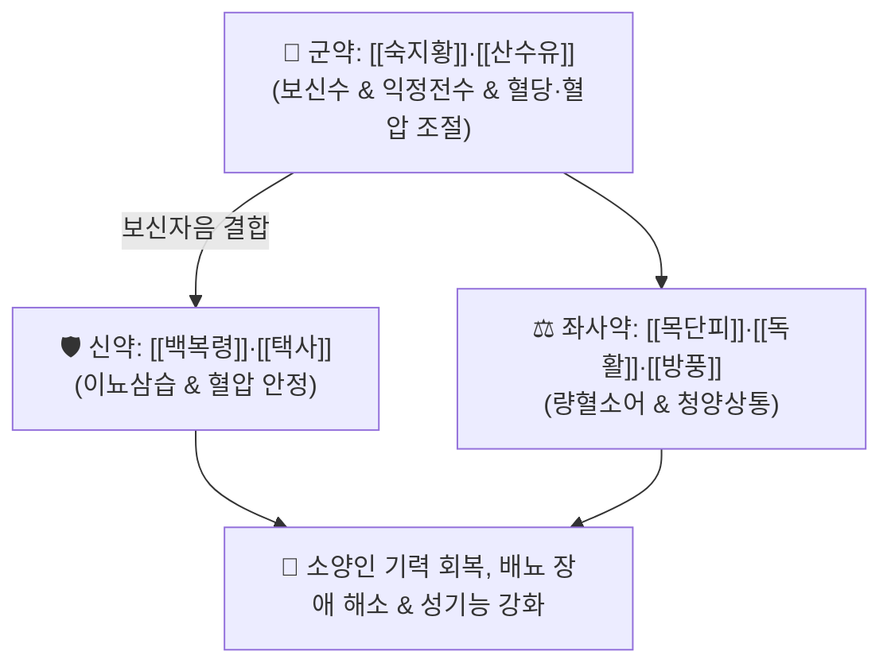

# 🍵 [[독활지황탕]] (獨活地黃湯, Dokhwaljihwang-tang / Dokkatsu-jio-to)

> **핵심 3줄 요약 (Key Summary)**:
> - 🌿 기본 구성: [[숙지황]]·[[산수유]] (군), [[백복령]]·[[택사]] (신), [[목단피]]·[[독활]]·[[방풍]] (좌사) (소양인의 고갈된 신수와 하초 음청을 대보하여 청양을 상통시키는 보신수·음양보 대표 방제).
> - 🎯 건장한 체격의 [[소양인]]이 과로와 스트레스로 기운이 없고, 배고프면 화가 나며, 소변불리, 성기능 저하(정력감퇴·발기부전)가 나타나는 위수열이열병(胃受熱裏熱病).
> - 🔬 숙지황 [[카탈폴]]의 혈당·혈압 조절 및 인슐린 감수성 개선, 산수유 [[로가닌]]의 테스토스테론 분비 촉진 및 해마 신경세포 사멸 억제, 복령·택사의 이뇨 및 혈압 강하.
> - ⚠️ 주의사항: 숙지황·산수유의 자니성(滋膩性)으로 소화장애 발생 가능(식후 복용), 비위가 차고 설사하는 소음인에게는 절대 투약 금기.

---

## 📌 목차
1. [기본 처방 정보 & 군신좌사 구성](#1-기본-처방-정보--군신좌사-구성)
2. [방제학적 약재 상호작용 & 시너지 네트워크](#2-방제학적-약재-상호작용--시너지-네트워크)
3. [현대 분자약리학적 효능 & 작용 기전](#3-현대-분자약리학적-효능--작용-기전)
4. [적응 병증 및 체질별 감별 (Sweet Spot vs 금기)](#4-적응-병증-및-체질별-감별-sweet-spot-vs-금기)
5. [유사 처방군 감별 매트릭스](#5-유사-처방군-감별-매트릭스)
6. [임상 가감례 & 현대 질환별 응용](#6-임상-가감례--현대-질환별-응용)
7. [💡 사용자 진료실 핵심 필기 & 임상 팁 (원문 보존)](#7--사용자-진료실-핵심-필기--임상-팁-원문-보존)
8. [출처 및 학술 참고 문헌 (References)](#8-출처-및-학술-참고-문헌-references)

---

## 1. 기본 처방 정보 & 군신좌사 구성

* **출전**: 이제마(李濟馬) 『[[동의수세보원]]』(東醫壽世保元) 소양인 위수열이열병론(少陽人 胃受熱裏熱病論)
* **치법**: 보신수(補腎水), 청양상통(淸陽上通), 자음강화(滋陰降火), 거풍이습(祛風利濕)

| 구분 | 약재명 | 표준 용량 | 본초 효능 & 방제 내 역할 |
| :--- | :--- | :--- | :--- |
| **군약 (君藥)** | [[숙지황]] | 8.0~16.0g | **자음보혈·익정전수**: 신수(腎水)를 대보하고 혈당과 혈압을 조절하며 정혈을 보충 |
| **군약 (君藥)** | [[산수유]] | 4.0~8.0g | **보익간신·삽정축뇨**: 간신의 음액을 수렴하고 성기능 및 비뇨기 기능을 강화 |
| **신약 (臣藥)** | [[백복령]] | 4.0~6.0g | **건비녕심·삼습이뇨**: 삼초 수액 대사를 원활하게 하고 혈압과 부종을 조절 |
| **신약 (臣藥)** | [[택사]] | 4.0~6.0g | **사신화·삼습통림**: 하초의 습열을 소변으로 배출하고 혈압을 안정화 |
| **좌약 (佐藥)** | [[목단피]] | 4.0~6.0g | **청열량혈·활혈산어**: 하초 혈맥에 울체된 허열과 미세 어혈을 제거 |
| **좌사약 (佐使藥)** | [[독활]]·[[방풍]] | 각 2.0~4.0g | **거풍통락·승양상통**: 약력을 전신 경락으로 인도하고 맑은 청양(淸陽)의 기운을 두면부로 상승 |

> **배오 특징**: 《동의수세보원》에서 장중경의 육미지황탕에서 [[목단피]]를 빼거나 줄이고 [[독활]]과 [[방풍]]을 가미하여 창제한 처방입니다. 소양인의 근본 결함인 **비대신소(脾大腎小)**로 인해 신수(腎水)가 마르고 청양(淸陽)이 머리로 오르지 못할 때, **하초를 자음보신하면서 독활·방풍으로 청양을 통하게(보신수 음양보 청양상통)** 하는 절묘한 배오입니다.

---

## 2. 방제학적 약재 상호작용 & 시너지 네트워크

* **숙지황·산수유 + 독활·방풍의 승강 배오**: 숙지황과 산수유가 하초에 마르지 않는 신수(진액)를 축적하면, 독활과 방풍이 이 진액의 맑은 기운(청양)을 머리 끝까지 끌어올려 만성 피로와 뇌혈류 장애를 해소합니다.
* **복령 + 택사의 삼습 배오**: 하초의 탁한 수습을 소변으로 원활히 배출시켜 전립선 및 방광의 압박을 줄입니다.

---

## 3. 현대 분자약리학적 효능 & 작용 기전

### 1) 혈당 및 인슐린 저항성 개선
* 숙지황의 카탈폴(Catalpol)과 산수유의 로가닌(Loganin) 성분이 골격근과 간조직의 GLUT4 발현 및 AMPK 인산화를 촉진하여 공복 혈당과 인슐린 저항성을 개선합니다.
### 2) 남성 생식기능 개선 및 테스토스테론 분비 촉진
* 고환 라이디히 세포(Leydig cell)의 스테로이드 합성 효소(StAR, 3$\beta$-HSD) 발현을 유도하여 혈중 유리 테스토스테론 농도를 높이고 발기부전 및 정자 운동성을 개선합니다.
### 3) 뇌 미세혈류 촉진 및 신경 보호 작용
* 독활과 방풍의 페놀성 유효 성분이 뇌혈관 평활근의 과긴장을 이완시키고 eNOS 발현을 자극하여 두뇌 피로와 현훈을 완화합니다.

---

## 4. 적응 병증 및 체질별 감별 (Sweet Spot vs 금기)

### [✅ 최적 적응증 (Sweet Spot)]
* **건장한 소양인의 성기능 저하 및 배뇨 장애**: 평소 체격이 좋고 열이 많은 소양인이 과로 후 소변발이 약해지고(소변불리), 발기부전, 조루, 정력 감퇴가 발생했을 때.
* **혈당 스파이크 및 만성 피로 증후군**: 밥을 굶으면 극도로 예민하고 화가 나며, 잠이 부족하고 스트레스로 기운이 바닥난 상태.
* **소양인 위수열이열병 만성기**: 흉격에 열이 차면서도 하초가 허약하여 허리·무릎이 시큰거리고 정력이 떨어지는 병태.

### [⚠️ 신중 투여 및 금기 (Caution / Contraindication)]
* **소음인 비위허한 환자 절대 금기**: 몸이 차고 소화력이 약한 소음인이 복용 시 숙지황·산수유로 인해 심한 소화불량, 구역, 물설사가 유발되므로 금기.
* **식후 따뜻하게 복용**: 소화기 부담을 줄이기 위해 식후 30분에 따뜻한 물로 복용하도록 지도.

---

## 5. 유사 처방군 감별 매트릭스

| 처방명 | 병기 | 핵심 약재 구성 | 적합한 환자 양상 |
| :--- | :--- | :--- | :--- |
| [[독활지황탕]] | **소양인 신음부족 청양불승** | 숙지황, 산수유, 복령, 택사, 독활, 방풍 | **건장한 소양인, 성기능 저하, 배뇨 장애, 피로 (기본방)** |
| [[형방사백산]] | **소양인 비수보한 표한이열** | 생지황, 복령, 택사, 형개, 방풍, 석고, 지모 | **혈압·혈당 상승, 성인병, 체온 상승, 안면부 부종** |
| [[육미지황탕]] | **간신음허 신수고갈** | 숙지황, 산수유, 산약, 복령, 택사, 목단피 | **일반 체질의 노인성 음허, 요슬산통, 조열 (방풍·독활 없음)** |
| [[팔물군자탕]] | **소음인 기혈양허 비위약** | 인삼, 백출, 감초, 당귀, 천궁, 황기 | **마르고 소화 안 되며 면역력 저하된 소음인 보약** |

---

## 6. 임상 가감례 & 현대 질환별 응용

* **당뇨 및 소갈(구갈) 심할 때**:
  * [[석고]] 4~8g, [[지모]] 4g을 가미하여 양명 위열을 강하게 사화.
* **현대 응용**:
  * 중년 남성 소양인의 대사증후군 동반 발기부전, 당뇨병성 말초신경병증, 만성 전립선염 및 전립선 비대증 배뇨 장애.

---

## 7. 💡 사용자 진료실 핵심 필기 & 임상 팁 (원문 보존)

* **사용자 원문 필기**:
  * [구성]: [[숙지황]], [[산수유]] / [[백복령]], [[택사]] / [[목단피]], [[독활]], [[방풍]]
  * [[숙지황]]: 혈당, 혈압을 조절
  * [적응증]:
    * 소양인과 같은 건장한 체질에 기운 없고, 오줌 잘 못 싸고, 성기능 문제 있는 경우에 사용.
    * 소양인 위수열 이열병에 청양이 제대로 상승하지 못할 때 보신수, 음양보를 통해 청양을 상통하도록 한다.
    * 배고프면 화나고, 피로하고 스트레스 받고, 잠이 부족한데, 발기부전, 정력저하되었지만 성욕은 감소하지 않은 경우에 활용.
* **진료실 실전 포인트**:
  * 소양인 남성이 "요즘 너무 피곤하고 아침에 발기가 안 되는데 성욕은 그대로다", "소변 줄기가 가늘고 밥을 제때 안 먹으면 신경질이 난다"고 호소할 때 독활지황탕을 투여하면 기력과 발기력이 동시에 신속히 회복된다.

---

## 8. 출처 및 학술 참고 문헌 (References)

1. 이제마(李濟馬). 『동의수세보원(東醫壽世保元)』 소양인 위수열이열병론.
2. 전국한의과대학 사상의학교실. 『사상의학』. 집문당.
