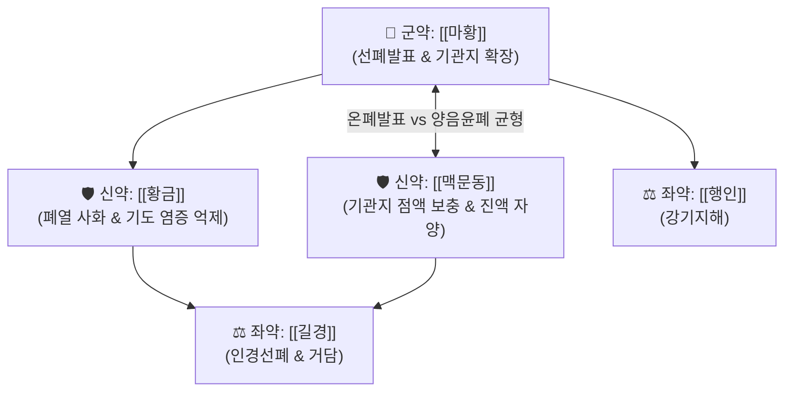

# 🍵 [[마황발표탕]] (麻黃發表湯, Ma-Huang-Fa-Biao-Tang / Maou-happyoto)

> **핵심 3줄 요약 (Key Summary)**:
> - 🌿 기본 구성: [[마황]] (군), [[맥문동]]·[[황금]] (신), [[길경]]·[[행인]] (좌사) (태음인의 굳어진 폐기를 열고 기관지 점막에 진액을 채우며 염증을 끄는 온폐선표·청열자음 대표 방제).
> - 🎯 [[태음인]]의 폐·기관지 평활근 연축으로 인한 호흡 곤란, 쌕쌕거리는 천명, 마른 기침, 인두 점막 건조 및 급·만성 기관지 염증 상태.
> - 🔬 에페드린·아미그달린의 기관지 평활근 확장, 맥문동 오피오포고닌(Ophiopogonin)의 배상세포 보호 및 뮤신 분비 정상화, 황금 [[바이칼린]]의 Th2 기도 염증 차단.
> - ⚠️ 주의사항: 맥문동·황금의 청열자음성이 강하므로, 소화기가 차고 맑은 콧물만 쏟아지는 소음인 한음증에는 금기.

---

## 📌 목차
1. [기본 처방 정보 & 군신좌사 구성](#1-기본-처방-정보--군신좌사-구성)
2. [방제학적 약재 상호작용 & 시너지 네트워크](#2-방제학적-약재-상호작용--시너지-네트워크)
3. [현대 분자약리학적 효능 & 작용 기전](#3-현대-분자약리학적-효능--작용-기전)
4. [적응 병증 및 체질별 감별 (Sweet Spot vs 금기)](#4-적응-병증-및-체질별-감별-sweet-spot-vs-금기)
5. [유사 처방군 감별 매트릭스](#5-유사-처방군-감별-매트릭스)
6. [임상 가감례 & 현대 질환별 응용](#6-임상-가감례--현대-질환별-응용)
7. [💡 사용자 진료실 핵심 필기 & 임상 팁 (원문 보존)](#7--사용자-진료실-핵심-필기--임상-팁-원문-보존)
8. [출처 및 학술 참고 문헌 (References)](#8-출처-및-학술-참고-문헌-references)

---

## 1. 기본 처방 정보 & 군신좌사 구성

* **출전**: 이제마(李濟馬) 『[[동의수세보원]]』(東醫壽世保元) 태음인 위완수한표한병론(太陰人 胃脘受寒表寒病論)
* **치법**: 선폐발표(宣肺發表), 청열윤폐(淸熱潤肺), 화담지해(化痰止咳)

| 구분 | 약재명 | 표준 용량 | 본초 효능 & 방제 내 역할 |
| :--- | :--- | :--- | :--- |
| **군약 (君藥)** | [[마황]] | 6.0~10.0g | **선폐평천·개규발한**: 좁아진 기관지 평활근을 열고 폐기를 선통하여 호흡 곤란 완화 |
| **신약 (臣藥)** | [[맥문동]] | 8.0~12.0g | **양음윤폐·청심제번**: 마황의 조열성을 막고 기관지 점막에 진액을 공급 |
| **신약 (臣藥)** | [[황금]] | 4.0~6.0g | **청열조습·사화해독**: 폐포 및 상기도의 울체된 염증 화열을 제거 |
| **좌약 (佐藥)** | [[길경]] | 4.0~6.0g | **개선폐기·거담배농**: 약 기운을 인후 상초로 끌어올리고 담음을 배출 |
| **좌약 (佐藥)** | [[행인]] | 6.0~8.0g | **강기지해·선폐윤장**: 마황과 배오하여 기침과 천식을 진정 |

> **배오 특징**: 마황의 맵고 따뜻한 기관지 확장력에, [[맥문동]]의 자윤한 진액 공급력과 [[황금]]의 폐열 청해력을 결합했습니다. 마황으로 숨길을 시원하게 열어주면서도 점막이 바짝 타들어가는 것을 원천 봉쇄한 태음인 전용의 명방입니다.

---

## 2. 방제학적 약재 상호작용 & 시너지 네트워크

* **마황 + 맥문동 배오 (선발과 윤폐의 조화)**: 기관지가 건조하게 쪼그라들면서 경련이 일어나는 태음인 천식에, 맥문동이 습도를 맞춰주고 마황이 통로를 넓혀 호흡을 편안하게 해줍니다.

---

## 3. 현대 분자약리학적 효능 & 작용 기전

### 1) 기관지 점막 배상세포 보호 및 뮤신(Mucin) 분비 정상화
* 맥문동의 오피오포고닌(Ophiopogonin)이 기도 상피세포의 손상을 복구하고 건조한 점막에 윤활 작용을 제공하여, 기관지 경련으로 인한 찢어질 듯한 마른 기침을 멎게 합니다.
### 2) 기도 과민성 억제 & Th2 염증 반응 차단
* 황금의 [[바이칼린]]과 마황의 [[에페드린]]이 기도 평활근의 과민 반응을 낮추고 호산구 침윤을 막아 급성 천식 발작을 진정시킵니다.

---

## 4. 적응 병증 및 체질별 감별 (Sweet Spot vs 금기)

### [✅ 최적 적응증 (Sweet Spot)]
* **태음인 건조성 천식 및 마른 기침**: 감기나 미세먼지 노출 후 목구멍이 바짝 마르면서 가슴이 답답하고 숨을 들이쉬기 힘든 상태.
* **급만성 기관지염 및 기관지 경련**: 쌕쌕거리는 천명음이 들리고 밤마다 발작적인 기침으로 잠을 깨는 상태.
* **감염 후 만성 기침(Post-infectious cough)**: 감기 후 가래는 거의 없으나 인후가 간질거리며 지속되는 기침.

### [⚠️ 신중 투여 및 금기 (Caution / Contraindication)]
* **소음인 한음증 금기**: 묽고 투명한 거품 가래와 맑은 콧물이 쏟아지는 소음인에게는 맥문동·황금이 소화 장애를 일으키므로 투약 금기.
* **설사 경향자 주의**: 비위가 차서 무른 변을 보는 환자에게는 용량을 감량하여 투약.

---

## 5. 유사 처방군 감별 매트릭스

| 처방명 | 병기 | 핵심 약재 구성 | 적합한 환자 양상 |
| :--- | :--- | :--- | :--- |
| [[마황발표탕]] | **태음인 표한 + 폐열조담** | 마황, 맥문동, 황금, 길경, 행인 | **건조한 마른 기침, 기관지 수축, 호흡 곤란 (기본방)** |
| [[마행감석탕]] | **폐열옹성 담열천식** | 마황, 행인, 감초, 석고 | **누런 끈적한 가래, 땀나면서 숨참, 심한 열감** |
| [[맥문동탕]] | **폐위음허 허화상충** | 맥문동, 반하, 인삼, 갱미 | **목구멍 건조 마른 기침, 마황 배제 순수 자음** |
| [[소청룡탕]] | **외한강화 수음내정** | 마황, 세신, 건강, 반하, 오미자 | **맑은 콧물, 찬바람 쐬면 기침, 오한 (소음인 적합)** |

---

## 6. 임상 가감례 & 현대 질환별 응용

* **인후통 및 편도염 동반 시**:
  * [[연교]] 4g, [[우방자]] 4g을 가미하여 인후 소염배농 강화.
* **현대 응용**:
  * 기침이형 천식(Cough variant asthma), 만성 폐쇄성 폐질환(COPD) 호흡곤란 완화.

---

## 7. 💡 사용자 진료실 핵심 필기 & 임상 팁 (원문 보존)

* **사용자 원문 필기**:
  * [구성]: [[길경]], [[마황]], [[맥문동]], [[황금]], [[행인]]
  * [적응증]: 폐, 기관지의 수축으로 인해 호흡 곤란, 염증 상태, 마른 기침 증상에 사용.
* **실전 진료실 노하우**:
  * 환자가 체격이 우람한 태음인인데 "기침할 때 가슴이 찢어질 것 같고 목 안이 타들어간다"고 호소할 때 마황발표탕을 처방하면 기관지 점막이 촉촉해지면서 기침이 즉시 멎는다.

---

## 8. 출처 및 학술 참고 문헌 (References)

1. 이제마(李濟馬). 『동의수세보원(東醫壽世保元)』 태음인 위완수한표한병론.
2. 전국한의과대학 사상의학교실. 『사상의학』. 집문당.
