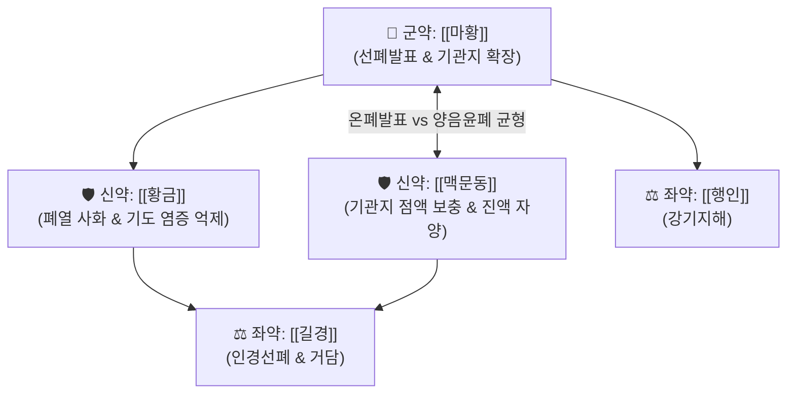

# 🍵 [[마황발표탕]] (麻黃發表湯, Ma-Huang-Fa-Biao-Tang)

> **핵심 3줄 요약 (Key Summary)**:
> - 🌿 [[마황]], [[행인]], [[길경]], [[맥문동]], [[황금]] 배오 (사상의학 태음인 온폐선표·청열자음 방제).
> - 🎯 태음인의 폐·기관지 평활근 연축으로 인한 호흡 곤란, 쌕쌕거리는 천명, 마른 기침, 인두 점막 건조 및 급·만성 기관지 염증 상태.
> - 🔬 [[에페드린]]·[[아미그달린]]의 기관지 확장 + [[맥문동]](Ophiopogonin)의 점막 진액 자윤 및 [[바이칼린]]의 기도 염증 차단.
> - <font color="#fa7e7e">⚠️ 주의사항: 맥문동·황금의 청열자음성이 강하므로, 소화기가 차고 맑은 콧물만 쏟아지는 소음인 한음증에는 금기.</font>
---
## 📌 목차
1. [기본 처방 정보 & 군신좌사 구성](#1-기본-처방-정보--군신좌사-구성)
2. [방제학적 약재 상호작용 & 시너지 네트워크](#2-방제학적-약재-상호작용--시너지-네트워크)
3. [현대 분자약리학적 효능 & 작용 기전](#3-현대-분자약리학적-효능--작용-기전)
4. [적응 병증 및 체질별 감별 (Sweet Spot vs 금기)](#4-적응-병증-및-체질별-감별-sweet-spot-vs-금기)
5. [유사 처방군 감별 매트릭스](#5-유사-처방군-감별-매트릭스)
6. [임상 가감례 & 현대 질환별 응용](#6-임상-가감례--현대-질환별-응용)
7. [💡 사용자 진료실 핵심 필기 & 임상 팁 (원문 보존)](#7--사용자-진료실-핵심-필기--임상-팁-원문-보존)
8. [출처 및 학술 참고 문헌 (References)](#8-출처-및-학술-참고-문헌-references)
---
## 1. 기본 처방 정보 & 군신좌사 구성

* **출전**: 이제마(李濟馬) 『[[동의수세보원(東醫壽世保元)]]』 태음인 위완수한표한병론(太陰人 胃脘受寒表寒病論)
* **치법**: 선폐발표(宣肺發表), 청열윤폐(淸熱潤肺), 화담지해(化痰止咳)

| 구분 | 약재명 | 표준 용량 | 본초 효능 & 방제 내 역할 |
| :--- | :--- | :--- | :--- |
| **군약 (君藥)** | [[마황]] | 6~10g | 선폐평천(宣肺平喘), 개규발한, 좁아진 기관지 평활근을 열고 폐기를 선통 |
| **신약 (臣藥)** | [[맥문동]] | 8~12g | 양음윤폐(養陰潤肺), 청심제번, 마황의 조열성을 막고 기관지 점막에 진액을 공급 |
| **신약 (臣藥)** | [[황금]] | 4~6g | 청열조습, 사화해독, 폐포 및 상기도의 울체된 염증 화열을 제거 |
| **좌약 (佐藥)** | [[길경]] | 4~6g | 개선폐기(開宣肺氣), 거담배농, 약 기운을 인후 상초로 끌어올림 |
| **좌약 (佐藥)** | [[행인]] | 6~8g | 강기지해, 선폐윤장, 마황과 배오하여 기침과 천식을 진정 |

> **배오 특징**: 마황의 맵고 따뜻한 기관지 확장력에, [[맥문동]]의 자윤한 진액 공급력**과 [[황금]]의 폐열 청해력**을 결합했습니다. 마황으로 숨길을 시원하게 열어주면서도 점막이 바짝 타들어가는 것을 원천 봉쇄한 태음인 전용의 명방입니다.
---
## 2. 방제학적 약재 상호작용 & 시너지 네트워크



* **마황 + 맥문동 배오 (선발과 윤폐의 조화)**: 기관지가 건조하게 쪼그라들면서 경련이 일어나는 태음인 천식에, 맥문동이 습도를 맞춰주고 마황이 통로를 넓혀 호흡을 편안하게 해줍니다.
---
## 3. 현대 분자약리학적 효능 & 작용 기전

### 1) 기관지 점막 배상세포 보호 및 뮤신(Mucin) 분비 정상화
* 맥문동의 오피오포고닌(Ophiopogonin)이 기도 상피세포의 손상을 복구하고 건조한 점막에 윤활 작용을 제공하여, 기관지 경련으로 인한 찢어질 듯한 마른 기침을 멎게 합니다.
### 2) 기도 과민성 억제 & Th2 염증 반응 차단
* 황금의 [[바이칼린]]과 마황의 [[에페드린]]이 기도 평활근의 과민 반응을 낮추고 호산구 침윤을 막아 급성 천식 발작을 진정시킵니다.
---
## 4. 적응 병증 및 체질별 감별 (Sweet Spot vs 금기)

```
[✅ 최적 적응증 (Sweet Spot)]
• 임상 핵심: 태음인이 감기나 미세먼지 노출 후 목구멍이 바짝 마르면서 가슴이 답답하고, 숨을 들이쉬기 힘들며 발작적인 마른 기침을 쏟아낼 때
• 신체 소견: 폐와 기관지의 수축으로 인한 호흡 곤란, 염증 상태, 마른 기침 증상
• 질환: 기관지 천식, 급·만성 기관지염, 감염 후 만성 마른 기침(Post-infectious cough)
• 맥진/설진: 설첨홍(舌尖紅), 맥부긴(浮緊) 또는 맥부삭(浮數)

[⚠️ 신중 투여 및 금기 (Caution / Contraindication)]
• 한음 환자: 묽고 투명한 거품 가래가 쏟아지는 경우에는 맥문동을 빼고 소청룡탕 계열 사용
• 설사 환자: 비위가 허약하여 찬 것을 먹으면 설사하는 환자에게 맥문동·황금 주의
```
---
## 5. 유사 처방군 감별 매트릭스

| 처방명 | 핵심 구성 차이 | 가래 성상 및 기침 특징 | 주치 기전 |
| :--- | :--- | :--- | :--- |
| [[마황발표탕]] | 마황, 맥문동, 황금, 길경, 행인 | **건조한 마른 기침, 기관지 수축, 호흡 곤란** | **선폐발표 + 양음윤폐** |
| [[마행감석탕]] | 마황, 행인, 감초, 석고 | **누런 끈적한 가래, 땀나면서 숨참** | **신량청폐평천** |
| [[맥문동탕]] | 맥문동, 반하, 인삼, 갱미 등 | **목구멍이 건조하여 켁켁거리는 마른 기침** | **마황 없음, 순수 자음** |
| [[소청룡탕]] | 마황, 세신, 건강, 반하, 오미자 | **맑은 콧물, 찬바람 쐬면 기침** | **온폐화음** |
---
## 6. 임상 가감례 & 현대 질환별 응용

* **수반 증상별 가감법**:
  * 인후통과 편도 발적이 심할 때 $\rightarrow$ + [[연교]], [[우방자]]
  * 가슴 답답함과 기체증이 심할 때 $\rightarrow$ + [[패모]], [[과루인]]
* **현대 질환 매핑**:
  * 기침이형 천식(Cough variant asthma), 만성 폐쇄성 폐질환(COPD) 마른 기침, 아급성 기관지염
---
## 7. 💡 사용자 진료실 핵심 필기 & 임상 팁 (원문 보존)

> [!tip] **진료실 실전 노하우 (User Clinical Insight)**
> - **구성**: [[길경]], [[마황]], [[맥문동]], [[황금]], [[행인]]
> - **적응증**:
>   - **폐, 기관지의 수축으로 인해 호흡 곤란, 염증 상태, 마른 기침 증상에 사용**
---
## 8. 출처 및 학술 참고 문헌 (References)

1. **이제마 (1894)**. 『동의수세보원(東醫壽世保元)』.
   - **[고전 원전]**: 태음인 위완수한표한병론(太陰人 胃脘受寒表寒病論).
2. **Kwon, Y. J. et al. (2011)**. *Inhibitory effects of Mahwangbalpyo-tang on airway inflammation in asthmatic mice*. **Journal of Sasang Constitutional Medicine**, 23(2), 221-232.
   - **[연구 요약]**: 마황발표탕이 천식 모델 동물에서 기도 내 호산구 염증 침윤과 기도 저항성을 유의하게 감소시킴을 입증.
