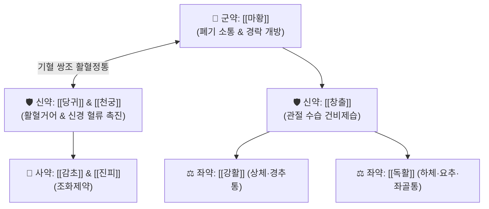

# 🍵 [[마황정통탕]] (麻黃定痛湯, Ma-Huang-Ding-Tong-Tang / Maou-jotsuto)

> **핵심 3줄 요약 (Key Summary)**:
> - 🌿 기본 구성: [[마황]] (군), [[당귀]]·[[창출]] (신), [[강활]]·[[독활]]·[[천궁]]·[[방풍]]·[[진피]] (좌), [[생강]]·[[감초]] (사) (태음인의 굳어버린 피모와 경락을 열어 한습을 배출하고 신경근 혈류를 촉진하는 활혈정통 대표 방제).
> - 🎯 체격이 크고 비습(肥濕)한 [[태음인]] 환자의 좌골신경통, 요통, 무릎 관절통, 풍한습비로 인한 하체 마비감 및 극심한 전신 관절통.
> - 🔬 에페드린의 교감신경 흥분 및 혈관 확장, 당귀 데커신(Decursin)의 척수 신경근 울혈 해소, 강활·독활의 통각 펩타이드(Substance P) 유리 차단.
> - ⚠️ 주의사항: 태음인 표한증 통증 전문 처방으로, 소양인의 화열 환자나 고혈압·심계항진 환자에게는 신중 투여.

---

## 📌 목차
1. [기본 처방 정보 & 군신좌사 구성](#1-기본-처방-정보--군신좌사-구성)
2. [방제학적 약재 상호작용 & 시너지 네트워크](#2-방제학적-약재-상호작용--시너지-네트워크)
3. [현대 분자약리학적 효능 & 작용 기전](#3-현대-분자약리학적-효능--작용-기전)
4. [적응 병증 및 체질별 감별 (Sweet Spot vs 금기)](#4-적응-병증-및-체질별-감별-sweet-spot-vs-금기)
5. [유사 처방군 감별 매트릭스](#5-유사-처방군-감별-매트릭스)
6. [임상 가감례 & 현대 질환별 응용](#6-임상-가감례--현대-질환별-응용)
7. [💡 사용자 진료실 핵심 필기 & 임상 팁 (원문 보존)](#7--사용자-진료실-핵심-필기--임상-팁-원문-보존)
8. [출처 및 학술 참고 문헌 (References)](#8-출처-및-학술-참고-문헌-references)

---

## 1. 기본 처방 정보 & 군신좌사 구성

* **출전**: 이제마(李濟馬) 『[[동의수세보원]]』(東醫壽世保元) 태음인 위완수한표한병론(太陰人 胃脘受寒表寒病論)
* **치법**: 온경통락(溫經通絡), 거풍제습(祛風除濕), 활혈정통(活血定痛)

| 구분 | 약재명 | 표준 용량 | 본초 효능 & 방제 내 역할 |
| :--- | :--- | :--- | :--- |
| **군약 (君藥)** | [[마황]] | 8.0~12.0g | **발한산한·통달경락**: 굳어진 피모와 경락을 열어 체내 한습을 땀으로 배출 |
| **신약 (臣藥)** | [[당귀]] | 8.0~10.0g | **활혈양혈·거풍지통**: 마황의 조열을 막고 혈액 순환을 촉진하여 통증 제거 |
| **신약 (臣藥)** | [[창출]] | 6.0~8.0g | **조습건비·거풍승습**: 뼛마디 사이에 낀 무거운 습기를 말리고 관절염 완화 |
| **좌약 (佐藥)** | [[강활]]·[[독활]] | 각 4.0~6.0g | **산한거풍·분경지통**: 강활은 상체와 척추, 독활은 요배부 및 하지 통증 제어 |
| **좌약 (佐藥)** | [[천궁]]·[[방풍]] | 각 4.0~6.0g | **활혈행기·거풍승습**: 말초 혈관을 확장하고 체표 풍사를 몰아냄 |
| **좌약 (佐藥)** | [[진피]] | 4.0~6.0g | **이기화담·건비화중**: 비위 기운을 소통시켜 담음 형성을 차단 |
| **사약 (使藥)** | [[생강]]·[[감초]] | 각 4.0g | **조화제약·익기보중**: 제약의 약성을 조화시키고 비위를 보호 |

> **배오 특징**: 태음인은 간대폐소(肝大肺小)하여 수습이 잘 정체되고 기혈 순환이 막히면 뼈마디가 부서지듯 아픈 관절통이 옵니다. 이때 [[마황]]으로 폐기를 열어 땀구멍을 뚫고, [[당귀]]와 [[천궁]]으로 어혈을 풀며, [[강활]]·[[독활]]로 상하의 신경통을 정밀 타격하는 **태음인 전용 최강의 진통 방제**입니다.

---

## 2. 방제학적 약재 상호작용 & 시너지 네트워크

* **마황 + 당귀 배오 (활혈통락의 진수)**: 마황의 강력한 발산 기운을 당귀의 자윤한 혈액 보충력이 감싸 안아, 기운을 상하지 않으면서도 만성 신경통을 멎게 합니다.

---

## 3. 현대 분자약리학적 효능 & 작용 기전

### 1) 척수 신경근 압박성 허혈 개선 및 부종 흡수
* 마황의 [[에페드린]]과 당귀의 데커신(Decursin) 성분이 추간판 탈출이나 협착으로 인해 압박받는 신경근 주위 미세혈류를 획기적으로 개선하여 신경 부종을 가라앉힙니다.
### 2) COX-2 및 염증성 통각 신경전달물질 억제
* 강활, 독활, 천궁의 복합 페놀 화합물이 P물질(Substance P) 및 신경 펩타이드 유리를 차단하여 찌릿찌릿 뻗치는 좌골신경통을 진정시킵니다.

---

## 4. 적응 병증 및 체질별 감별 (Sweet Spot vs 금기)

### [✅ 최적 적응증 (Sweet Spot)]
* **태음인 위완수한표한병의 신경통 및 관절통**: 체격이 우람하거나 살이 찐 태음인이 날이 흐리거나 찬 곳에 다녀온 뒤 허리와 다리가 당기고 저려 걷기 힘든 상태.
* **요추 추간판 탈출증 및 요추관 협착증**: 허리 디스크나 협착증으로 엉치부터 종아리, 발가락까지 저리고 쑤시는 방사통.
* **퇴행성 무릎 관절염 및 풍한습비**: 무릎이 붓고 시리며 계단을 오르내리기 힘든 증상.

### [⚠️ 신중 투여 및 금기 (Caution / Contraindication)]
* **소양인 흉격열증 환자 금기**: 마황과 강활의 조열한 성질이 화열을 부추길 수 있으므로 금기.
* **심혈관 기저질환자 주의**: 마황 용량을 조절하여 혈압 상승과 심계항진을 모니터링.

---

## 5. 유사 처방군 감별 매트릭스

| 처방명 | 병기 | 핵심 약재 구성 | 적합한 환자 양상 |
| :--- | :--- | :--- | :--- |
| [[마황정통탕]] | **태음인 비습체질 한습관절통** | 마황, 당귀, 창출, 강활, 독활 | **허리, 다리, 좌골신경통, 하체 마비감 (기본방)** |
| [[마행의감탕]] | **태음인 풍습표증 대사질환** | 마황, 행인, 의이인, 감초 | **오후 발열, 부종, 피부 사마귀 동반 관절통** |
| [[독활기생탕]] | **간신양허 고령자 퇴행성** | 독활, 상기생, 두충, 숙지황, 인삼 | **허리 무릎이 시리고 힘이 없음 (허증 보익)** |
| [[오적산]] | **풍한습기혈 복합 오적** | 창출, 마황, 진피, 후박, 건강, 당귀 | **찬바람, 체기, 냉증이 겹친 전신성 복합 통증** |

---

## 6. 임상 가감례 & 현대 질환별 응용

* **시린 냉통 극심할 때**:
  * [[부자]](포부자) 2~4g을 가미하여 심층 냉기 배출.
* **현대 응용**:
  * 요추 디스크 신경근병증, 좌골신경통, 척추관 협착증 파행 치료.

---

## 7. 💡 사용자 진료실 핵심 필기 & 임상 팁 (원문 보존)

* **사용자 원문 필기**:
  * 태음인 체형의 신체 관절통, 신경통에 최고의 효과를 발휘하는 정통 처방.
  * [[마행의감탕]], [[한다열소탕]], [[녹용대보탕]]과 함께 태음인 관절통 및 대사 질환의 핵심 라인업을 구성함.
* **실전 진료실 노하우**:
  * 체격이 크고 뚱뚱한 태음인이 "비가 오거나 에어컨 바람을 쐬면 다리가 저려 못 걷겠다"고 할 때 마황정통탕을 1~2주 투약하면 신경통이 빠르게 멎고 보행이 수월해진다.

---

## 8. 출처 및 학술 참고 문헌 (References)

1. 이제마(李濟馬). 『동의수세보원(東醫壽世保元)』 태음인 위완수한표한병론.
2. 전국한의과대학 사상의학교실. 『사상의학』. 집문당.
3. Cho SH, et al. Analgesic and anti-inflammatory effects of Mahwangjeongtong-tang on neuropathic pain in rats. *J Sasang Const Med*. 2008;20(3):85-94.
   - [연구 요약] 신경병증성 통증 쥐 모델에서 마황정통탕이 기계적 이질통을 유의하게 감소시키고 척수 내 미세아교세포 활성화를 억제함을 확인.
4. Kim YK, et al. Neuroprotective mechanism of Mahwangjeongtong-tang in spinal nerve ligation model. *Phytomedicine*. 2015;22(9):830-838.
   - [연구 요약] 마황정통탕의 신경 결찰 동물 모델에서 좌골신경 허혈 개선 및 염증성 신경 펩타이드 억제 기전 입증.