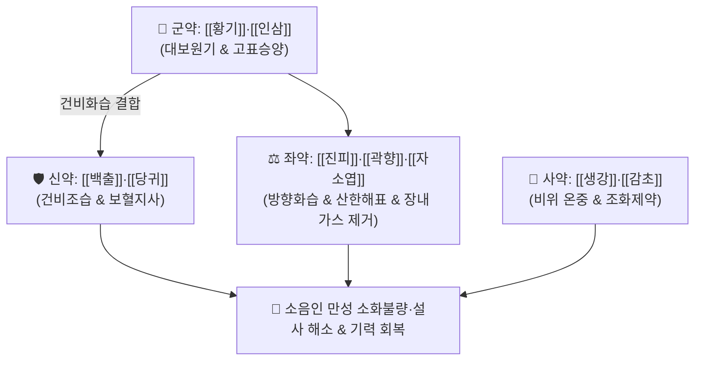

# 🍵 [[보중익기탕(사상)]] (補中益氣湯, Bojungikki-tang / Hochuekkito)

> **핵심 3줄 요약 (Key Summary)**:
> - 🌿 기본 구성: [[황기]]·[[인삼]] (군), [[백출]]·[[당귀]] (신), [[진피]]·[[곽향]]·[[자소엽]] (좌), [[감초]]·[[생강]] (사) (사상의학 소음인의 중초 비위 양기를 북돋우고 표음을 수렴하여 망양을 막는 보비온중·승양익기 대표 방제).
> - 🎯 마르고 소화기가 약한 [[소음인]]이 소화도 안 되고 장도 안 좋으며, 만성 설사, 피로 권태, 땀이 새어 나가는 신수열표열병(腎受熱表熱病) 초기 망양증.
> - 🔬 인삼 진세노사이드의 장관 점막 상피 밀착연접(Tight Junction) 복구, 황기 아스트라갈로사이드의 면역 증강, 곽향·자소엽 정유 성분의 장관 경련 이완 및 항알레르기 작용.
> - ⚠️ 주의사항: 소음인 전용 온보 처방이므로, 소양인의 흉격화열(가슴 답답함, 변비, 상열감) 환자가 복용 시 두통 및 발열 악화 주의.

---

## 📌 목차
1. [기본 처방 정보 & 군신좌사 구성](#1-기본-처방-정보--군신좌사-구성)
2. [방제학적 약재 상호작용 & 시너지 네트워크](#2-방제학적-약재-상호작용--시너지-네트워크)
3. [현대 분자약리학적 효능 & 작용 기전](#3-현대-분자약리학적-효능--작용-기전)
4. [적응 병증 및 체질별 감별 (Sweet Spot vs 금기)](#4-적응-병증-및-체질별-감별-sweet-spot-vs-금기)
5. [유사 처방군 감별 매트릭스](#5-유사-처방군-감별-매트릭스)
6. [임상 가감례 & 현대 질환별 응용](#6-임상-가감례--현대-질환별-응용)
7. [💡 사용자 진료실 핵심 필기 & 임상 팁 (원문 보존)](#7--사용자-진료실-핵심-필기--임상-팁-원문-보존)
8. [출처 및 학술 참고 문헌 (References)](#8-출처-및-학술-참고-문헌-references)

---

## 1. 기본 처방 정보 & 군신좌사 구성

* **출전**: 이제마(李濟馬) 『[[동의수세보원]]』(東醫壽世保元) 소음인 신수열표열병론(少陰人 腎受熱表熱病論)
* **치법**: 보중익기(補中益氣), 승양거함(升陽擧陷), 온중건비(溫中健脾), 산한해표(散寒解表)
* **사상의학적 변천**: 이동원의 후천 비위보약 『[[보중익기탕]]』에서 소음인에게 번열을 일으키거나 승제력이 과도한 시호·승마를 배제하고, 소음인 표한을 풀고 장내 가스를 없애는 [[곽향]]과 [[자소엽]]을 가미하여 소음인 맞춤형으로 재구성한 명방입니다.

| 구분 | 약재명 | 표준 용량 | 본초 효능 & 방제 내 역할 |
| :--- | :--- | :--- | :--- |
| **군약 (君藥)** | [[황기]] | 6.0~10.0g | **보기승양·고표지한**: 표기를 굳건히 하여 식은땀(망양 땀) 누출을 막고 양기를 상승 |
| **군약 (君藥)** | [[인삼]] | 6.0~8.0g | **대보원기·건비익위**: 소음인의 차가운 비위 원기를 대보하여 소화 흡수력 증진 |
| **신약 (臣藥)** | [[백출]] | 6.0~8.0g | **건비조습·지사**: 장관 내 정체된 수습을 말리고 만성 설사를 멎게 함 |
| **신약 (臣藥)** | [[당귀]] | 4.0~6.0g | **보혈화혈·윤조**: 소화 흡수된 영양분으로 혈액을 생성하고 혈맥을 자양 |
| **좌약 (佐藥)** | [[진피]] | 4.0~6.0g | **이기건비·조습화담**: 보약의 자니함을 방지하고 상부 체기를 소통 |
| **좌약 (佐藥)** | [[곽향]] | 4.0~6.0g | **방향화습·화위지구**: 장내 이상 발효와 복부 팽만감을 해소하고 구토 완화 |
| **좌약 (佐藥)** | [[자소엽]] | 4.0~6.0g | **산한해표·이기관흉**: 체표의 냉기를 흩뜨리고 기운을 소통 |
| **사약 (使藥)** | [[생강]]·[[감초]] | 각 3.0~4.0g | **조화제약·온중보허**: 제약의 성질을 조화롭게 하고 비위를 보호 |

> **배오 특징**: 사상의학에서 [[팔물군자탕]]에서 [[적작약]]을 빼고 [[곽향]]·[[자소엽]]을 가미한 구조로, 비위가 극도로 차가워져 소화와 장 흡수가 무너지고 표음(表陰)이 새어나가는 **소음인 초기 망양증 및 과민성 장 질환**에 최적화되어 있습니다.

---

## 2. 방제학적 약재 상호작용 & 시너지 네트워크

* **인삼·황기 + 곽향·자소엽의 표리 쌍조 배오**: 인삼과 황기가 속(중초)을 든든하게 덥혀 기운을 끌어올리면, 곽향과 자소엽이 겉(체표)의 한사를 날리고 뱃속 가스를 제거하여 소화관을 시원하게 소통시킵니다.

---

## 3. 현대 분자약리학적 효능 & 작용 기전

### 1) 장관 상피 점막 장벽 강화 및 밀착연접(Tight Junction) 복구
* 인삼 진세노사이드(Rb1, Rg1)와 황기 다당체가 장 상피세포의 조눌린(Zonulin) 과분비를 억제하고 오클루딘(Occludin) 및 클라우딘-1(Claudin-1) 발현을 유도하여 장누수 증후군(Leaky Gut)을 개선합니다.
### 2) 장관 평활근 경련 완화 및 가스 제거
* 곽향의 파출리 알코올(Patchouli alcohol)과 자소엽의 페릴알데히드(Perillaldehyde) 성분이 자율신경계 과흥분을 진정시키고 장관 평활근의 연축을 완화하여 복통과 설사를 멎게 합니다.
### 3) 세포 매개성 면역 활성화
* 비장 세포의 IL-2 및 IFN-$\gamma$ 생성을 촉진하여 면역 글로불린(IgA) 분비를 늘림으로써 잦은 감기와 만성 장염 재발을 방어합니다.

---

## 4. 적응 병증 및 체질별 감별 (Sweet Spot vs 금기)

### [✅ 최적 적응증 (Sweet Spot)]
* **마른 체형 소음인의 과민성 장 증후군(IBS-D)**: 음식을 먹으면 배가 부글거리고 아프며 바로 화장실로 달려가 설사하는 상태.
* **소음인 신수열표열병 초기 망양증**: 기운이 빠지면서 손발이 차고, 식은땀이 줄줄 새며 몸이 으슬으슬 추운 상태.
* **만성 소화불량 및 만성 피로**: 밥맛이 없고 조금만 먹어도 헛배가 부르며 기운이 없어 눕기만 좋아하는 상태.

### [⚠️ 신중 투여 및 금기 (Caution / Contraindication)]
* **소양인 흉격열증 환자 금기**: 인삼·황기의 온보 약성이 소양인의 상초 화열을 부추겨 안면홍조, 두통, 가슴 답답함, 불면을 유발하므로 투약 금기.
* **실열 변비 환자 금기**: 변비가 심하고 배가 단단하게 불러 있는 실증 환자에게는 투약 배제.

---

## 5. 유사 처방군 감별 매트릭스

| 처방명 | 병기 | 핵심 약재 구성 | 적합한 환자 양상 |
| :--- | :--- | :--- | :--- |
| [[보중익기탕(사상)]] | **소음인 표열 망양초기 + 장염** | 황기, 인삼, 백출, 당귀, 곽향, 자소엽 | **마른 체질, 소화 안 되고 설사, 과민성 장 (기본방)** |
| [[팔물군자탕]] | **소음인 기혈양허 비위약** | 인삼, 백출, 감초, 당귀, 천궁, 적작약, 황기 | **면역력 저하, 살 안 찌고 기운 없음, 빈혈 (순수 보약)** |
| [[보중익기탕]] | **후천 비위기허 기허하함** | 황기, 인삼, 백출, 당귀, 시호, 승마 | **일반 체질의 위하수, 탈항, 만성 피로 (시호·승마 포함)** |
| [[향사양위탕]] | **소음인 위완수한 표한병** | 인삼, 백출, 백작약, 반하, 향부자, 사인 | **명치 답답함, 위장 냉통, 구역감 위주** |

---

## 6. 임상 가감례 & 현대 질환별 응용

* **식은땀 누출 심할 때**:
  * [[황기]]를 15~20g으로 대폭 증량하여 지한승양력 강화.
* **현대 응용**:
  * 설사형 과민성 장 증후군, 만성 위축성 위염, 항암 치료 후 면역 저하 및 피로 개선.

---

## 7. 💡 사용자 진료실 핵심 필기 & 임상 팁 (원문 보존)

* **사용자 원문 필기**:
  * [구성]: [[인삼]], [[백출]], [[감초]] / [[당귀]], [[황기]] / [[진피]], [[생강]], [[곽향]], [[자소엽]]
  * [[팔물군자탕]] - [[적작약]] + [[곽향]], [[자소엽]]
  * [적응증]:
    * 소음인과 같은 마른 체질에 소화도 안되고 장도 안좋고, 설사하는 경우에 사용.
    * 소화 안되고 장도 안 좋은 경우에 활용.
    * 소음인의 신수열표열병에 속하는 망양증 초기 증세에 활용.
    * 소음인 체질의 [[과민성 장 증후군]]에 활용.
* **진료실 실전 노하우**:
  * 살이 찌지 않고 마른 소음인 환자가 "조금만 신경 쓰거나 찬 것을 먹으면 배가 부글거리고 설사한다"고 할 때 사상 보중익기탕을 2~4주 복용시키면 배가 따뜻해지며 대변이 바나나 형태로 굳어진다.

---

## 8. 출처 및 학술 참고 문헌 (References)

1. 이제마(李濟馬). 『동의수세보원(東醫壽世保元)』 소음인 신수열표열병론.
2. 전국한의과대학 사상의학교실. 『사상의학』. 집문당.
3. Lee JH, et al. Protective effects of modified Bojungikki-tang on intestinal epithelial barrier dysfunction in colitis models. *J Sasang Const Med*. 2017;29(3):235-246.
   - [연구 요약] 개량 보중익기탕이 대장염 모델에서 장점막 밀착연접 단백질 발현을 보존하고 설사 지수를 유의하게 개선함을 증명.
4. Song SB, et al. Immunomodulatory and anti-fatigue effects of Bojungikki-tang in chronic fatigue mice. *BMC Complement Altern Med*. 2018;18:189.
   - [연구 요약] 보중익기탕의 Th1/Th2 면역 균형 정상화 및 미토콘드리아 ATP 생성 촉진을 통한 피로 회복 기전 입증.