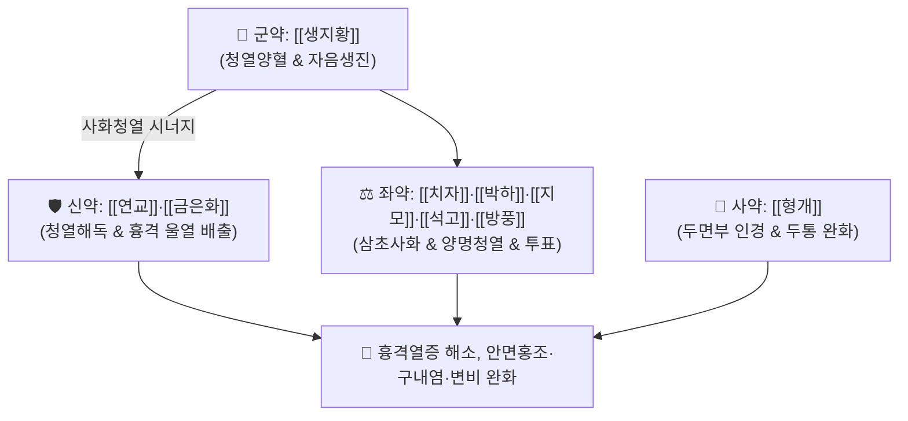

# 🍵 [[양격산화탕]] (凉膈散火湯, Yanggyeoksanhwa-tang / Ryokaku-sanka-to)

> **핵심 3줄 요약 (Key Summary)**:
> - 🌿 기본 구성: [[생지황]] (군), [[연교]]·[[금은화]] (신), [[치자]]·[[박하]]·[[지모]]·[[석고]]·[[방풍]] (좌), [[형개]] (사) (소양인 흉격과 상초에 치솟은 극심한 화열을 끄고 신수를 보존하는 청열사화·양혈해독 대표 방제).
> - 🎯 [[소양인]] 위수열이열병(胃受熱裏熱病 / 흉격열증)으로 인한 흉격 화열(가슴 답답함 및 작열감), 심계, 불면, 두통, 안구 충혈, 입안 헐음(구설생창), 대변비결(변비).
> - 🔬 금은화 루테올린 및 치자 제니포사이드의 IκB-α 분해 억제를 통한 NF-κB/MAPK 차단, 석고·지모의 시상하부 체온조절 중추 진정, 생지황 카탈폴의 혈관 투과성 정상화.
> - ⚠️ 주의사항: 한성 약재가 다수 포함되어 복용 후 일시적 연변이 나타날 수 있으며, 비위가 차고 설사하는 소음인 및 임산부에게는 투약 절대 금기.

---

## 📌 목차
1. [기본 처방 정보 & 군신좌사 구성](#1-기본-처방-정보--군신좌사-구성)
2. [방제학적 약재 상호작용 & 시너지 네트워크](#2-방제학적-약재-상호작용--시너지-네트워크)
3. [현대 분자약리학적 효능 & 작용 기전](#3-현대-분자약리학적-효능--작용-기전)
4. [적응 병증 및 체질별 감별 (Sweet Spot vs 금기)](#4-적응-병증-및-체질별-감별-sweet-spot-vs-금기)
5. [유사 처방군 감별 매트릭스](#5-유사-처방군-감별-매트릭스)
6. [임상 가감례 & 현대 질환별 응용](#6-임상-가감례--현대-질환별-응용)
7. [💡 사용자 진료실 핵심 필기 & 임상 팁 (원문 보존)](#7--사용자-진료실-핵심-필기--임상-팁-원문-보존)
8. [출처 및 학술 참고 문헌 (References)](#8-출처-및-학술-참고-문헌-references)

---

## 1. 기본 처방 정보 & 군신좌사 구성

* **출전**: 이제마(李濟馬) 『[[동의수세보원]]』(東醫壽世保元) 소양인 위수열이열병론(少陽人 胃受熱裏熱病論)
* **치법**: 청열사화(淸熱瀉火), 양혈해독(凉血解毒), 소풍지통(疎風止痛), 자음생진(滋陰生津)

| 구분 | 약재명 | 표준 용량 | 본초 효능 & 방제 내 역할 |
| :--- | :--- | :--- | :--- |
| **군약 (君藥)** | [[생지황]] | 8.0~16.0g | **청열양혈·자음생진**: 심경과 신경의 화열을 끄고 손상된 음액을 신속히 보충 |
| **신약 (臣藥)** | [[연교]] | 6.0~8.0g | **청열해독·소옹산결**: 흉격의 울체된 열독을 삭이고 인후 및 림프 부종을 해소 |
| **신약 (臣藥)** | [[금은화]] | 6.0~8.0g | **청열해독·광범위소염**: 상초의 염증 화열을 체외로 배출 |
| **좌약 (佐藥)** | [[치자]] | 4.0~6.0g | **사화제번·청열량혈**: 삼초의 화열을 소변으로 이끌어 내리고 가슴 답답함 해소 |
| **좌약 (佐藥)** | [[박하]] | 4.0g | **소산풍열·청리오두**: 두면부의 열기를 흩뜨리고 눈과 목구멍을 시원하게 함 |
| **좌약 (佐藥)** | [[지모]]·[[석고]] | 각 4.0~6.0g | **청열사화·제번지갈**: 양명 위열을 강하게 진압하고 갈증을 멎게 함 |
| **좌약 (佐藥)** | [[방풍]] | 4.0g | **거풍승습·투표**: 체표에 갇힌 풍열사를 땀구멍을 통해 발산 |
| **사약 (使藥)** | [[형개]] | 4.0g | **거풍투진·인경**: 약력을 상초 두면부로 이끌어 두통을 완화 |

> **배오 특징**: 소양인의 병리적 특성인 **포양지기(包陽之氣)의 과다로 인한 흉격 화열(胸膈火熱)**을 다스리기 위해, [[생지황]]으로 신수를 채우면서 [[연교]]·[[금은화]]·[[치자]]·[[석고]]의 강력한 청열사화제를 총동원하여 **상초의 불길을 잡고 하초의 진액을 지키는** 소양인 최고의 사화 방제입니다.

---

## 2. 방제학적 약재 상호작용 & 시너지 네트워크

* **생지황 + 연교·금은화의 자음사화 배오**: 진액을 공급함과 동시에 상초의 열독을 풀어내어 세포의 열 손상을 방어합니다.
* **치자 + 석고·지모의 삼초 청열 배오**: 체내에 갇힌 극열을 소변과 대변으로 유도 배출시킵니다.

---

## 3. 현대 분자약리학적 효능 & 작용 기전

### 1) NF-$\kappa$B 및 MAPK 경로 이중 차단을 통한 강력한 항염증
* 금은화의 [[루테올린]]과 치자의 제니포사이드 성분이 I$\kappa$B-$\alpha$ 분해를 억제하여 IL-6, TNF-$\alpha$, [[COX-2]], [[iNOS]] 발현을 억제합니다.
### 2) 시상하부 체온조절 중추 진정 및 해열
* [[석고]]와 [[지모]]가 중추신경계의 과도한 $PGE_2$ 합성을 차단하여 체온 세트포인트를 하향 조정하고 전신 고열 및 번갈을 해소합니다.
### 3) 뇌혈관 내피세포 안정화 및 미세순환 울혈 해소
* [[생지황]]의 카탈폴이 미세혈관 투과성을 정상화하여 결막 충혈, 피부 발적, 안면부 혈류 울혈을 신속히 진정시킵니다.

---

## 4. 적응 병증 및 체질별 감별 (Sweet Spot vs 금기)

### [✅ 최적 적응증 (Sweet Spot)]
* **소양인 흉격열증(胸膈熱證)**: 가슴이 답답하고 열이 차올라 터질 것 같으며, 조급하고 화가 잘 나는 상태.
* **두면부 화열성 질환**: 안면홍조, 결막 충혈, 극심한 편두통, 잇몸 부종, 구설생창(아프타성 구내염), 중이염.
* **변비 동반 열증**: 대변이 딱딱하게 굳어 며칠씩 통하지 않고 입마름과 구취가 심한 상태.

### [⚠️ 신중 투여 및 금기 (Caution / Contraindication)]
* **소음인 비위허한 환자 절대 금기**: 찬 것을 먹으면 설사하는 소음인이 복용 시 위장관 마비와 심한 설사를 유발하므로 금기.
* **설사 반응 관리**: 대변이 부드러워지는 것은 화열 배출의 호전 반응이나, 물설사가 지속되면 석고·지모를 감량.

---

## 5. 유사 처방군 감별 매트릭스

| 처방명 | 병기 | 핵심 약재 구성 | 적합한 환자 양상 |
| :--- | :--- | :--- | :--- |
| [[양격산화탕]] | **소양인 흉격열증 + 변비** | 생지황, 연교, 금은화, 치자, 박하, 석고 | **가슴 답답함, 변비, 구내염, 안면홍조 (기본방)** |
| [[지황백호탕]] | **소양인 위열옹성 극열** | 생지황, 석고, 지모, 방풍, 독활 | **39도 고열, 끝없는 갈증(대갈), 맥홍대** |
| [[형방사백산]] | **소양인 표한이열 + 성인병** | 생지황, 복령, 택사, 형개, 방풍, 석고 | **고혈압, 당뇨, 체온 상승, 배뇨 곤란 동반** |
| [[독활지황탕]] | **소양인 신음부족 + 청양불승** | 숙지황, 산수유, 복령, 택사, 독활, 방풍 | **성기능 저하, 정력 감퇴, 배뇨 장애, 만성 피로** |

---

## 6. 임상 가감례 & 현대 질환별 응용

* **변비 극심하고 복만통 시**:
  * [[대황]] 4~6g을 가미하여 하초 결열(結熱)을 신속 통도.
* **현대 응용**:
  * 급성 편도선염, 삼차신경통, 갱년기 안면홍조증, 고혈압성 두통 및 뇌졸중 급성기 화열 제어.

---

## 7. 💡 사용자 진료실 핵심 필기 & 임상 팁 (원문 보존)

* **사용자 원문 필기**:
  * 소양인 위수열이열병(흉격열증)의 제1 청열사화 대표 처방.
  * 소양인의 흉격화열(가슴 답답함 및 작열감), 두통, 안구 충혈, 입마름, 변비, 피부 발진 및 뇌혈관 질환 급성기 화열 치료의 최고 명방.
* **실전 진료실 노하우**:
  * 소양인이 "가슴에 불이 난 것처럼 답답해서 옷을 벗어던지고 싶다", "입안이 헐고 며칠째 대변을 못 봤다"고 할 때 양격산화탕을 2~3첩 투약하면 대변이 시원하게 통하면서 흉격 열감이 씻은 듯이 사라진다.

---

## 8. 출처 및 학술 참고 문헌 (References)

1. 이제마(李濟馬). 『동의수세보원(東醫壽世保元)』 소양인 위수열이열병론.
2. 전국한의과대학 사상의학교실. 『사상의학』. 집문당.
