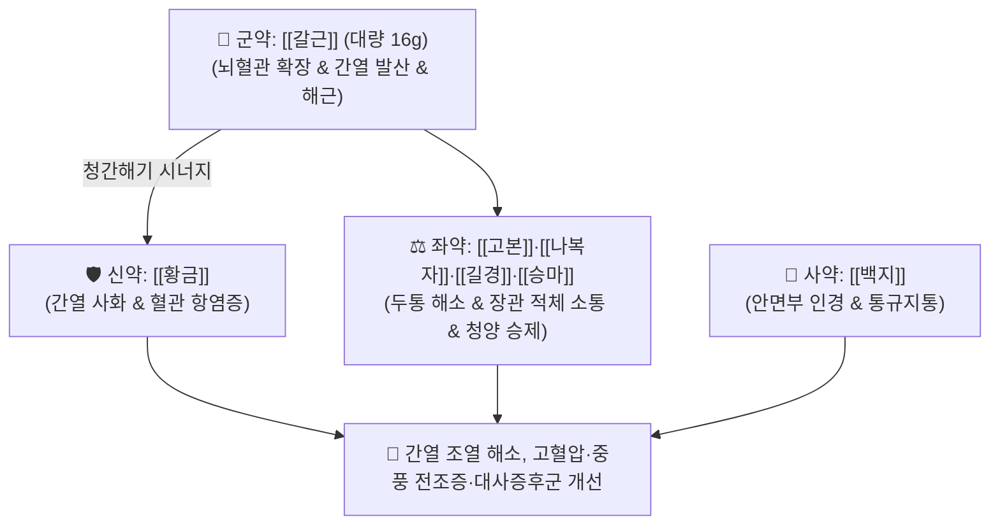

# 🍵 [[열다한소탕]] (熱多寒少湯, Yeoldahanso-tang / Netsutakansho-to)

> **핵심 3줄 요약 (Key Summary)**:
> - 🌿 기본 구성: [[갈근]] (군, 대량), [[황금]] (신), [[고본]]·[[나복자]]·[[길경]]·[[승마]] (좌), [[백지]] (사) (태음인의 간열을 시원하게 식히고 뇌혈류를 촉진하며 체내 조열을 해소하는 청간사화·통경활혈 대표 방제).
> - 🎯 [[태음인]] 간수열이열병(肝受熱裏熱病)으로 인한 열다한소(열이 많고 오한이 적음), 심한 번갈, 두통, 안구 충혈, 변비, 중풍 전조증(손발 저림, 안면 마목), 고혈압, 대사증후군.
> - 🔬 갈근 [[푸에라린]]의 뇌혈관 eNOS 활성화 및 뇌혈류 촉진, 간세포 AMPK 활성화를 통한 지방간 억제, 황금 [[바이칼린]]의 과산화지질 및 염증성 사이토카인 차단.
> - ⚠️ 주의사항: 황금의 청열사화성으로 비위가 찬 환자는 연변 가능, 추위를 많이 타고 설사하는 태음인 표한증 환자에게는 투약 금기.

---

## 📌 목차
1. [기본 처방 정보 & 군신좌사 구성](#1-기본-처방-정보--군신좌사-구성)
2. [방제학적 약재 상호작용 & 시너지 네트워크](#2-방제학적-약재-상호작용--시너지-네트워크)
3. [현대 분자약리학적 효능 & 작용 기전](#3-현대-분자약리학적-효능--작용-기전)
4. [적응 병증 및 체질별 감별 (Sweet Spot vs 금기)](#4-적응-병증-및-체질별-감별-sweet-spot-vs-금기)
5. [유사 처방군 감별 매트릭스](#5-유사-처방군-감별-매트릭스)
6. [임상 가감례 & 현대 질환별 응용](#6-임상-가감례--현대-질환별-응용)
7. [💡 사용자 진료실 핵심 필기 & 임상 팁 (원문 보존)](#7--사용자-진료실-핵심-필기--임상-팁-원문-보존)
8. [출처 및 학술 참고 문헌 (References)](#8-출처-및-학술-참고-문헌-references)

---

## 1. 기본 처방 정보 & 군신좌사 구성

* **출전**: 이제마(李濟馬) 『[[동의수세보원]]』(東醫壽世保元) 태음인 간수열이열병론(太陰人 肝受熱裏熱病論)
* **치법**: 청간사화(淸肝瀉火), 통경활혈(通經活血), 해기생진(解肌生津), 조위승청(調胃升淸)

| 구분 | 약재명 | 표준 용량 | 본초 효능 & 방제 내 역할 |
| :--- | :--- | :--- | :--- |
| **군약 (君藥)** | [[갈근]] | 16.0g | **해근청열·생진지갈**: 뇌혈관을 확장하고 경항부 근육 긴장을 풀며 간열을 발산 |
| **신약 (臣藥)** | [[황금]] | 8.0g | **청열조습·사간화**: 간과 폐의 조열을 끄고 염증과 혈관 내피 손상을 방어 |
| **좌약 (佐藥)** | [[고본]] | 4.0g | **거풍산한·지통**: 정수리 두통을 해소하고 체표의 울체된 풍열을 발산 |
| **좌약 (佐藥)** | [[나복자]] | 4.0g | **소식도체·강기화담**: 위장관의 음식 적체와 가스를 아래로 내려 소화 소통 |
| **좌약 (佐藥)** | [[길경]] | 4.0g | **선폐거담·인경**: 폐기를 열어 약 기운을 상초 두면부로 끌어올림 |
| **좌약 (佐藥)** | [[승마]] | 4.0g | **승양투진·청열해독**: 맑은 청양의 기운을 올리고 열독을 해소 |
| **사약 (使藥)** | [[백지]] | 4.0g | **거풍지통·통규**: 안면부 두통을 치료하고 비규와 안구 충혈을 해소 |

> **배오 특징**: 태음인의 강한 **간열(肝熱)이 폐음(肺陰)과 진액을 말리는 간수열이열병**을 치료하기 위해, [[갈근]]을 대량(16g) 군약으로 삼아 뇌혈류를 확보하고 [[황금]]으로 간열을 소각하며, [[승마]]·[[길경]]·[[백지]]·[[고본]]의 승강 배오로 전신 기혈을 소통시키는 태음인 최고의 뇌혈관·대사 방제입니다.

---

## 2. 방제학적 약재 상호작용 & 시너지 네트워크

* **갈근 + 황금 배오 (청간통경의 핵심)**: 갈근이 두경부와 뇌혈관의 혈류 저항을 낮추면, 황금이 혈액 속의 활성산소와 염증성 열독을 씻어내어 뇌졸중 발생을 원천 차단합니다.
* **나복자의 강기 배오**: 상초로 치솟는 기운을 아래로 끌어내려 변비를 풀고 복부 팽만을 해소합니다.

---

## 3. 현대 분자약리학적 효능 & 작용 기전

### 1) 뇌혈관 내피세포 eNOS 활성화 및 뇌혈류 촉진
* 갈근의 [[푸에라린]](Puerarin) 성분이 혈관 내피세포의 eNOS 인산화를 촉진하여 일산화질소(NO) 생성을 증가시키고, 추골동맥 및 대뇌 혈류량을 증대시켜 뇌 허혈 손상을 방어합니다.
### 2) 간세포 AMPK 활성화 및 지질대사 개선
* 간세포 내 AMPK(AMP-activated protein kinase)를 활성화하여 SREBP-1c 및 지방산 합성효소(FAS) 발현을 억제함으로써 지방간과 고지혈증을 개선합니다.
### 3) 항산화 및 전신 염증 제어
* 황금의 [[바이칼린]](Baicalin)이 과산화지질 생성을 억제하고 염증성 사이토카인(TNF-$\alpha$, IL-6)의 전신 분비를 차단하여 죽상동맥경화 진행을 늦춥니다.

---

## 4. 적응 병증 및 체질별 감별 (Sweet Spot vs 금기)

### [✅ 최적 적응증 (Sweet Spot)]
* **태음인 간열조열증 및 고혈압·대사증후군**: 체격이 크고 살이 찐 태음인이 얼굴이 붉고, 입이 마르며, 뒷목이 뻣뻣하고 혈압이 높은 상태.
* **중풍 전조증(뇌혈관 허혈)**: 손발 끝이 찌릿찌릿 저리고, 안면 감각이 둔하며, 말이 어눌해지는 증상.
* **대변비결 및 심한 갈증**: 대변이 굳어 며칠간 통하지 않고 찬물을 연달아 들이켜는 병태.

### [⚠️ 신중 투여 및 금기 (Caution / Contraindication)]
* **태음인 위완수한표한병 환자 금기**: 추위를 많이 타고 소화가 안 되며 묽은 변을 보는 한증 환자에게는 투약 금기.
* **설사 반응 관리**: 대변이 약간 묽어지는 것은 이열(裏熱) 배출의 호전 반응이나, 심한 설사 시 황금을 감량.

---

## 5. 유사 처방군 감별 매트릭스

| 처방명 | 병기 | 핵심 약재 구성 | 적합한 환자 양상 |
| :--- | :--- | :--- | :--- |
| [[열다한소탕]] | **태음인 간수열이열병 (열증)** | 갈근, 황금, 고본, 나복자, 길경, 승마 | **열감, 고혈압, 두통, 중풍 전조증, 대변비결 (기본방)** |
| [[한다열소탕]] | **태음인 간열초기 + 표한 (오한)** | 의이인, 건율, 나복자, 맥문동, 마황 | **감기 초기 오한 심함, 목마름, 가슴 답답함** |
| [[갈근해기탕]] | **태양양명합병 표열울체** | 갈근, 마황, 황금, 시호, 석고 | **오한 뒤 고열, 눈 부위 통증, 안면 발적** |
| [[태음조위탕]] | **태음인 위완수한 비만·대사** | 의이인, 건율, 나복자, 마황, 맥문동 | **살찌고 소화 빠름, 혈당 스파이크, 부종** |

---

## 6. 임상 가감례 & 현대 질환별 응용

* **대변 불통 및 열독 극심 시**:
  * [[대황]] 4~6g을 가미하여 간열 조열을 대변으로 신속 배출.
* **현대 응용**:
  * 본태성 고혈압, 당뇨병성 인슐린 저항성, 비알코올성 지방간(NAFLD), 일과성 뇌허혈 발작(TIA) 예방.

---

## 7. 💡 사용자 진료실 핵심 필기 & 임상 팁 (원문 보존)

* **사용자 원문 필기**:
  * 이제마의 『동의수세보원』에 수록된 태음인 간수열이열병의 대표적인 청열사화·통경활혈 처방.
  * 태음인의 열다한소(열이 많고 오한이 적음), 심한 번갈, 두통, 안구 충혈, 변비, 중풍 전조증, 고혈압, 대사증후군 및 뇌혈관 질환에 탁월한 치료 효과 발휘.
* **실전 진료실 노하우**:
  * 체격이 우람한 태음인 중년 남성이 "혈압이 자꾸 오르고 뒷목이 뻐근하며 손가락 끝이 저리다"고 할 때 열다한소탕을 처방하면 혈압이 안정되고 저림증이 말끔히 해소된다.

---

## 8. 출처 및 학술 참고 문헌 (References)

1. 이제마(李濟馬). 『동의수세보원(東醫壽世保元)』 태음인 간수열이열병론.
2. 전국한의과대학 사상의학교실. 『사상의학』. 집문당.
3. * **Bae N et al. (2011)**. The neuroprotective effect of modified Yeoldahanso-tang via autophagy enhancement in models of Parkinson's disease. *Journal of ethnopharmacology*, 134: 313-22. [PMID: 21172413](https://pubmed.ncbi.nlm.nih.gov/21172413/)
