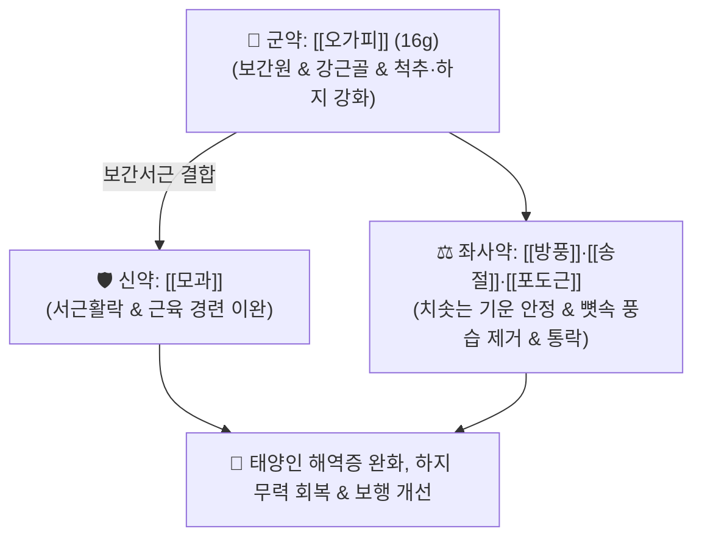

# 🍵 [[오가피장척탕]] (五加皮壯脊湯, Ogapi Jangcheok-tang / Gokapi-soshikito)

> **핵심 3줄 요약 (Key Summary)**:
> - 🌿 기본 구성: [[오가피]] (군, 16g), [[모과]] (신), [[방풍]]·[[송절]]·[[포도근]] (좌사) (태양인의 위로 치솟는 기운을 가라앉히고 간국을 보좌하여 척추와 하지 신경근을 강화하는 하기건각·보간원 대표 방제).
> - 🎯 [[태양인]] 외감요척병(外感腰脊病)으로 인한 해역증(解㑊證, 다리가 풀려 걷지 못함), 하지 무력, 척추 통증, 각약증(脚弱證), 보행 장애.
> - 🔬 오가피 엘레우테로사이드 E의 운동신경원 사멸 억제, 모과 우르솔산의 골격근 단백질 합성 촉진(Akt/mTOR 경로), 송절·포도근의 척수 염증성 사이토카인 차단.
> - ⚠️ 주의사항: 모과·오가피의 수렴 작용으로 장관 운동 둔화 및 변비 발생 가능, 타 체질의 하지 마비 처방과 혼용하지 않도록 엄격한 체질 감별 필수.

---

## 📌 목차
1. [기본 처방 정보 & 군신좌사 구성](#1-기본-처방-정보--군신좌사-구성)
2. [방제학적 약재 상호작용 & 시너지 네트워크](#2-방제학적-약재-상호작용--시너지-네트워크)
3. [현대 분자약리학적 효능 & 작용 기전](#3-현대-분자약리학적-효능--작용-기전)
4. [적응 병증 및 체질별 감별 (Sweet Spot vs 금기)](#4-적응-병증-및-체질별-감별-sweet-spot-vs-금기)
5. [유사 처방군 감별 매트릭스](#5-유사-처방군-감별-매트릭스)
6. [임상 가감례 & 현대 질환별 응용](#6-임상-가감례--현대-질환별-응용)
7. [💡 사용자 진료실 핵심 필기 & 임상 팁 (원문 보존)](#7--사용자-진료실-핵심-필기--임상-팁-원문-보존)
8. [출처 및 학술 참고 문헌 (References)](#8-출처-및-학술-참고-문헌-references)

---

## 1. 기본 처방 정보 & 군신좌사 구성

* **출전**: 이제마(李濟馬) 『[[동의수세보원]]』(東醫壽世保元) 태양인론 외감요척병론(太陽人 外感腰脊病論)
* **치법**: 보간원(補肝元), 청열하기(淸熱下氣), 건각장척(健脚壯脊), 서근활락(舒筋活絡)

| 구분 | 약재명 | 표준 용량 | 본초 효능 & 방제 내 역할 |
| :--- | :--- | :--- | :--- |
| **군약 (君藥)** | [[오가피]] | 16.0g | **보간신·강근골·항피로**: 부족한 간목(肝木)을 북돋우고 척추와 하지의 골격을 튼튼히 지탱 |
| **신약 (臣藥)** | [[모과]] | 8.0g | **서근활락·화습화위**: 산미(酸味)로 음액을 수렴하고 굳어진 근육 경련을 풀어 보행을 원활히 함 |
| **좌약 (佐藥)** | [[방풍]] | 6.0g | **거풍제습·진경**: 상초로 치솟는 기운을 완충하면서 경락의 풍사를 소산 |
| **좌약 (佐藥)** | [[송절]] | 6.0g | **거풍조습·활혈지통**: 소나무 마디의 송진 성분으로 뼛속 풍습을 뽑아내고 척추통 제어 |
| **사약 (使藥)** | [[포도근]] | 6.0g | **이습소종·행혈통락**: 덩굴식물의 통락 작용으로 관절 내 부종을 가라앉히고 혈행 촉진 |

> **배오 특징**: 태양인은 체질적으로 **폐대간소(肺大肝小)**하여 상초의 기운이 지나치게 치솟고 하초의 간음(肝陰)과 신수가 허약해지기 쉽습니다. 이때 [[오가피]]를 군약으로 삼아 간원(肝元)을 대보하고 [[모과]]로 근육을 유연하게 하며, [[송절]]·[[포도근]]으로 하체로 기혈을 견인하여 다리가 풀리는 **해역증(解㑊證)**을 치료하는 태양인 유일의 근골격계 명방입니다.

---

## 2. 방제학적 약재 상호작용 & 시너지 네트워크

* **오가피 + 모과 배오 (하기건각의 핵심)**: 오가피가 뼈와 신경을 튼튼하게 하고 모과가 근육과 힘줄을 부드럽게 감싸주어 상하 균형을 회복시킵니다.
* **송절 + 포도근의 통락 배오**: 척추 신경관과 하지 관절로 막힌 기혈을 뚫어줍니다.

---

## 3. 현대 분자약리학적 효능 & 작용 기전

### 1) 신경근 접합부(NMJ) 및 운동신경원 보호
* 오가피의 엘레우테로사이드 E 성분이 운동신경원의 사멸을 억제하고 아세틸콜린 수용체의 감수성을 유지하여 근 무력증을 개선합니다.
### 2) 골격근 단백질 합성 촉진 및 근위축 차단
* 모과의 우르솔산(Ursolic acid)이 골격근 세포 내 Akt/mTOR 신호 경로를 자극하여 단백질 합성을 촉진하고, 근위축 유발 인자인 MuRF-1 및 Atrogin-1 발현을 차단합니다.
### 3) 척수 신경근 염증 억제 및 방사통 완화
* 송절과 포도근의 테르페노이드가 척수 후각의 염증성 사이토카인 생성을 억제하여 척추관 협착 및 좌골신경 압박으로 인한 다리 방사통을 경감시킵니다.

---

## 4. 적응 병증 및 체질별 감별 (Sweet Spot vs 금기)

### [✅ 최적 적응증 (Sweet Spot)]
* **태양인 해역증(解㑊證) 및 각약증**: 눕기를 좋아하고, 다리에 힘이 풀려 걷기 힘들며, 관절에 외형상 부종은 없으나 힘을 줄 수 없는 상태.
* **신경근 질환 회복기**: 길랑-바레 증후군 회복기, 척추관 협착증 후유증으로 인한 족하수(Foot Drop) 및 보행 곤란.
* **요척강통 및 상기증**: 화가 나면 머리로 피가 쏠리면서 허리와 다리가 후들거리는 병태.

### [⚠️ 신중 투여 및 금기 (Caution / Contraindication)]
* **변비 환자 주의**: 모과·오가피의 수렴 작용으로 장관 운동이 둔화될 수 있으므로 변비 환자는 택사나 미후도를 가미.
* **체질 감별 필수**: 태음인의 마황정통탕, 소음인의 관계부자이중탕 등 타 체질의 하지마비 처방과 혼용 절대 금기.

---

## 5. 유사 처방군 감별 매트릭스

| 처방명 | 병기 | 핵심 약재 구성 | 적합한 환자 양상 |
| :--- | :--- | :--- | :--- |
| [[오가피장척탕]] | **태양인 폐대간소 해역증** | 오가피, 모과, 방풍, 송절, 포도근 | **상체 발달, 다리 풀림, 보행 곤란 (태양인 전용)** |
| [[마황정통탕]] | **태음인 비습체질 한습관절통** | 마황, 당귀, 창출, 강활, 독활 | **체격 우람, 뚱뚱함, 좌골신경통, 뼈마디 쑤심** |
| [[독활기생탕]] | **간신양허 기혈부족 (고령자)** | 독활, 상기생, 두충, 숙지황, 당귀 | **허리 무릎 시리고 무력함, 극심한 허증** |
| [[미후도식장탕]] | **태양인 열격반위 (소화기)** | 미후도, 포도근, 오가피, 송절 | **음식을 삼키기 어렵고 게우는 식도 질환** |

---

## 6. 임상 가감례 & 현대 질환별 응용

* **변비 동반 시**:
  * [[택사]] 6g, [[미후도]](다래) 6g을 가미하여 장관 윤택 유도.
* **현대 응용**:
  * 중추 및 말초 신경 손상 후 보행 재활, 척추관 협착증 하지 파행증, 노인성 근감소증(Sarcopenia).

---

## 7. 💡 사용자 진료실 핵심 필기 & 임상 팁 (원문 보존)

* **사용자 원문 필기**:
  * 이제마의 《동의수세보원》에 수록된 사상의학 태양인 외감요척병의 대표 처방.
  * 상승하는 화열과 조급성을 가라앉히고, 간국을 보좌하여 척추와 하지 신경근을 강화하는 하기건각 작용.
  * 태양인의 폐대간소 병태에서 발생하는 해역증(다리가 풀려 걷지 못함), 하지 무력, 요척통을 다스림.
* **실전 진료실 노하우**:
  * 환자가 목덜미와 상체는 건장한데 "다리에 힘이 풀려 계단을 내려갈 때 주저앉는다"고 호소하는 태양인 해역증에 오가피장척탕을 투약하면 척추와 하체의 지탱력이 빠르게 회복된다.

---

## 8. 출처 및 학술 참고 문헌 (References)

1. 이제마(李濟馬). 『동의수세보원(東醫壽世保元)』 태양인 외감요척병론.
