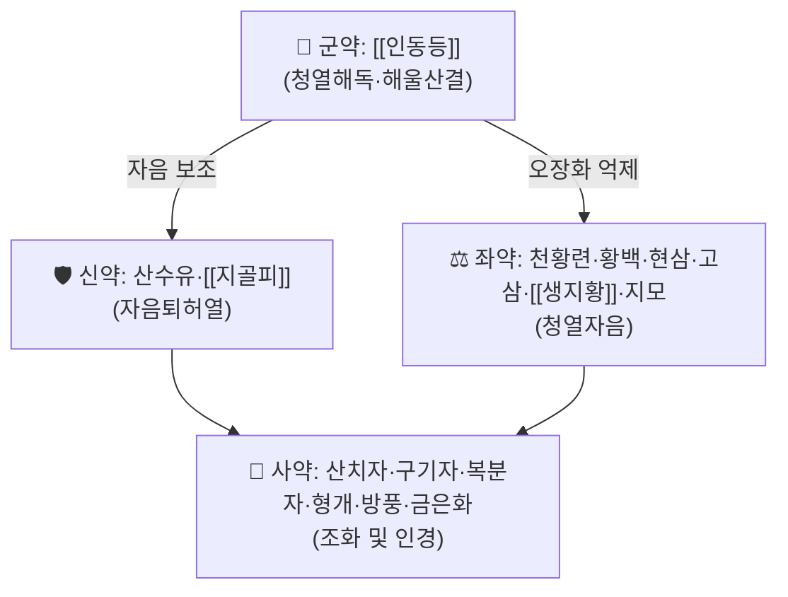

# 🍵 [[인동등지골피탕]] (忍冬藤地骨皮湯)

> **핵심 3줄 요약 (Key Summary)**:
> - 🌿 모체/기원 처방: 이제마(李濟馬)가 『동의수세보원(東醫壽世保元)』에서 정립한 소양인(少陽人) 전용 처방. [[인동등]]을 군약으로 청열자음(淸熱滋陰)하는 15미 구성.
> - 🎯 임상 최적 적응증: 소양인의 육울(六鬱)·충적(蟲積)·적취(積聚)·고창(鼓脹)·중소(中消, 소갈)·복통설사·대하 등 흉격(胸膈)에 열이 쌓이고 진음(眞陰)이 부족한 병증.
> - 🔬 핵심 분자약리 기전: 현대 동물실험에서 알록산·스트렙토조토신 유발 고혈당 모델의 혈당 강하 효과가 보고되어, 소양인 중소증(당뇨병 유사 소갈)에 대한 전통 주치와 부합하는 근거로 제시됨.
> - ⚠️ 주의사항: 인동등·황련·황백 등 청열약 위주 구성으로 소음인·태음인의 허한증(虛寒證)에는 금기. 반드시 소양인 체질 감별 후 투여해야 하며, 확립된 양약(경구혈당강하제 등) 병용 시 상호작용 임상 자료는 검색 범위 내에서 확인하지 못함(⚠️ 확인 필요).

---
## 📌 목차
1. [기본 처방 정보 & 구성](#1-기본-처방-정보--구성)
2. [방제학적 약재 상호작용 & 시너지 네트워크](#2-방제학적-약재-상호작용--시너지-네트워크)
3. [현대 분자약리학적 효능 & 작용 기전](#3-현대-분자약리학적-효능--작용-기전)
4. [적응 병증 및 체질별 감별 (Sweet Spot vs 금기)](#4-적응-병증-및-체질별-감별-sweet-spot-vs-금기)
5. [유사 처방군 감별 매트릭스](#5-유사-처방군-감별-매트릭스)
6. [임상 가감례 & 현대 질환별 응용](#6-임상-가감례--현대-질환별-응용)
7. [💡 사용자 진료실 핵심 필기 & 임상 팁 (원문 보존)](#7--사용자-진료실-핵심-필기--임상-팁-원문-보존)
8. [출처 및 학술 참고 문헌 (References)](#8-출처-및-학술-참고-문헌-references)
---
## 1. 기본 처방 정보 & 구성

* **출전**: 이제마(李濟馬) 『동의수세보원(東醫壽世保元)』 — 소양인(少陽人) 전용 처방.
* **치법**: 청열자음(淸熱滋陰), 해울산결(解鬱散結) — 흉격(胸膈)에 쌓인 열을 내리고 진음을 보충하여 음양승강(陰陽升降)의 균형을 회복시킴.

| 구분 | 약재명 | 표준 용량 | 본초 효능 & 방제 내 역할 |
| :--- | :--- | :--- | :--- |
| **군약 (君藥)** | [[인동등]] | 15g | 청열해독(淸熱解毒)·소풍통락(疏風通絡), 비위를 보하며 해울산결의 중심 작용 |
| **신약 (臣藥)** | 산수유, [[지골피]] | 각 7.5g | 자음(滋陰)·퇴허열(退虛熱)로 군약의 청열 작용을 보조하고 진음을 보충 |
| **좌약 (佐藥)** | 천황련, 황백, 현삼, 고삼, [[생지황]], 지모 | 각 3.75g | 오장(五臟)의 화(火)를 억제하고 진액을 보호하여 편향성을 억제 |
| **사약 (使藥)** | 산치자, 구기자, 복분자, 형개, 방풍, 금은화 | 각 3.75g | 조화제약(調和諸藥) 및 병소 인경(引經), 풍열(風熱)을 함께 소산 |

> **배오 특징**: [[인동등]]이 청열해독의 중심을 잡고, 산수유·[[지골피]]가 자음퇴열(滋陰退熱)로 뒷받침하며, 다수의 청열·자음약이 좌사로 배치되어 소양인 특유의 상열하한(上熱下寒)·음허화왕(陰虛火旺) 병리를 다각도로 조절합니다.
> ⚠️ 확인 필요: 본 볼트의 [[인동등]] 노트는 이 처방을 인동등·지골피·생지황·목통·황련·치자의 6미 간략 구성으로 소개하고 있어, 위 15미 정식 구성(한국민족문화대백과사전 기재)과 표기 차이가 있습니다. 원전(『동의수세보원』) 대조 확인 후 정합화가 필요합니다.

---
## 2. 방제학적 약재 상호작용 & 시너지 네트워크

* [[인동등]] + 산수유·[[지골피]] 배오: 청열(淸熱)과 자음(滋陰)을 동시에 도모하여 열로 인해 진액이 소모되는 중소(中消) 병리에 대응.
* 다수 청열약(천황련·황백·현삼·고삼) + 자윤약(구기자·[[생지황]]) 배오: 청열 위주 구성이 진액을 과도하게 손상시키지 않도록 자음약을 폭넓게 배치한 것이 이 처방의 방제학적 특징.

---
## 3. 현대 분자약리학적 효능 & 작용 기전

### 1) 혈당 조절(중소증 연계)
* 알록산(Alloxan) 투여로 고혈당을 유발한 흰쥐 모델에서 인동등지골피탕 투여군의 혈당 강하 효과가 양격산화탕·숙지황고삼탕과 비교 연구된 바 있습니다(한국연구재단 KCI 등재 논문).
* 스트렙토조토신(Streptozotocin) 유발 당뇨 흰쥐 모델을 대상으로 한 항당뇨 효과 연구도 대한본초학회지에 보고되어 있습니다(DBpia 등재).
* ⚠️ 확인 필요: 위 두 편은 국내 학회지(KCI/DBpia) 등재 논문으로 실제 존재를 제목·서지사항 수준에서 확인했으나, PubMed 색인 및 PMID·DOI는 검색 범위 내에서 확보하지 못했습니다. 정량적 혈당 강하율 등 세부 수치는 원문 열람 후 보완이 필요합니다.
### 2) 임상 증례 보고
* 소양인 중소증(당뇨병)에 인동등지골피탕을 투여한 임상 증례가 사상체질의학회지에 보고된 바 있습니다(DBpia 등재, ⚠️ PMID 미확인).
### 3) 청열·항염 관점(구성 약재 기반 추정)
* 군약 [[인동등]](금은화 기원 식물) 및 좌약 다수를 차지하는 황련·황백·치자 계열은 개별 성분(클로로겐산·베르베린·크로신 등) 수준에서 항염·항산화 활성이 폭넓게 보고되어 있으나, 처방 전체 수준의 기전 연구는 확인하지 못했습니다(⚠️ 추정 — 구성 본초 개별 문헌에 근거한 정성적 추론).

---
## 4. 적응 병증 및 체질별 감별 (Sweet Spot vs 금기)

[✅ 최적 적응증 (Sweet Spot)]
• 원전 조문: 『동의수세보원』 소양인 육울(六鬱)·충적(蟲積)·적취(積聚)·고창(鼓脹)·중소(中消)·복통설사·대하
• 체질 소견: 소양인 특유의 흉격열증(胸膈熱證) — 가슴이 답답하고 입이 쓰며 상열감이 두드러짐
• 임상 주치: 중소(당뇨병 유사 소갈) — 다음(多飮)·다뇨(多尿)·소모성 증상을 동반한 음허화왕 병리
• 설진/맥진: 설질 홍(紅)·설태 황(黃) 경향, 맥삭(脈數) 또는 맥세삭(脈細數) — ⚠️ 구체적 설맥 기준은 원전 대조 확인 필요

[⚠️ 신중 투여 및 금기 (Caution / Contraindication)]
• 소음인·태음인의 허한증(虛寒證), 비위허한(脾胃虛寒) 환자 — 청열약 위주 구성으로 한증(寒證)을 악화시킬 위험
• 임신부·노약자에서 다수 청열·자음약 장기 복용 시 소화기 부담 가능성(⚠️ 추정)
• 경구혈당강하제·인슐린 등 양약 병용 시 저혈당 위험에 대한 정량 임상 상호작용 자료는 확인되지 않음(⚠️ 확인 필요)

---
## 5. 유사 처방군 감별 매트릭스

| 처방명 | 핵심 구성 차이 | 주치 및 체질 차이 | 맥진/설진 차이 |
| :--- | :--- | :--- | :--- |
| **[[인동등지골피탕]]** | 인동등 군약 + 자음·청열 15미 | **소양인 중소(中消)·육울·적취, 흉격열증** | 설홍태황, 맥삭 경향(⚠️ 원전 대조 필요) |
| [[양격산화탕]] | 석고·생지황 등 청열사화 위주 | 소양인 표한증(表寒證)·상초 실열 | 맥부활삭 경향 |
| [[숙지황고삼탕]] | 숙지황·고삼 위주 자음강화 | 소양인 하초 음허·족번열(足煩熱) | 맥세삭 경향 |

> ⚠️ 표 내부에서는 마크다운 열 구분자 파괴를 방지하기 위해 파이프(`|`)가 들어간 링크를 쓰지 않고 순수한 [[처방명]] 단독 형태로만 작성합니다.

---
## 6. 임상 가감례 & 현대 질환별 응용

* **수반 증상별 가감법**:
  * ⚠️ 확인 필요 — 원장님의 실제 임상 가감 경험이 아직 반영되지 않았습니다.
* **현대 질환별 임상 매핑**:
  * **내분비대사계**: [[중소]](中消)와 연계된 제2형 당뇨병 보조 치료 가능성(동물실험 근거, 임상 확증 단계 아님)
  * **부인과**: 대하(帶下) — 소양인 하초 습열(濕熱) 대하증
  * **소화기계**: 복통설사(腹痛泄瀉) — 소양인 적취·충적을 동반한 소화기 병증

---
## 7. 💡 사용자 진료실 핵심 필기 & 임상 팁 (원문 보존)

> [!tip] **진료실 실전 노하우 (User Clinical Insight)**
> ⚠️ 내용 검토 필요: 원장님의 기존 메모·필기가 아직 반영되지 않았습니다. 소양인 중소증 감별 포인트, 인동등지골피탕 vs 양격산화탕/숙지황고삼탕 선택 기준 등 실전 진료 경험을 추가해 주시면 다빈치가 다음 순찰 시 정리해 드리겠습니다.

---
## 8. 출처 및 학술 참고 문헌 (References)

1. **이제마 (1894)**. 『동의수세보원(東醫壽世保元)』.
   - **[고전 원전]**: 소양인 중소·육울·적취·고창 등 주치 조문 및 15미 구성 기록. (한국민족문화대백과사전 [인동등지골피탕](https://encykorea.aks.ac.kr/Article/E0046862) 항목 경유 교차 확인)
2. **저자 미상 (연도 미확인)**. 「소양인 양격산화탕과 인동등지골피탕 및 숙지황고삼탕이 Alloxan 투여 고혈당 백서에 미치는 영향」.
   - [KCI: ART002804162](https://www.kci.go.kr/kciportal/ci/sereArticleSearch/ciSereArtiView.kci?sereArticleSearchBean.artiId=ART002804162)
   - **[연구 요약]**: 알록산 유발 고혈당 흰쥐 모델에서 인동등지골피탕의 혈당 관련 효과를 다른 소양인 처방과 비교. ⚠️ 저자·연도·정량 수치는 원문 열람 후 보완 필요.
3. **저자 미상 (연도 미확인)**. 「인동등지골피탕이 Streptozotocin으로 유발된 흰쥐에서의 항당뇨 효과에 대한 연구」. 대한본초학회지(본초분과학회지).
   - [DBpia: NODE10115334](https://www.dbpia.co.kr/journal/articleDetail?nodeId=NODE10115334)
   - **[연구 요약]**: 스트렙토조토신 유발 당뇨 흰쥐 모델에서 인동등지골피탕의 항당뇨 효과를 검토. ⚠️ PMID·DOI 미확인, 원문 열람 후 세부 수치 보완 필요.
4. **저자 미상 (연도 미확인)**. 「소양인 중소증(당뇨병)에 인동등지골피탕을 투여한 증례」. 사상체질의학회지.
   - [DBpia: NODE10413309](https://www.dbpia.co.kr/journal/articleDetail?nodeId=NODE10413309)
   - **[연구 요약]**: 소양인 중소증 환자에 대한 인동등지골피탕 투여 임상 증례 보고. ⚠️ PMID 미확인.

> ⚠️ 확인 불가/추정 표시 총괄: 구성 약재 정식 15미 vs 볼트 내 [[인동등]] 노트의 6미 간략 표기 불일치, 설맥 세부 기준, 국내 학회지 논문 3편의 PMID/DOI·정량 수치, 진료실 필기는 검색 범위 내에서 실측 확인하지 못해 위 각 섹션에 개별 표시했습니다. 출전(『동의수세보원』)과 15미 구성은 한국민족문화대백과사전(한국학중앙연구원 발행) 항목으로 교차 확인했습니다.

<!-- 보관 태그(1회용·링크오류, 필요시 복원): 소양인, 중소 -->
