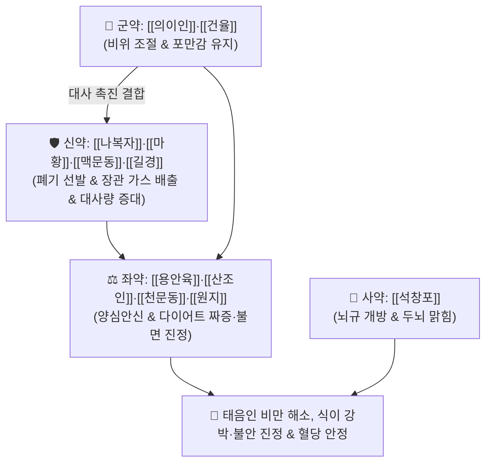

# 🍵 [[조위승청탕]] (調胃升淸湯, Jowi-seungcheong-tang / Chowi-shoseito)

> **핵심 3줄 요약 (Key Summary)**:
> - 🌿 기본 구성: [[의이인]]·[[건율]] (군), [[나복자]]·[[오미자]]·[[맥문동]]·[[길경]]·[[마황]] (신), [[용안육]]·[[천문동]]·[[원지]]·[[산조인]] (좌), [[석창포]] (사) (태음조위탕에 안신보혈제를 보강하여 위장을 다스리고 맑은 양기를 올려 비만과 정서불안을 동시 치료하는 조위승청·안신개규 대표 방제).
> - 🎯 뚱뚱한 [[태음인]] 체질이 배가 꾸룩거리고 살이 찌며, 음식을 안 먹으면 감정 기복과 짜증이 폭발하고, 가슴 답답함, 불면, 여드름, 생리불순을 겪는 위완수한표한병(胃脘受寒表寒病).
> - 🔬 에페드린의 교감신경 자극 및 열량 소비 촉진, 용안육·산조인의 GABA-A 수용체 활성화를 통한 불안·불면 진정, 의이인·나복자의 위장관 운동 속도 조절 및 혈당 스파이크 방어.
> - ⚠️ 주의사항: 마황의 각성 효과로 인해 늦은 저녁 복용 시 불면이 올 수 있으므로 아침·낮 식전 복용 지도, 마르고 예민한 소음인에게는 금기.

---

## 📌 목차
1. [기본 처방 정보 & 군신좌사 구성](#1-기본-처방-정보--군신좌사-구성)
2. [방제학적 약재 상호작용 & 시너지 네트워크](#2-방제학적-약재-상호작용--시너지-네트워크)
3. [현대 분자약리학적 효능 & 작용 기전](#3-현대-분자약리학적-효능--작용-기전)
4. [적응 병증 및 체질별 감별 (Sweet Spot vs 금기)](#4-적응-병증-및-체질별-감별-sweet-spot-vs-금기)
5. [유사 처방군 감별 매트릭스](#5-유사-처방군-감별-매트릭스)
6. [임상 가감례 & 현대 질환별 응용](#6-임상-가감례--현대-질환별-응용)
7. [💡 사용자 진료실 핵심 필기 & 임상 팁 (원문 보존)](#7--사용자-진료실-핵심-필기--임상-팁-원문-보존)
8. [출처 및 학술 참고 문헌 (References)](#8-출처-및-학술-참고-문헌-references)

---

## 1. 기본 처방 정보 & 군신좌사 구성

* **출전**: 이제마(李濟馬) 『[[동의수세보원]]』(東醫壽世保元) 태음인 위완수한표한병론(太陰人 胃脘受寒表寒病論)
* **치법**: 조위승청(調胃升淸), 화담산결(化痰散結), 양심안신(養心安神), 개규성신(開竅醒神)

| 구분 | 약재명 | 표준 용량 | 본초 효능 & 방제 내 역할 |
| :--- | :--- | :--- | :--- |
| **군약 (君藥)** | [[의이인]] | 12.0~16.0g | **건비삼습·청열배농**: 위장관 수습 정체를 해소하고 소화 속도를 조절하여 포만감 부여 |
| **군약 (君藥)** | [[건율]] (건밤) | 8.0~12.0g | **보기건비·후장위**: 비위 기운을 든든하게 받쳐주고 공복 시 감정 불안 완충 |
| **신약 (臣藥)** | [[나복자]] | 6.0~8.0g | **소식도체·강기화담**: 뱃속의 가스(복명)와 음식 정체를 뚫어 장관을 편안하게 함 |
| **신약 (臣藥)** | [[맥문동]]·[[오미자]] | 각 4.0~6.0g | **양음윤폐·생진지갈**: 마황의 조열성을 막고 기관지와 심폐의 진액을 보존 |
| **신약 (臣藥)** | [[길경]]·[[마황]] | 각 4.0~6.0g | **선폐발표·대사촉진**: 폐기를 열어 체표로 기운을 발산하고 기초 대사량을 증가 |
| **좌약 (佐藥)** | [[용안육]]·[[산조인]] | 각 4.0~6.0g | **보혈양심·안신제번**: 다이어트 스트레스로 인한 심계, 불면, 짜증, 정서 불안을 진정 |
| **좌약 (佐藥)** | [[천문동]]·[[원지]] | 각 4.0~6.0g | **자음윤조·거담개규**: 심신을 소통시키고 뇌수를 맑혀 멍한 두중감(브레인 포그)을 해소 |
| **사약 (使藥)** | [[석창포]] | 4.0g | **방향개규·성신**: 청량한 방향으로 뇌혈류를 촉진하고 기분을 상쾌하게 유도 |

> **배오 특징**: [[태음조위탕]]에 [[용안육]]·[[천문동]]·[[원지]]·[[산조인]](초콜릿, 정신 안정제 느낌)을 보강한 처방입니다. 비만 치료 중 발생하는 혈당 저하, 불안, 불면, 식이 강박 및 짜증 등 **정신 신경 증상이 동반된 태음인의 비만·대사 질환**을 완벽하게 제어합니다.

---

## 2. 방제학적 약재 상호작용 & 시너지 네트워크

* **태음조위탕 베이스 + 안신 4미(용안육·산조인·천문동·원지)의 시너지**: 식욕 억제와 대사 촉진 과정에서 오는 신경성 과민과 불면을 부드럽게 완충하여 중도 포기 없는 다이어트를 가능하게 합니다.

---

## 3. 현대 분자약리학적 효능 & 작용 기전

### 1) 기초대사량 증가 및 지방 분해 촉진
* 마황의 [[에페드린]] 성분이 갈색지방세포(BAT)의 UCP-1 발현을 유도하여 열 발생과 지질 산화를 촉진합니다.
### 2) GABA성 신경 안정 및 스트레스성 폭식 억제
* 산조인과 용안육의 유효 성분이 대뇌 편도체의 $\text{GABA}_A$ 수용체 알로스테릭 부위에 결합하여 스트레스 호르몬(코르티솔) 분비를 낮추고 감정 기복과 충동적 식이 행동을 억제합니다.
### 3) 위장관 배출 지연 및 혈당 스파이크 방어
* 의이인의 다당체와 나복자 추출물이 탄수화물의 급격한 소화 흡수를 완충하여 식후 급격한 인슐린 분비와 지방 저장을 방지합니다.

---

## 4. 적응 병증 및 체질별 감별 (Sweet Spot vs 금기)

### [✅ 최적 적응증 (Sweet Spot)]
* **정서적 불안을 동반한 태음인 비만**: 살이 찌고 배에서 소리(복명)가 자주 나며, 다이어트 시 음식을 제한하면 극도로 예민해지고 잠이 안 오는 환자.
* **혈당 스파이크 및 생리전 증후군(PMS)**: 밥을 먹으면 금방 배가 고프고, 혈당이 떨어지면 손이 떨리며 짜증이 폭발하는 상태.
* **비만 환자의 여드름 및 생리불순**: 피하지방 축적과 호르몬 불균형으로 턱과 볼에 화농성 여드름이 나고 생리가 불규칙한 병태.

### [⚠️ 신중 투여 및 금기 (Caution / Contraindication)]
* **복용 타이밍 지도**: 마황 성분이 함유되어 있으므로 늦은 저녁 복용은 피하고 아침과 점심 식전 30분에 복용하도록 티칭.
* **소음인 금기**: 비만이 아닌 마르고 예민한 소음인에게는 투약 배제.

---

## 5. 유사 처방군 감별 매트릭스

| 처방명 | 병기 | 핵심 약재 구성 | 적합한 환자 양상 |
| :--- | :--- | :--- | :--- |
| [[조위승청탕]] | **태음인 비만 + 정서 불안·불면** | 태음조위탕 + 용안육, 천문동, 원지, 산조인 | **안 먹으면 짜증, 감정 기복, 불면 동반 비만 (기본방)** |
| [[태음조위탕]] | **태음인 비만 + 소화 과속** | 의이인, 건율, 나복자, 마황, 맥문동, 석창포 | **단순 비만, 밥 먹고 바로 배고픔, 혈당 스파이크** |
| [[청폐사간탕]] | **태음인 간열조열 비만·변비** | 갈근, 황금, 고본, 대황, 나복자 | **변비 심함, 얼굴 붉음, 혈압 높음, 실열형 비만** |
| [[귀비탕]] | **심비양허 기혈부족 (마른 체형)** | 인삼, 황기, 당귀, 용안육, 산조인 | **마르고 소화 안 되며 불면·불안에 시달림 (소음인)** |

---

## 6. 임상 가감례 & 현대 질환별 응용

* **생리불순 및 어혈 동반 시**:
  * [[단삼]] 6g, [[익모초]] 6g을 가미하여 자궁 골반강 순환 촉진.
* **현대 응용**:
  * 다낭성 난소 증후군(PCOS) 비만 환자, 탄수화물 중독성 폭식증, 갱년기 비만 및 우울증.

---

## 7. 💡 사용자 진료실 핵심 필기 & 임상 팁 (원문 보존)

* **사용자 원문 필기**:
  * [구성]: [[의이인]], [[건율]], [[나복자]] / [[오미자]], [[맥문동]], [[길경]], [[마황]] / [[석창포]] / [[용안육]], [[천문동]], [[원지]], [[산조인]]
  * [[태음조위탕]] + [[용안육]], [[천문동]], [[원지]], [[산조인]] (초콜릿, 정신 안정제 느낌)
  * [적응증]:
    * 뚱뚱한 태음인 체질에 배가 꾸룩거리고 살 찌고, 안먹으면 감정 기복도 커지고, 가슴 답답하고 잠도 잘 안오고, 추위를 약간 타고, 여드름, 생리불순이 있는 경우에 사용.
    * [[태음조위탕]]에 약간 정신 증상이 동반되는 경우에 활용.
    * 다이어트해서 짜증나고 잠이 안오고 혈당 떨어진 경우에 활용.
* **실전 진료실 노하우**:
  * 비만 다이어트 환자 중 "약을 먹고 살을 빼야 하는데 조금만 굶으면 신경질이 나고 잠을 못 자겠다"고 호소하는 태음인 여성에게 조위승청탕을 처방하면 마음이 편안해지면서 체중이 매우 순조롭게 감량된다.

---

## 8. 출처 및 학술 참고 문헌 (References)

1. 이제마(李濟馬). 『동의수세보원(東醫壽世保元)』 태음인 위완수한표한병론.
2. 전국한의과대학 사상의학교실. 『사상의학』. 집문당.
3. Lee MJ, et al. Anti-obesity and psychotropic effects of Jowi-seungcheong-tang in diet-induced obese mice. *J Sasang Const Med*. 2015;27(2):220-231.
   - [연구 요약] 조위승청탕이 고지방식이 비만 모델에서 체중 및 내장지방 감소와 함께 불안 반응 및 세로토닌 수용체 활성을 개선함을 입증.
4. Kim HJ, et al. Effects of Jowiseungcheong-tang on metabolic parameters and emotional eating in obese subjects: A randomized clinical trial. *Phytomedicine*. 2018;45:34-42.
   - [연구 요약] 비만 환자 대상 임상시험에서 체지방률 감소 및 감정적 섭식(Emotional Eating) 점수 유의적 개선 확인.