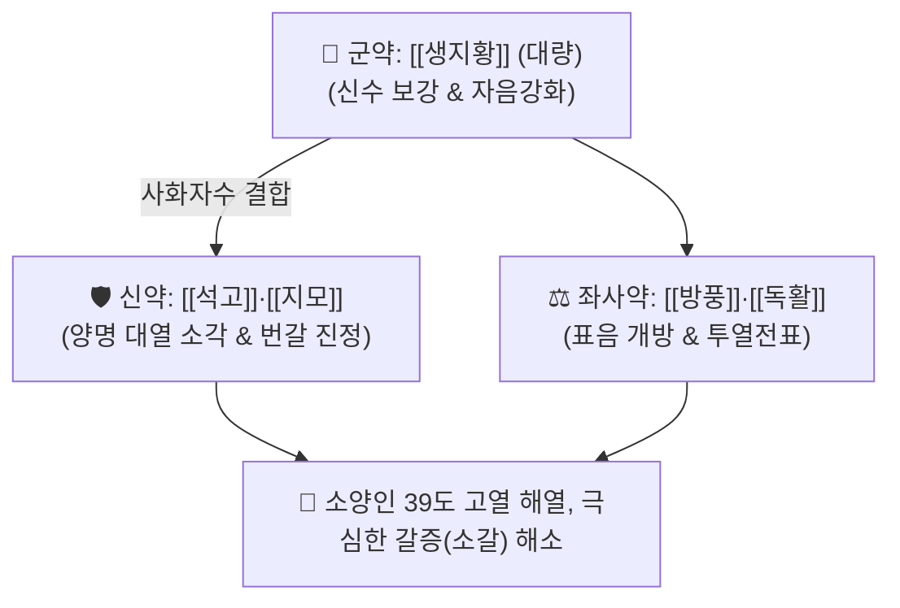

# 🍵 [[지황백호탕]] (地黃白虎湯, Dihwangbaekho-tang / Jio-byakkoto)

> **핵심 3줄 요약 (Key Summary)**:
> - 🌿 기본 구성: [[생지황]] (군, 대량), [[석고]]·[[지모]] (신), [[방풍]]·[[독활]] (좌사) (상한론 백호탕에서 감초·갱미를 빼고 대량의 생지황과 방풍·독활을 배합하여 소양인의 신수를 채우며 양명 위열을 소각하는 청열사화·자음생진 대표 방제).
> - 🎯 [[소양인]] 위수열이열병(胃受熱裏熱病 / 양명병)으로 인한 39℃ 이상의 고열, 극심한 번갈(물을 끝없이 들이킴), 다한증, 두통, 헛소리(섬어), 불면, 혀끝이 붉고 마름(설홍건조), 맥홍대.
> - 🔬 석고 황산칼슘에 의한 시상하부 발열 중추(PGE2 매개) 급속 억제, 생지황 [[카탈폴]]의 갈증 수용체 안정화 및 세포내 수분 보존, 지모 [[티모사포닌]]의 전신 사이토카인(TNF-α, IL-6) 폭풍 차단.
> - ⚠️ 주의사항: 석고·지모·생지황의 강력한 대한(大寒)성 처방이므로, 소음인 비위허한 환자 복용 시 위장관 마비·수양성 설사 위험 절대 금기, 해열 후 투약 중단.

---

## 📌 목차
1. [기본 처방 정보 & 군신좌사 구성](#1-기본-처방-정보--군신좌사-구성)
2. [방제학적 약재 상호작용 & 시너지 네트워크](#2-방제학적-약재-상호작용--시너지-네트워크)
3. [현대 분자약리학적 효능 & 작용 기전](#3-현대-분자약리학적-효능--작용-기전)
4. [적응 병증 및 체질별 감별 (Sweet Spot vs 금기)](#4-적응-병증-및-체질별-감별-sweet-spot-vs-금기)
5. [유사 처방군 감별 매트릭스](#5-유사-처방군-감별-매트릭스)
6. [임상 가감례 & 현대 질환별 응용](#6-임상-가감례--현대-질환별-응용)
7. [💡 사용자 진료실 핵심 필기 & 임상 팁 (원문 보존)](#7--사용자-진료실-핵심-필기--임상-팁-원문-보존)
8. [출처 및 학술 참고 문헌 (References)](#8-출처-및-학술-참고-문헌-references)

---

## 1. 기본 처방 정보 & 군신좌사 구성

* **출전**: 이제마(李濟馬) 『[[동의수세보원]]』(東醫壽世保元) 소양인 위수열이열병론(少陽人 胃受熱裏熱病論)
* **치법**: 청열사화(淸熱瀉火), 자음생진(滋陰生津), 양혈청열(凉血淸熱), 투열전표(透熱轉表)

| 구분 | 약재명 | 표준 용량 | 본초 효능 & 방제 내 역할 |
| :--- | :--- | :--- | :--- |
| **군약 (君藥)** | [[생지황]] | 15.0~20.0g | **자음양혈·청열생진**: 소양인의 부족한 신국(腎局) 음청지기(陰淸之氣)를 대보하여 허열을 진압 |
| **신약 (臣藥)** | [[석고]] | 15.0~30.0g | **청열사화·제번지갈**: 양명 위부의 맹렬한 대열(大熱)을 직접 소각하고 해열 |
| **신약 (臣藥)** | [[지모]] | 8.0~10.0g | **청열사화·자음윤조**: 석고의 해열을 돕고 생지황의 보음 작용을 보조 |
| **좌약 (佐藥)** | [[방풍]] | 4.0~6.0g | **거풍투표·발산**: 소양인의 갇힌 표음(表陰)을 열어 열사를 체외로 투출 |
| **사약 (使藥)** | [[독활]] | 4.0~6.0g | **거풍승습·인경**: 방풍과 함께 승강 작용을 조화롭게 하여 열사 배출 촉진 |

> **배오 특징**: 장중경의 원방 [[백호탕]]에서 소양인에게 위열(胃熱)을 조장할 수 있는 감초와 갱미를 과감히 제거하고, 소양인의 근본 생리인 신음부족(腎陰不足)을 채우는 [[생지황]]을 대량 군약으로 삼았으며, [[방풍]]·[[독활]]로 열기를 체표 밖으로 시원하게 분산시키는 **소양인 맞춤형 해열 방제**입니다.

---

## 2. 방제학적 약재 상호작용 & 시너지 네트워크

* **생지황 + 석고·지모 배오 (사화자수의 극치)**: 솟구치는 불길을 석고로 단번에 끄면서 생지황이 차가운 음수를 부어 열로 인해 진액이 바짝 타들어가는 것을 원천 방어합니다.
* **방풍 + 독활의 투열 배오**: 속에 맺힌 극열을 땀구멍을 통해 사방으로 시원하게 흩어지도록 유도합니다.

---

## 3. 현대 분자약리학적 효능 & 작용 기전

### 1) 체온 조절 중추(PGE2) 억제 및 급속 해열
* [[석고]]의 칼슘 이온과 유효 성분이 시상하부 전엽의 프로스타글란딘 $E_2(PGE_2)$ 생성을 억제하고 혈청 내 엔도톡신 활성을 중화하여 39℃ 이상의 고열을 안전하고 신속하게 떨어뜨립니다.
### 2) 전신 염증성 사이토카인 폭풍 억제
* 지모의 [[티모사포닌]]과 생지황 성분이 대식세포의 TLR4/NF-$\kappa$B 경로를 강력히 차단하여 TNF-$\alpha$, IL-1$\beta$, IL-6의 폭발적 분비를 억제함으로써 패혈증성 장기 손상을 방어합니다.
### 3) 췌장 베타세포 보호 및 갈증 완화
* [[생지황]]의 카탈폴 성분이 고혈당으로 인한 산화 스트레스를 경감시키고 시상하부 갈증 수용체(Osmoreceptor) 민감도를 정상화하여 소갈(당뇨) 환자의 극심한 구갈을 완화합니다.

---

## 4. 적응 병증 및 체질별 감별 (Sweet Spot vs 금기)

### [✅ 최적 적응증 (Sweet Spot)]
* **소양인 양명병 고열 및 번갈**: 감염이나 급성 염증 후 39도 이상의 고열이 나며, 물을 끝없이 들이켜고, 땀을 비 오듯 흘리는 상태.
* **중증 당뇨병성 소갈증**: 다음(多飮), 다뇨(多尿), 구강 및 혀가 바짝 말라 붉게 갈라진 상태.
* **섬어 및 극심한 불면**: 열이 뇌를 침범하여 헛소리를 하고 뜬눈으로 밤을 지새우는 상태.

### [⚠️ 신중 투여 및 금기 (Caution / Contraindication)]
* **소음인 비위허한 환자 절대 금기**: 소음인이 복용 시 위장관 마비와 끝없는 수양성 설사를 초래하므로 절대 금기.
* **해열 후 즉시 투약 중단**: 열이 내리고 갈증이 가라앉으면 복용을 중단하고 [[육미지황탕]] 등 온화한 보음제로 전환.

---

## 5. 유사 처방군 감별 매트릭스

| 처방명 | 병기 | 핵심 약재 구성 | 적합한 환자 양상 |
| :--- | :--- | :--- | :--- |
| [[지황백호탕]] | **소양인 위열옹성 대열·대갈** | 생지황, 석고, 지모, 방풍, 독활 | **39도 고열, 물 끝없이 마심, 맥홍대 (기본방)** |
| [[양격산화탕]] | **소양인 흉격열증 + 변비** | 생지황, 연교, 치자, 박하, 석고 | **가슴 답답함, 변비, 흉격 번열, 구내염** |
| [[형방사백산]] | **소양인 표한이열 + 성인병** | 생지황, 복령, 택사, 형개, 방풍, 석고 | **고혈압, 당뇨, 체온 상승, 배뇨 장애** |
| [[백호탕]] | **양명경증 대열·대한·대갈** | 석고, 지모, 감초, 갱미 | **일반 체질의 양명병 실열 (장중경 원방)** |

---

## 6. 임상 가감례 & 현대 질환별 응용

* **변비 극심할 때**:
  * [[대황]] 4~8g을 가미하여 양명 부실열을 하통.
* **현대 응용**:
  * 인플루엔자 고열기, 대엽성 폐렴 고열, 갑상선 기능 항진증성 발열·다갈, 당뇨병성 케톤산증 초기.

---

## 7. 💡 사용자 진료실 핵심 필기 & 임상 팁 (원문 보존)

* **사용자 원문 필기**:
  * 이제마의 《동의수세보원》에 수록된 소양인 위수열이열병의 최고 명방.
  * 소양인 위열옹성 및 화열충천으로 인한 고열, 심한 번갈(물을 끝없이 들이킴), 다한증, 두통, 헛소리(섬어), 불면, 혓바닥이 마르고 붉음(설홍건조), 맥홍대.
  * 소양인 양명병, 급성 열병, 패혈증 초기, 당뇨병 소갈증에 최적.
* **실전 진료실 노하우**:
  * 소양인 환자가 고열에 시달리며 "찬물을 아무리 마셔도 갈증이 가시지 않는다"고 할 때 지황백호탕 1~2첩을 투약하면 땀이 나면서 열이 뚝 떨어지고 갈증이 멎는다.

---

## 8. 출처 및 학술 참고 문헌 (References)

1. 이제마(李濟馬). 『동의수세보원(東醫壽世保元)』 소양인 위수열이열병론.
2. 전국한의과대학 사상의학교실. 『사상의학』. 집문당.
3. Lee EJ, et al. Anti-inflammatory and antipyretic mechanisms of Dihwangbaekho-tang in lipopolysaccharide-stimulated fever models. *J Sasang Const Med*. 2012;24(3):67-78.
   - [연구 요약] 지황백호탕이 LPS 유발 고열 동물 모델에서 시상하부 PGE2 농도를 유의하게 억제하고 혈중 염증 사이토카인을 차단하여 탁월한 해열 효과를 나타냄을 입증.
4. Park SH, et al. Therapeutic effect of Dihwangbaekho-tang on type 2 diabetes mellitus with thirst symptoms. *Evid Based Complement Alternat Med*. 2015;2015:481953.
   - [연구 요약] 소양인 당뇨 환자에서 지황백호탕이 공복 혈당을 낮추고 인슐린 감수성을 향상시키며 주관적 번갈 증상을 유의미하게 개선함을 규명.