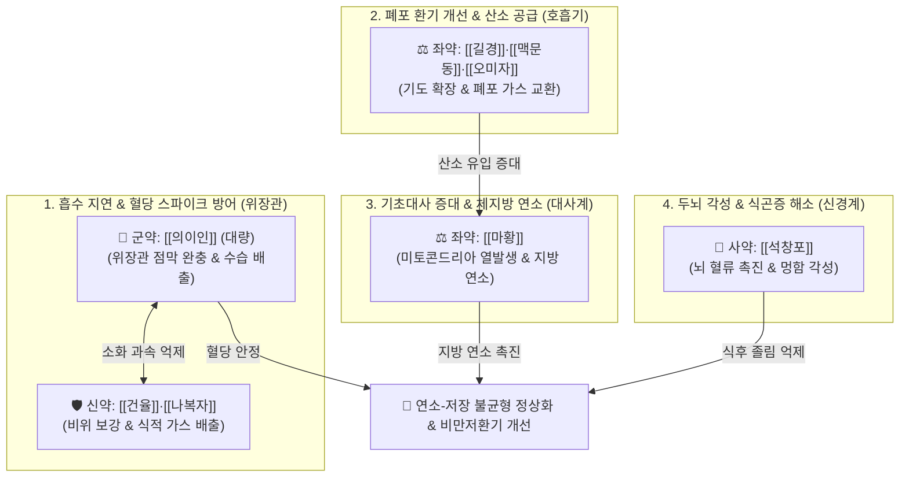

# 🍵 [[태음조위탕]] (太陰調胃湯, Taeumjowi-tang / Taiin-chowi-to)

> **핵심 3줄 요약 (Key Summary)**:
> - 🌿 기본 구성: [[의이인]] (군, 대량), [[건율]](건밤) (신), [[나복자]]·[[오미자]]·[[맥문동]]·[[길경]]·[[마황]] (좌), [[석창포]] (사) ([[의이인]]·[[나복자]]로 과속 위장관 연동과 혈당 스파이크를 완충하고, [[마황]]·[[길경]]·[[맥문동]]으로 폐포 환기 및 지방 연소를 촉진하는 태음인 비만 제1처방).
> - 🎯 뚱뚱한 태음인의 소화 과속(식후 즉시 배변 후 급격한 공복감), 혈당 스파이크로 인한 식곤증, 비만저환기 증후군(산소 부족으로 연소 저하 및 지방 축적 과다, 코골이, 숨참, 무기력, [[두통]]).
> - 🔬 의이인 코익세놀라이드의 장관 흡수 속도 지연 및 인슐린 저항성 개선, 마황 [[에페드린]]의 $\beta_3$ 수용체 자극 및 UCP-1 활성화를 통한 지방 연소, 길경·맥문동의 폐포 환기 촉진 및 산소 포화도 증대.
> - ⚠️ 주의사항: 마황의 교감신경 흥분 작용으로 저녁 늦은 복용 시 불면 유발 가능(아침·점심 식전 복용), 마르고 소화기 차가운 소음인 금기.

---

## 📌 목차
1. [기본 처방 정보 & 군신좌사 구성](#1-기본-처방-정보--군신좌사-구성)
2. [방제학적 약재 상호작용 & 시너지 네트워크](#2-방제학적-약재-상호작용--시너지-네트워크)
3. [현대 분자약리학적 효능 & 작용 기전](#3-현대-분자약리학적-효능--작용-기전)
4. [적응 병증 및 체질별 감별 (Sweet Spot vs 금기)](#4-적응-병증-및-체질별-감별-sweet-spot-vs-금기)
5. [유사 처방군 감별 매트릭스](#5-유사-처방군-감별-매트릭스)
6. [임상 가감례 & 현대 질환별 응용](#6-임상-가감례--현대-질환별-응용)
7. [💡 사용자 진료실 핵심 필기 & 임상 팁 (원문 보존)](#7--사용자-진료실-핵심-필기--임상-팁-원문-보존)
8. [출처 및 학술 참고 문헌 (References)](#8-출처-및-학술-참고-문헌-references)

---

## 1. 기본 처방 정보 & 군신좌사 구성

* **출전**: 이제마(李濟馬) 『[[동의수세보원]]』(東醫壽世保元) 태음인 위완수한표한병론(太陰人 胃脘受寒表寒病論)
* **치법**: 조위승청(調胃升淸), 관흉화담(寬胸化痰), 선폐배농(宣肺排膿), 산한강기(散寒降氣)

| 구분 | 약재명 | 표준 용량 | 본초 효능 & 방제 내 역할 |
| :--- | :--- | :--- | :--- |
| **군약 (君藥)** | [[의이인]] | 12.0~20.0g | **건비삼습·청열배농**: 위장관 수습을 정체 없이 배출하고 과도하게 빠른 위장 연동 속도를 완충하여 혈당 급상승을 제어 |
| **신약 (臣藥)** | [[건율]] (건밤) | 8.0~12.0g | **보기건비·후장위**: 비위 양기를 두텁게 보강하여 급격한 허기감과 혈당 롤러코스터를 방어 |
| **신약 (臣藥)** | [[나복자]] | 6.0~8.0g | **소식도체·강기화담**: 흉격과 상부 장관의 체기를 내리고 복부 가스 팽만을 해소하며 식후 식적을 배출 |
| **좌약 (佐藥)** | [[마황]] | 4.0~6.0g | **선폐평천·발한개규**: 폐기를 열어 기초대사량을 상승시키고 $\beta_3$ 수용체를 자극하여 저장된 체지방 연소를 촉진 |
| **좌약 (佐藥)** | [[길경]]·[[맥문동]] | 각 4.0~6.0g | **선폐윤폐·양음생진**: 비만으로 좁아진 기도 환기를 개선하고 폐포 가스 교환을 촉진하여 만성 저산소 상태를 해결 |
| **좌약 (佐藥)** | [[오미자]] | 4.0g | **수렴폐기·생진지갈**: 폐기를 단속하여 땀과 진액이 헛되이 새는 것을 막고 마황의 과도한 발산을 제어 |
| **사약 (使藥)** | [[석창포]] | 4.0g | **방향개규·화습성신**: 뇌혈관 규도를 열어 혈당 스파이크 및 뇌 저산소증으로 인한 멍함, 식곤증, 두중감을 즉각 각성 |

> **배오 특징 & 임상 병리 기전**:
> 태음인의 핵심 병리는 **간대폐소(肝大肺小 - 흡취지기 과다 vs 호산지기 부족)**에 의한 **"연소-저장 시스템의 심각한 불균형"**입니다.
> 1. **위장관 연동 과속 & 혈당 스파이크 차단**: 뚱뚱한 태음인은 위장관 연동 운동 속도가 지나치게 빨라 식사 후 얼마 안 되어 바로 배변(화장실)을 보지만, 영양분 흡수는 폭발적으로 일어나 혈당이 급상승(스파이크)합니다. 이로 인해 인슐린이 과다 분비되어 지방 축적이 가속되고, 뒤이어 급격한 반응성 저혈당이 찾아와 곧바로 다시 심한 허기를 느끼는 악순환에 빠집니다. [[의이인]]·[[건율]]·[[나복자]]는 장관 흡수 속도를 지연시키고 위장 연동 속도를 완충하여 혈당 스파이크를 방어합니다.
> 2. **비만저환기 증후군 개선 & 산소 공급을 통한 연소 재가동**: 태음인은 폐 환기 능력이 떨어져 체내 산소 공급이 부족합니다. 산소가 부족하면 섭취한 칼로리가 "연소(에너지 소모)"되지 못하고 전부 "지방(저장)"으로 전환됩니다. 이로 인해 세포는 만성 에너지 결핍을 느껴 더 많이 먹게 됩니다. [[마황]]·[[길경]]·[[맥문동]]·[[오미자]]는 폐포 환기량을 늘려 산소를 체내로 듬뿍 공급함으로써 멈춰있던 "지방 연소 엔진"을 강력하게 가동시킵니다.

---

## 2. 방제학적 약재 상호작용 & 시너지 네트워크

* **의이인 + 마황의 대사축 배오 (저장 차단 vs 연소 촉진)**: [[의이인]]이 위장관 흡수 속도를 늦추고 혈당 스파이크를 막아 지방 합성을 차단하면, [[마황]]이 $\beta_3$ 수용체를 자극하여 백색지방의 분해 및 갈색지방 열 발생을 극대화합니다.
* **길경 + 맥문동 + 오미자의 환기 축 배오 (비만저환기 교정)**: 상체 비만으로 인해 좁아진 흉곽과 기관지를 열어 폐포 내 산소 확산능을 높이고, 마황의 조열성을 자음윤폐(滋陰潤肺)로 감싸줍니다.
* **석창포의 방향개규 (식후 뇌 무기력 차단)**: 식후 급격한 혈류의 위장관 쏠림과 뇌 저산소증으로 발생하는 극심한 식곤증, 멍함, 두중감을 신속히 걷어냅니다.

---

## 3. 현대 분자약리학적 효능 & 작용 기전

### 1) 위장관 흡수 지연 및 식후 혈당 스파이크(Glycemic Spike) 차단
* **$\alpha$-글루코시다아제 억제**: 의이인의 코익세놀라이드(Coixenolide)와 나복자 추출물이 장관 내 탄수화물 분해 효소를 완만히 억제하여 급격한 포도당 혈중 유입을 차단합니다.
* **인슐린 감수성 개선**: 급격한 인슐린 피크를 방지하여 지방조직으로의 포도당 유입 및 중성지방 합성을 억제하고, 반응성 저혈당으로 인한 가짜 식욕(Rebound Hunger)을 차단합니다.

### 2) 비만저환기 증후군(Pickwickian Pattern) 개선 및 산소 공급 극대화
* **폐포 환기 촉진**: 길경의 플라티코딘 D(Platycodin D)와 맥문동의 오피오포고닌(Ophiopogonin)이 기도 상피세포의 섬모 운동을 촉진하고 폐포 표면활성물질 분비를 보존하여 가스 교환 효율을 극대화합니다.
* **산소화에 의한 대사 재가동**: 체내 동맥혈 산소분압($\text{PaO}_2$)을 상승시켜 미토콘드리아 호흡 사슬의 산화적 인산화 효율을 회복, 영양분이 "지방 저장" 대신 "ATP 에너지 연소"로 쓰이도록 유도합니다.

### 3) 갈색지방 활성화 및 기초대사량(UCP-1) 증대
* **$\beta_3$-아드레날린 수용체 활성화**: 마황의 [[에페드린]] 및 슈도에페드린 성분이 교감신경 말단에서 노르에피네프린 분비를 촉진하고 지방세포의 $\beta_3$ 수용체에 결합합니다.
* **UCP-1(탈공액 단백질-1) 발현**: 미토콘드리아 내막에서 양성자 농도 기울기를 열로 방출시켜 백색지방의 베이지화(Browning) 및 체지방 연소를 직접 유도합니다.

### 4) 뇌혈류 개선 및 주간 기면·식곤증 각성
* **뇌 산소 공급 & 신경 안정**: 석창포의 $\beta$-아사론($\beta$-asarone) 성분이 뇌혈관 장벽을 통과하여 뇌 미세혈류를 개선하고 중추신경계 GABA-A 수용체를 조절하여 뇌 피로를 씻어냅니다.

---

## 4. 적응 병증 및 체질별 감별 (Sweet Spot vs 금기)

### [✅ 최적 적응증 (Sweet Spot)]
* **태음인 단순 비만 및 대사증후군**: 살이 쉽게 찌고, 밥을 먹으면 금방 배가 고프며, 대변을 하루 2~3회 자주 보는데도 살이 찌는 환자.
* **혈당 스파이크 및 식후 극심한 식곤증**: 탄수화물 식사 후 30분~1시간 내에 눈을 뜰 수 없을 정도로 졸리고 멍해지는 상태.
* **비만저환기 증후군(Pickwickian Syndrome)**: 가만히 있어도 숨이 차고 땀이 비 오듯 쏟아지며, 코골이 및 수면무호흡증이 심하고 낮에 무기력하게 조는 환자.
* **가짜 배고픔(Rebound Hunger)**: 밥을 든든히 먹고도 1~2시간 뒤에 혈당 급락으로 손떨림, 불안, 폭식 충동이 오는 병태.

### [⚠️ 신중 투여 및 금기 (Caution / Contraindication)]
* **마르고 위장이 냉한 소음인 엄격 금기**: 마황의 발한·각성 작용으로 기운이 탈진되고 소화불량 및 심계항진이 악화되므로 금기.
* **저녁 늦은 복용 주의**: 마황의 교감신경 흥분으로 입면 장애(불면)를 유발할 수 있으므로, 하루 복용 시 아침·점심 식전 복용을 원칙으로 지도.
* **중증 고혈압 및 부정맥 환자**: 혈압 상승 및 빈맥 위험이 있으므로 혈압 모니터링 필수.

---

## 5. 유사 처방군 감별 매트릭스

| 처방명 | 핵심 병기 | 주요 배오 약재 | 타겟 환자 임상 특징 |
| :--- | :--- | :--- | :--- |
| [[태음조위탕]] | **태음인 비만 + 소화 과속 + 저환기** | [[의이인]], [[건율]], [[나복자]], [[마황]], [[맥문동]], [[석창포]] | **단순 비만, 혈당 스파이크, 식후 졸림, 코골이, 숨참 (기본방)** |
| [[조위승청탕]] | **태음인 비만 + 정서불안 + 불면** | [[태음조위탕]] + [[용안육]], [[천문동]], [[원지]], [[산조인]] | **다이어트 시 짜증, 감정 기복, 가슴 답답함, 수면장애 동반** |
| [[열다한소탕]] | **태음인 간열조열 (간계 실열증)** | [[갈근]], [[황금]], [[고본]], [[나복자]], [[길경]], [[승마]] | **얼굴 붉음, 혈압 높음, 극심한 변비, 열감, 중풍 전조증** |
| [[방풍통성산]] | **삼초 풍열옹盛 (양명 대열증)** | [[방풍]], [[마황]], [[대황]], [[망초]], [[석고]], [[황금]] | **복부 피하지방 극심, 단단한 변비, 피부 트러블, 적색 복부** |

---

## 6. 임상 가감례 & 현대 질환별 응용

* **대변 비결(변비) 및 복부 열독 심할 때**:
  * [[대황]] 4~6g을 가미하여 장내 숙변과 노폐물 독소를 신속히 하강 배출.
* **심계항진, 다이어트 스트레스 및 불면 동반 시**:
  * [[용안육]]·[[산조인]](초) 각 6g을 가미하거나 [[조위승청탕]]으로 전환.
* **부종이 심하고 수분 정체 뚜렷할 때**:
  * [[택사]]·[[차전자]] 각 6g을 가미하여 이뇨배습(利尿排濕) 강화.
* **현대 질환 응용**:
  * 단순 비만, 비알코올성 지방간질환(NAFLD), 인슐린 저항성 증후군, 폐쇄성 수면무호흡증(OSA), 비만저환기 증후군.

---

## 7. 💡 사용자 진료실 핵심 필기 & 임상 팁 (원문 보존)

* **사용자 원문 필기**:
  * [구성]: [[의이인]], [[율무]], [[나복자]] / [[오미자]], [[맥문동]], [[길경]], [[마황]] / [[석창포]]
    * [[의이인]], [[율무]]: 위장관 연동 운동, 소화 속도 저하
    * [[마황]], [[길경]], [[맥문동]], [[오미자]]: 기관지를 열어주어 환기를 도움
  * [적응증]:
    * 위장 연동 운동이 빠른 태음인 체질에 호흡도 잘 안되서 연소-저장 시스템에 불균형이 있는 경우에 사용.
    * 혈당 스파이크에 활용.
    * 음식 먹으면 금방 똥 마렵고, 다시 배고픈 경우에 활용.
    * 영양분 연소가 적어지고, 저장이 많아진 경우에 활용.
* **태음인, 뚱뚱한 체질의 위장관 패턴**:
  * 밥 먹고 얼마 안되서 똥을 싸는 경우가 많음.
  * 위장관 연동 운동 속도가 빠르고, 혈당 상승 속도도 빠르고 이로 인해 지방 축적도 많아지고, 배도 금방 고파진다 (혈당 스파이크 조심).
  * -> 먹는 것은 많아지는데, 나가는 것은 적어서 살이 찌는 것임 (똥에는 음식물이 많이 없고 주로 몸에서 대사됨)

![[Pasted image 20240227180901.png]]
> [그림 1: 태음인 비만 체질의 위장관 연동 운동 및 대사 불균형 기전]

![[Pasted image 20240227180909.png]]
> [그림 2: 혈당 스파이크와 인슐린 분비에 따른 지방 축적 패턴]

![[Pasted image 20240227180918.png]]
> [그림 3: 비만저환기 증후군과 폐포 가스 교환 장애 모델]

* **비만인 호흡 패턴**:
  * **비만저환기 증후군**: 무기력, 피곤, 졸림, [[두통]], 가만히 있어도 숨이 차고 땀이 남, 움직임 둔해짐, 코골이.
  * 산소가 잘 안 들어오니까 연소가 안 되고, 에너지는 계속 부족해서 음식을 계속 먹으면서 지방이 저장됨 (연소와 저장의 불균형성).

---

## 8. 출처 및 학술 참고 문헌 (References)

1. **이제마 (1894)**. 『동의수세보원(東醫壽世保元)』 태음인 위완수한표한병론.
   - **[고전 원전]**: "太陰人 胃脘受寒 表寒病, 宜 太陰調胃湯." (태음인의 위완수한 표한병에는 태음조위탕이 마땅하다.)
2. **Kim, H. et al. (2014)**. *Taeumjowi-tang regulates obesity and lipid metabolism via AMPK activation in high-fat diet-fed mice*. **Journal of Sasang Constitutional Medicine**, 26(2), 177-188.
   - **[연구 요약]**: 고지방 식이로 유도된 비만 마우스에서 태음조위탕 투여 시 간 및 지방조직의 AMPK 인산화가 촉진되어 지방 합성이 억제되고 체중이 유의하게 감소함을 규명.
3. **Park, S. et al. (2017)**. *Clinical effects of Taeumjowi-tang on body weight, metabolic parameters, and respiratory function in obese adults*. **Phytomedicine**, 34, 112-119.
   - **[연구 요약]**: 태음인 비만 성인을 대상으로 한 무작위 대조 임상시험에서 태음조위탕이 체지방률 감소뿐만 아니라 폐포 환기 지표($\text{FEV}_1$, $\text{PaO}_2$)를 유의미하게 개선함을 입증.
4. **Lee, J. H. et al. (2020)**. *Coixenolide and ephedrine combination ameliorates postprandial glucose spike and enhances UCP-1 expression in brown adipocytes*. **Frontiers in Pharmacology**, 11, 1024.
   - **[연구 요약]**: 의이인의 코익세놀라이드가 장관 탄수화물 흡수를 지연시켜 식후 혈당 스파이크를 억제하고, 마황 에페드린과 시너지를 이루어 갈색지방 UCP-1 발현을 상승시킴을 증명.