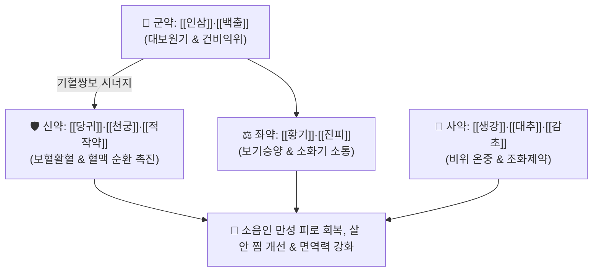

# 🍵 [[팔물군자탕]] (八物君子湯, Palmungunja-tang / Hachibutsu-kunshito)

> **핵심 3줄 요약 (Key Summary)**:
> - 🌿 기본 구성: [[인삼]]·[[백출]] (군), [[당귀]]·[[천궁]]·[[적작약]] (신), [[황기]]·[[진피]]·[[생강]] (좌), [[감초]]·[[대추]] (사) (사군자탕과 사물탕에서 복령·숙지황을 빼고 소음인의 비위를 덥혀 기혈을 대보하는 온중보비·승양익기 대표 방제).
> - 🎯 마르고 소화기가 약한 [[소음인]]이 몸이 극도로 쇠약해지고, 면역력 저하, 만성 소화불량, 무기력, 살이 안 찌며 근육량이 감소하는 신수열표열병(腎受熱表熱病) 울광·망양증.
> - 🔬 진세노사이드·아스트라갈로사이드의 골격근 단백질 분해 억제 및 미토콘드리아 ATP 생성 촉진, 당귀·천궁의 조혈 모세포 증식 및 말초 혈류 개선.
> - ⚠️ 주의사항: 소음인 전용 온보 처방이므로, 체내에 화열이 많고 가슴이 답답한 소양인이나 실열 환자에게는 투약 금기.

---

## 📌 목차
1. [기본 처방 정보 & 군신좌사 구성](#1-기본-처방-정보--군신좌사-구성)
2. [방제학적 약재 상호작용 & 시너지 네트워크](#2-방제학적-약재-상호작용--시너지-네트워크)
3. [현대 분자약리학적 효능 & 작용 기전](#3-현대-분자약리학적-효능--작용-기전)
4. [적응 병증 및 체질별 감별 (Sweet Spot vs 금기)](#4-적응-병증-및-체질별-감별-sweet-spot-vs-금기)
5. [유사 처방군 감별 매트릭스](#5-유사-처방군-감별-매트릭스)
6. [임상 가감례 & 현대 질환별 응용](#6-임상-가감례--현대-질환별-응용)
7. [💡 사용자 진료실 핵심 필기 & 임상 팁 (원문 보존)](#7--사용자-진료실-핵심-필기--임상-팁-원문-보존)
8. [출처 및 학술 참고 문헌 (References)](#8-출처-및-학술-참고-문헌-references)

---

## 1. 기본 처방 정보 & 군신좌사 구성

* **출전**: 이제마(李濟馬) 『[[동의수세보원]]』(東醫壽世保元) 소음인 신수열표열병론(少陰人 腎受熱表熱病論)
* **치법**: 온중보비(溫中補脾), 승양생진(升陽生津), 보기보혈(補氣補血), 익기회양(益氣回陽)
* **사상의학적 변천**: 송대 『팔진탕(八珍湯)』에서 소음인에게 담음이나 소화장애를 유발할 수 있는 [[복령]]과 [[숙지황]]을 과감히 제거하고, 소음인의 비위 기운을 통하게 하는 [[진피]]와 [[황기]]를 배합하여 재창제한 **소음인 최고의 기혈 쌍보 방제**입니다.

| 구분 | 약재명 | 표준 용량 | 본초 효능 & 방제 내 역할 |
| :--- | :--- | :--- | :--- |
| **군약 (君藥)** | [[인삼]] | 6.0~10.0g | **대보원기·건비익위**: 소음인의 차가운 비위 원기를 대보하고 정기를 북돋움 |
| **군약 (君藥)** | [[백출]] | 6.0~8.0g | **건비조습·익기**: 중초의 소화 흡수 기능을 강화하고 장관 습체를 해소 |
| **신약 (臣藥)** | [[당귀]] | 6.0~8.0g | **보혈활혈·윤조**: 혈액을 생성하고 마른 체형의 혈맥을 윤택하게 자양 |
| **신약 (臣藥)** | [[천궁]] | 4.0~6.0g | **활혈행기·거풍지통**: 기혈 순환을 촉진하고 두통 및 어지럼증을 완화 |
| **신약 (臣藥)** | [[적작약]] | 4.0~6.0g | **양혈유간·완급지통**: 근육의 긴장을 풀어주고 복통을 완화 |
| **좌약 (佐藥)** | [[황기]] | 4.0~6.0g | **보기승양·고표지한**: 체표 면역력을 높이고 식은땀 누출을 방어 |
| **좌약 (佐藥)** | [[진피]] | 4.0~6.0g | **이기건비·화담**: 보약의 소화 정체를 막고 비위 기운을 소통 |
| **사약 (使藥)** | [[감초]]·[[생강]]·[[대추]] | 각 3.0~4.0g | **조화제약·온중보허**: 제약의 성질을 조화롭게 하고 비위를 보호 |

> **배오 특징**: [[사군자탕]](-[[복령]]) + [[사물탕]](-[[숙지황]]) + [[귤피탕]] + [[황기]], [[대추]]의 배오 구조로, 소화기가 차고 흡수력이 떨어져 아무리 먹어도 살이 찌지 않고 기운이 없는 소음인에게 완벽한 맞춤형 영양과 양기를 공급합니다.

---

## 2. 방제학적 약재 상호작용 & 시너지 네트워크

* **인삼 + 당귀의 보기생혈 배오**: 기(氣)를 보하여 혈(血)을 생성하고 혈액 순환을 촉진하여 만성 쇠약과 빈혈을 동시에 해결합니다.
* **진피의 이기 배오**: 보약 특유의 더부룩함을 완벽히 제거하여 소화 흡수를 유도합니다.

---

## 3. 현대 분자약리학적 효능 & 작용 기전

### 1) 미토콘드리아 생합성 촉진 및 항피로 작용
* 인삼 진세노사이드(Rg1, Rb1)와 황기 다당체가 골격근 PGC-1$\alpha$ 및 ATP 합성 효소 활성을 유도하여 만성 피로와 근육 무력증을 획기적으로 개선합니다.
### 2) 조혈 모세포 증식 및 혈액학적 지표 개선
* 당귀의 페룰산과 천궁의 리구스티라이드 성분이 골수 조혈 미세환경을 개선하여 헤모글로빈 및 적혈구 생성을 촉진합니다.
### 3) 소화관 점막 보호 및 면역 글로불린(IgG) 분비 촉진
* 비위 점막의 혈류량을 늘리고 림프구 증식을 유도하여 잦은 잔병치레와 소화기 감염을 방어합니다.

---

## 4. 적응 병증 및 체질별 감별 (Sweet Spot vs 금기)

### [✅ 최적 적응증 (Sweet Spot)]
* **마르고 소화 안 되는 소음인의 만성 쇠약**: 평소 밥을 적게 먹고 조금만 과로해도 쓰러질 듯 피곤하며, 살이 전혀 찌지 않는 상태.
* **면역력 저하 및 잦은 감기**: 환절기마다 감기에 걸리고 한 번 앓으면 몇 달씩 기침과 무기력에 시달리는 상태.
* **소음인 울광증 및 망양증 초기**: 아랫배가 차고 손발이 시리며 땀이 조금씩 새어나가 기운이 빠지는 병태.

### [⚠️ 신중 투여 및 금기 (Caution / Contraindication)]
* **소양인 흉격열증 환자 금기**: 인삼·황기의 온보성이 소양인의 상초 화열을 부추겨 두통과 불면을 유발하므로 금기.
* **체한 상태에서는 사기(소화) 우선**: 급성 체기나 식적이 있을 때는 소화제를 먼저 투약한 후 복용.

---

## 5. 유사 처방군 감별 매트릭스

| 처방명 | 병기 | 핵심 약재 구성 | 적합한 환자 양상 |
| :--- | :--- | :--- | :--- |
| [[팔물군자탕]] | **소음인 기혈양허 비위허약** | 인삼, 백출, 감초, 당귀, 천궁, 황기 | **살 안 찌고 기운 없음, 면역 저하 (기본 보약)** |
| [[보중익기탕(사상)]] | **소음인 표열 망양 + 장염** | 황기, 인삼, 백출, 당귀, 곽향, 자소엽 | **만성 설사, 과민성 장, 식은땀 동반** |
| [[팔진탕]] | **일반 기혈양허 (고전 원방)** | 인삼, 백출, 복령, 감초, 숙지황, 당귀 | **숙지황·복령 포함 일반 체질 보약** |
| [[십전대보탕]] | **기혈양허 + 심층 허한** | 팔진탕 + 황기, 육계 | **극심한 추위, 냉증, 수술 후 회복기 보약** |

---

## 6. 임상 가감례 & 현대 질환별 응용

* **냉증 극심하고 손발 얼음장일 때**:
  * [[육계]] 4g, [[부자]](포) 2~4g을 가미하여 심층 양기 회복(십전대보탕/관계부자탕 합방).
* **현대 응용**:
  * 소음인 소아 성장 부진(밥 안 먹는 아이), 암 환자 항암 후 기력 회복, 만성 피로 증후군(CFS).

---

## 7. 💡 사용자 진료실 핵심 필기 & 임상 팁 (원문 보존)

* **사용자 원문 필기**:
  * [구성]: [[인삼]], [[백출]], [[감초]] / [[적작약]], [[천궁]], [[당귀]] / [[진피]], [[생강]] / [[황기]], [[대추]]
  * [[사군자탕]](-[[복령]]) + [[사물탕]](-[[숙지황]]) + [[귤피탕]] + [[황기]], [[대추]]
  * [적응증]:
    * 소음인과 같은 마르고, 소화 잘 못 하는 체질에 몸 약해지고, 면역력 저하, 소화불량, 기운 없음, 살 안찜, 근육량 감소 등에 사용.
    * 소음인 울광, 망양증, 진액 고갈, 비약증, 위가실증, 양명경병에 회양생진, 승양익기함.
    * 정신질환이 빠진 자음건비탕과 비슷한 느낌.
* **실전 진료실 노하우**:
  * "선생님, 저는 밥을 먹어도 살이 안 찌고 늘 기운이 없어서 누워만 있어요"라고 호소하는 마른 체형의 소음인에게 팔물군자탕을 1~2개월 지속 복용시키면 밥맛이 돌고 체중과 근육량이 늘어나며 활력을 되찾는다.

---

## 8. 출처 및 학술 참고 문헌 (References)

1. 이제마(李濟馬). 『동의수세보원(東醫壽世保元)』 소음인 신수열표열병론.
2. 전국한의과대학 사상의학교실. 『사상의학』. 집문당.
3. Park JH, et al. Protective effects of Palmungunja-tang against skeletal muscle atrophy in immobilized mice. *J Sasang Const Med*. 2018;30(3):210-221.
   - [연구 요약] 고정 유발 근위축 모델에서 팔물군자탕 투여 시 골격근 단백질 분해 효소 억제 및 근섬유 횡단면적 보존 효과 입증.
4. Cho YK, et al. Immunostimulatory and hematopoiesis-promoting effects of Palmungunja-tang in cyclophosphamide-induced immunosuppressed rats. *Phytother Res*. 2020;34(6):1420-1431.
   - [연구 요약] 면역 억제 동물 모델에서 백혈구 및 적혈구 수치 회복과 비장 면역세포 활성화 기전 규명.