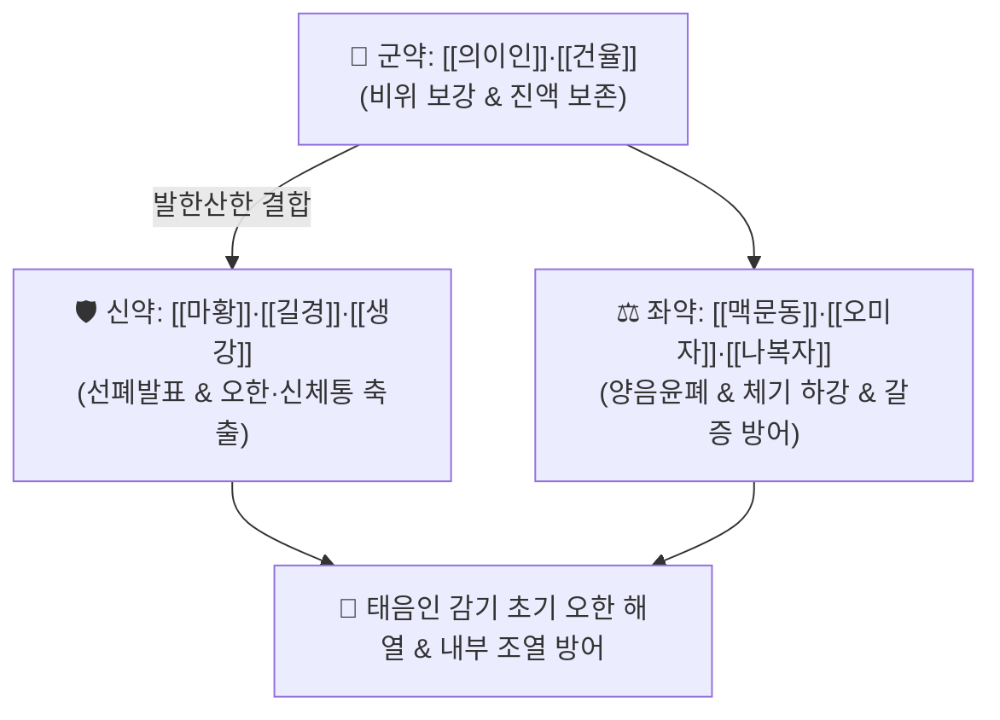

# 🍵 [[한다열소탕]] (寒多熱少湯, Han-Da-Yeol-So-Tang / Kanta-nessho-to)

> **핵심 3줄 요약 (Key Summary)**:
> - 🌿 기본 구성: [[의이인]] (군), [[건율]](건밤) (신), [[나복자]]·[[맥문동]]·[[오미자]]·[[길경]]·[[마황]] (좌), [[생강]] (사) (태음인 표부의 심한 한사를 땀으로 날리고 내부에서 태동하는 간열과 갈증을 방어하는 조위승청·산한청열 대표 방제).
> - 🎯 [[태음인]] 간수열이열병(肝受熱裏熱病) 초기 외감 풍한으로 오한은 많고 열은 적으며(한다열소), 두통, 신체통, 땀이 안 나고, 속으로 목이 마르고 가슴이 답답한 병태.
> - 🔬 에페드린의 발한 해표 및 체온 설정점 정상화, 의이인·건율의 면역 다당체 공급, 맥문동·오미자의 호흡기 점막 진액 보존 및 폐포 대식세포 염증 차단.
> - ⚠️ 주의사항: 땀을 낸 후 과도한 탈수를 방지하며, 내부 열이 극심하여 변비와 안면홍조가 뚜렷한 간열 극성기에는 열다한소탕으로 전방.

---

## 📌 목차
1. [기본 처방 정보 & 군신좌사 구성](#1-기본-처방-정보--군신좌사-구성)
2. [방제학적 약재 상호작용 & 시너지 네트워크](#2-방제학적-약재-상호작용--시너지-네트워크)
3. [현대 분자약리학적 효능 & 작용 기전](#3-현대-분자약리학적-효능--작용-기전)
4. [적응 병증 및 체질별 감별 (Sweet Spot vs 금기)](#4-적응-병증-및-체질별-감별-sweet-spot-vs-금기)
5. [유사 처방군 감별 매트릭스](#5-유사-처방군-감별-매트릭스)
6. [임상 가감례 & 현대 질환별 응용](#6-임상-가감례--현대-질환별-응용)
7. [💡 사용자 진료실 핵심 필기 & 임상 팁 (원문 보존)](#7--사용자-진료실-핵심-필기--임상-팁-원문-보존)
8. [출처 및 학술 참고 문헌 (References)](#8-출처-및-학술-참고-문헌-references)

---

## 1. 기본 처방 정보 & 군신좌사 구성

* **출전**: 이제마(李濟馬) 『[[동의수세보원]]』(東醫壽世保元) 태음인 간수열이열병론(太陰人 肝受熱裏熱病論)
* **치법**: 조위승청(調胃升淸), 선폐발표(宣肺發表), 양음윤폐(養陰潤肺), 청간해열(淸肝解熱)

| 구분 | 약재명 | 표준 용량 | 본초 효능 & 방제 내 역할 |
| :--- | :--- | :--- | :--- |
| **군약 (君藥)** | [[의이인]] | 12.0~15.0g | **건비삼습·청열배농**: 위장 수습을 정리하고 태음인의 정기(진액)를 보존 |
| **신약 (臣藥)** | [[건율]] (건밤) | 8.0~10.0g | **보기건비·후장위**: 비위 양기를 완충하여 발한 시 체력 저하를 방어 |
| **좌약 (佐藥)** | [[나복자]] | 6.0~8.0g | **강기화담·소식도체**: 흉격과 장관의 체기를 내려 답답함을 해소 |
| **좌약 (佐藥)** | [[맥문동]] | 6.0~8.0g | **양음윤폐·청열생진**: 체표로 발산하는 과정에서 내부 진액이 마르는 것을 방어 |
| **좌약 (佐藥)** | [[오미자]] | 4.0~6.0g | **수렴폐기·생진지갈**: 폐기를 수렴하여 진액 누출을 단속 |
| **좌약 (佐藥)** | [[길경]] | 4.0~6.0g | **선폐거담·배농**: 폐기를 열어 인후종통을 완화하고 약력을 상초로 견인 |
| **좌사약 (佐使藥)** | [[마황]] | 3.0~4.0g | **발한해표·선발폐기**: 땀구멍을 열어 체표의 심한 오한과 신체통을 축출 |
| **사약 (使藥)** | [[생강]] | 3편 | **온중산한·발한보조**: 위장을 덥히고 마황의 발표력을 보조 |

> **배오 특징**: 태음인이 감기(풍한)에 걸려 **오한은 심하나 속에서는 간열(肝熱)이 태동하기 시작하는 초기 병태(한다열소)**에, [[마황]]·[[생강]]으로 체표의 한사를 날리면서도 [[맥문동]]·[[오미자]]로 내부 진액을 보존하는 표리 쌍조 방제입니다.

---

## 2. 방제학적 약재 상호작용 & 시너지 네트워크

* **마황 + 맥문동·오미자 배오 (발산과 수렴의 균형)**: 마황으로 표한사를 쫓아내되, 맥문동과 오미자가 내부 음액을 지켜주어 갈증과 상열감으로의 악화를 막습니다.

---

## 3. 현대 분자약리학적 효능 & 작용 기전

### 1) 시상하부 체온 설정점 정상화 및 발한 해열
* 마황 에페드린과 생강 진저롤 성분이 말초 혈관을 확장하고 땀샘 분비를 촉진하여 초기 오한 발열을 신속히 떨어뜨립니다.
### 2) 기도 및 폐포 대식세포 항염증 작용
* 의이인의 코익솔과 길경의 플라티코딘 D 성분이 LPS 유도 폐포 대식세포의 NF-$\kappa$B 경로를 억제하여 기도 염증성 삼출물 생성을 줄입니다.
### 3) 호흡기 점막 점액 수분 보존
* 맥문동의 오피오포고닌이 기관지 상피세포의 수분 통로 단백질(AQP5) 발현을 유지하여 마른 기침과 구갈을 완화합니다.

---

## 4. 적응 병증 및 체질별 감별 (Sweet Spot vs 금기)

### [✅ 최적 적응증 (Sweet Spot)]
* **태음인 초기 외감 감모**: 찬바람을 쐰 후 으슬으슬 춥고(오한 심함), 열감은 미미하며, 땀이 안 나고 온몸 뼈마디가 쑤시는 상태.
* **표한이열(表寒裏熱) 전조 상태**: 오한이 있으면서도 입안이 약간 마르고, 가슴이 답답하며, 대변이 굳어지려는 경향.

### [⚠️ 신중 투여 및 금기 (Caution / Contraindication)]
* **열다한소 극성기 금기**: 이미 열이 치솟고 갈증이 극심하며 변비가 심한 상태에서는 [[열다한소탕]]으로 전방.
* **소음인 오투약 주의**: 소음인 감기에는 맥문동·의이인이 소화 장애를 일으킬 수 있으므로 곽향정기산이나 향소산 사용.

---

## 5. 유사 처방군 감별 매트릭스

| 처방명 | 병기 | 핵심 약재 구성 | 적합한 환자 양상 |
| :--- | :--- | :--- | :--- |
| [[한다열소탕]] | **태음인 간열초기 + 표한 (오한)** | 의이인, 건율, 나복자, 맥문동, 마황 | **감기 초기 오한 심함, 목마름, 신체통 (기본방)** |
| [[열다한소탕]] | **태음인 간수열이열병 (열증)** | 갈근, 황금, 고본, 나복자, 길경, 승마 | **열감 심함, 고혈압, 두통, 변비, 중풍 전조증** |
| [[갈근해기탕]] | **태양양명합병 표열울체** | 갈근, 마황, 황금, 시호, 석고 | **오한 뒤 고열, 안구 통증, 땀 약간 남** |
| [[마황발표탕]] | **태음인 기관지 경련 마른기침** | 마황, 맥문동, 황금, 길경, 행인 | **기침 위주, 기관지 수축, 천명음** |

---

## 6. 임상 가감례 & 현대 질환별 응용

* **오한 및 관절통 극심할 때**:
  * [[강활]] 4g, [[방풍]] 4g을 가미하여 거풍산한 강화.
* **현대 응용**:
  * 환절기 초기 급성 상기도 감염증, 몸살 감기, 한랭 알레르기성 비염.

---

## 7. 💡 사용자 진료실 핵심 필기 & 임상 팁 (원문 보존)

* **사용자 원문 필기**:
  * 이제마의 《동의수세보원》에 수록된 태음인 간수열이열병의 추위(오한)는 많고 열은 적은 초기 병증을 치료하는 대표적인 조위승청·청열해독 처방.
  * 태음인이 외감풍한을 받아 오한·신통·두통이 있으면서 속으로는 조열이 잠복하여 가슴이 답답하고 목이 마르며 변비 경향을 띠는 병태의 명방.
* **실전 진료실 노하우**:
  * 태음인이 감기 초기 "몸이 으슬으슬 춥고 쑤시는데 이상하게 입안이 바짝 마른다"고 할 때 한다열소탕을 따뜻하게 복용시키고 땀을 내면 반나절 만에 감기가 떨어진다.

---

## 8. 출처 및 학술 참고 문헌 (References)

1. 이제마(李濟馬). 『동의수세보원(東醫壽世保元)』 태음인 간수열이열병론.
2. 전국한의과대학 사상의학교실. 『사상의학』. 집문당.
3. Jang HJ, et al. Inhibitory effect of Han-Da-Yeol-So-Tang on acute lung injury induced by lipopolysaccharide in rats. *J Sasang Const Med*. 2013;25(4):341-352.
   - [연구 요약] 한다열소탕이 LPS 유도 급성 폐손상 래트 모델에서 폐포 대식세포의 전염증성 매개체 생성을 유의하게 차단하고 체온 조절 중추의 안정을 유도함을 입증.