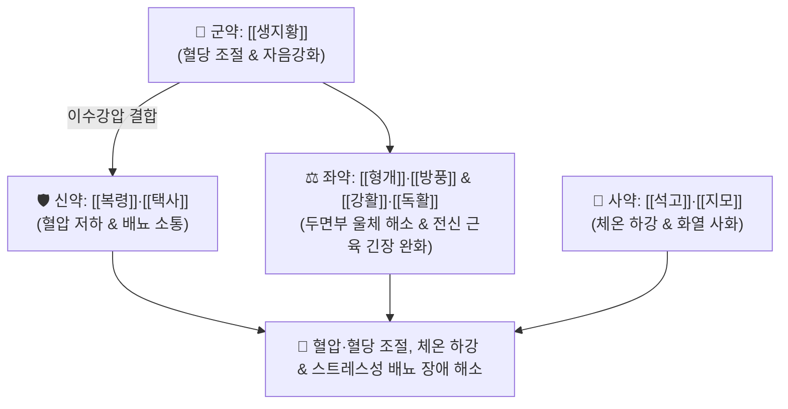

# 🍵 [[형방사백산]] (荊防瀉白散, Hyeongbangsabaek-san / Keibo-shahakusan)

> **핵심 3줄 요약 (Key Summary)**:
> - 🌿 기본 구성: [[생지황]] (군), [[복령]]·[[택사]] (신), [[형개]]·[[방풍]]·[[강활]]·[[독활]] (좌), [[석고]]·[[지모]] (사) (소양인의 두면·상지부 순환 울체를 풀고 전신 근육 긴장을 완화하며 혈당·혈압·체온을 하강시키는 청열사화·승양발표 대표 방제).
> - 🎯 건장하고 생기 있는 [[소양인]]이 성인병, 당뇨, 고혈압, 체온 상승, 스트레스 시 소변불리(오줌이 안 나올 것 같음), 목·어깨·허리 근육 강직을 겪는 비수보한표한병(脾受保寒表寒病).
> - 🔬 생지황 [[카탈폴]]의 혈당 조절 및 췌장 보호, 복령·택사의 혈압 강하 및 이뇨, 강활·독활의 TRPV1/COX-2 억제를 통한 전신 근육 긴장 완화, 석고·지모의 체온 하강.
> - ⚠️ 주의사항: 석고·지모·생지황의 한량성 처방이므로, 소화기가 차고 마른 소음인에게는 절대 투약 금기.

---

## 📌 목차
1. [기본 처방 정보 & 군신좌사 구성](#1-기본-처방-정보--군신좌사-구성)
2. [방제학적 약재 상호작용 & 시너지 네트워크](#2-방제학적-약재-상호작용--시너지-네트워크)
3. [현대 분자약리학적 효능 & 작용 기전](#3-현대-분자약리학적-효능--작용-기전)
4. [적응 병증 및 체질별 감별 (Sweet Spot vs 금기)](#4-적응-병증-및-체질별-감별-sweet-spot-vs-금기)
5. [유사 처방군 감별 매트릭스](#5-유사-처방군-감별-매트릭스)
6. [임상 가감례 & 현대 질환별 응용](#6-임상-가감례--현대-질환별-응용)
7. [💡 사용자 진료실 핵심 필기 & 임상 팁 (원문 보존)](#7--사용자-진료실-핵심-필기--임상-팁-원문-보존)
8. [출처 및 학술 참고 문헌 (References)](#8-출처-및-학술-참고-문헌-references)

---

## 1. 기본 처방 정보 & 군신좌사 구성

* **출전**: 이제마(李濟馬) 『[[동의수세보원]]』(東醫壽世保元) 소양인 비수보한표한병론(少陽人 脾受保寒表寒病論)
* **치법**: 청열사화(淸熱瀉火), 승양발표(升陽發表), 이수강압(利水降壓), 강당제열(降糖除熱)

| 구분 | 약재명 | 표준 용량 | 본초 효능 & 방제 내 역할 |
| :--- | :--- | :--- | :--- |
| **군약 (君藥)** | [[생지황]] | 8.0~16.0g | **청열양혈·강당생진**: 혈당을 저하(조절)하고 소양인의 고갈된 신수와 진액을 보충 |
| **신약 (臣藥)** | [[복령]]·[[택사]] | 각 4.0~6.0g | **이수삼습·강압**: 혈압을 저하하고 하초의 삼습 배출로 배뇨 곤란 해소 |
| **좌약 (佐藥)** | [[형개]]·[[방풍]] | 각 4.0~6.0g | **거풍투표·순환개선**: 두면부 및 상지부의 기혈 순환 울체를 시원하게 풀어줌 |
| **좌약 (佐藥)** | [[강활]]·[[독활]] | 각 4.0~6.0g | **거풍통락·완급지통**: 목, 어깨, 등, 허리, 골반, 하지 근육의 긴장과 부종 완화 |
| **사약 (使藥)** | [[석고]]·[[지모]] | 각 4.0~6.0g | **사화제번·강온**: 체온을 하강시키고 속에서 솟구치는 화열을 진압 |

> **배오 특징**: 《동의보감》 사백산의 구조를 소양인 생리에 맞춰 전면 재창제한 처방입니다. [[생지황]](혈당 조절) + [[복령]]·[[택사]](혈압 조절) + [[형개]]·[[방풍]](상초 순환) + [[강활]]·[[독활]](전신 근육 이완) + [[석고]]·[[지모]](체온 강하)의 5대 약대(藥對)가 완벽한 하모니를 이루어 **소양인의 대사증후군과 스트레스성 신경 증상**을 단번에 다스립니다.

---

## 2. 방제학적 약재 상호작용 & 시너지 네트워크

* **생지황 + 석고·지모 배오**: 체내에 가득 찬 화열을 끄고 혈당 스파이크와 체온 상승을 안정화합니다.
* **복령·택사 + 강활·독활 배오**: 굳어진 등·허리 근육을 풀고 하초 수액 대사를 열어 스트레스성 소변 차폐를 해소합니다.

---

## 3. 현대 분자약리학적 효능 & 작용 기전

### 1) 인슐린 감수성 개선 및 혈당 강하
* 생지황의 카탈폴과 지모의 티모사포닌 성분이 간조직의 당신생(Gluconeogenesis)을 억제하고 말초 조직의 포도당 흡수를 촉진합니다.
### 2) 혈관 내피 이완 및 혈압 강하 작용
* 복령의 파키만(Pachyman)과 택사의 알리스몰 성분이 신장 레닌-안지오텐신(RAAS) 축의 과활성을 억제하여 혈압을 강하시킵니다.
### 3) 신경근 긴장 완화 및 진통 항염
* 강활·독활의 쿠마린 성분이 척수 신경근의 TRPV1 수용체 활성을 억제하여 뒷목과 어깨, 허리의 근육 뭉침을 신속히 이완합니다.

---

## 4. 적응 병증 및 체질별 감별 (Sweet Spot vs 금기)

### [✅ 최적 적응증 (Sweet Spot)]
* **건장한 소양인의 성인병(대사증후군)**: 체격이 좋고 열이 많은 소양인이 고혈압, 당뇨, 체온 상승, 안면홍조를 겪는 상태.
* **스트레스성 배뇨 장애**: 긴장하거나 스트레스를 받으면 소변이 잘 안 나오고 잔뇨감이 드는 상태.
* **경항부 및 전신 근육 강직**: 목, 어깨, 등, 허리 근육이 판자처럼 굳어 뻐근하고 무거운 상태.

### [⚠️ 신중 투여 및 금기 (Caution / Contraindication)]
* **소음인 비위허한 환자 금기**: 차가운 약성이 소음인의 소화기를 상하게 하므로 금기.
* **혈압·혈당 모니터링**: 혈당 및 혈압 강하 작용이 있으므로 양약 병용 시 수치를 정기적으로 체크.

---

## 5. 유사 처방군 감별 매트릭스

| 처방명 | 병기 | 핵심 약재 구성 | 적합한 환자 양상 |
| :--- | :--- | :--- | :--- |
| [[형방사백산]] | **소양인 표한이열 성인병** | 생지황, 복령, 택사, 형개, 방풍, 석고, 지모 | **고혈압, 당뇨, 체온 상승, 배뇨 곤란 (기본방)** |
| [[독활지황탕]] | **소양인 신음부족 청양불승** | 숙지황, 산수유, 복령, 택사, 독활, 방풍 | **성기능 저하, 정력 감퇴, 만성 피로 위주** |
| [[양격산화탕]] | **소양인 흉격열증 + 변비** | 생지황, 연교, 치자, 박하, 석고 | **가슴 답답함, 변비, 구내염, 급성 화열** |
| [[지황백호탕]] | **소양인 위열옹성 극열** | 생지황, 석고, 지모, 방풍, 독활 | **39도 고열, 물 끝없이 마심, 맥홍대** |

---

## 6. 임상 가감례 & 현대 질환별 응용

* **기침 및 호흡 곤란 동반 시**:
  * [[패모]] 4g, [[상백피]] 4g을 가미하여 선폐지해.
* **현대 응용**:
  * 초기 당뇨병 고혈당 조절, 본태성 고혈압 두통, 긴장성 근육통 및 전립선염 배뇨 장애.

---

## 7. 💡 사용자 진료실 핵심 필기 & 임상 팁 (원문 보존)

* **사용자 원문 필기**:
  * [구성]: [[생지황]] / [[복령]], [[택사]] / [[형개]], [[방풍]] / [[강활]], [[독활]] / [[석고]], [[지모]]
    * [[생지황]]: 혈당 저하(조절)
    * [[복령]], [[택사]]: 혈압 저하
    * [[형개]], [[방풍]]: 두면상지부 수환 울체 풀어줌
    * [[강활]], [[독활]]: 목, 어깨, 등, 허리, 골반, 하지근육 긴장, 부음 완화
    * [[석고]], [[지모]]: 체온 하강
  * [적응증]:
    * 소양인과 같은 건장하고 생기 있는 체질에 성인병, 당뇨, 고혈압, 체온 상승 등에 사용.
    * 스트레스 받으면 오줌 안나올 것 같은 [[소양인]]에게 사용.
* **실전 진료실 노하우**:
  * 소양인 환자가 "혈압이 오르고 목어깨가 굳으면서 스트레스만 받으면 소변이 똑똑 끊긴다"고 할 때 형방사백산을 처방하면 1주일 만에 어깨가 가벼워지고 소변이 시원하게 뚫린다.

---

## 8. 출처 및 학술 참고 문헌 (References)

1. 이제마(李濟馬). 『동의수세보원(東醫壽世保元)』 소양인 비수보한표한병론.
2. 전국한의과대학 사상의학교실. 『사상의학』. 집문당.
