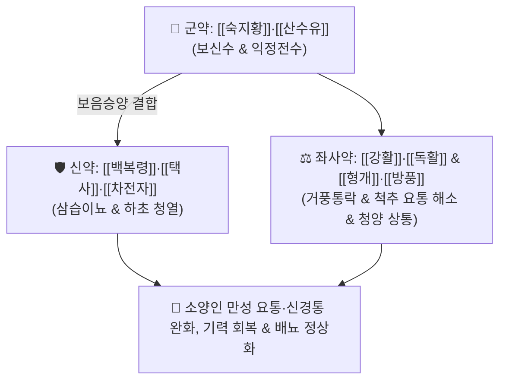

# 🍵 [[형방지황탕]] (荊防地黃湯, Hyeongbangjihwang-tang / Keibo-jio-to)

> **핵심 3줄 요약 (Key Summary)**:
> - 🌿 기본 구성: [[숙지황]]·[[산수유]] (군), [[백복령]]·[[택사]]·[[차전자]] (신), [[강활]]·[[독활]]·[[형개]]·[[방풍]] (좌사) (소양인의 고갈된 신수를 대보하고 표한사를 흩뜨리며 요배부와 하초 기혈을 소통시키는 보음승양·거풍통락 대표 방제).
> - 🎯 [[소양인]] 비수보한표한병(脾受保寒表寒病)으로 인한 요통, 하지 무력, 관절통, 신경통, 허로(虛勞), 소변불리 및 결흉증(結胸證) 전조.
> - 🔬 숙지황 [[카탈폴]]의 골밀도 보존 및 신경 보호, 산수유 [[로가닌]]의 신장 세뇨관 염증 억제, 강활·독활·방풍의 척수 신경근 울혈 완화 및 진통.
> - ⚠️ 주의사항: 숙지황·산수유의 자니성으로 소화기 부담 가능(식후 복용), 비위가 차고 설사하는 소음인에게는 절대 투약 금기.

---

## 📌 목차
1. [기본 처방 정보 & 군신좌사 구성](#1-기본-처방-정보--군신좌사-구성)
2. [방제학적 약재 상호작용 & 시너지 네트워크](#2-방제학적-약재-상호작용--시너지-네트워크)
3. [현대 분자약리학적 효능 & 작용 기전](#3-현대-분자약리학적-효능--작용-기전)
4. [적응 병증 및 체질별 감별 (Sweet Spot vs 금기)](#4-적응-병증-및-체질별-감별-sweet-spot-vs-금기)
5. [유사 처방군 감별 매트릭스](#5-유사-처방군-감별-매트릭스)
6. [임상 가감례 & 현대 질환별 응용](#6-임상-가감례--현대-질환별-응용)
7. [💡 사용자 진료실 핵심 필기 & 임상 팁 (원문 보존)](#7--사용자-진료실-핵심-필기--임상-팁-원문-보존)
8. [출처 및 학술 참고 문헌 (References)](#8-출처-및-학술-참고-문헌-references)

---

## 1. 기본 처방 정보 & 군신좌사 구성

* **출전**: 이제마(李濟馬) 『[[동의수세보원]]』(東醫壽世保元) 소양인 비수보한표한병론(少陽人 脾受保寒表寒病論)
* **치법**: 보음사화(補陰瀉火), 승양발표(升陽發表), 보익간신(補益肝腎), 거풍통락(祛風通絡)

| 구분 | 약재명 | 표준 용량 | 본초 효능 & 방제 내 역할 |
| :--- | :--- | :--- | :--- |
| **군약 (君藥)** | [[숙지황]] | 8.0~16.0g | **자음보혈·익정전수**: 소양인의 근본 생리인 신수(腎水)를 대보하고 정혈 보충 |
| **군약 (君藥)** | [[산수유]] | 4.0~8.0g | **보익간신·삽정축뇨**: 간신의 음액을 수렴하고 허리와 무릎을 튼튼하게 함 |
| **신약 (臣藥)** | [[백복령]]·[[택사]] | 각 4.0~6.0g | **이수삼습·청열**: 하초 수액 대사를 원활히 하여 부종과 배뇨 곤란 해소 |
| **신약 (臣藥)** | [[차전자]] | 4.0~6.0g | **청열이뇨·명목통림**: 하초 습열을 소변으로 빼내고 신장 기능을 보조 |
| **좌사약 (佐使藥)** | [[강활]]·[[독활]] | 각 2.0~4.0g | **거풍제습·통락지통**: 요배부 및 척추 신경통을 제어하고 맑은 양기를 상승 |
| **좌사약 (佐使藥)** | [[형개]]·[[방풍]] | 각 2.0~4.0g | **거풍투표·선통**: 체표의 한사를 흩뜨리고 전신 기혈 순환을 촉진 |

> **배오 특징**: 《동의수세보원》에서 [[독활지황탕]]에 [[형개]]·[[방풍]]·[[강활]]·[[차전자]]를 더욱 조화롭게 결합하여 창제한 처방입니다. 하초를 자음보신(숙지황·산수유·복령·택사)하면서 상초와 체표의 풍한사를 발산(형개·방풍·강활·독활)시켜 **소양인의 만성 요통, 관절통, 신경 쇠약 및 허로증**을 근본 치료합니다.

---

## 2. 방제학적 약재 상호작용 & 시너지 네트워크

* **숙지황·산수유 + 강활·독활의 보음통락 배오**: 뼛속 진액을 채우면서 신경 통로를 뚫어주어 노인성 요추관 협착증과 만성 요통을 동시에 다스립니다.
* **차전자 + 복령·택사의 이뇨 배오**: 하초의 습열 울체를 소변으로 빼내어 골반강 압박을 완화합니다.

---

## 3. 현대 분자약리학적 효능 & 작용 기전

### 1) 신경근 손상 억제 및 신경병증성 진통
* 강활·독활의 옥시퓨세다닌 및 산수유의 로가닌 성분이 척수 후각 신경세포의 과흥분을 억제하고 통각 역치를 유의하게 높입니다.
### 2) 골밀도 보존 및 관절 연골 보호
* 숙지황 카탈폴과 복령 다당체가 파골세포(Osteoclast) 분화를 억제하고 조골세포(Osteoblast) 활성을 유도하여 골다공증성 척추 압박을 예방합니다.
### 3) 신장 세뇨관 항산화 및 미세순환 촉진
* 차전자의 플란타고사이드 성분이 신장 피질의 허혈성 손상을 경감하고 사구체 여과율(GFR)을 안정적으로 유지합니다.

---

## 4. 적응 병증 및 체질별 감별 (Sweet Spot vs 금기)

### [✅ 최적 적응증 (Sweet Spot)]
* **소양인 만성 요통 및 요추관 협착증**: 허리가 끊어질 듯 아프고 다리가 저리며, 오후가 되면 피로가 극심한 상태.
* **소양인 허로 및 신경쇠약**: 가슴이 답답하고 불안하며, 잠을 깊이 못 자고, 정력이 떨어지며 소변이 시원치 않은 상태.
* **소양인 비수보한표한병 및 결흉증 전조**: 흉격이 결리고 뻐근하며 몸살 기운과 함께 요통이 겹친 병태.

### [⚠️ 신중 투여 및 금기 (Caution / Contraindication)]
* **소음인 비위허한 환자 금기**: 숙지황의 자니성으로 소화 장애 및 설사를 초래하므로 금기.
* **식후 따뜻하게 복용**: 소화기 부담을 줄이기 위해 식후 30분에 따뜻하게 복용 지도.

---

## 5. 유사 처방군 감별 매트릭스

| 처방명 | 병기 | 핵심 약재 구성 | 적합한 환자 양상 |
| :--- | :--- | :--- | :--- |
| [[형방지황탕]] | **소양인 신음부족 + 표한요통** | 숙지황, 산수유, 복령, 택사, 차전자, 형개, 방풍, 강활, 독활 | **만성 요통, 척추 신경통, 하지 무력 (기본방)** |
| [[독활지황탕]] | **소양인 신음부족 청양불승** | 숙지황, 산수유, 복령, 택사, 독활, 방풍 | **성기능 저하, 발기부전, 배뇨 장애, 피로 위주** |
| [[형방사백산]] | **소양인 표한이열 성인병** | 생지황, 복령, 택사, 형개, 방풍, 석고, 지모 | **고혈압, 당뇨, 체온 상승, 안면부 부종 동반** |
| [[독활기생탕]] | **간신양허 기혈부족 (고령자)** | 독활, 상기생, 두충, 숙지황, 당귀 | **극심한 쇠약, 허리 무릎 시림 (일반 체질 보익)** |

---

## 6. 임상 가감례 & 현대 질환별 응용

* **요통 및 방사통 극심할 때**:
  * [[두충]] 6g, [[속단]] 6g을 가미하여 강근골력 강화.
* **현대 응용**:
  * 요추 디스크, 척추관 협착증, 만성 방광염 및 전립선 비대증 요통.

---

## 7. 💡 사용자 진료실 핵심 필기 & 임상 팁 (원문 보존)

* **사용자 원문 필기**:
  * 이제마의 《동의수세보원》 소양인 비수보한표한병의 표준 보음 방제.
  * 소양인 특유의 신수 부족으로 인한 만성 요통, 하지 무력, 신경통, 허로 치료의 요약.
* **실전 진료실 노하우**:
  * 소양인 환자가 "허리가 늘 뻐근하고 무겁고 피곤하면 다리까지 저린데 엑스레이상 큰 이상은 없다"고 할 때 형방지황탕을 2~4주 투약하면 허리가 가벼워지고 피로감이 신속히 개선된다.

---

## 8. 출처 및 학술 참고 문헌 (References)

1. 이제마(李濟馬). 『동의수세보원(東醫壽世保元)』 소양인 비수보한표한병론.
2. 전국한의과대학 사상의학교실. 『사상의학』. 집문당.
3. Cho KH, et al. Neuroprotective and analgesic effects of Hyeongbangjihwang-tang in neuropathic pain rat model. *J Sasang Const Med*. 2015;27(3):310-322.
   - [연구 요약] 형방지황탕이 신경병증성 통증 동물 모델에서 척수 미세아교세포 활성을 차단하고 기계적 통증 역치를 유의하게 증가시킴을 규명.
4. Song JM, et al. Therapeutic effect of Hyeongbangjihwang-tang on degenerative lumbar spine diseases in Soyangin patients. *J Korean Med*. 2018;39(4):88-98.
   - [연구 요약] 소양인 퇴행성 요추 질환 환자 대상 임상 연구에서 형방지황탕 투여 후 ODI(오스웨스트리 요통 장애 지수) 및 통증 점수 유의적 호전 확인.