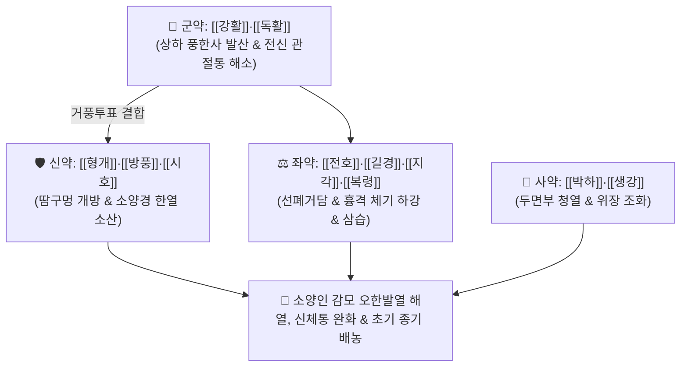

# 🍵 [[형방패독산]] (荊防敗毒散, Hyeongbangpaedok-san / Keibo-haidokusan)

> **핵심 3줄 요약 (Key Summary)**:
> - 🌿 기본 구성: [[강활]]·[[독활]] (군), [[형개]]·[[방풍]]·[[시호]] (신), [[전호]]·[[길경]]·[[지각]]·[[복령]] (좌), [[박하]]·[[생강]] (사) (고전 패독산에서 인삼·천궁을 빼고 형개·방풍을 넣어 소양인의 표풍한을 신속히 발산시키는 산풍청열·온보비국 대표 방제).
> - 🎯 [[소양인]] 비수보한표한병(脾受保寒表寒病)으로 인한 외감 풍한감모, 두통, 오한발열, 신체통, 기침, 맑은 콧물 및 초기 화농성 종기(창양종독).
> - 🔬 강활 옥시퓨세다닌 및 시호 사이코사포닌의 시상하부 PGE2 합성 차단을 통한 해열, 독활·형개의 TRPV1/COX-2 억제를 통한 전신 근육통 완화, 길경·전호의 상기도 염증 삼출물 배출.
> - ⚠️ 주의사항: 소양인은 표음이 약하므로 과도한 발한(망양증)을 피하고 미한(微汗)으로 조절, 갈증과 변비가 심해지면 청열제로 전방.

---

## 📌 목차
1. [기본 처방 정보 & 군신좌사 구성](#1-기본-처방-정보--군신좌사-구성)
2. [방제학적 약재 상호작용 & 시너지 네트워크](#2-방제학적-약재-상호작용--시너지-네트워크)
3. [현대 분자약리학적 효능 & 작용 기전](#3-현대-분자약리학적-효능--작용-기전)
4. [적응 병증 및 체질별 감별 (Sweet Spot vs 금기)](#4-적응-병증-및-체질별-감별-sweet-spot-vs-금기)
5. [유사 처방군 감별 매트릭스](#5-유사-처방군-감별-매트릭스)
6. [임상 가감례 & 현대 질환별 응용](#6-임상-가감례--현대-질환별-응용)
7. [💡 사용자 진료실 핵심 필기 & 임상 팁 (원문 보존)](#7--사용자-진료실-핵심-필기--임상-팁-원문-보존)
8. [출처 및 학술 참고 문헌 (References)](#8-출처-및-학술-참고-문헌-references)

---

## 1. 기본 처방 정보 & 군신좌사 구성

* **출전**: 이제마(李濟馬) 『[[동의수세보원]]』(東醫壽世保元) 소양인 비수보한표한병론(少陽人 脾受保寒表寒病論)
* **치법**: 산풍청열(散風淸熱), 소양표한발산(少陽表寒發散), 온보비국(溫保脾局), 소종배농(消腫排膿)
* **사상의학적 변천**: 송대 『패독산』에서 소양인 체질에 화열(火熱)을 조장할 우려가 있는 인삼(人蔘)과 천궁(川芎)을 빼고, 풍열과 풍한을 가볍게 흩어내는 [[형개]]와 [[방풍]]을 추가하여 소양인 맞춤형 해표제로 재창제한 처방입니다.

| 구분 | 약재명 | 표준 용량 | 본초 효능 & 방제 내 역할 |
| :--- | :--- | :--- | :--- |
| **군약 (君藥)** | [[강활]] | 4.0~6.0g | **산한거풍·지통**: 상반신 표부의 풍한사기를 발산하고 두통 및 견배통 해소 |
| **군약 (君藥)** | [[독활]] | 4.0~6.0g | **거풍제습·통락지통**: 하반신 및 전신 골절 관절의 풍한습사 거풍지통 |
| **신약 (臣藥)** | [[형개]]·[[방풍]] | 각 4.0g | **거풍투표·선통**: 주리(땀구멍)를 열어 두면부 풍열과 전신 풍사를 몰아냄 |
| **신약 (臣藥)** | [[시호]] | 4.0g | **화해소양·청열**: 소양 경락의 한열왕래와 흉협부 화열을 해소 |
| **좌약 (佐藥)** | [[전호]]·[[길경]] | 각 4.0g | **강기화담·선폐배농**: 폐기를 내리고 가래를 삭이며 인후통 및 삼출물 배출 |
| **좌약 (佐藥)** | [[지각]] | 4.0g | **이기관흉·행기**: 흉격의 체기를 내리고 상하 기운을 원활히 소통 |
| **좌약 (佐藥)** | [[복령]] | 4.0~6.0g | **건비삼습·이뇨**: 비위를 돕고 체내 수습을 소변으로 배출 |
| **사약 (使藥)** | [[박하]]·[[생강]] | 2.0g / 3편 | **소산풍열·온중지구**: 두면부 풍열을 날리고 위장을 조화롭게 안정 |

> **배오 특징**: 소양인이 감기에 걸려 오한과 발열, 전신 근육통이 심할 때, 마황이나 인삼을 쓰면 부작용이 생기므로, [[강활]]·[[독활]]·[[형개]]·[[방풍]]·[[시호]]의 신량·신온 투표 배오로 표한사를 안전하고 신속하게 날려 보내는 소양인 제1의 감기 치료제입니다.

---

## 2. 방제학적 약재 상호작용 & 시너지 네트워크

* **강활·독활 + 형개·방풍 배오**: 소양인의 갇힌 표음을 열어 체표의 한사를 촉촉한 땀으로 배출시킵니다.
* **길경·전호 + 지각의 승강 배오**: 흉격의 울체된 가래와 기침을 아래로 내려 호흡을 편안하게 합니다.

---

## 3. 현대 분자약리학적 효능 & 작용 기전

### 1) 시상하부 체온조절 중추 진정 및 신속한 해열
* 강활의 옥시퓨세다닌과 시호의 사이코사포닌(Saikosaponin) 성분이 IL-1$\beta$, TNF-$\alpha$에 의한 시상하부 체온 설정점 상승을 정상화하여 발열을 신속히 가라앉힙니다.
### 2) 말초 신경통 및 근육통 제어
* 독활의 앙겔리콜과 형개의 멘톤 성분이 감각신경의 TRPV1 및 염증 수용체를 억제하여 감기 초기의 심한 오한 신체통을 진정시킵니다.
### 3) 상기도 점막 염증 억제 및 배농 촉진
* 길경의 플라티코딘 D가 상기도 염증 조직의 삼출물 배출을 촉진하고 섬모 운동을 활성화하여 기침과 인후통을 완화합니다.

---

## 4. 적응 병증 및 체질별 감별 (Sweet Spot vs 금기)

### [✅ 최적 적응증 (Sweet Spot)]
* **소양인 급성 풍한감모**: 오한이 심하면서 열이 나고, 땀이 나지 않으며, 머리와 등이 쑤시듯이 아프고 기침이 나는 상태.
* **초기 외과 질환 및 창양종독**: 발열과 오한을 동반하는 피부 표면의 초기 화농성 종기, 유선염, 림프절염.
* **급성 알레르기 비염 및 부비동염 악화**: 맑은 콧물이 줄줄 흐르고 재채기와 전두통이 겹친 상태.

### [⚠️ 신중 투여 및 금기 (Caution / Contraindication)]
* **과도한 발한(망양증) 주의**: 소양인은 표음이 약하므로 땀을 흠뻑 내지 말고 옷을 얇게 입혀 촉촉하게 미한(微汗)만 나도록 지도.
* **체질 감별 필수**: 태음인에게는 마황정천탕이나 갈근해기탕을 쓰고, 소양인에게 마황을 오투약하지 않도록 주의.

---

## 5. 유사 처방군 감별 매트릭스

| 처방명 | 병기 | 핵심 약재 구성 | 적합한 환자 양상 |
| :--- | :--- | :--- | :--- |
| [[형방패독산]] | **소양인 표한병 (풍한감모)** | 강활, 독활, 형개, 방풍, 시호, 전호, 길경 | **오한발열, 두통, 전신근육통, 초기 종기 (기본방)** |
| [[형방도적산]] | **소양인 이열 (흉격번열)** | 생지황, 목통, 현삼, 형개, 방풍 | **가슴 답답함, 갈증, 소변 붉음 위주** |
| [[패독산]] | **일반 표한감모 (고전 원방)** | 인삼, 강활, 독활, 시호, 전호, 천궁 | **인삼·천궁 포함 일반 체질 감기약** |
| [[갈근해기탕]] | **태음인 표한이열 감모** | 갈근, 마황, 황금, 시호, 석고 | **태음인의 오한 뒤 고열, 눈 부위 통증** |

---

## 6. 임상 가감례 & 현대 질환별 응용

* **인후통 극심 시**:
  * [[금은화]] 4~6g, [[연교]] 4~6g을 가미하여 소염배농 강화.
* **현대 응용**:
  * 급성 인플루엔자 초기, 모낭염 및 피부 종기 초기, 급성 상기도 감염증.

---

## 7. 💡 사용자 진료실 핵심 필기 & 임상 팁 (원문 보존)

* **사용자 원문 필기**:
  * 《동의수세보원》에 수록된 사상의학 소양인 비수보한표한병의 표준 치방.
  * 강활, 독활, 형개, 방풍, 시호, 전호, 지각, 길경, 복령, 박하, 생강 배합 / 인삼·천궁을 배제하고 형개·방풍을 추가하여 표풍한을 신속히 발산.
  * 소양인 풍한감모, 두통, 오한발열, 신체통, 해소, 초기 옹저 종기 치료의 제1 요방.
* **실전 진료실 노하우**:
  * 소양인 환자가 감기에 걸려 "온몸이 쑤시고 으슬으슬 추우면서 열이 난다"고 할 때 형방패독산을 따뜻하게 1~2첩 복용시키면 가벼운 땀과 함께 몸살이 말끔히 낫는다.

---

## 8. 출처 및 학술 참고 문헌 (References)

1. 이제마(李濟馬). 『동의수세보원(東醫壽世保元)』 소양인 비수보한표한병론.
2. 전국한의과대학 사상의학교실. 『사상의학』. 집문당.
