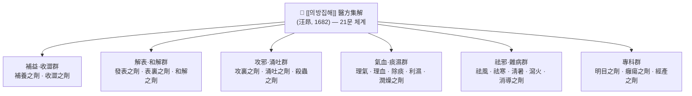
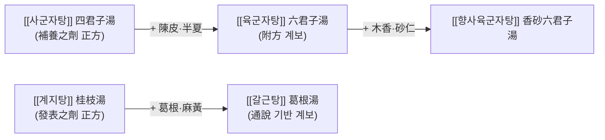

# 📖 [[의방집해]] (醫方集解, Yi Fang Ji Jie)

> **핵심 3줄 요약 (Key Summary)**:
> - 🌿 **모체/기원**: 청대(淸代) 초기 의가 [[왕앙]](汪昻, 자 訒庵)이 1682년(康熙 21년)에 간행한 **방서(方書)·처방집**으로, [[의방고]](醫方考)의 方論 전통을 계승하면서 21문(門) 분류 체계와 正方·附方 편제를 확립한 처방집대성이다.
> - 🎯 **임상 최적 적응증**: 특정 처방 1개의 적응증이 아니라, **"방제를 왜 그렇게 배오하는가"를 문(門)별로 설명해 주는 학습·참조용 문헌**이다. 진료실에서는 유사 처방군 감별, 가감 원리 확인, 처방 계보 추적 시 가장 빈번하게 참조된다.
> - 🔬 **핵심 기전**: 본서 자체는 분자약리 데이터를 담고 있지 않으며, 수록 방제별 현대 기전 연구는 개별 처방 단위로 수행된다. **개별 방제의 분자 표적·사이토카인 수치는 본 노트에서 근거 미확인**으로 표시한다.
> - ⚠️ 주의사항: 판본(版本)에 따라 수록 방제 수·용량 표기가 다르므로 인용 시 판본 확인이 필수다. 원문의 方解는 전통 이론 체계의 설명이며 현대 임상근거(EBM)와 동일시해서는 안 된다. 한국 임상에 그대로 적용할 때는 향약(鄕藥) 기반 처방집인 [[방약합편]]·[[동의보감]]과의 상호 확인이 필요하다.
---
## 📌 목차
1. [기본 처방 정보 & 군신좌사 구성](#1-기본-처방-정보--군신좌사-구성)
2. [방제학적 약재 상호작용 & 시너지 네트워크](#2-방제학적-약재-상호작용--시너지-네트워크)
3. [현대 분자약리학적 효능 & 작용 기전](#3-현대-분자약리학적-효능--작용-기전)
4. [적응 병증 및 체질별 감별 (Sweet Spot vs 금기)](#4-적응-병증-및-체질별-감별-sweet-spot-vs-금기)
5. [유사 처방군 감별 매트릭스](#5-유사-처방군-감별-매트릭스)
6. [임상 가감례 & 현대 질환별 응용](#6-임상-가감례--현대-질환별-응용)
7. [💡 사용자 진료실 핵심 필기 & 임상 팁 (원문 보존)](#7--사용자-진료실-핵심-필기--임상-팁-원문-보존)
8. [출처 및 학술 참고 문헌 (References)](#8-출처-및-학술-참고-문헌-references)
---
## 1. 기본 처방 정보 & 군신좌사 구성

> **※ 본 노트의 대상은 단일 처방이 아니라 처방집(方書)이므로, 1항은 「서지 정보 + 편제 구성」으로 대체하고, 군신좌사(君臣佐使)는 본서가 실제로 方解를 붙여 설명하는 대표 방제를 예시로 제시한다.**

### 1-1. 서지 정보 (Bibliographic Data)

| 항목 | 내용 |
| :--- | :--- |
| **서명(원서명)** | 醫方集解 (의방집해) |
| **저자** | 汪昻(왕앙) — 자(字) 訒庵, 安徽 休寧 출신으로 전해짐 |
| **성립 시기** | 1682년(康熙 21년) 간행으로 전함 |
| **분류 체계** | 21문(門) — 보양(補養)·발표(發表)·용토(涌吐)·공리(攻裏)·표리(表裏)·화해(和解)·이기(理氣)·이혈(理血)·거풍(祛風)·거한(祛寒)·청서(淸暑)·이습(利濕)·윤조(潤燥)·사화(瀉火)·제담(除痰)·소도(消導)·수삽(收澀)·살충(殺蟲)·명목(明目)·옹양(癰瘍)·경산(經產) 등 |
| **편제** | 각 문(門) 하위에 **正方 → 附方** 순으로 배열, 각 방마다 主治·組成·方義(方解)·加減을 서술 |
| **수록 방제 수** | 판본에 따라 차이가 있어 본 노트에서는 확정하지 않음 **(근거 미확인)** |
| **학술사적 의의** | 처방을 단순 나열하지 않고 **方論(방론)** 을 결합한 대표적 처방집 |
| **한국 유입·유통** | 국내 유입 시기와 판본 계통은 **근거 미확인** (조선 후기 의서 간행 목록과의 대조 필요) |

### 1-2. 군신좌사(君臣佐使) 예시 — 補養之劑 [[사군자탕]] 四君子湯

| 구분 | 약재명 | 표준 용량 | 본초 효능 & 방제 내 역할 |
| :--- | :--- | :--- | :--- |
| **군약 (君藥)** | [[인삼]] (人蔘) | 판본별 차이 **(근거 미확인)** | 甘溫 補氣 — 中氣를 直補하여 氣虛라는 주증을 직접 공략하는 군약 |
| **신약 (臣藥)** | [[백출]] (白朮) | 판본별 차이 **(근거 미확인)** | 健脾燥濕 — 군약의 補氣를 비위(脾胃) 運化 측면에서 보조 |
| **좌약 (佐藥)** | [[복령]] (茯苓) | 판본별 차이 **(근거 미확인)** | 利濕健脾 — 白朮과 배합하여 濕濁 배출, 補益의 壅滯 편향을 억제 |
| **사약 (使藥)** | [[감초]] (甘草, 炙) | 판본별 차이 **(근거 미확인)** | 調和諸藥 — 제약 조화 및 비위 보호 |

> **배오 특징**: 四君子湯은 氣虛를 다스리는 補益方의 기본 골격으로, 汪昻은 본서에서 **"補氣하되 滯하지 않게 한다"** 는 補養之劑의 원칙 아래 蔘·朮·苓·草의 甘溫 평이한 배합을 설명한다. 즉 補益(승)과 利濕(강)을 동시에 두어 補만 하고 瀉하지 않으면 생기는 氣滯·濕停을 방지하는 승강(升降) 균형 구조로 이해할 수 있다. 이 골격에 半夏·陳皮를 더하면 [[육군자탕]] 六君子湯, 다시 木香·砂仁을 더하면 [[향사육군자탕]] 香砂六君子湯으로 이어지는 가감 계보가 본서의 附方 배열에서 추적된다.

---
## 2. 방제학적 약재 상호작용 & 시너지 네트워크

본 항은 단일 처방의 약재 네트워크가 아니라, **본서가 방제들을 어떤 분류·계보 네트워크로 묶어 놓았는가**를 재구성한 것이다.

* **正方 ↔ 附方의 배오 원리**: 본서의 핵심 편집 전략은 正方을 기준점으로 놓고, 附方을 "무엇을 더하고 무엇을 덜었는가"로 설명하는 것이다. 이는 방제학에서 말하는 **상수(相須)·상사(相使)** 의 증강 관계와 **상외(相畏)·상오(相惡)** 의 억제 관계를 임상 단위에서 비교 가능하게 만든다.
* **보좌 배합의 완충 원리**: 補益之劑에서는 補氣藥에 利濕·理氣藥을 붙여 滯氣를 막고, 攻裏之劑에서는 峻下藥에 和胃·緩急藥을 붙여 정기(正氣) 손상을 완충한다. 이러한 "주약(主藥) + 제어약(制御藥)" 구조가 문(門)마다 반복적으로 나타나는 것이 본서 서술의 일관된 특징이다.
* **인경(引經) 및 표적 장부 유도**: 본서 方解는 약재를 단순 성미(性味)로만 설명하지 않고 병소(病所)·경락(經絡)과 연결해 설명하는 경향이 강하다. 다만 개별 方解 문장의 원문 인용은 판본 확인이 필요하다 **(근거 미확인)**.

---
## 3. 현대 분자약리학적 효능 & 작용 기전

> ⚠️ **본서는 17세기 방서(方書)로, 분자 표적·사이토카인·신호전달 경로에 대한 데이터를 포함하지 않는다.** 아래는 "본서를 현대적으로 읽을 때의 접점"과 "근거 수준 표시"이며, 구체적 수치·경로는 **근거 미확인**으로 명시한다.

### 1) 학술사적 기전 — 方論(방론) 결합과 인용 네트워크
* 본서의 방법론적 특징은 처방의 **主治만 나열하는 방식에서 벗어나 組成 → 方義 → 加減을 연결해 설명**하는 데 있다. 이 때문에 후대 방제 교육(방제학 교재, 湯頭歌訣 계열 암송서)의 서술 구조에 영향을 주었다는 것이 통설이다.
* [[왕앙]]은 자서(自序)와 범례에서 기존 방서의 한계를 지적하고 方論의 필요성을 강조한 것으로 전해지며, 明代 [[의방고]] 醫方考(吳崑)의 方論 전통을 계승·확장한 것으로 평가된다. (개별 서문 문구의 정확한 인용은 판본 확인 필요 — **근거 미확인**)

### 2) 구조적 기전 — 21문 분류와 3단 서술 체계
* **21문 분류**: 병기(病機)·치법(治法) 기준으로 처방을 대분류하여, 동일 증상군 내에서 처방 간 우선순위를 판단할 수 있게 한다.
* **3단 서술**: ① 組成(약재·용량) → ② 主治(적응 증상) → ③ 方解(배오 이유). 이 3단 구조는 오늘날 방제학 노트의 [[군신좌사]] 분석 틀과 직접 대응한다.
* **정방·부방 이중 구조**: 기준 처방(正方)과 파생 처방(附方)을 나란히 배치하여, 가감(加減)에 따른 적응증 이동을 한눈에 비교하도록 설계되어 있다.

### 3) 현대 분자약리학과의 접점 및 한계
* 본서 수록 방제(예: [[사군자탕]], [[계지탕]], [[육미지황환]] 등)에 대한 현대 연구는 **개별 처방 단위의 별도 노트**에서 다루어야 하며, 본 노트에서는 특정 사이토카인(TNF-α, IL-6, IL-1β), NF-κB/MAPK 경로, eNOS 활성화, 미토콘드리아 대사 등의 수치를 **근거 미확인**으로 표시하고 인용하지 않는다.
* **문헌 검색 결과**: 본 노트 작성 시 제공된 PubMed 검색 결과가 없어, 본서 자체를 대상으로 한 현대 분자약리 논문은 인용하지 않았다. 추후 개별 방제 노트에서 실제 논문 데이터를 확보해 기재할 것.

---
## 4. 적응 병증 및 체질별 감별 (Sweet Spot vs 금기)

**본서는 "처방"이 아니라 "처방을 고르는 기준을 담은 문헌"이므로, 아래는 질병 적응증이 아니라 본서의 활용 적합 상황과 한계를 정리한 것이다.**

[✅ 최적 적응증 (Sweet Spot)]
* **원전 조문 성격**: 21문(門)별로 正方·附方을 배열하고 方解를 붙인 방제 참조 문헌. 특정 병증의 主治 조문을 찾는 용도보다 **"왜 이 약재를 이렇게 배합하는가"를 확인하는 용도**에 최적이다.
* **활용 상황(임상)**: ① 유사 처방군 감별이 필요할 때, ② 기존 처방에 가감을 결정할 때, ③ 처방의 계보(正方 → 附方)를 추적할 때.
* **활용 상황(학습)**: 방제학 암송·정리, 처방 간 상호 비교표 작성, 군신좌사 분석 훈련.
* **체질 소견**: 본서 자체는 사상체질(태음인/소음인/소양인) 분류 체계를 사용하지 않는다. 체질 감별은 [[동의보감]] 및 [[사상의학]] 계열 문헌과 교차 확인이 필요하다.
* **설진/맥진**: 본서는 처방별 主治와 方解를 제시하지만, 현대 한국 한의학에서 쓰는 체계적 설진·맥진 감별표를 제공하지는 않는다. 설·맥 소견은 개별 처방 노트에서 다룰 것.

[⚠️ 신중 투여 및 금기 (Caution / Contraindication)]
* **판본(版本) 리스크**: 수록 방제 수와 용량 표기가 판본에 따라 달라, 판본 미확인 상태의 수치 인용은 오류 위험이 크다. **(수치 근거 미확인)**
* **시대·지역 격차**: 청대 중원(中原) 기준의 약재·용량 체계이므로, 한국 향약(鄕藥) 기반 처방 및 현대 약재 규격과 그대로 대응되지 않는다.
* **이론-근거 혼동 주의**: 方解는 전통 이론(성미·경락·승강) 체계의 설명이며, 현대 임상근거와 동일시할 수 없다.
* **병용 주의**: 본서는 양약 병용 데이터를 포함하지 않는다. 개별 처방의 양약 상호작용은 별도 노트에서 확인할 것. **(근거 미확인)**
* **체질 무구분 적용 금지**: 소음인·태음인 감별 없이 본서의 처방을 그대로 선택하는 것은 한국 임상에서 부적절할 수 있다.

---
## 5. 유사 처방군 감별 매트릭스

| 처방명 | 핵심 구성 차이 | 주치 및 체질 차이 | 맥진/설진 차이 |
| :--- | :--- | :--- | :--- |
| [[의방집해]] | 기준 문헌 — 21문 분류 + 正方·附方 + 方解 결합 | 方論 중심의 방제 학습·감별 참조서. 체질 분류 없음 | 설·맥 감별표 미제공 |
| [[의방고]] | 方論 전문, 문(門) 분류 체계는 상대적으로 단순 | 明代 方論의 선구. 본서의 방법론적 모체 | 설·맥 감별표 미제공 |
| [[탕두가결]] | 七言 歌訣 형식의 암송용 방서 | 동일 저자 계열의 후속 저작. 암기·복습 특화 | 설·맥 감별표 미제공 |
| [[동의보감]] | 湯液篇에서 향약 포함 처방을 수록 | 한국 향약·체질 감각 반영. 국내 임상 친화적 | 내경편·잡병편에 설·맥 언급 분산 |
| [[방약합편]] | 1884년 한국 저작, 임상 처방 중심 편제 | 한국 임상 실용 처방집. 체질·증상별 선택 중심 | 증상별 감별 기술 중심 |

> ⚠️ 표 내부에서는 마크다운 열 구분자 파괴를 방지하기 위해 파이프(`|`)가 들어간 링크를 쓰지 않고 순수한 [[처방명]] 단독 형태로만 작성합니다.

---
## 6. 임상 가감례 & 현대 질환별 응용

### 6-1. 본서를 활용한 가감(加減) 사고 절차
* **기준 방 확정 단계**: 문(門)을 먼저 정한다 (예: 氣虛 → 補養之劑).
* **군약 유지·교체 단계**: 군약(예: [[인삼]])을 유지한 채 신약을 교체할지, 군약 자체를 바꿀지 결정한다.
* **부방(附方) 대조 단계**: 본서 附方 배열을 따라 "무엇을 더하면 어떤 적응증으로 이동하는가"를 확인한다.
  * 補氣 단독 → **+ [[진피]]·[[반하]]** → 담음(痰飮)·구역 동반 병증으로 이동 ([[육군자탕]] 계보)
  * **+ [[목향]]·[[사인]]** → 기체(氣滯)·복창(腹脹) 동반 병증으로 이동 ([[향사육군자탕]] 계보)
  * 表證 + 項强 동반 → 解表方에 [[갈근]]을 더하는 방향 ([[갈근탕]] 계보, 통설)
* **한국 임상 보정 단계**: 국내 체질·향약 기준으로 용량·약재를 재조정하고, [[방약합편]]·[[동의보감]] 처방과 대조한다.

### 6-2. 문(門)별 현대 질환 매핑 (개별 방제 근거는 미확인)
* **呼吸器系**: 發表之劑·除痰之劑 — 감모, 기침, 담음 관련 처방군이 배열되는 영역.
* **消化器系**: 補養之劑·消導之劑·理氣之劑 — 만성 피로·식욕부진·소화불량·복부팽만 관련.
* **神經·自律神經系**: 和解之劑·理氣之劑 — 스트레스성 자율신경 증상, 긴장 관련.
* **循環·代謝系**: 理血之劑·利濕之劑 — 어혈·수습(水濕) 관련 병증.
* **婦人科**: 經產之劑 — 월경·산후 관련 처방군.
* **皮膚·外科**: 癰瘍之劑 — 창양(瘡瘍)·피부 병변 관련 처방군.

> ⚠️ 위 매핑은 본서의 **문(門) 분류 원칙에 따른 위치 안내**이며, 개별 방제의 현대 질환별 유효성 수치는 본 노트에서 **근거 미확인**이다. 실제 처방 선택은 개별 처방 노트에서 검증된 데이터로 판단할 것.

---
## 7. 💡 사용자 진료실 핵심 필기 & 임상 팁 (원문 보존)

> [!tip] **진료실 실전 노하우 (User Clinical Insight)**
> - **【원문 미입력 상태】** 이 노트에는 아직 원장님의 진료실 메모가 입력되지 않았습니다. 기존 필기 원문은 삭제하지 말고 이 블록에 그대로 붙여 주세요.
> - **기록 권장 항목 1 — 처방 선택 기준**: 소음인/태음인별로 본서 수록 처방을 어떻게 변형해 쓰는지, 실제 다빈도 처방 3~5개의 적용 기준.
> - **기록 권장 항목 2 — 감별 포인트**: 유사 처방(예: 四君子湯 vs 六君子湯 vs 香砂六君子湯)을 실제로 갈라 쓰게 되는 결정적 증상·설·맥 소견.
> - **기록 권장 항목 3 — 환자 티칭**: 복약 설명 시 사용하는 표현, 복약 반응 관찰 시점(예: 며칠째 어떤 변화를 확인하는지).
> - **기록 권장 항목 4 — 판본 메모**: 진료실에서 실제 참조하는 판본(출판사·역자)과 그 판본에서 확인된 용량 표기.

---
## 8. 출처 및 학술 참고 문헌 (References)

> **※ PubMed 검색 결과 없음 — 본 노트에는 해외 학술 논문을 인용하지 않았으며, 존재하지 않는 PMID·DOI를 기재하지 않는다.**

1. **汪昻 (1682)**. 『醫方集解』.
   - **[고전 원전]**: 21문(門) 분류, 正方·附方 배열, 主治·組成·方義·加減 서술 체계의 원출처. 인용 시 판본 및 간행 연도 확인 필수.
2. **汪昻 (1694)**. 『湯頭歌訣』.
   - **[학습 문헌]**: 동일 저자의 후속 저작으로, 방제를 七言 歌訣로 요약한 암송용 문헌.
3. **吳崑 (1584)**. 『醫方考』.
   - **[선행 문헌]**: 明代 方論의 대표작으로, 본서 方解 방법론의 선구로 평가된다.
4. **許浚 (1613)**. 『[[동의보감]]』.
   - **[임상 문헌]**: 湯液篇의 향약 포함 처방 및 체질·증상 감별 원문. 본서 처방의 한국 임상 적용 시 교차 확인용.
5. **黃度淵 (1884)**. 『方藥合編』.
   - **[임상 문헌]**: 한국 임상 실용 처방집. 본서 처방의 국내 용량·가감 보정 시 대조 자료.
6. **허준 외 편찬 계열 의서 및 국내 방제학 교재**.
   - **[참고]**: 본서의 국내 유입·유통 경로 및 판본 계통은 **근거 미확인** — 추후 서지학 문헌으로 보완 필요.

<!-- 보관 태그(1회용·링크오류, 필요시 복원): 처방집대성, 중의학 -->
