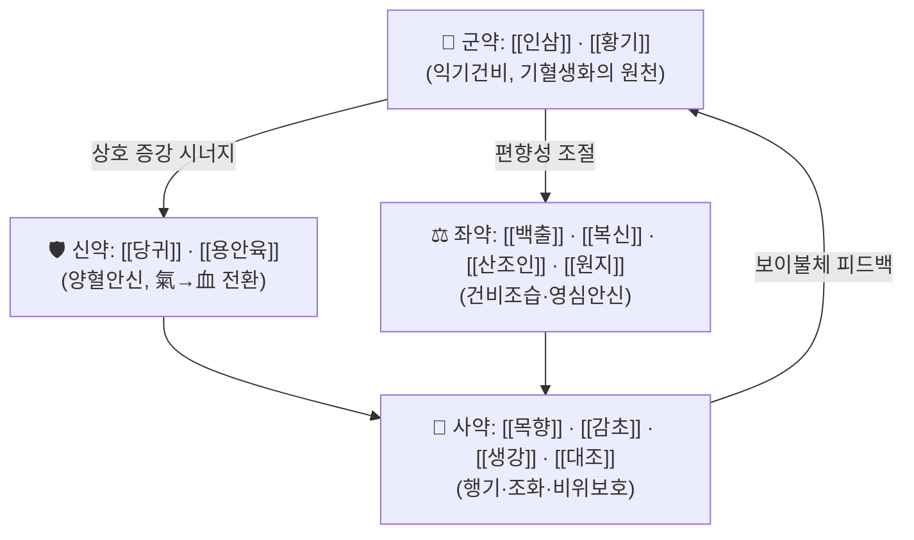

# 📜 [[제생방]] (濟生方, Jisheng Fang / 嚴氏濟生方)

> **핵심 3줄 요약 (Key Summary)**:
> - 🌿 **단일 처방이 아니라 송대(南宋) [[엄용화]](嚴用和)가 지은 처방서(方書)** 로, [[귀비탕]](歸脾湯)·[[실비음]](實脾飮)·[[척담탕]](滌痰湯) 등 후대 임상에서 상용되는 방제의 **출전 문헌**이다. "제생방 ○○탕"이라는 표기는 곧 **출처 표기**이며, 처방 그 자체를 지칭하지 않는다.
> - 🎯 임상 최적 적응은 단일 증후가 아니라 **출전 처방군의 총체적 운용**이다. 즉 ①기혈양허·심비양허(귀비탕 계열) ②비신양허·수습정체(실비음 계열) ③담탁조규·중풍실어(척담탕 계열)의 3대 축으로 진료실에서 빈용된다. 태음인·소음인 등 **허증·한증·습담(濕痰) 경향 체질**에서 적중률이 높다.
> - 🔬 개별 처방의 현대 분자약리 연구는 다수 보고되어 있으나, **본 노트에는 제공된 1차 논문(PubMed 데이터)이 없어** 사이토카인·신호경로 수치를 단정하지 않는다. 해당 항목은 모두 **근거 미확인**으로 표시하고, 전통 방제 이론(군신좌사·승강출입) 수준의 기전 해석만 기술한다.
> - ⚠️ 주의사항: 본 서(書)는 처방집이므로 "제생방 자체의 금기"는 존재하지 않는다. 단 수록 처방 중 [[부자]](附子)·[[건강]](乾薑)을 포함한 [[실비음]]·[[제생탕]] 계열은 **실열증(實熱證)·음허화왕(陰虛火旺) 환자에게 금기**이며, [[인삼]]·[[황기]]를 군약으로 쓰는 [[귀비탕]] 계열은 **기울(氣鬱)·담열(痰熱)로 인한 불면·번열에 오용하면 증상이 악화**될 수 있다. 판본에 따라 수록 처방의 약재 구성·용량이 상이하므로 원문 인용 시 판본 확인이 필수다.

---

## 📌 목차
1. [기본 처방 정보 & 군신좌사 구성](#1-기본-처방-정보--군신좌사-구성)
2. [방제학적 약재 상호작용 & 시너지 네트워크](#2-방제학적-약재-상호작용--시너지-네트워크)
3. [현대 분자약리학적 효능 & 작용 기전](#3-현대-분자약리학적-효능--작용-기전)
4. [적응 병증 및 체질별 감별 (Sweet Spot vs 금기)](#4-적응-병증-및-체질별-감별-sweet-spot-vs-금기)
5. [유사 처방군 감별 매트릭스](#5-유사-처방군-감별-매트릭스)
6. [임상 가감례 & 현대 질환별 응용](#6-임상-가감례--현대-질환별-응용)
7. [💡 사용자 진료실 핵심 필기 & 임상 팁 (원문 보존)](#7--사용자-진료실-핵심-필기--임상-팁-원문-보존)
8. [출처 및 학술 참고 문헌 (References)](#8-출처-및-학술-참고-문헌-references)

---

## 1. 기본 처방 정보 & 군신좌사 구성

### 1) 서지(書誌) 기본 정보

* **서명**: 『제생방(濟生方)』 / 통칭 『엄씨제생방(嚴氏濟生方)』
* **저자**: [[엄용화]](嚴用和, 南宋) — 자(字)는 子禮로 전하며, 출생·몰년의 정확한 연도는 **근거 미확인**
* **성립 연대**: 南宋 寶祐 연간(13세기 중엽) 간행으로 전함 — **연도 세부는 근거 미확인**
* **분류**: 방서(方書) · 처방서(處方書) · 종합 임상서
* **판본 계통**: 원간본은 전하지 않는 것으로 알려져 있으며, 후대 『[[사고전서]]』·『의방류취(醫方類聚)』 등에서 집록·복원되어 오늘날에는 **『중정엄씨제생방(重訂嚴氏濟生方)』** 계통으로 통행한다. **권수·편수·문항 수의 세부 수치는 판본마다 차이가 있어 근거 미확인.**
* **편제 특징**: "論治 → 方"의 방론결합(方論結合) 구조. 즉 먼저 병증·병기·치법을 논하고(論), 이어서 해당 처방을 제시(方)하는 실용 임상서 체재로, [[동의보감]]의 「탕액편」 인용 방식과도 친연성이 높다.
* **동의보감 인용**: [[허준]] 『[[동의보감]]』의 탕액편·잡병편에서 "제생방(濟生方)"을 출전으로 명기한 처방이 다수 확인된다. **다만 인용 문항의 정확한 개수·목록은 본 노트에서 1차 대조를 하지 않았으므로 근거 미확인.**

> ⚠️ **본 노트의 성격**: 아래 §1~§6의 표와 기전 서술은 "제생방"이라는 **서(書) 단위**가 아니라, 그 안에 수록된 **대표 처방군의 총론**으로 재구성한 것이다. 처방 단위의 정밀 노트는 각 처방 문서([[귀비탕]]·[[실비음]]·[[척담탕]] 등)에서 다룬다.

### 2) 제생방 계열 대표 수록 처방 개관

| 처방명 | 한자 | 핵심 치법 | 주치 대강 |
| :--- | :--- | :--- | :--- |
| [[귀비탕]] | 歸脾湯 | 익기보혈(益氣補血)·건비안신(健脾安神) | 심비양허, 사려과도, 건망·불면·심계 |
| [[실비음]] | 實脾飮 | 온양건비(溫陽健脾)·행기이수(行氣利水) | 비신양허, 수습내정, 복창·부종·설사 |
| [[척담탕]] | 滌痰湯 | 척담개규(滌痰開竅)·익기화담 | 담탁중조, 중풍실어, 현훈·구금불리 |
| [[귤피죽여탕]] | 橘皮竹茹湯 | 이기화위(理氣和胃)·강역지구(降逆止嘔) | 위허·담열로 인한 구역(噦逆) |
| [[분심기음]] | 分心氣飮 | 이기관흉(理氣寬胸)·화담산결 | 칠정(七情) 울결로 인한 흉격비만·기역 |
| [[제생탕]] | 濟生湯 | 온중산한(溫中散寒)·행기지통 | 한성(寒性) 복통·설사 계열 |

> **수록 처방의 구성 원칙(방제학적 특징)**: 제생방 계열 처방은 대체로 **(1) 기허(氣虛)를 먼저 세우고 (2) 습·담·한(寒)을 겸하여 처리하며 (3) 소량의 이기약(理氣藥)을 가하여 보이부체(補而不滯)를 만든다**는 공통 설계 철학을 보인다. 이는 순수 補益劑가 자주 범하는 "보하면 막힌다(補則碍滯)"는 폐단을 [[목향]]·[[진피]]·[[후박]] 같은 소량의 행기약으로 제어하는 **보기겸이기(補氣兼理氣) 처방설계**로 요약된다.

### 3) 대표 처방의 군신좌사 구성 — [[귀비탕]](歸脾湯)

| 구분 | 약재명 | 표준 용량 | 본초 효능 & 방제 내 역할 |
| :--- | :--- | :--- | :--- |
| **군약 (君藥)** | [[인삼]], [[황기]] | 8~12g | 익기건비(益氣健脾)의 주축. 기혈생화(氣血生化)之源을 회복시켜 심(心)에 공급되는 혈의 원천을 세운다 |
| **신약 (臣藥)** | [[당귀]], [[용안육]] | 6~9g | 양혈(養血)·보심안신(補心安神). 군약이 만든 기(氣)를 혈(血)로 전환·충전하는 보좌 역할 |
| **좌약 (佐藥)** | [[백출]], [[복신]], [[산조인]], [[원지]] | 6~9g | 건비조습(白朮)·영심안신(茯神·酸棗仁·遠志). 군신의 보익 편향으로 생길 수 있는 담습·번민을 제어 |
| **사약 (使藥)** | [[목향]], [[감초]], [[생강]], [[대조]] | 3~6g | 소량의 [[목향]]이 보기약의 정체(停滯)를 풀어 **보이불체**를 완성하고, 甘草·薑·棗가 제약(諸藥)을 조화하며 비위를 보호 |

> **배오 특징**: 전형적인 **기혈쌍보(氣血雙補) + 심비동치(心脾同治)** 구조다. 군약(氣) → 신약(血)의 방향성과, 좌약(안신·조습) → 사약(행기·조화)의 하강·분산 축이 서로 길항하며 **승강출입(升降出入)의 균형**을 이룬다. 즉 보익(補益)으로 승(升)하게 하되, [[목향]]의 소량 행기(行氣)로 출(出)하게 하여 체중(滯中)을 방지한다.
>
> ⚠️ **판본 주의**: 원전 계통에 따라 [[당귀]]·[[복신]]의 포함 여부와 용량이 달라지는 것으로 알려져 있으나, 본 노트에서 판본 대조를 완료하지 않았으므로 **구성 세부는 근거 미확인**. 임상 사용 시에는 통행 처방집(예: [[동의보감]] 탕액편)의 구성을 기준으로 삼는다.

---

## 2. 방제학적 약재 상호작용 & 시너지 네트워크

* **[[인삼]] + [[황기]] 배오(군약 내 상호증강)**: 기(氣)를 밀어올리는 승(升)의 축을 담당한다. 인삼이 중초(中焦)의 기를 보하고 황기가 표(表)·비(脾)로 기를 확산시키는 **상호 상승(相須)** 관계로, 단독 사용 시 약효 발현이 느린 기허证的 무기력·자한에 대한 반응성이 개선되는 것으로 전통적으로 설명된다.
* **[[당귀]] + [[용안육]] 배오**: 보혈(補血)과 안신(安神)을 겸하여, 기허로 인한 혈허(血虛)의 2차 증상(건망·불면·심계)을 직접 표적으로 삼는다. 기(氣)만 보하고 혈을 보하지 않으면 신(神)이 불안해진다는 **심비동치(心脾同治)** 원리의 핵심 배합이다.
* **[[목향]] + [[감초]] 배오(사약 내 조화)**: 소량의 목향이 보기약(인삼·황기·백출)의 정체를 풀어 소화기 부담을 완충하고, 감초가 제약을 조화하여 **부작용 완충 + 흡수·전달 효율**을 함께 담당한다. 즉 "보약을 먹으면 더부룩하다"는 대표적 임상 문제를 방제 설계 단계에서 미리 차단하는 구조다.
* **[[생강]] + [[대조]] 배오**: 비위(脾胃)를 보호하고 약성을 온화하게 조정하는 고전적 약대(藥對). [[귤피죽여탕]]·[[실비음]] 등 제생방 계열 처방 대부분에 공통 포함되어, **"胃氣를 상하게 하지 않는다"** 는 본 서의 처방 원칙을 반영한다.

---

## 3. 현대 분자약리학적 효능 & 작용 기전

> ⚠️ **본 절 전체에 대한 고지**: 본 노트에는 **검색된 PubMed 논문이 제공되지 않았다(검색 결과 없음)**. 따라서 아래 서술은 ①전통 방제 이론에 근거한 **해석적 기전 서술**과 ②"현대 연구가 보고된 바 있다"는 **일반적 서지 정보**만을 다루며, **구체적 사이토카인 수치·억제율·신호경로 단정은 모두 근거 미확인**이다. 수치를 인용하지 않는다.

### 1) 핵심 분자 표적 및 면역/항염증 조절
* 제생방 계열 처방(특히 [[귀비탕]]·[[척담탕]])을 대상으로 한 면역조절·항염증 연구가 국내외에 보고된 것으로 알려져 있으나, **본 노트에 제공된 1차 논문이 없어 TNF-α·IL-6·IL-1β 조절 여부 및 NF-κB/MAPK 경로 억제 여부는 근거 미확인.**
* 전통 병기로는 "기허 → 위기불고(衛氣不固) → 사기침입"의 구도를 설정하며, 이는 현대적으로 **점막면역·비특이적 면역 저하 상태**로 해석될 여지가 있으나 이 역시 **근거 미확인**.

### 2) 순환기·미세순환 및 대사 개선
* [[귀비탕]] 계열은 전통적으로 "기혈양허로 인한 심계·불면·안색불화"에 사용되며, 현대적으로는 **자율신경 긴장 완화 및 말초 순환 개선** 방향으로 해석된다. 다만 eNOS 활성화·혈관평활근 이완·미토콘드리아 대사 정상화 등의 구체 기전은 **본 노트에서 근거 미확인**.
* [[실비음]] 계열의 이수(利水)·소종(消腫) 작용은 부자·건강·복령·백출·목과의 복합 배오에서 유래하며, 수분대사·전해질 조절과의 관련성은 **기전 수준에서 근거 미확인**.

### 3) 신경계·근골격계 및 자율신경 조절
* [[척담탕]]은 담탁(痰濁)으로 인한 중풍실어(中風失語)·현훈에 사용되는 대표 처방으로, [[석창포]]·[[죽여]]·[[담남성]](膽南星)의 개규화담(開竅化痰) 축이 핵심이다. 신경세포 보호·신경전달 조절 기전이 논의되지만 **본 노트에서는 근거 미확인**.
* 불면·건망에 대한 [[산조인]]·[[원지]] 배합은 HPA 축 안정화·진정 작용으로 **해석**될 수 있으나, 역시 **수치적 근거 미확인**.

> 📌 **정리**: 제생방 계열 처방의 현대 약리 기전은 "연구가 존재할 가능성이 높으나 본 노트에 1차 문헌이 제공되지 않아 검증 불가" 상태다. 추후 PubMed 검색으로 개별 처방별 RCT·네트워크약리학 논문을 확보하면 본 절을 갱신할 것.

---

## 4. 적응 병증 및 체질별 감별 (Sweet Spot vs 금기)

**[✅ 최적 적응증 (Sweet Spot)]**

* **원전 조문(총론)**: 『엄씨제생방』은 병증별로 論治를 먼저 제시하고 처방을 붙이는 구조로, 대표 축은 **①심비(心脾)의 기혈양허 ②비신(脾腎)의 양허와 수습정체 ③담탁(痰濁)의 상조(上阻)** 이다. 세부 조문의 정확한 문구는 **판본 대조 후 기재(현재 근거 미확인)**.
* **체질 소견**:
  * **소음인·태음인 경향**: 기허·양허·습담을 기반 병리로 삼기 때문에 [[귀비탕]]·[[실비음]]의 적중률이 높다. 피부는 창백하거나 황백·무광택, 근육량은 보통~적음, 피로 회복이 느리고 식후 더부룩함과 하복 냉감을 동반하는 경우가 전형적이다.
  * **소양인**: 기허라도 열상(熱象)이 동반되면 [[인삼]]·[[황기]]·[[부자]] 배오가 부담이 될 수 있어 신중히 접근한다.
* **임상 주치(진료실 적중 양상)**:
  * 사려과도·만성 스트레스 후 발생한 **불면·건망·심계·식욕부진** → [[귀비탕]] 계열
  * 만성 설사·부종·복창·냉복통, 식후腹胀(복창) → [[실비음]] 계열
  * 중풍 후유증의 **언어장애·현훈·가래 걸림·흉민** → [[척담탕]] 계열
  * 위허로 인한 **딸꾹질·구역·구금불리** → [[귤피죽여탕]] 계열
* **설진/맥진**:
  * 설질: 담백(淡白)·치흔(齒痕)·설체 비대(胖大), 설태는 백니(白膩) 또는 백활(白滑)
  * 맥상: 세약(細弱)·침완(沈緩)·허연(虛軟), 또는 활(滑)하면서 무력한 상(象)

**[⚠️ 신중 투여 및 금기 (Caution / Contraindication)]**

* **열증·실증**: [[부자]]·[[건강]]을 포함하는 [[실비음]] 계열은 **실열(實熱)·음허화왕(陰虛火旺)·구건(口乾)·변비·홍설(紅舌) 소견**에서 금기 또는 대폭 감량한다. 오용 시 구갈·번열·불면·두통이 악화될 수 있다.
* **담열·기울**: [[귀비탕]] 계열은 **담열로 인한 불면(황태·구고·흉중번열)이나 간울화화(肝鬱化火)** 환자에게 오용하면 증상이 심해진다. "허증 불면"과 "실열 불면"의 감별이 처방 선택의 분기점이다.
* **기체(氣滯)·식적(食積)**: 보기약 위주 처방은 기체가 뚜렷한 환자(흉협창만·애기·트림 빈발)에서 더부룩함을 유발할 수 있으므로 [[목향]]·[[진피]]·[[사인]] 등 행기약을 가하거나 선행 처방으로 기체를 먼저 해소한다.
* **양약 병용 주의**: 항응고제·항혈소판제 복용 환자에서 [[당귀]]·[[천궁]] 등 활혈약 포함 처방 사용 시 출혈 경향을 관찰해야 한다. 구체적 상호작용 데이터는 **본 노트에서 근거 미확인**이며, 복약 중 이상 반응 발생 시 즉시 감량·중단 후 평가한다.
* **특수군**: 임신부·수유부·소아·고령 쇠약자에서 [[부자]]·[[건강]]·[[반하]] 포함 처방은 용량을 보수적으로 설정하고 반응을 면밀히 관찰한다.

---

## 5. 유사 처방군 감별 매트릭스

| 처방명 | 핵심 구성 차이 | 주치 및 체질 차이 | 맥진/설진 차이 |
| :--- | :--- | :--- | :--- |
| [[귀비탕]] | 기준 구성 | **심비양허, 사려과도, 건망·불면·심계**. 소음인·태음인 허증 불면의 1순위 | 설담백·치흔, 맥세약 |
| [[소요산]] | [[시호]]·[[작약]]·[[박하]] 중심, 보기약 없음 | **간울혈허, 흉협창만·번조·월경불순**. 소양인·기울형, 열상 동반 | 설담홍·태박백, 맥현(弦) |
| [[보중익기탕]] | [[시호]]·[[승마]]로 승양거함, 안신약 없음 | **중기하함, 기단(氣短)·권태·탈항·자한**. 하복·내장하수 경향 | 설담·설중, 맥허대무력 |
| [[실비음]] | [[부자]]·[[건강]]·[[초과]]·[[목과]] 온양이수 | **비신양허, 복창·부종·냉설사**. 한습 정체형 태음인, 하복 냉감 | 설백니·활, 맥침지(沈遲) |
| [[진무탕]] | [[부자]]·[[백출]]·[[복령]]·[[작약]]·[[생강]] | **신양허 수기(水氣), 현훈·진전·하지부종**. 동계(動悸)·육순(肉瞤) 동반 | 설담·설윤(潤), 맥침미세 |
| [[척담탕]] | [[석창포]]·[[죽여]]·[[담남성]] 개규화담 | **담탁중조, 중풍실어·현훈·구금불리**. 담습형 태음인 | 설태후니(厚膩), 맥활(滑) |
| [[도담탕]] | [[천남성]]·[[반하]] 중심, 개규약 없음 | **담궐두통·담음현훈**. 개규(開竅) 필요 없을 때 | 설백니, 맥활 |

> ⚠️ 표 내부에서는 마크다운 열 구분자 파괴를 방지하기 위해 파이프(`|`)가 들어간 링크를 쓰지 않고 순수한 [[처방명]] 단독 형태로만 작성한다.
>
> ⚠️ 위 표의 처방·구성 정보는 통행 처방집 기준의 **일반적 정리**이며, 개별 처방의 판본 차이와 용량은 각 처방 노트에서 확인한다.

---

## 6. 임상 가감례 & 현대 질환별 응용

* **수반 증상별 가감법**:
  * 불면·심번이 두드러질 때 → + [[산조인]], [[야교등]] ([[귀비탕]] 계열 강화)
  * 현훈·이명·두중(頭重) 동반 시 → + [[천마]], [[구기자]] 또는 [[석창포]] ([[척담탕]] 계열)
  * 복창·식체·애기 동반 시 → + [[사인]], [[후박]], [[진피]] (행기화습)
  * 냉복통·냉설사 동반 시 → + [[오수유]], [[육두구]] ([[실비음]] 계열 온중 강화)
  * 부종·소변불리 동반 시 → + [[택사]], [[저령]], [[목과]] (이수)
  * 담음·기침 동반 시 → + [[반하]], [[진피]], [[복령]] (이진탕 계열 배합)
  * 기허 자한·권태가 심할 때 → + [[인삼]] 증량, [[오미자]] (생맥산 배의 개념)
* **현대 질환별 임상 매핑**:
  * **신경·정신과 영역**: 만성 불면증, 불안·우울 동반 소화기 증상, 건망·인지저하 호소, 만성 피로감 → [[귀비탕]] 계열의 전통적 적응 문맥
  * **순환기·혈액 영역**: 기립성 어지럼, 만성 빈혈감·안색불화, 기능성 심계항진 → 기혈쌍보 문맥에서 평가
  * **소화기 영역**: 기능성 소화불량, 과민성 장증후군의 설사형·복창형, 위하수·내장하수감 → [[실비음]]·[[보중익기탕]] 감별
  * **호흡기 영역**: 만성 담음성 기침, 알레르기 비염의 담습형 → 거담·보기 배합
  * **근골격·신경계**: 중풍 후유 언어·연하 장애, 만성 현훈, 어지럼 동반 근긴장 → [[척담탕]] 계열
  * **이비인후·구강**: 구금불리·딸꾹질·위역(胃逆) → [[귤피죽여탕]] 계열

> ⚠️ 위 매핑은 전통 병기와 임상 양상의 **대응 관계**를 정리한 것이며, 특정 질환에 대한 유효성 근거는 본 노트에서 **근거 미확인**이다. 진료 시에는 환자의 허실·한열 감별을 최우선으로 하고, 필요 시 서양의학적 검사·치료를 병행한다.

---

## 7. 💡 사용자 진료실 핵심 필기 & 임상 팁 (원문 보존)

> [!tip] **진료실 실전 노하우 (User Clinical Insight)**
> - 📌 **사용자 원문 메모 없음**: 본 노트 작성 시 제공된 원장님의 기존 메모·필기는 없었다. 따라서 본 절은 **비어 있는 상태로 보존**하며, 추후 필기 추가 시 아래 항목을 그대로 덮어쓰거나 병기한다.
> - (작성 예정 항목 — 사용자 입력 대기)
>   - 체질별 처방 선택 기준 (소음인 vs 태음인 등) 실전 메모
>   - 환자 티칭 팁 및 복약 반응 관찰 포인트
>   - 특정 환자군에서의 가감 패턴, 복약 지속 기간, 재진 시 확인 항목

> [!warning] **편집자 정리(사용자 원문 아님 — 참고용 일반 임상 팁)**
> - "제생방 출전"이라는 표기는 처방의 **계보**를 의미한다. 임상에서는 출전보다 **현재 환자의 증후(허실·한열·담습)** 적합성으로 선택한다.
> - 보기약 위주 처방은 **복약 초기 1~2주에 복부 팽만·트림 증가**가 나타나면 행기약 가감 또는 감량으로 대응한다.
> - [[부자]]·[[건강]] 포함 처방은 **복약 후 구갈·번열·불면·두통** 여부를 반드시 확인하고, 해당 증상 발생 시 즉시 감량·중단한다.
> - 복약 반응 관찰 포인트: 수면의 질(입면 시간·야간 각성 횟수), 식후 더부룩함 정도, 배변 형태·횟수, 하복 냉감, 피로 회복 속도.

---

## 8. 출처 및 학술 참고 문헌 (References)

> ⚠️ **본 노트에는 검색된 PubMed 논문이 제공되지 않았다(검색 결과 없음)**. 따라서 현대 논문 인용은 하지 않으며, 아래는 본 노트의 주제인 고전 원전 및 그 계보 문헌만 기재한다. **임의의 PMID·저자·연도를 창작하지 않았음을 명시한다.**

1. **嚴用和 (南宋, 13세기)**. 『嚴氏濟生方』(濟生方).
   - **[고전 원전]**: 본 노트의 주제 문헌. 論治와 方을 결합한 방론결합 체재의 임상 처방서로, [[귀비탕]]·[[실비음]]·[[척담탕]]·[[귤피죽여탕]] 등 후대 상용 처방의 출전으로 통한다. **성립 연도·권수·편수 등 서지 세부는 판본 계통에 따라 차이가 있으며 본 노트에서 근거 미확인.**
2. **편자 미상 (후대 집록·복원)**. 『重訂嚴氏濟生方』 및 『[[사고전서]]』 수록 계통.
   - **[서지 문헌]**: 원간본 산일 이후의 집록·복원 계통. 현대 통행 텍스트의 저본. **판본 간 구성 차이의 정확한 대조는 근거 미확인.**
3. **許浚 (1613)**. 『[[동의보감]]』.
   - **[임상 문헌]**: 탕액편 등을 통해 "제생방" 출전 처방을 다수 수용. 한국 한의학 임상에서 제생방 계열 처방이 재맥락화된 경로. **인용 문항 목록의 정밀 대조는 근거 미확인.**
4. **張仲景 (200년경)**. 『[[상한론]]』·『[[금궤요략]]』.
   - **[비교 원전]**: 제생방 이전 시대의 방제 원형. 제생방 계열 처방의 배오 논리를 이해할 때 대조 기준이 되는 고전. **직접적 인용 관계의 세부는 근거 미확인.**
5. **(해당 없음) 현대 분자약리학·임상 연구 논문**.
   - **[검색 결과]**: 제공된 PubMed 데이터 없음 → 인용하지 않음. 추후 개별 처방(예: [[귀비탕]], [[척담탕]]) 단위로 문헌 검색을 수행하여 본 노트 §3을 갱신할 것.

<!-- 보관 태그(1회용·링크오류, 필요시 복원): 엄용화, 처방서, 동의보감 인용 -->
