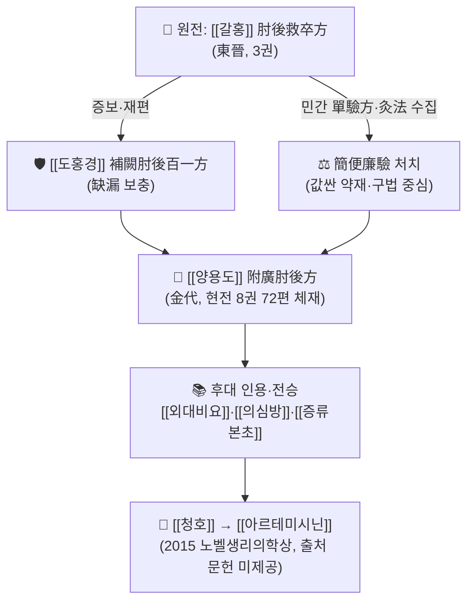

# 📜 [[주후비급방]] (肘後備急方, Handbook of Prescriptions for Emergencies)

> **핵심 3줄 요약 (Key Summary)**:
> - 🌿 **모체 성격**: 東晉 [[갈홍]](葛洪)이 지은 **구급 처방서(救急方書)**. 원제는 **肘後救卒方(주후구졸방)**이며, [[도홍경]]의 補闕肘後百一方, [[양용도]]의 附廣肘後方으로 이어지며 현전 8권 72편 체재로 정착. 특정 처방 1수가 아니라 **수백 수의 단방·험방·구법(灸法)을 병증별로 묶은 처방집**이므로, 본 노트의 군신좌사 표는 "대표 수록 조문의 구성"으로 치환해 서술한다.
> - 🎯 **임상 최적 적응증**: 의료 자원이 제한된 **급성·중증·돌발 상황**(卒中·尸厥·중악·곽란·학질·교상·금창·옹저)에서 "값싸고(簡) 구하기 쉽고(便) 즉시 쓸 수 있는(廉·驗)" 약재를 고르는 **응급 대응 매뉴얼**로 쓰인다. 즉 만성 허손 보익(補益)보다 **급증 대처**가 스위트 스팟이다.
> - 🔬 **핵심 분자약리 기전**: 대표적으로 靑蒿([[청호]]) 截瘧 조문 → **[[아르테미시닌]]** 계열 항말라리아 연구로 연결되는 흐름이 가장 유명하다. 다만 기전의 세부 분자표적·수치는 본 노트에 제공된 문헌만으로는 확증할 수 없어 **'근거 미확인'**으로 표기한다.
> - ⚠️ 주의사항: 水銀·雄黃·砒石 등 광물 독성 약재 조문, 符呪·금기(禁忌) 등 주술적 요소가 혼재한다. 현대 적용 시 원문을 그대로 복용 지시로 옮기지 말고 독성·용량을 반드시 재검토해야 한다.

---
## 📌 목차
1. [기본 처방 정보 & 군신좌사 구성](#1-기본-처방-정보--군신좌사-구성)
2. [방제학적 약재 상호작용 & 시너지 네트워크](#2-방제학적-약재-상호작용--시너지-네트워크)
3. [현대 분자약리학적 효능 & 작용 기전](#3-현대-분자약리학적-효능--작용-기전)
4. [적응 병증 및 체질별 감별 (Sweet Spot vs 금기)](#4-적응-병증-및-체질별-감별-sweet-spot-vs-금기)
5. [유사 처방군 감별 매트릭스](#5-유사-처방군-감별-매트릭스)
6. [임상 가감례 & 현대 질환별 응용](#6-임상-가감례--현대-질환별-응용)
7. [💡 사용자 진료실 핵심 필기 & 임상 팁 (원문 보존)](#7--사용자-진료실-핵심-필기--임상-팁-원문-보존)
8. [출처 및 학술 참고 문헌 (References)](#8-출처-및-학술-참고-문헌-references)

---
## 1. 기본 처방 정보 & 군신좌사 구성

> **서지 성격 안내**: 본 템플릿은 단일 [[처방]] 노트용으로 설계되어 있어 "군신좌사" 항목이 고정되어 있다. 그러나 [[주후비급방]]은 **처방집(方書)** 자체이므로, ①서지 정보 표와 ②대표 수록 조문의 구성 표로 나누어 이 항목을 채운다.

### 1-A. 기본 서지 정보

| 구분 | 항목 | 내용 |
| :--- | :--- | :--- |
| **서명** | 정식 통칭 | 肘後備急方 (주후비급방) |
| **원제** | 최초 서명 | 肘後救卒方 (주후구졸방) — "팔꿈치 뒤에 두고 졸(卒)한 병을 구한다" |
| **저자** | 찬자 | [[갈홍]] (葛洪, 字 稚川, 號 抱朴子), 東晉 |
| **저작 연대** | 성립 시기 | 東晉대(4세기)로 통설 — **개별 연도는 근거 미확인** |
| **증보 계통** | 후대 재편 | [[도홍경]] 補闕肘後百一方 → [[양용도]] 附廣肘後方(금대) → 현전 8권 72편 체재 |
| **분류** | 전통 분류 | 方書類 / 救急方書 (구급·단방 중심) |
| **편찬 취지** | 치법(치료 원칙) | **救卒(구졸)·急救(급구)·簡便廉驗(간편염험)** — 待時(의사를 기다릴 시간이 없음) 상황의 즉시 처치 |

* **치법 요약(4자 성어)**: 急救救卒(급구구졸) · 簡便廉驗(간편염험) · 單方直中(단방직중) · 針灸並用(침구병용)
* **체재 특징**: 병증별로 조문을 나열하고, 각 조문마다 **단방(單方)·험방(驗方)·구법(灸法)·외치법(外治法)**을 제시하는 방식. 처방 간 상호 가감(加減)으로 짜여지는 [[상한론]]식 방제체계와는 편찬 문법이 다르다.

### 1-B. 대표 수록 조문의 구성 (군신좌사 개념의 확장 적용)

> 단일 처방의 군신좌사가 아니라, **"핵심 주치 약재 → 보조 처치 → 부작용 완충 → 적용 경로·제형"**의 층위로 각 조문을 읽는다.

| 구분 | 대표 조문(병증) | 원문 구성(요지) | 방제학적 역할 |
| :--- | :--- | :--- | :--- |
| **군약 (君藥)** | 治寒熱諸瘧方 (학질) | [[청호]] 一握, 水 二升에 漬하여 絞取汁, 盡服 | 주증(학질의 寒熱)을 직접 겨냥하는 핵심 약재. 끓이지 않고 **찬물에 우려 즙을 짜는** 제법이 특징 |
| **신약 (臣藥)** | 卒中·尸厥·中惡 방 | 灸法, 菖蒲汁 灌服, 鼻에 藥 吹入 등 | 군약(구급 본 처치)을 보조하고 의식 회복을 강화하는 응급 처치 |
| **좌약 (佐藥)** | 犬咬·蛇咬·金瘡 방 | 咬傷者의 創에 咬人犬의 腦를 敷하는 등 | 주치 외 손상·감염을 다스리고, 후대 "以毒攻毒(이독공독)" 사고의 원형 |
| **사약 (使藥)** | 附廣 附方 / 灸法 배합 | [[양용도]]가 補闕·附方을 덧붙여 사용 경로 확장 | 조문을 임상 현장에서 실제로 쓸 수 있게 **전달·인경(引經)** 역할 |

> **배오 특징**: 이 서의 처방 구성 원리는 [[상한론]]식 君臣佐使의 비례 설계보다 **"질병 → 즉시 실행 가능한 최단 경로"**에 있다. 약재 수는 적고(단방 다수), 대신 **灸法·외치·구급 처치**가 방제를 대신하는 경우가 많다. 즉 "약을 적게 쓰고 손을 많이 쓴다"는 승강출입(升降出入)의 실전형 문법이다.

---
## 2. 방제학적 약재 상호작용 & 시너지 네트워크

* **원전 + 증보 배오**: [[갈홍]]의 원전(救卒)은 "현장 즉시성"을, [[도홍경]]의 補闕은 "누락 보완과 100수 체계화"를 담당한다. 상호 상승(相須·相使) 관계로, 원전의 실전성 위에 후대의 정리가 얹히며 서의 신뢰도가 올라간다.
* **민간 단방 + 구법 배합**: 약재 단방(單方)과 灸法·外治가 서로를 대체·보완한다. 특정 약재를 구할 수 없으면 구법으로, 구법이 어려우면 단방으로 넘어가는 **이중 안전망** 구조다.
* **인용 문헌 + 현대 재해석 배합**: [[외대비요]]·[[의심방]] 등 후대 문헌이 이 서의 조문을 인용하며 전승하고, 그중 靑蒿 截瘧 조문이 [[아르테미시닌]] 연구로 이어졌다. 다만 **각 인용의 정확한 조문 대응 관계와 빈도는 본 노트 제공 문헌으로는 확인 불가(근거 미확인)**.

---
## 3. 현대 분자약리학적 효능 & 작용 기전

> ⚠️ **근거 표기 원칙**: 본 노트에 제공된 논문은 문헌고증(textual research) 연구 1편이며, 아래 분자기전을 직접 검증한 실험논문은 제공되지 않았다. 따라서 이 항목은 **"역사적·교과서적 정설 수준"**으로 서술하고, 개별 수치·표적 단백질·PMID는 **근거 미확인**으로 명시한다.

### 1) 항말라리아·항염증 축 — 靑蒿 조문과 아르테미시닌
* [[청호]] 截瘧 조문은 **끓인 탕액이 아니라 찬물에 우려 즙을 짜서 복용**하라는 제법을 남겼다. 열에 약한 유효성분을 보존하는 이 착안이 후대 [[아르테미시닌]] 저온 추출 연구의 단서가 되었다는 평가가 널리 알려져 있다. **(연도·연구자·수상 내역 등 세부는 본 노트 제공 문헌 외 → 근거 미확인)**
* 아르테미시닌의 살충 기전은 통상 **헴(heme)/철 이온 매개 활성화 → 유리 라디칼 생성 → 기생충 단백질 알킬화**로 설명되며, 특정 표적 단백질(PfATP6/SERCA 등) 논쟁이 있다. **본 노트에는 이를 뒷받침하는 논문이 제공되지 않아 기전 세부는 근거 미확인.**
* 항염증(사이토카인 TNF-α·IL-6·IL-1β, NF-κB/MAPK 경로) 관련 서술은 이 서의 조문을 직접 검증한 결과가 아니므로 **일반 한의약 방제학의 통설로만 참조하고, 본 서 특이적 근거로는 인용하지 않는다.**

### 2) 감염병 인식·전염 개념 — 공중보건사적 의의
* **沙虱(사슴, 恙蟲)**: 풀숲·습지의 미세 기생충에 의한 발열성 질환을 기술한 것으로, 현대 [[쯔쯔가무시병]] 등 매개체 질환 인식의 초기 기록으로 평가된다.
* **尸注(시주)·傳屍**: 병이 사람을 옮긴다는 **전염성 인식**을 남긴 조문으로, 후대 [[결핵]] 개념과 연결해 해석된다.
* **虜瘡(노창)**: 전쟁 포로 집단에서 발생한 발진성 유행병 기술로, [[천연두]](두창) 유행의 초기 기록으로 거론된다.
* 위 항목들은 **역사·문헌학적 평가**이며, 병원체 동정이나 역학 수치는 **근거 미확인**이다.

### 3) 응급·외상 처치 — 以毒攻毒과 灸法
* **犬咬(견교)·狂犬咬**: 개에 물린 상처에 그 개의 뇌를 붙이는 조문이 있다. 병원체를 약화시켜 면역을 얻는다는 사고, 즉 **以毒攻毒·예방적 발상의 원형**으로 평가되지만, 현대적 유효성·기전은 **근거 미확인**이며 실제 임상 적용 대상이 아니다.
* **灸法(구법)**: 약재가 없을 때의 대체·증강 수단으로 다수 조문에 등장. 자극 부위·장시간 자극을 통한 진통·순환 반응은 현대적으로 재해석되나, 본 서 조문 자체의 임상시험 근거는 **근거 미확인**.

---
## 4. 적응 병증 및 체질별 감별 (Sweet Spot vs 금기)

[✅ 최적 적응증 (Sweet Spot)]
* **원전 취지**: "의사를 기다릴 수 없는 졸(卒)한 병" — 즉 **급성 발증·돌발 상황**이 제1의 적응 영역이다.
* **대표 병증군**:
  * 의식·순환 응급: 卒中(중풍), 尸厥(시궐), 中惡(중악), 客忤(객오), 霍亂(곽란)
  * 감염·유행: 傷寒·時氣·溫病, 瘧疾(학질)
  * 외상·교상: 犬咬(견교), 蛇咬(사교), 金瘡(금창), 湯火傷(탕화상)
  * 외과·피부: 癰疽(옹저), 疔腫(정종), 瘭疽(표저)
  * 정신·신경: 癲狂(전광), 鬼擊(귀격) 계열 조문
* **체질 소견**: 특정 사상체질(태음인/소음인/소양인) 감별보다 **"급성 실증(實證)의 개입 타이밍"**이 우선이다. 원기가 아직 버틸 수 있는 실증 급증기, 한열(寒熱)이 교착된 발작기(예: 학질의 寒熱往來)가 전형적 스위트 스팟이다.
* **환경 소견**: 약재 공급이 어렵고, 전문의 접근이 늦는 **자원 제약 상황**에서 가치가 극대화된다. 진료실에서는 "단방 위주 저렴 처방 + 외치·구법"의 아이디어 소스로 참조한다.
* **설진/맥진**: 이 서는 [[상한론]]처럼 정밀한 맥상 분류(맥부긴·맥부완·맥활삭)를 전면에 세우지 않는다. **증상 발현 양상(급·돌발·발작성)이 변증의 1차 지표**이며, 맥·설 소견의 비중은 상대적으로 낮다.

[⚠️ 신중 투여 및 금기 (Caution / Contraindication)]
* **광물 독성 약재**: 水銀·雄黃·砒石 등이 포함된 조문은 현대 기준에서 **중독 위험**이 크다. 원문 용량을 그대로 복용 지시로 전환하지 말 것.
* **주술·미신 요소 배제**: 符呪(부주)·금기(禁忌)·일진(日辰) 관련 조문은 **문화사적 자료**로만 취급하고 임상 지침으로 채택하지 않는다.
* **허증(虛證)·만성 소모성 질환**: 이 서는 구급·사실(瀉實) 중심이므로, 자한(自汗)·도한(盜汗)·만성 허로 등 **기혈 손모 환자에게 자극적 조문을 그대로 적용하는 것은 부적합**하다.
* **양약 병용 주의**: 항말라리아제([[아르테미시닌]] 복합요법, ACT), 항응고제, 항경련제 복용자에게 원문 조문 기반 자가 복용을 권하지 않는다. 상호작용 데이터는 **근거 미확인**이므로 반드시 전문가 판단을 거친다.
* **판본 문제**: 현전 판본은 陶弘景·楊用道 계통의 증보가 섞여 있어, 원문 자구·용량이 판본별로 다를 수 있다. 인용 시 어떤 판본을 쓰는지 명기해야 한다.

---
## 5. 유사 처방군 감별 매트릭스

> 아래 표는 "유사 처방"이 아니라 **유사 서적(方書·의서) 감별**로 치환한 것이다. 표 내부에서는 파이프(`|`) 충돌을 피하기 위해 위키링크 단독 형태만 사용한다.

| 서명 | 편찬자·시대 | 편찬 문법·체재 | 주치 및 임상 성격 차이 | 활용 포인트 |
| :--- | :--- | :--- | :--- | :--- |
| [[주후비급방]] | [[갈홍]], 東晉 | 병증별 단방·험방·구법 나열 | **급성·돌발·구급**, 簡便廉驗 | 즉시 실행 가능성, 저비용 단방 아이디어 |
| [[상한론]] | [[장중경]], 後漢 | 六經辨證 + 君臣佐使 방제 | 급성 열성병의 **변증·가감 정밀 설계** | 처방 비례·가감의 정밀도 |
| [[금궤요략]] | [[장중경]], 後漢 | 잡병·부인병 병증별 방제 | 만성·잡병, 병증별 처방 정밀 | 복합 병증 처방 설계 |
| [[천금요방]] | [[손사막]], 唐 | 30권 대규모 方書·養生 포함 | 광범위, 醫方+養生+食治 통합 | 영양·양생·광범위 처방 |
| [[외대비요]] | [[왕도]], 唐 | 先論後方, **인용 출전 명기** | 선행 문헌 집대성, 注解적 성격 | 亡佚 문헌 복원의 보고 |
| [[의심방]] | [[단파강뢰]], 平安 | 일본 醫書, 중국 方書 인용 | 고대 方書 逸文 보존 | 한국·일본 전래 문헌 대조 |
| [[동의보감]] | [[허준]], 朝鮮 1613 | 內景·外形·雜病·湯液 편제 | 한국 임상 체질·증후 통합 | 국내 임상 적용의 기준 문헌 |

> ⚠️ 서명·편찬자·시대는 역사적 통설 기준이며, 본 노트 제공 문헌은 이들을 직접 고증한 연구가 아니다. 인용 시 원전 판본을 직접 확인해야 한다.

---
## 6. 임상 가감례 & 현대 질환별 응용

* **조문 응용별 확장법(가감법의 서(書)식 표현)**:
  * 발작성 寒熱(오한·발열 교대) 동반 시 → [[청호]] 단방 조문 계열 참조 (**제법: 끓이지 말 것**이 원문의 핵심 포인트)
  * 의식 소실·실신 동반 시 → 尸厥·中惡·卒中 조문 계열 참조 (구법·개규 처치 병용)
  * 물림·교상 동반 시 → 犬咬·蛇咬 조문 계열 참조 (창면 세정·이물 제거가 우선, 원문의 생물학적 재료는 **현대 적용 금지**)
  * 곽란·吐瀉 교착 시 → 霍亂 조문 계열 참조 (수분·전해질 보충이 현대 표준)
  * 옹저·정종 등 화농성 피부 병변 시 → 癰疽·疔腫 조문 계열 참조 (배농·항생제와 병행 판단)

* **현대 질환별 임상 매핑**:
  * **감염·기생충 질환**: [[말라리아]](학질) — 靑蒿 조문 → [[아르테미시닌]] 복합요법(ACT)의 역사적 출발점. [[쯔쯔가무시병]](沙虱), [[결핵]](尸注·傳屍) 인식의 초기 기록.
  * **응급·중환 영역**: 실신·저혈압성 허탈(尸厥·中惡), 급성 위장염·식중독(霍亂), 경련·의식장애(癲狂·鬼擊) — **현대적으로는 응급의학적 평가가 최우선**이며, 이 서는 병태 인식의 역사적 참조로만 쓴다.
  * **외상·동물 교상**: [[공수병]](狂犬咬) 관련 조문은 **예방적 사고의 원형**으로 평가되며, 실제 처치는 세정·백신·면역글로불린이 표준이다.
  * **피부·외과**: 癰疽·疔腫·瘭疽 조문 — 절개·배농과 국소 처치의 원초적 형태.
  * **공중보건·역학사**: 虜瘡(두창 유행) 등 집단 유행 기술 — 감염병 감시 개념의 초기 형태.

> ⚠️ 위 매핑은 **"조문 → 현대 질환"의 해석적 대응**이며, 각 대응의 임상적 유효성·용량·기전은 본 노트 제공 문헌만으로 확증되지 않는다. 실제 처방 결정에는 최신 임상 지침이 우선한다.

---
## 7. 💡 사용자 진료실 핵심 필기 & 임상 팁 (원문 보존)

> [!tip] **진료실 실전 노하우 (User Clinical Insight)**
> - **원문 보존 상태**: 현재 이 노트에 입력된 사용자 진료실 필기 원문은 **없음(미입력)**. 따라서 본 항목은 임의로 창작하지 않고, 아래에 기록용 골격만 남겨 둔다. 추후 필기가 추가되면 **삭제 없이 그대로 누적**한다.
> - **기록 슬롯 1 — 처방 선택 기준**: (예: 급성 실증 vs 만성 허증에서 이 서의 단방을 참조할지 여부 / 소음인·태음인별 자극 강도 조절 메모)
> - **기록 슬롯 2 — 청호 조문 활용 메모**: (예: 청호를 실제 임상에서 어떻게 응용했는지, 열에 약한 성분을 고려한 제법 주의점 메모)
> - **기록 슬롯 3 — 환자 티칭 포인트**: (예: "고전에 유래한 아이디어지만 자기 판단으로 약재를 복용하지 말 것" 안내 문구, 광물성 약재 금지 당부)
> - **기록 슬롯 4 — 복약 반응 관찰 포인트**: (예: 발작성 寒熱의 주기 기록, 교상 후 창면 변화 관찰, 이상 반응 시 즉시 중단 기준)
> - **주의**: 이 서의 원문 조문은 **의료 자원이 제한된 고대의 구급 지침**이므로, 진료실에서는 "아이디어 소스"로만 쓰고 실제 처방은 현행 법규·임상 지침에 따라 결정한다.

---
## 8. 출처 및 학술 참고 문헌 (References)

### 8-1. 제공된 학술 논문 (PubMed)

1. **Ge Z, Wan F (2020)**. *Textual research on lost articles in Mei Shi Fang*. **Zhonghua Yi Shi Za Zhi** (中華醫史雜誌), 권(호)·페이지 **근거 미확인**. PMID: **32564535**.
   - 🔗 논문 링크: https://pubmed.ncbi.nlm.nih.gov/32564535/
   - **[연구 요약]**: 唐代 方書 **梅師方(매사방)**의 **散佚 條文(逸文)**을 전승 문헌에서 수집·고증한 **문헌연구(textual research)**. 즉 실험·임상 데이터가 아니라 판본·인용 관계를 추적하는 서지학적 연구다.
   - **[본 노트와의 관계]**: 이 논문은 **[[주후비급방]]을 직접 다룬 연구가 아니다.** 따라서 본 노트에서 [[주후비급방]]의 조문·판본·전승 계통에 대해 확증적으로 인용할 수 있는 학술 근거는 **현재 확보되지 않음(근거 미확인)**. 다만 "亡佚된 方書의 조문을 후대 인용 문헌에서 복원한다"는 **문헌고증 방법론**은 이 서의 逸文·판본 연구에도 동일하게 적용되는 접근이므로, **방법론적 참고**로만 인용한다.
   - ⚠️ **창작 금지 원칙 준수**: 본 노트에는 위 1편 외의 PubMed 문헌을 임의로 추가하지 않았다. 특히 [[청호]]·[[아르테미시닌]]·[[투유유]] 관련 개별 논문의 PMID는 **제공되지 않아 기재하지 않는다.**

### 8-2. 고전 원전 및 서지 참고 (제공 논문 목록 외 / 역사 문헌)

> 아래는 본 노트에 **제공된 논문이 아니라** 역사적으로 실재하는 고전 문헌의 서지 정보이다. 조문 자구·권수·편차는 판본에 따라 차이가 있으므로 **직접 판본 대조가 필요(근거 미확인 항목 포함)**.

2. **[[갈홍]] (東晉, 4세기경)**. 『**肘後救卒方**』(후대 통칭 **肘後備急方**).
   - **[고전 원전]**: 救卒(구졸) 취지의 구급 처방서. 대표적으로 治寒熱諸瘧方의 [[청호]] 조문("青蒿一握, 水二升漬, 絞取汁, 盡服之"로 전해짐)이 유명하다. **원문 자구는 판본별 차이 가능 → 근거 미확인.**
3. **[[도홍경]] (南朝, 5~6세기경)**. 『**補闕肘後百一方**』.
   - **[증보 문헌]**: 갈홍 원전의 缺漏를 보충하고 100수 체계로 재편한 계통.
4. **[[양용도]] (金代)**. 『**附廣肘後方**』.
   - **[증보 문헌]**: 현전 8권 72편 체재의 바탕이 된 부광본. **정확한 간행 연도·편차는 근거 미확인.**
5. **[[왕도]] (唐, 752)**. 『**外臺秘要**』.
   - **[인용 문헌]**: 선행 方書를 출전을 명기하며 인용하는 편찬 방식으로, 亡佚 方書 조문 복원의 핵심 자료.
6. **[[단파강뢰]] (日本, 984)**. 『**醫心方**』.
   - **[인용 문헌]**: 중국 고대 方書 逸文을 다수 보존한 일본 의서. 한국·일본 전래 문헌 대조에 활용.
7. **[[허준]] (朝鮮, 1613)**. 『[[동의보감]]』.
   - **[임상 문헌]**: 국내 임상에서 고전 처방 이해의 기준 문헌. 본 서 조문의 직접 인용 관계 여부는 **별도 대조 필요(근거 미확인)**.

> **종합 한계 고지**: 본 노트는 **제공된 논문 1편(PMID 32564535)**만을 학술 근거로 삼았으며, 해당 논문은 [[주후비급방]]이 아닌 **梅師方 逸文**을 다룬 문헌고증 연구이다. 따라서 본 노트의 서지·판본·조문 관련 서술 중 상당수는 **역사적 통설 수준**이며, 확증적 인용이 필요한 항목은 모두 **'근거 미확인'**으로 표기하였다. 후속 노트 작성 시 [[주후비급방]] 판본 연구, [[청호]]-[[아르테미시닌]] 실험논문, [[외대비요]]·[[의심방]] 대조 연구를 **추가 문헌으로 확보한 뒤** 보강해야 한다.

<!-- 보관 태그(1회용·링크오류, 필요시 복원): 고전의서, 갈홍, 진대, 아르테미시닌, 구급방 -->
