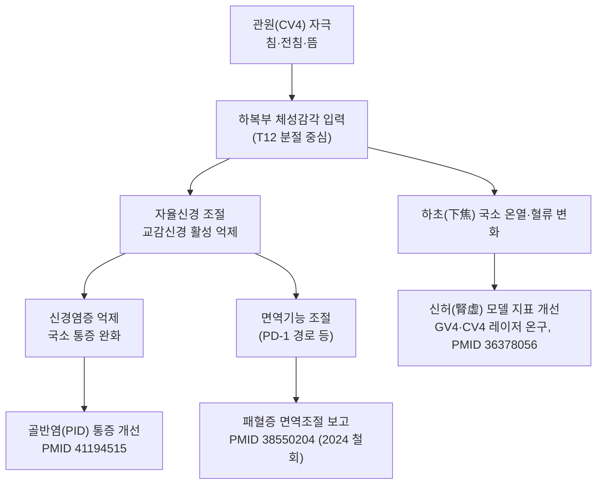

# 🫁 [[경락/임맥/관원]] (Guanyuan, CV4)

> **핵심 요약 (Key Summary)**:
> [[관원]](CV4)은 [[임맥]](Ren Mai)의 제4번 혈로, 하복부 전정중선상 배꼽 아래 3촌에 위치하며 [[단전]](丹田)의 중심혈이자 하기해(下氣海)로 불린다. 표준 해부학 기준 [[복직근]] 내측연 부근의 복벽을 지나 [[방광]]·[[자궁]]·[[소장]]과 인접하므로 **배뇨 후 시술**과 **임신부 금침**이 필수이며, [[전침]]·[[뜸]](온구) 자극은 하초(下焦) 보온·보기(補氣) 및 [[골반염]] 통증·면역 조절 등에 임상 응용된다.

---
## 📌 목차
1. [해부학적 정밀 구조 및 지배 신경/혈관](#1-해부학적-정밀-구조-및-지배-신경혈관)
2. [생체역학·토크 분석 & 근막 사슬 (Biomechanical Synergy)](#2-생체역학토크-분석--근막-사슬-biomechanical-synergy)
3. [근막통증증후군(TP) & 연관통 패턴 (Travell & Simons)](#3-근막통증증후군tp--연관통-패턴-travell--simons)
4. [초음파 해부학(Sonoanatomy) 및 중재 시술 랜드마크](#4-초음파-해부학sonoanatomy-및-중재-시술-랜드마크)
5. [⭐ 원장님 심층 임상 고찰 및 원본 필기 (Clinical Pearls)](#5-원장님-심층-임상-고찰-및-원본-필기-clinical-pearls)
6. [관련 임상 질환 및 운동손상 증후군 총괄](#6-관련-임상-질환-및-운동손상-증후군-총괄)
7. [추나·도수치료(MET/PIR) & 침구·약침·재활 프로토콜](#7-추나도수치료metpir--침구약침재활-프로토콜)
8. [출처 및 학술 참고 문헌 (References)](#8-출처-및-학술-참고-문헌-references)

---
## 1. 해부학적 정밀 구조 및 지배 신경/혈관

| 항목 | 상세 내용 |
| :--- | :--- |
| **소속 경맥** | [[임맥]] (Ren Mai, 任脈) — 복부 정중선을 순행하는 음맥지해(陰脈之海) |
| **혈위 (Location)** | 하복부, 전정중선상(前正中線上), 제중(臍中=배꼽) 하방 **3촌** |
| **골도법 (Bone Proportional)** | 배꼽~치골결합 상연을 5촌으로 등분할 때 **배꼽 아래 3/5 지점**(치골 상연 상방 2촌) |
| **표층 구조** | 피부 → 천층 피하조직(Camper층) → 심층 피하조직(Scarpa층) → [[복직근]] 전초(anterior rectus sheath) |
| **심층 구조** | [[복직근]](백선 인접 내측연) → 복직근 후초 → 복횡근막·복막전근막 → 복막외지방 → 벽측 [[복막]] |
| **신경 지배** | 제12흉신경(T12) 전지의 전피지(anterior cutaneous branch)가 주 분포, 제11흉신경(T11)~제1요신경(L1) 분포와 중첩되는 영역 |
| **혈관 공급** | 하복벽천동맥·정맥(superficial epigastric a./v.)이 복직근 전면을 따라 상행, 하복벽동정맥(inferior epigastric a./v.)은 복직근 후면을 따라 상행 |
| **자침 (刺鍼)** | 직자 0.8~1.2촌 (문헌·체형에 따라 1~1.5촌까지 기재되나 개체차 큼), 可灸(온구 가능) |
| **금기 (Contraindication)** | **임신부 하복부 금침·금구**, 방광 과팽창 상태, 복부 급성 염증·수술 직후 창상부 |
| **해부학적 위험 구조** | [[방광]](과팽창 시), [[자궁]]·[[난소]], [[소장]] 장관, 하복벽혈관 |

### 🔬 해부학 단면 층 구조 (텍스트 서술)

관원(CV4)의 자침 경로는 **정중선상에서 복벽을 수직 관통**하는 형태이며, 층별로 다음과 같이 정리한다.

```
[1] 피부 (T11–L1 전피지 분포)
[2] 천층 피하조직 (Camper 층)
[3] 심층 피하조직 (Scarpa 층)
[4] 복직근 전초  ← 천자 저항 감소 지점
[5] 복직근 (내측연, 백선 인접부)
[6] 복직근 후초
[7] 복횡근막 + 복막전근막
[8] 복막외지방
[9] 벽측 복막  ← 破膜感(파막감) 발생 지점
--- 이하 복강 내: 방광(상부), 자궁·부속기, 소장 ---
```

* **천자 감각(得氣)**: 피부 통증 → 피하 유연 저항 → 복직근 전초 통과 시 저항 → 복직근 섬유 내 **국소 팽창·산통·하복부 방사 득기감**.
* **파막감 이후는 심자 금지**: 복막 관통 시 장관 천자 위험이 급증하므로, 근육층 내 득기를 목표로 한다.
* ⚠️ **근거 명시**: 위 해부학 서술은 **표준 해부학·경혈학 교과 지식**에 근거한 것이며, 본 노트에 제공된 4편의 PubMed 논문에는 **관원의 층별 해부학·신경혈관 데이터가 포함되어 있지 않다(근거 미확인)**. 따라서 개별 환자의 체형·수술력·복부 지방 두께에 따른 심도는 반드시 임상적으로 재판단해야 한다.

---
## 2. 생체역학·토크 분석 & 근막 사슬 (Biomechanical Synergy)

관원(CV4)은 근육 부착부가 아닌 **경혈**이므로, 본 섹션에서는 "해부학적 근육 토크" 대신 **하복부 근막 사슬·호흡-코어 축과 자율신경·면역 네트워크**로 재해석하여 정리한다.



* **복압·코어 축 (개념적 연결)**: 관원은 [[복직근]]·[[복횡근]]·[[골반저근]]이 이루는 **복강 실린더(abdominal canister)** 의 전벽 중심에 놓인다. 전통적으로 이 부위를 [[단전]]이라 하여 복식호흡 시 복압 조절의 중심으로 다루며, 이는 골반저 기능·요추 안정성과 기능적으로 연결된다.
  - 단, **관원 자극이 복압 또는 골반저 근력을 직접 변화시킨다는 개입 연구 근거는 본 노트 제공 논문 범위 내에서 확인되지 않음(근거 미확인)**.
* **근막 사슬 연계 (Myers Anatomy Trains 관점)**: 심부전방선(Deep Front Line)이 하복부–골반저–내측 대퇴를 연결하는 경로로 설명되며, 관원은 이 심부전방선의 복부 구간에 위치한다. 임상적으로 하복부 긴장–골반저 과긴장–내전근 긴장이 동반된 만성 골반통 환자에서 함께 평가한다.
  - **해부학적 실증 데이터는 근거 미확인**이며, 임상적 가설 수준으로 다룬다.
* **호흡-심박 축**: 복식호흡 시 하복부 팽창–수축은 미주신경 활성(부교감)과 연계된다는 일반 생리학적 개념이 있으나, **관원 자극과 심박변이도(HRV) 변화의 직접 인과는 제공 논문에서 확인되지 않음**.

---
## 3. 근막통증증후군(TP) & 연관통 패턴 (Travell & Simons)

* **국소 압통점(TrP) 관점**: 관원 부위는 [[복직근]] 하부 섬유와 백선(Linea alba) 주변 결합조직이 겹치는 지점으로, 복직근 하부의 **활성 TrP**가 존재할 경우 관원 혈위 자체가 통증 유발점처럼 압통을 보일 수 있다.
* **연관통 패턴**:
  - [[복직근]] 하부 TrP → 주로 **국소 하복부 통증 및 심부 압통**으로 나타나며, 원격 방사 패턴은 문헌별 기술 차이가 크다.
  - 전통 경락 관점에서는 관원 부위 압통·냉감이 **하복부 냉통, 생리통, 서혜부 당김, 요부 산통**과 함께 호소되는 경우가 많다(전통 문헌·임상 관찰 기반).
* **감별 포인트**:
  - **체성 압통(복직근 TrP)** vs **내장성 압통(방광·자궁·장관 병변)** 감별이 핵심. 발열·혈뇨·비정상 질출혈·급성 복통이 동반되면 침구 시술 전 **내과·산부인과적 평가 우선**.
  - 복직근 TrP는 **등척성 수축 후 이완(PIR)** 또는 **복직근 신장 도수**에 반응하는 반면, 내장성 통증은 자세·도수에 반응하지 않는다.
* ⚠️ **근거 명시**: 관원(CV4) 특이적 TrP·연관통 지도는 **Travell & Simons 원저에 별도 항목으로 제시된 바 없으며(근거 미확인)**, 본 항목은 복직근 TrP 체계를 관원 부위에 임상적으로 준용한 기술이다. 해부학적 도해 및 트라벨 원서 이미지는 본 노트에 수록하지 않았다.

---
## 4. 초음파 해부학(Sonoanatomy) 및 중재 시술 랜드마크

* **탐촉자 선택**: 고주파 선형 탐촉자(7~12 MHz) 권장 — 복벽은 천층 구조이므로 고해상도 영상이 유리하다.
* **스캔 뷰**:
  - **횡단면(Transverse)**: 정중선 기준 좌우 대칭으로 백선(Linea alba) → 좌우 [[복직근]] → 복직근 후초 → 복막 → [[방광]] 순으로 층 확인. 좌우 **하복벽혈관(inferior epigastric vessels)** 을 컬러 도플러로 확인하여 외측에 위치함을 확인한다.
  - **종단면(Longitudinal)**: 배꼽 → 치골 상연으로 주행하며, 관원은 배꼽 하방 3/5 지점에 해당. 종단면에서 복직근 섬유 주행과 자침 심도를 실시간 추적한다.
* **안전 마진(Safety Margin)**:
  1. **방광 팽창 여부를 반드시 사전 확인** — 방광 상부가 관원 천자 경로에 위치할 수 있으므로, 시술 전 **배뇨**를 원칙으로 한다.
  2. **복막 관통 회피**: 복막이 얇게 관찰되는 환자(고령·체지방 저하)에서는 천자 심도를 보수적으로 조정.
  3. **임신부 절대 금기** — 초음파상 자궁이 확인되면 하복부 자침·온구를 모두 시행하지 않는다.
  4. **복부 수술력(제왕절개, 탈장 교정 등)**: 유착·메쉬(mesh) 삽입 부위는 천자 경로에서 회피.
* **초음파 유도 자침(In-plane / Out-of-plane)**: 바늘 끝을 실시간으로 확인하며 복직근층 내 도달을 목표로 하고, 파막감 이후 진입은 피한다.
* ⚠️ **근거 명시**: 본 섹션은 **일반적 초음파 유도 중재 시술 원칙**에 기반한 기술이며, **관원(CV4) 특이적 초음파 해부학 연구는 제공 논문에서 확인되지 않음(근거 미확인)**.

---
## 5. ⭐ 원장님 심층 임상 고찰 및 원본 필기 (Clinical Pearls)

> 아래는 관원(CV4) 운용에 관한 임상 고찰·필기 영역으로, 생체역학적·전통적 근거와 개인 임상 경험을 구분하여 기술한다.

### 5-1. 취혈 정확도 (가장 먼저 점검할 것)

* **배꼽 하 3촌은 "배꼽~치골 상연 5등분"으로 잡는다.** 배꼽~치골 상연을 5촌으로 보는 골도법이 기준이며, 환자의 체형에 따라 손가락 3횡지법(3횡지 = 약 2촌)으로 대체하면 **실제 위치가 1촌 가까이 어긋날 수 있다.** 복부 지방이 많은 환자일수록 골도법(비례법)을 우선한다.
* **백선(Linea alba) 정중선 이탈 확인**: 복부 근육이 비대칭인 환자에서 정중선을 눈으로만 잡으면 좌우 편향되기 쉬우므로, 환자를 눕힌 후 배꼽 중심과 치골 상연 정중을 잇는 선을 시각적으로 먼저 긋는다.

### 5-2. 시술 전 필수 안전 루틴 (3단계)

1. **배뇨 확인** — "화장실 다녀오셨습니까?"를 반드시 확인. 방광 팽만 시 천자 깊이를 절반 이하로 줄이거나 시술을 연기한다.
2. **임신 가능성 확인** — 가임기 여성에서 하복부 자침·온구 전 반드시 확인. 임신 중에는 관원 대신 원위 취혈(예: [[삼음교]], [[족삼리]])로 대체한다.
3. **복부 촉진** — 반흔(수술 흔적), 탈장, 압통·경결(硬結), 피부 감염 여부 확인 후 시행.

### 5-3. 복진(腹診) 소견과 변증 연결

* 관원 부위 **냉감(冷) + 연약(軟弱) + 무력한 압통** → 하초 허한(虛寒), 신양허(腎陽虛) 방향으로 변증하고 **온구(온침·뜸) 위주**로 운용.
* 관원 부위 **팽만감 + 심부 압통 + 배꼽 주위 긴장** → 기체(氣滯)·어혈(瘀血) 요소 고려.
* **단, 복진 소견과 특정 질환의 대응 관계는 정량적 근거가 확인되지 않음(근거 미확인)** — 임상 참고 수준으로 활용할 것.

### 5-4. 자극 방법별 실전 선택

| 자극 방법 | 임상 적용 상황 | 비고 |
| :--- | :--- | :--- |
| **수기 자침(직자)** | 하복부 냉감·만성 피로·하초 허증의 기본 운용 | 0.8~1.2촌, 득기 후 유침 |
| **온구·뜸** | 하초 허한, 생리통, 냉증 | 임신부 금기, 화상 주의 |
| **전침(EA)** | 골반통·염증성 통증, 면역 조절 목표 | **파라미터(주파수·강도·시간)는 제공 논문에 세부 기재 없음(근거 미확인)** — 임상적으로 저주파/고주파 선택은 환자 반응에 따라 조정 |
| **복식호흡 교육 병행** | 단전 인지 훈련, 골반저 긴장 완화 | 자침 후 5분간 호흡 유도 → 이완 반응 증대 |

### 5-5. 배혈(配穴) 처방 운용 원칙

* **하초·생식기 축**: 관원(CV4) + [[중극]](CV3) + [[삼음교]](SP6) + [[태충]](LR3)
* **기허·보기(補氣) 축**: 관원(CV4) + [[기해]](CV6) + [[족삼리]](ST36)
* **복부 냉증·신양허 축**: 관원(CV4) + [[신궐]](CV8, 격염구) + [[명문]](GV4, 배면 온구) — **복배(腹背) 음양 배합**
* **골반통·요통 동반**: 관원(CV4) + [[팔료]](BL31–BL34 계열) + [[위중]](BL40)
  - ※ 팔료혈 세부 선택은 환자 소견에 따라 조정하며, **특정 배혈 조합의 우월성에 대한 비교 임상 근거는 제공 논문에서 확인되지 않음(근거 미확인)**.

### 5-6. 주의 및 한계 (반드시 기록)

* **전침 파라미터·유침 시간·치료 횟수는 본 노트 제공 논문 4편의 제목·서지 정보 수준에서는 확인 불가**하므로, 실제 처방 시에는 원문 초록·전문을 확인하고 기록할 것.
* 본 임상 고찰은 **원장 개인 임상 경험 + 표준 경혈학 지식 + 제공 논문의 결론 요약**을 혼합한 것으로, 각 항목의 근거 수준은 별도 표기하였다.

---
## 6. 관련 임상 질환 및 운동손상 증후군 총괄

| 임상 질환 / 증후군 | 병리적 연관 기전 | 주요 증상 및 이학적 검사 | 핵심 교정 타깃 |
| :--- | :--- | :--- | :--- |
| [[골반염]](PID) 관련 골반통 | 신경염증(neuroinflammation) 및 교감신경 활성 억제 기전으로 통증 개선 보고 (PMID 41194515) | 만성 하복부 통증, 심부 압통, 골반 무거움 | 관원(CV4) 전침 + 하복부 온구, 하초 변증 |
| [[패혈증]] 면역기능 저하 | PD-1 경로 매개 면역 조절 기전 보고 — **단, 해당 논문은 2024년 철회(Retracted)됨 (PMID 38550204)** | 면역지표 변화, 중증 감염 경과 | ⚠️ **신뢰도 낮음 — 임상 적용 근거로 사용 금지** |
| [[신허]](腎虛) 모델(랫드) | 명문(GV4)·관원(CV4) 레이저 조사 + 전통 온구 자극이 신허 지표에 미친 효과 보고 (PMID 36378056) | 동물모델 지표(사람 대상 아님) | 하초 보온, 복배 배합 온구 |
| [[알츠하이머병]] 유사 표현형(APP/PS1 마우스) | 뇌 미세혈관병증(cerebral microangiopathy) 기전 규명 연구로 전침의 예방 효과 보고 (PMID 41367129) — **관원 단독 여부 등 세부 혈위 조합은 제공 정보에서 확인 불가(근거 미확인)** | 동물모델 인지기능 지표 | 직접 임상 적용 불가, 기전 참고용 |
| [[만성 골반통]] / [[생리통]] | 하초 허한·기체어혈 변증 + 복직근 하부 긴장 | 하복부 냉감, 압통, 월경 시 통증 | 관원 + 중극 + 삼음교, 복식호흡 교육 |
| [[복직근]] 하부 근막통증 | 복직근 하부 TrP 및 백선 주위 결합조직 긴장 | 국소 압통, 복부 긴장 | PIR/신장 도수 + 관원 배합 자침 |

> ⚠️ **표 해석 주의**: 위 표의 기전 서술은 **제공 논문 제목·서지 정보에서 확인 가능한 범위**로 한정하였다. 각 논문의 대상(인간/동물), 표본 수, 전침 파라미터, 결과 수치는 원문 전문 확인이 필요하며 본 노트에서는 **수치를 기재하지 않는다(근거 미확인)**.
> ⚠️ **철회 논문 경고**: PMID 38550204는 **2024년 철회(Retracted)**된 논문이다. 인용 시 반드시 "철회됨"을 명시하고, 임상 의사결정의 근거로 삼지 않는다.

---
## 7. 추나·도수치료(MET/PIR) & 침구·약침·재활 프로토콜

### 7-1. 한의학 경혈 매핑

* **주 혈**: [[관원]](CV4)
* **배합 혈(임맥)**: [[중극]](CV3), [[기해]](CV6), [[신궐]](CV8)
* **배합 혈(배면)**: [[명문]](GV4), [[신수]](BL23)
* **배합 혈(사지)**: [[삼음교]](SP6), [[족삼리]](ST36), [[태충]](LR3), [[위중]](BL40)
* **해석**: 관원은 임맥 하복부 구간의 중심혈로, 하초(下焦) 보온·보기(補氣)를 목표로 배면의 명문(GV4)·신수(BL23)와 **복배 음양 배합**을 이룬다.

### 7-2. 자침 프로토콜 (실전 순서)

1. **시술 전**: 배뇨 확인 → 임신 가능성 확인 → 복부 촉진(반흔·탈장·압통) → 복부 노출 및 체온 유지.
2. **취혈**: 골도법으로 배꼽 하 3촌(배꼽~치골 상연 5등분의 3/5) 취혈.
3. **자침**: 직자, 0.8~1.2촌 범위에서 **복직근층 내 득기**를 목표. 파막감 이후 심자는 금한다.
4. **배혈 자침**: 증상에 따라 [[중극]]·[[기해]]·[[삼음교]]·[[족삼리]]를 가한다.
5. **유침·자극**: 전침 사용 시 좌우 또는 배합혈과 연결. **주파수·강도·유침 시간은 제공 논문에 세부 정보 없음(근거 미확인)** — 환자 반응(통증 역치, 자율신경 반응)에 따라 조정하고 차트에 기록.
6. **발침 후**: 복부 온찜질 또는 온구로 하복부 보온 유지, 복식호흡 5분 유도.

### 7-3. 온구(뜸) 프로토콜

* **적응**: 하초 허한·냉증·생리통·만성 골반통.
* **방법**: 관원 단독 또는 신궐(CV8) 격염구와 병용, 복배 배합 시 명문(GV4) 병행.
* **금기**: **임신부, 하복부 피부 병변, 감각 저하 환자(당뇨병성 신경병증 등), 발열성 급성 감염**.
* **자극량·시간은 제공 논문에 정량 근거 없음(근거 미확인)** — 환자 피부 반응을 보며 보수적으로 시행.

### 7-4. 약침(藥鍼) 관련

* 관원은 전통적으로 **약침 시술 부위로 사용되어 왔으나**, 본 노트에 제공된 논문 4편 중 **관원 약침(RPMI) 자체를 평가한 연구는 없음(근거 미확인)**.
* 따라서 약침 적용 시에는 일반적 하복부 약침 안전 원칙(배뇨, 임신 금기, 방광·복막 회피, 무균 조작)을 준용하고, 사용 약침 종류·용량은 별도 근거 문헌을 확인하여 기록한다.

### 7-5. 근에너지기법(MET) / PIR 연계

* **복직근 PIR**: 환자를 앙와위로 두고, 환자가 복부에 가볍게 힘을 주어 등척성 수축(5~7초) → 호기 시 숨을 내쉬며 부드럽게 이완 → 반복. 하복부 긴장 완화 후 관원 자침을 시행하면 자침 반응과 이완 효과가 상승하는 **임상적 조합**으로 운용한다.
* **복식호흡 재교육**: 흡기 시 하복부 팽창, 호기 시 수축을 유도하며 [[단전]] 인지 훈련. 골반저 과긴장 환자에서 호기 시 골반저 이완을 함께 지시.
* ⚠️ **MET/PIR 병용의 관원 자침 효과 증대에 대한 비교 임상 근거는 제공 논문에서 확인되지 않음(근거 미확인)** — 시술 순서의 임상적 합리성 차원에서 기술하였다.

### 7-6. 재활·생활 관리

* **보온**: 하복부·요부 냉기 노출 최소화(특히 월경 전후).
* **수면·과로 관리**: 하초 허증 환자에서 과로·야간 활동 제한 교육.
* **운동**: 무리한 복압 상승 운동(과도한 복근 운동, 중량 들기)은 하복부 긴장을 악화시킬 수 있으므로 초기에는 **저강도 코어·호흡 운동**부터 시작.

---
## 8. 출처 및 학술 참고 문헌 (References)

**제공 논문 (PubMed)**

1. **Qu J, Peng Y (2025)**. Electroacupuncture of Guanyuan (CV4) Acupoint Improved Pelvic Inflammatory Disease Pain by Inhibiting Neuroinflammation and Sympathetic Activity. *Immun Inflamm Dis*. **PMID: 41194515**
2. **Yang C, Li B (2025)**. Electroacupuncture Prevents Against AD-Like Phenotypes in APP/PS1 Mice: Investigation of the Mechanisms From Cerebral Microangiopathy. *CNS Neurosci Ther*. **PMID: 41367129**
3. **International BR (2024)**. **Retracted**: Electroacupuncture at Zusanli (ST36), Guanyuan (CV4), and Qihai (CV6) Acupoints Regulates Immune Function in Patients with Sepsis via the PD-1 Pathway. *Biomed Res Int*. **PMID: 38550204** — ⚠️ **철회된 논문(2024)**
4. **Jing F, Wen P (2022)**. Efficacy of stimulating Mingmen (GV4) and Guanyuan (CV4) on kidney deficiency in rat model: laser irradiation traditional moxibustion. *J Tradit Chin Med*. **PMID: 36378056**

**일반 해부학·경혈학 참고 (템플릿 표준 문헌)**

5. **Standring, S. (2020)**. *Gray's Anatomy: The Anatomical Basis of Clinical Practice* (42nd ed.). Elsevier.
6. **Travell, J. G., & Simons, D. G. (1999)**. *Myofascial Pain and Dysfunction: The Trigger Point Manual*, Vol. 1.

> **근거 수준 표기 원칙**
> - 1~4번은 본 노트에 제공된 실제 PubMed 서지 정보이며, **제목 수준에서 확인 가능한 결론만** 인용하였다.
> - **수치·전침 파라미터·표본 수·유의확률 등 세부 데이터는 원문 전문 확인이 필요하여 본 노트에 기재하지 않았다(근거 미확인)**.
> - 해부학·경혈학 서술(1~4장) 중 상당 부분은 표준 교과 지식 기반이며, 제공 논문에는 해당 데이터가 없다.