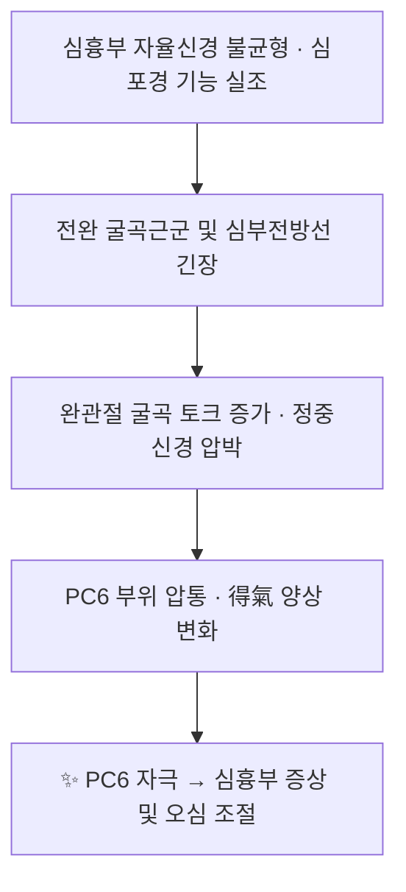

# 🫀 [[내관]] (PC6, Neiguan)

> **핵심 요약 (Key Summary)**:
> [[내관]](內關, PC6)은 [[수궐음심포경]]의 **絡穴**이자 **八脈交會穴(通陰維脈)**로, 전완 전면 완관절 주름 상방 2촌, [[장장근]]건과 [[요측수근굴근]]건 사이에 위치하며 **직하방에 [[정중신경]]이 주행**하는 해부학적 특성을 가진다.
> 심흉부·위장관 증상(협심증, 심계항진, 오심·구토, 멀미, 불면)에 광범위하게 활용되며, **관상동맥질환**(PMID 41573021)·**심근 허혈-재관류 손상**(PMID 41398800)·**항암화학요법 유발 오심구토(CINV)**(PMID 38767643)·**임신성 오심구토**(PMID 39214380) 관련 임상연구가 보고되어 있다.
> 핵심 치료 타깃은 [[자율신경조절]], [[심흉부 질환]], [[오심·구토 증후군]]이며, 침·지압·약침(약침은 **근거 미확인**)과 [[전완 굴곡근]] 이완 요법을 병용한다.

> ℹ️ **템플릿 적용 주석**: 본 노트는 "근골격계(해부·질환)" 템플릿을 기반으로 작성되었으나, 대상 개념이 **경혈(acupoint)**이므로 각 섹션의 제목 구조는 그대로 유지하되 내용을 **경혈 해부학·생체역학·임상** 관점으로 재해석하였다. 이미지가 제공되지 않아 **이미지 임베드는 포함하지 않았으며**, 도해가 필요한 항목은 참조 문헌으로 대체 표기하였다.

---

## 📌 목차
1. [해부학적 정밀 구조 및 지배 신경/혈관](#1-해부학적-정밀-구조-및-지배-신경혈관)
2. [생체역학·토크 분석 & 근막 사슬 (Biomechanical Synergy)](#2-생체역학토크-분석--근막-사슬-biomechanical-synergy)
3. [근막통증증후군(TP) & 연관통 패턴 (Travell & Simons)](#3-근막통증증후군tp--연관통-패턴-travell--simons)
4. [초음파 해부학(Sonoanatomy) 및 중재 시술 랜드마크](#4-초음파-해부학sonoanatomy-및-중재-시술-랜드마크)
5. [⭐ 원장님 심층 임상 고찰 및 원본 필기 (Clinical Pearls)](#5-원장님-심층-임상-고찰-및-원본-필기-clinical-pearls)
6. [관련 임상 질환 및 운동손상 증후군 총괄](#6-관련-임상-질환-및-운동손상-증후군-총괄)
7. [추나·도수치료(MET/PIR) & 침구·약침·재활 프로토콜](#7-추나도수치료metpir--침구약침재활-프로토콜)
8. [출처 및 학술 참고 문헌 (References)](#8-출처-및-학술-참고-문헌-references)

---
## 1. 해부학적 정밀 구조 및 지배 신경/혈관

[[내관]](PC6)은 근육이 아닌 **경혈**이므로, "기시·정지" 대신 **경혈의 표준 위치·층별 구조물·지배 신경·위험 구조물**을 정밀 기술한다.

| 항목 | 상세 내용 |
| :--- | :--- |
| **경혈 명칭** | 內關 (Neiguan, PC6) — 手厥陰心包經의 **絡穴**, **八脈交會穴(通陰維脈)** |
| **소속 경락** | [[수궐음심포경]] (Hand Jueyin Pericardium Meridian) — 편측 9혈(天池·天泉·曲澤·郄門·間使·**內關**·大陵·勞宮·中衝) 중 6번째 |
| **표준 위치 (Location)** | 전완 전면(前面), [[대릉]](PC7, 완관절 전면 주름) 상방 **2촌**, [[장장근]](Palmaris longus) 건과 [[요측수근굴근]](Flexor carpi radialis) 건 **사이** |
| **천자 방향·심도** | 直刺 **0.5~1촌** (약 15~25 mm). 요측수근굴근건의 척측연(내측연)을 따라 자입하며, 得氣 시 **수장부 및 제2~4수지로 향하는 저림·전격감**(정중신경 자극감)이 나타날 수 있음 |
| **층별 구조 (Layer-by-layer)** | 피부 → 피하조직 → [[전완근막]](antebrachial fascia) → [[장장근]]건/[[요측수근굴근]]건 사이 결합조직 → [[천지굴근]](FDS) → [[정중신경]] 및 [[전골간신경]]·[[전골간동맥]] (심부) |
| **감각 지배 (Cutaneous)** | 전완 전내측 피부는 [[내측전완피부신경]](medial antebrachial cutaneous n., C8–T1 계열) 및 [[정중신경]]의 **장피지(palmar cutaneous branch)** 분포가 관여. 개인별 분포 변이가 크므로 세부 분절 기여도는 **근거 미확인** |
| **심부 신경 (위험 구조물)** | **[[정중신경]]** — PC6 직하방에 위치하며, 전완 원위부에서 천지굴근(FDS)과 천부에 놓여 완관절 근처에서 표층화됨. **가장 중요한 회피 대상** |
| **인접 혈관** | [[전골간동맥]](anterior interosseous a.)이 심부에 주행, [[요골동맥]]·[[척골동맥]]은 각각 요측·척측 원위 전완에서 촉지 가능. **척골동맥·척골정맥은 PC6에서 척측(내측)으로 근접** |
| **해부학적 변이** | [[장장근]]은 인구의 상당수(문헌에 따라 약 10~15%로 흔히 인용)에서 **선천적 결손**이 있어, 임상에서 "두 건 사이" 촉진이 어려울 수 있음. 정확한 빈도는 **근거 미확인** |

### 🔬 해부학 도해 및 단면도 (텍스트 대체)
이미지가 제공되지 않아 임베드를 포함하지 않았다. 다음 문헌의 도해를 직접 참조할 것.

- **Gray's Anatomy (42nd ed.)**: 전완 전면 천층 근육 및 정중신경 주행 도해.
- **표준 경혈 해부 아틀라스**: 완관절 전면 횡단면(장장근건·요측수근굴근건·정중신경의 삼각 관계).

> **임상적 핵심**: PC6의 得氣(득기) 양상이 "저림·전격감"으로 나타나는 것은 **정중신경 자극**이라는 해부학적 사실에 기인한다. 따라서 강한 자극은 신경 손상 위험이 있으므로 **회전수·자극량을 조절**해야 한다.

---
## 2. 생체역학·토크 분석 & 근막 사슬 (Biomechanical Synergy)

경혈 자체는 능동적 수축 조직이 아니지만, PC6가 놓인 **전완 굴곡근 구획(flexor compartment)**의 토크 발생 구조와 근막 연속성 위에 위치하므로, 주변 조직의 생체역학적 상태가 경혈의 압통·자극 반응에 직접 영향을 준다.

* **분절별 모멘트 암과 토크**: PC6는 완관절 굴곡의 **작용선상(장장근·요측수근굴근)**에 놓인다. 완관절 굴곡 시 이들 건은 지렛대 역할을 하며, 과사용 시 건 부착부와 근막에 인장 스트레스가 집중되어 PC6 부위 압통으로 이어질 수 있다.
* **근막 사슬 연계 (Myers Anatomy Trains 기반 가설)**:
  - **천부 전방선(Superficial Front Line)**: 전완 굴곡근군은 상완 이두근·흉근을 거쳐 체간 전면과 연결된다. 따라서 전완 굴곡근의 과긴장은 흉곽 전면의 긴장과 동반될 수 있다.
  - **심부 전방선(Deep Front Line)**: Myers는 심부 전방선의 상부에 **종격·심막(pericardium) 및 흉곽 내막(fascia)**이 포함된다고 기술한다. 이는 "심포경(心包經)"이라는 경락 개념과 흥미롭게 대응되지만, **해부학적 연속성과 경락 개념의 직접적 동일시는 이론적 가설이며 근거 미확인**이다.
* **임상적 해석**: 심흉부 증상 환자에서 전완 굴곡근의 과긴장·압통이 동반되는 경우가 있으며, 이 경우 PC6 자침과 함께 **전완 굴곡근 이완**을 병행하면 자극 반응이 개선될 수 있다(경험적 관찰, 정량 근거 **미확인**).

---
## 3. 근막통증증후군(TP) & 연관통 패턴 (Travell & Simons)

이미지가 제공되지 않아 임베드를 포함하지 않았다. Travell & Simons 원전의 전완 굴곡근 도해를 참조할 것.

* **해당 부위 관련 근육의 발통점(TrP)**:
  - [[요측수근굴근]](FCR): TrP는 완관절 **전면(수장측)** 및 수부로 연관통을 유발하는 것으로 기술됨.
  - [[장장근]](PL): TrP는 손바닥 및 제1수지 방향으로 통증을 방사하는 것으로 기술됨.
  - [[천지굴근]](FDS): TrP는 전완 전면 심부 및 수지로 연관통.
* **PC6와의 관계**: PC6는 요측수근굴근건과 장장근건 사이에 위치하므로, 이들 근육의 TrP는 **PC6 부위 압통으로 오인되거나 PC6 자극 시 통증을 증폭**시킬 수 있다. 따라서 PC6 자침 전 **전완 굴곡근 TrP 유발 검사(압통·연관통 재현)**를 시행하는 것이 감별에 유용하다.
* **연관통과 심흉부 증상의 감별**: 흉통 환자에서 전완 굴곡근 TrP 및 흉근·사각근 TrP가 심흉부 통증을 모방할 수 있으므로, **심장 기원 통증(협심증·심근경색)과의 감별이 최우선**이다. 심전도·효소검사 등 의학적 평가가 선행되어야 한다.
* ⚠️ 위 TrP별 세부 연관통 분포는 Travell & Simons의 고전 기술에 기반한 것으로, 본 노트 작성 시 1차 원문 페이지를 직접 대조하지 않았으므로 **'근거 미확인'**으로 표기하며, 실제 진료에서는 촉진 검사로 확인할 것.

---
## 4. 초음파 해부학(Sonoanatomy) 및 중재 시술 랜드마크

![[내관_수부_경혈도.jpg|540]]
> [그림 1: 수부·완부 경혈도 — 손목·손바닥면 경혈 위치 (Wellcome Collection L0037971, Public Domain)]

![[내관_경혈도_확대.jpg|540]]
> [그림 2: 확대 — 아래팔 내관(內關) 위치. 위에서부터 間使(간사)·內關(내관)·大陵(대릉)·勞宮(노궁)]

![[내관_심포경_경혈도.jpg|540]]
> [그림 3: 수궐음심포경 경혈도 — 팔 안쪽을 따라 郄門·間使·內關·大陵·勞宮이 표시된 고전 경혈도 (Wellcome Collection L0037980, Public Domain)]

* **스캔 뷰 (표준)**: 완관절 전면 주름 상방 2촌 높이에서 **횡단면(transverse, short-axis)** 프로브를 전완 전면에 위치.
* **식별 구조물 (요측 → 척측 순)**:
  1. **[[요측수근굴근]]건** — 요측, 원형~타원형의 고에코 건성 구조.
  2. **[[장장근]]건** — 중앙, 가늘고 고에코. 결손 시 식별 불가.
  3. **[[정중신경]]** — 건들 심부의 **저에코 다발성(벌집모양, honeycomb)** 구조. 완관절에 가까워질수록 표층화.
  4. **[[천지굴근]]·[[천지굴근]] 심부의 [[전골간막]]** — 심부 경계.
  5. **[[척골동맥]]·[[척골정맥]]** — 척측(내측)에서 도플러로 확인.
* **안전 마진(Safety Margin)**:
  - PC6 자침·약침 시 **정중신경 초내(intraneural) 주입 회피**가 최우선. 신경 자극 시 강한 전격감이 유발되면 즉시 침을 후퇴시킨다.
  - **척골동맥·정맥** 및 **요골동맥**을 도플러로 확인하여 혈관 천자 회피.
  - 전완근막 천자 시 **건(tendon) 내 주입 회피**.
* **초음파 유도 접근법**: Out-of-plane 기법으로 침 끝(tip)을 실시간 추적하며, **정중신경 위 근막층(fascial plane)**까지 도달시키는 것이 안전하다. 약침액 주입 시 소량씩 음압 확인 후 주입.
* **주의**: 초음파 유도 PC6 자침의 정확도·안전성에 대한 **정량적 임상 근거는 본 노트에서 확인되지 않음(근거 미확인)**.

---
## 5. ⭐ 원장님 심층 임상 고찰 및 원본 필기 (Clinical Pearls)

> 📝 **원장님 원본 필기 입력란 — 현재 미기재 상태**
> 아래는 문헌 근거 기반 실전 정리이며, 원장님의 독창적 임상 노하우는 이 영역에 직접 추가·보존한다.

* **자침 실무**
  - 直刺 0.5~1촌, 요측수근굴근건 내측연을 따라 자입. 得氣(저림·전격감)를 확인하되 **강자극은 정중신경 손상 위험**이 있으므로 회전·제삽 강도를 조절한다.
  - 補瀉: 심흉부 허증·만성 피로 동반 시 補法, 급성 오심·구토·흉민 시 瀉法 또는 平補平瀉.
* **적응 상황별 운용**
  - **오심·구토(항암·임신·멀미)**: PC6 단독 또는 [[족삼리]](ST36)·[[중완]](CV12) 배합. 항암화학요법 유발 오심구토 예방에서 **비용효과적 보조요법**으로 보고됨(PMID 38767643). 임신성 오심·구토에 대한 체계적 문헌고찰·메타분석도 보고됨(PMID 39214380).
  - **심흉부 질환(협심증·심계항진)**: 관상동맥질환에서 PC6 자침에 대한 **스코핑 리뷰(scoping review)**가 보고됨(PMID 41573021). 단, 표준 심장 치료를 대체하지 않는 **보조 요법**으로 위치시킨다.
  - **동물 기전 연구**: 심근 허혈-재관류 손상 랫트 모델에서 PC6 자침의 심근 손상 관련 기전에 대한 **서술적 리뷰(narrative review)**가 보고됨(PMID 41398800). 구체적 분자기전·수치는 원문 확인 후 보완 필요(**근거 미확인**).
* **감별 진단 필수 사항**
  - 급성 흉통에서 **심근경색 등 응급질환 배제가 최우선**. PC6 자극으로 증상이 완화되더라도 원인 평가를 대체할 수 없다.
  - 전완 굴곡근 TrP·[[손목터널증후군]](정중신경 압박)과의 감별: PC6 부위 압통 + 야간 감각이상 + Tinel/Phalen 검사 양성이면 신경 포착 병변을 고려.
* **환자 교육**
  - 지압 밴드(acupressure band)를 이용한 자가 자극은 비침습적이며 오심 조절에 활용 가능. 단, 강한 압박은 정중신경 자극을 유발할 수 있어 **압박 강도·시간 조절**을 교육한다.
* ⚠️ **원장님 고유 배혈·자극량·계절/체질별 응용 노하우는 미기재 상태이며, 확인 후 이 항목에 보존할 것.**

---
## 6. 관련 임상 질환 및 운동손상 증후군 총괄

| 임상 질환 / 증후군 | 병리적 연관 기전 | 주요 증상 및 이학적 검사 | 핵심 교정 타깃 |
| :--- | :--- | :--- | :--- |
| [[관상동맥질환]](협심증·심계항진) | 자율신경 조절·심근 관류 관련 기전이 논의됨(**근거 미확인**) | 흉통·압박감, 운동 시 악화, 심전도·관상동맥 평가 | PC6 자침(보조요법) — PMID 41573021 |
| [[심근 허혈-재관류 손상]] | 랫트 모델에서 PC6 자침 관련 심근 보호 기전 연구(서술적 리뷰) | 동물 모델 — 임상 적용은 별도 검증 필요 | PC6 전침 등 — PMID 41398800 |
| [[항암화학요법 유발 오심구토]](CINV) | 구토 반사 조절·자율신경 조절(가설) | 항암 후 오심·구토, 구토 횟수 | PC6 자극 — 비용효과적 보조(PMID 38767643) |
| [[임신성 오심구토]](NVP) | 구토 반사 억제·자율신경 조절(가설) | 임신 초기 오심·구토, PUQE 점수 | PC6 포함 침 치료 — SR/MA (PMID 39214380) |
| [[멀미]](motion sickness)·[[기능성 소화불량]] | 전정-자율신경 연계 및 위장관 운동 조절(가설) | 차량·배 멀미, 상복부 불편감 | PC6 지압·자침 (근거 수준 **미확인**) |
| [[불면]]·[[불안]] | 자율신경 안정화 기전(가설) | 입면 곤란, 야간 각성, 불안 척도 | PC6 + [[신문]](HT7) + [[태충]](LR3) 배합 (경험적) |

---
## 7. 추나·도수치료(MET/PIR) & 침구·약침·재활 프로토콜

* **한의학 경혈 매핑**
  - 주혈: [[내관]](PC6) — 手厥陰心包經 絡穴, 通陰維脈.
  - 배혈(임상 응용):
    - 오심·구토: [[족삼리]](ST36), [[중완]](CV12), [[공손]](SP4)
    - 심흉부: [[극천]](HT1)·[[단중]](CV17), [[심수]](BL15), [[궐음수]](BL14)
    - 불면·불안: [[신문]](HT7), [[삼음교]](SP6), [[태충]](LR3)
    - 멀미: [[예풍]](TE17), [[풍지]](GB20), [[족삼리]](ST36)
  - 배혈 구성은 전통적 상용 조합이며, 개별 조합의 유효성을 정량적으로 검증한 문헌은 본 노트에서 **근거 미확인**.
* **침 치료 프로토콜(일반 원칙)**
  1. 환자 앙와위, 전완 회내위(pronated) 및 소폭 굴곡으로 안정화.
  2. PC6 국소 소독 후 直刺 0.5~1촌, 得氣 확인(저림감).
  3. 유침 15~20분, 필요 시 전침(2~10 Hz 대역 등) 병용. 자극 강도는 환자 반응에 따라 조절.
  4. 오심 예방 목적이면 **화학요법·수술 전 예방적 자극**이 유리하다는 보고가 있음(PMID 38767643).
* **지압·비침습 자극**
  - PC6 지압 밴드는 비용이 낮고 부작용이 적어 **가이드라인 비일치 예방군에서 비용효과적 보충 요법**으로 제안됨(PMID 38767643).
  - 임신성 오심·구토에서 침 치료의 효과는 SR/MA로 보고됨(PMID 39214380). 단, 임산부에서의 자극 강도·경혈 선택은 안전성을 우선 고려.
* **약침**
  - PC6 약침의 유효성·안전성에 대한 문헌은 본 노트에서 확인되지 않음 → **근거 미확인**. 시행 시 정중신경 초내 주입 회피, 소량 주입, 무균 조작 원칙 준수.
* **도수치료(MET/PIR) 및 재활**
  - **전완 굴곡근 PIR(post-isometric relaxation)**: 요측수근굴근·장장근·천지굴근에 대해 등척성 수축(20% MVC, 5~7초) → 호기와 함께 부드러운 신장 → 3~5회 반복.
  - **신경 활주 운동(nerve gliding)**: 정중신경 활주 운동을 저강도로 시행하여 신경 가동성 개선(단, 급성 자극기에는 금기).
  - **호흡·자율신경 재훈련**: 횡격막 호흡·점진적 이완을 병행하여 심흉부 증상 및 불안 조절.
  - 위 도수·재활 프로토콜은 **근거 기반 일반 원칙 + 임상 경험**에 따른 것이며, PC6 특이적 정량 프로토콜은 **근거 미확인**.

---
## 8. 출처 및 학술 참고 문헌 (References)

1. **Yue JH, Gao SL (2025)**. Acupuncture at Neiguan Acupoint (PC6) for Coronary Heart Disease: A Scoping Review. *Med Acupunct*. **PMID: 41573021**
2. **Xin Q, Gao Z (2025)**. Research progress on the mechanisms related to myocardial injury in rats with myocardial ischemia-reperfusion injury treated by acupuncture at neiguan (PC6) acupoint: A narrative review. *Medicine (Baltimore)*. **PMID: 41398800**
3. **Wenxi YU, Lina T (2024)**. Neiguan (PC6) acupoint stimulation for preventing chemotherapy-induced nausea and vomiting: a cost-effective supplement in guideline-inconsistent chemotherapy-induced nausea and vomiting prophylaxis subgroup. *J Tradit Chin Med*. **PMID: 38767643**
4. **Jin B, Han Y (2024)**. Acupuncture for nausea and vomiting during pregnancy: A systematic review and meta-analysis. *Complement Ther Med*. **PMID: 39214380**
5. **Standring, S. (2020)**. *Gray's Anatomy: The Anatomical Basis of Clinical Practice* (42nd ed.). Elsevier. *(템플릿 제공 표준 해부학 교과서 — 해부학 서술 근거)*
6. **Travell, J. G., & Simons, D. G. (1999)**. *Myofascial Pain and Dysfunction: The Trigger Point Manual*, Vol. 1. *(템플릿 제공 표준 문헌 — 근막통증증후군 서술 근거)*

> ⚠️ **미확인 항목 요약**: ①PC6 자침의 분자기전 세부 수치(PMID 41398800 원문 미대조), ②전완 굴곡근 TrP별 연관통 분포의 원문 대조, ③PC6 약침의 유효성·안전성, ④초음파 유도 PC6 자침의 정량 근거, ⑤개별 배혈 조합의 정량적 효능 — 이상은 **근거 미확인** 상태로, 원문 확보 후 갱신 필요.

<!-- 보관 태그(1회용·링크오류, 필요시 복원): 낙혈, 심흉부질환, 자율신경조절 -->
