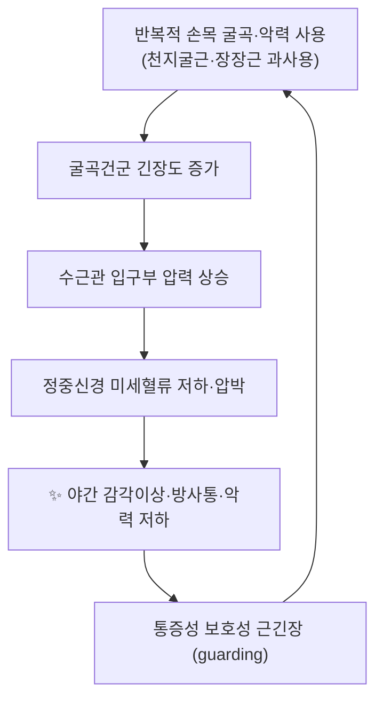

# 🫁 [[경혈/대릉]] (Daling, PC7)

> **핵심 요약 (Key Summary)**:
> [[대릉]](PC7)은 완관절 전면 주름 중앙, [[요측수근굴근]]건과 [[장장근]]건 사이에 위치한 [[수궐음심포경]]의 7번째 경혈로, 자침 시 심부에서 [[정중신경]]과 [[수근관]] 구조물에 근접한다.
> 임상적으로는 [[수근관증후군]]을 비롯한 완관절·수부 통증과 [[흉비]](胸痺)·[[심통]](心痛) 계열 증상에 함께 활용되며, [[내관]](PC6)·[[신문]](HT7) 등 인접 경혈과의 작용 특이성 비교 연구가 존재한다.
> 치료 타깃은 완관절 굴곡건군의 과긴장 완화와 수근관 내 압력 관리이며, 침구·[[약침]] 시술 시 [[정중신경]] 손상 회피가 핵심 안전 고려사항이다.

---
## 📌 목차
1. [해부학적 정밀 구조 및 지배 신경/혈관](#1-해부학적-정밀-구조-및-지배-신경혈관)
2. [생체역학·토크 분석 & 근막 사슬 (Biomechanical Synergy)](#2-생체역학토크-분석--근막-사슬-biomechanical-synergy)
3. [근막통증증후군(TP) & 연관통 패턴 (Travell & Simons)](#3-근막통증증후군tp--연관통-패턴-travell--simons)
4. [초음파 해부학(Sonoanatomy) 및 중재 시술 랜드마크](#4-초음파-해부학sonoanatomy-및-중재-시술-랜드마크)
5. [⭐ 원장님 심층 임상 고찰 및 원본 필기 (Clinical Pearls)](#5-⭐-원장님-심층-임상-고찰-및-원본-필기-clinical-pearls)
6. [관련 임상 질환 및 운동손상 증후군 총괄](#6-관련-임상-질환-및-운동손상-증후군-총괄)
7. [추나·도수치료(MET/PIR) & 침구·약침·재활 프로토콜](#7-추나도수치료metpir--침구약침재활-프로토콜)
8. [출처 및 학술 참고 문헌 (References)](#8-출처-및-학술-참고-문헌-references)

---
## 1. 해부학적 정밀 구조 및 지배 신경/혈관

[[대릉]](PC7)은 근육의 기시·정지 개념으로 정의되는 구조물이 아니라 **경혈(acupoint)** 이므로, 본 항목은 템플릿의 골격을 유지하되 “경혈의 표준 위치와 그 자입 경로상의 층별 해부 구조”로 재구성한다.

| 항목 | 상세 내용 |
| :--- | :--- |
| **표준 위치 (Location)** | 완관절 전면(장측) 원위 주름의 중앙, [[요측수근굴근]]건(FCR)과 [[장장근]]건(PL) 사이의 함요부 (WHO 표준 경혈 위치 기준) |
| **층별 구조 (Layer)** | 피부 → 피하 지방·천장근막 → [[장장근]]건 및 [[요측수근굴근]]건 사이 결합조직 → [[천지굴근]](FDS)건 열 → [[수근관]] 입구부 → [[정중신경]] |
| **신경 지배 (Innervation)** | 국소 피부: [[정중신경]]의 [[수장피부지]](palmar cutaneous branch) 및 전완외측피신경 분지 / 심부 자입 시 [[정중신경]] 본간과 근접 |
| **혈관 공급 (Vascular)** | [[요골동맥]]·[[척골동맥]]의 수장 수근 가지 및 천장동맥궁(palmar carpal arch) 계열이 인접 |
| **자침 심도·각도** | 직자 0.3~0.5寸(교과서 기준), 완관절 하방 45° 사자(斜刺) 응용. 개인차 및 문헌별 기술 차이 존재 |

### 🔬 층별 해부학 및 인접 구조 (텍스트 정리)

- **표재층**: 얇은 피부와 피하조직. 손목 주름이 곧 완관절의 골성 기준선(요골 원위단·근위 수근열)과 대략 일치한다.
- **건층**: [[장장근]]건은 완관절 주름 중앙의 가장 표재성 지표이며, 해부학적 변이(선천적 결손)가 흔하여 촉진으로 확인이 어려운 경우가 있다. 요측에는 [[요측수근굴근]]건, 척측에는 [[척측수근굴근]]건이 위치한다.
- **심부**: [[천지굴근]]건과 [[천지굴근]] 활차, [[수근관]]이 형성하는 터널이 있으며, 그 내부를 [[정중신경]]이 통과한다. 즉 PC7 자입은 **수근관 입구부의 정중신경과 해부학적으로 매우 근접**한 위치에 해당한다.
- **변이 주의**: 정중신경의 분지 형태, [[정중동맥]](median artery of forearm)의 존재 여부, 장장근 결손 등은 개인차가 크므로 맹목적 심자(深刺)는 권장되지 않는다. 수치적 발생률은 **근거 미확인**.

> 참고: 본 노트에는 제공된 이미지 블록이 없으므로 도해·단면도 임베드는 수록하지 않았으며, 위 층별 구조 기술로 대체한다.

---
## 2. 생체역학·토크 분석 & 근막 사슬 (Biomechanical Synergy)

[[대릉]]이 위치한 완관절은 손목 굴곡·신전, 요측·척측 편위, 회내·회외가 복합되는 다축 관절이다. PC7 주변 구조는 주로 **손목 굴곡건군과 수근관 내 압력 조절**에 관여한다.

* **모멘트·토크 관점(일반 역학)**: 손목 굴곡 시 [[천지굴근]]·[[천지굴근]] 및 [[척측수근굴근]]이 협력하고, 장장근은 장측 근막 긴장(aponeurosis) 유지에 관여한다. 완관절 중립 위에서 굴곡건의 활주 저항이 최소화되므로, 수근관 증상 환자에서는 **중립 위 유지가 압력 감소에 유리**하다는 것이 일반적 생체역학 정설이다.
* **근막 사슬 연계 (Myers Anatomy Trains 관점)**: 전완 굴곡군은 상완 이두근·흉근을 거쳐 **심부전방선(Deep Front Arm Line)**, 그리고 손바닥·손가락 굴곡건을 통해 나선선(Spiral Line) 일부와 연결된다. 따라서 PC7 자극은 국소 건·수근관뿐 아니라 근위 [[흉소근]](pectoralis minor) 긴장, 경흉추 자세와 연동하여 평가하는 것이 임상적으로 타당하다.
* 단, 위 사슬 연결의 **정량적 힘 전달 수치(토크 값, 전달 비율)는 근거 미확인**이며, 본 노트에서 특정 수치를 제시하지 않는다.

---
## 3. 근막통증증후군(TP) & 연관통 패턴 (Travell & Simons)

본 항목의 주체는 근육이 아니므로, PC7과 해부학적으로 중첩되는 **손목·전완 굴곡근군의 발통점(TrP) 및 정중신경 자극 시 연관 감각 패턴**으로 정리한다.

* **국소 압통점(TrP) 후보 구조**: [[천지굴근]](특히 제3·4지 담당 근육속), [[장장근]], [[요측수근굴근]]. 이들 근육의 TrP는 손목 장측 통증 및 손가락으로의 확산통을 유발하는 것으로 Travell & Simons 문헌에 기술되어 있다.
* **정중신경 자극(경혈 자침 시) 연관 감각**: 자침 시 제2~4지로의 저림·전격감이 나타날 수 있으며, 이는 신경 본간 근접성에 기인한다. 이 감각의 강도·빈도에 대한 **정량적 보고는 근거 미확인**.
* **수근관증후군과의 감별 포인트**: TrP성 통증은 근육 압박 시 재현되고 야간 악화 양상이 상대적으로 약한 반면, 신경성 증상은 [[Tinel 징후]]·[[Phalen 검사]] 등 유발 검사에서 재현되는 경향이 있다(일반 임상 감별 원칙).
* 트라벨 도해 이미지는 본 노트에 제공된 블록이 없어 임베드하지 않는다.

---
## 4. 초음파 해부학(Sonoanatomy) 및 중재 시술 랜드마크

* **스캔 뷰**: 완관절 전면 횡단면(transverse, “수근관 뷰”)에서 [[정중신경]]은 [[천지굴근]]건 열의 표재·요측에 위치한 저에코성 타원 구조로 관찰된다. 종단면(longitudinal)에서는 신경속(fascicular) 패턴을 확인한다.
* **랜드마크**: [[장장근]]건(표재) – [[요측수근굴근]]건(요측) – [[수근관]] 지붕(굴근지대, flexor retinaculum) – [[정중신경]] – [[천지굴근]]건.
* **안전 마진**: 침 치료 및 [[약침]] 시술 시 초음파 유도 하에 신경 외막을 직접 천자하지 않도록 하고, 주행 방향과 평행한 접근 또는 신경에서 이격된 자입을 고려한다. 신경 내 직접 주입 시 신경내 혈종·감각 이상 위험이 보고될 수 있으므로 **초음파 미사용 맹검 심자는 지양**하는 것이 일반적 권고이다(구체적 합병증 발생률은 **근거 미확인**).
* **혈관 회피**: 요측 [[요골동맥]] 박동과 척측 [[척골동맥]] 주행을 사전 촉진·도플러로 확인한다.
* 수근관증후군에서 초음파상 [[정중신경]] 단면적(CSA) 증가, 굴근지대 활궁화 등이 관찰된다는 기술은 일반적이나, 본 노트에서 **구체적 수치 기준(cut-off)은 근거 미확인**이므로 제시하지 않는다.

---
## 5. ⭐ 원장님 심층 임상 고찰 및 원본 필기 (Clinical Pearls)

> ⚠️ 본 노트에는 **원장님 원본 필기 데이터가 첨부되지 않았다.** 따라서 아래 항목은 문헌·교과서 기반의 임상 정리이며, 원장님 고유의 필기·증례 코멘트는 추후 원본 그대로 보존·추가되어야 한다(현재 **근거 미확인** 영역).

* **경혈 선택 원칙(문헌 기반)**: [[신문]](HT7)과 [[대릉]](PC7)의 작용 특이성을 비교한 연구가 존재하며, 두 혈이 동일 계열(수소음·수궐음)에 속하되 반응 양상에 차이가 있을 가능성이 제기되었다[2]. 실제 배혈에서는 증상 부위·변증에 따라 주혈과 배혈을 구분하는 접근이 합리적이다.
* **수근관증후군에서의 활용**: 침 치료가 수근관증후군에 임상적으로 활용되며 유효성 연구가 존재한다[3]. 또한 경증~중등도 환자에서 **건측 원위 취혈 + 환측 국소 취혈**을 비교한 임상연구가 보고되어, 자침 부위 선택(동측 국소 vs 건측 원위)이 임상 결과에 영향을 줄 수 있다는 가설이 제기되었다[5]. 다만 본 노트에서는 해당 연구의 구체적 효과 크기·유의성 수치를 확인할 수 없으므로 **근거 미확인**으로 표기한다.
* **중추 반응 관련**: PC7에 경피 전기자극을 적용했을 때 대뇌피질 기능연결망(functional network) 변화가 관찰되었다는 연구가 보고되었다[1]. 이는 경혈 자극이 국소 효과를 넘어 중추 조절에 관여할 가능성을 시사한다.
* **흉비·심통 배혈 원칙**: 고대 침구 처방 데이터마이닝을 통해 흉비·심통(胸痺·心痛) 처방의 구성 원리가 분석된 연구가 있다[4]. 대릉이 해당 처방군에 포함되는지, 포함 시 빈도·배합 규칙이 어떠한지는 **원문 초록 미확인으로 근거 미확인**.
* **실전 팁(일반 원칙)**: 야간 통증이 심한 수근관증후군 환자에서는 완관절 중립 부목과 병행하고, 자침은 천자~중자로 시작하여 환자의 저림 반응을 확인하며 진행한다. 강한 전격감이 반복 유발되면 신경 자극 과다로 판단하고 자극 강도를 낮춘다.

---
## 6. 관련 임상 질환 및 운동손상 증후군 총괄

| 임상 질환 / 증후군 | 병리적 연관 기전 | 주요 증상 및 이학적 검사 | 핵심 교정 타깃 |
| :--- | :--- | :--- | :--- |
| [[수근관증후군]] | 수근관 내 압력 상승 → [[정중신경]] 압박·미세혈류 저하 | 야간 감각이상(제1~4지), 악력 저하, [[Tinel 징후]], [[Phalen 검사]] | 완관절 중립 유지, 굴곡건군 긴장 완화, 굴근지대 주변 연부조직 이완 |
| [[전완부 정중신경 포착]](pronator teres syndrome) | [[원회내근]]·굴곡건 활차부 압박 | 전완부 통증, 반복적 악력 사용 시 악화 | [[원회내근]] 이완, 신경 활주 운동 |
| [[손목 굴곡건초염]] | [[천지굴근]]·[[장장근]] 과사용에 따른 건초 염증 | 국소 압통, 저항성 굴곡 시 통증 | 굴곡건 부하 조절, 점진적 이완·강화 |
| [[흉비]](胸痺)·[[심통]](心痛) 계열 | [[수궐음심포경]] 순환 조절 관점(한의학적 병기) | 흉민, 심계, 흉통 양상 | [[내관]](PC6)·[[극문]](PC4) 등과 배합, 변증에 따른 가감 |
| [[완관절 염좌]]·만성 불안정 | 인대·관절낭 손상 후 고유수용감각 저하 | 부하 시 통증, 불안정감 | 완관절 안정화 근육 강화, 고유수용 훈련 |

※ 각 질환과 PC7 자극의 인과적 치료 효과 크기는 개별 연구 설계·대상에 따라 달라지며, 본 노트에서 확인된 문헌은 [1]~[5] 범위에 한정된다.

---
## 7. 추나·도수치료(MET/PIR) & 침구·약침·재활 프로토콜

* **한의학 경혈 매핑**: [[대릉]](PC7)은 동일 경락의 [[내관]](PC6)·[[간사]](PC5)·[[극문]](PC4)·[[노궁]](PC8)과 배합되고, 인접 경락으로는 [[신문]](HT7, 수소음심경)·[[양지]](TE4)·[[외관]](TE5, 수소양삼초경)과 해부학적·기능적으로 연계된다.
* **경혈 특이성 참고**: [[신문]](HT7)과 [[대릉]](PC7)의 작용 특이성을 비교한 연구[2]는 배혈 선택 시 두 혈의 역할 구분 근거로 활용 가능하다.
* **국소 vs 원위 취혈**: 경증~중등도 [[수근관증후군]]에서 건측 원위 취혈 기법과 환측 국소 취혈을 비교한 임상연구[5], 그리고 수근관증후군에 대한 침 치료 임상 효과 연구[3]가 보고되어 있다. 치료 강도·기간·평가지표는 원문 미확인으로 **근거 미확인**.
* **경피 전기자극 응용**: PC7 경피 전기자극 시 대뇌피질 기능연결망 변화가 관찰된 연구[1]가 있어, 자극 강도·주파수 설정 시 참고 가능하다(구체 프로토콜 수치는 **근거 미확인**).
* **근에너지기법 (MET/PIR)**: 전완 굴곡근군에 대해 완관절 중립~약간 신전 상태에서 등척성 수축(5~10초, 3~5회) 후 호기 시 부드럽게 신장하는 기법을 적용한다. 과긴장성 보호성 근수축(guarding)이 있는 급성기에는 강한 신장보다 저부하 등척성 위주로 접근한다.
* **자가 재활**: 신경 활주 운동(median nerve gliding), 야간 중립 부목, 악력·집기 강화의 점진적 단계화.
* **약침·침구 시술 시 안전**: 해부학적 위험 구조물([[정중신경]], [[수근관]] 내 구조)과의 근접성을 고려하여 심자·강자극을 피하고, 시술 후 감각이상 지속 여부를 반드시 재평가한다. 약침 용량·농도 등 구체적 시술 변수는 본 노트 범위에서 **근거 미확인**.

---
## 8. 출처 및 학술 참고 문헌 (References)

1. **Standring, S. (2020)**. *Gray's Anatomy: The Anatomical Basis of Clinical Practice* (42nd ed.). Elsevier.
2. **Travell, J. G., & Simons, D. G. (1999)**. *Myofascial Pain and Dysfunction: The Trigger Point Manual*, Vol. 1.
3. **Wang H, Yin N (2023)**. Cerebral cortex Functional Networks of Transdermal Electrical Stimulation at Daling (PC7) Acupoint. *Clin EEG Neurosci*. PMID: 36113449
4. **Li ZJ, Sun ZR (2012)**. [Study on specificity of acupuncture effect of Shenmen (HT 7) and Daling (PC 7)]. *Zhongguo Zhen Jiu*. PMID: 22734382
5. **Ho CY, Lin HC (2014)**. Clinical effectiveness of acupuncture for carpal tunnel syndrome. *Am J Chin Med*. PMID: 24707864
6. **Wang J, Jing X (2025)**. [Composition principles for chest obstruction and heart pain based on data mining of ancient acupuncture-moxibustion prescriptions]. *Zhongguo Zhen Jiu*. PMID: 41074530
7. **Chen L, Xue L (2017)**. [Clinical research on mild and moderate carpal tunnel syndrome treated with contralateral needling technique at distal acupoints and acupuncture at local acupoints]. *Zhongguo Zhen Jiu*. PMID: 29231607

※ 본 노트에 인용된 학술 문헌은 위 목록의 실제 PubMed 데이터에 한정하며, 확인되지 않은 수치·기전·PMID는 기재하지 않았다. 불확실 항목은 본문에 **근거 미확인**으로 명시하였다.

<!-- 보관 태그(1회용·링크오류, 필요시 복원): PC7 -->
