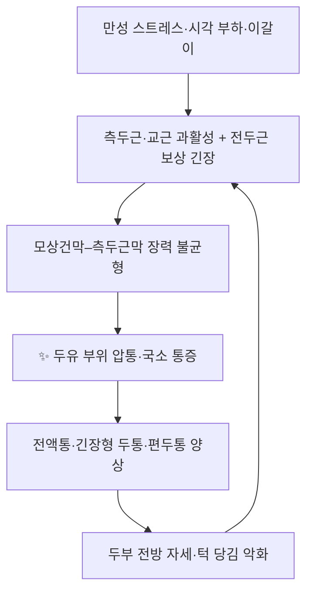

# 📍 [[두유]] (頭維 / ST8)

> **핵심 요약 (Key Summary)**:
> [[두유]](頭維, ST8)는 이마 옆각의 **앞머리카락 경계에서 0.5촌 위, 정중선에서 4.5촌 외측**에 위치한 [[족양명위경]]의 제8번째 경혈로, 천층은 [[전두근]]힘살·[[모상건막]]과 [[측두근막]]이 만나는 근막 접합부, 심층은 [[전두골]] 골막에 닿는다.
> 감각은 [[삼차신경]] 제1지(V1) [[안와상신경]]과 제3지(V3) [[이개측두신경]] 분포가 겹치는 경계역이며, 전통적으로 [[족소양담경]]·[[양유맥]]과의 교회혈로 분류된다.
> 임상적으로는 [[전액통]]·[[긴장형 두통]]·[[편두통]]·[[안면마비]]·안정피로의 국소 치료혈이며, [[두개주위근 압통]](pericranial muscle tenderness) 평가·교정의 핵심 랜드마크로 쓰인다.

---

## 📌 목차
1. [해부학적 정밀 구조 및 지배 신경/혈관](#1-해부학적-정밀-구조-및-지배-신경혈관)
2. [생체역학·토크 분석 & 근막 사슬 (Biomechanical Synergy)](#2-생체역학토크-분석--근막-사슬-biomechanical-synergy)
3. [근막통증증후군(TP) & 연관통 패턴 (Travell & Simons)](#3-근막통증증후군tp--연관통-패턴-travell--simons)
4. [초음파 해부학(Sonoanatomy) 및 중재 시술 랜드마크](#4-초음파-해부학sonoanatomy-및-중재-시술-랜드마크)
5. [⭐ 원장님 심층 임상 고찰 및 원본 필기 (Clinical Pearls)](#5-원장님-심층-임상-고찰-및-원본-필기-clinical-pearls)
6. [관련 임상 질환 및 운동손상 증후군 총괄](#6-관련-임상-질환-및-운동손상-증후군-총괄)
7. [추나·도수치료(MET/PIR) & 침구·약침·재활 프로토콜](#7-추나도수치료metpir--침구약침재활-프로토콜)
8. [출처 및 학술 참고 문헌 (References)](#8-출처-및-학술-참고-문헌-references)

---

## 1. 해부학적 정밀 구조 및 지배 신경/혈관

| 항목 | 상세 내용 |
| :--- | :--- |
| **표준 위치 (WHO)** | 이마(forehead), 앞머리카락 경계(anterior hairline)에서 **0.5촌 위**, 정중선(正中線)에서 **4.5촌 외측** |
| **고전 위치 기술** | ‘額角入髮際五分’ — 이마 옆각(額角)에서 발제(髮際) 안으로 5분 들어간 지점으로 기술되어 왔으며, [[신정]](GV24)에서 옆으로 4.5촌 되는 곳으로 취혈한다. |
| **소속 경락** | [[족양명위경]](足陽明胃經) 제8혈(ST8). 전통 침구문헌에서는 [[족소양담경]]·[[양유맥]](陽維脈)과의 **교회혈(交會穴)**로 분류된다(교과서 기술 기준). |
| **기시 (Origin) — 관련 근육** | [[전두근]](occipitofrontalis 전두힘살): [[모상건막]](galea aponeurotica) / [[측두근]](temporalis): 측두와(temporal fossa) |
| **정지 (Insertion)** | [[전두근]]: 눈썹 부위 피부 및 [[안와상연]](supraorbital margin) / [[측두근]]: [[하악골]] 근돌기(coronoid process) |
| **신경 지배** | **감각**: [[삼차신경]] 제1지(V1)의 [[안와상신경]](supraorbital n.) 및 그 외측가지, 외측으로는 제3지(V3)의 [[이개측두신경]](auriculotemporal n.) 분포와 중첩되는 경계역. **운동**: [[전두근]] — [[안면신경]](CN VII) 측두가지, [[측두근]] — [[삼차신경]] 하악지의 [[심측두신경]](deep temporal n.) |
| **혈관 공급** | [[천측두동맥]](superficial temporal a.)의 전두가지, [[안와상동맥]](supraorbital a.), [[활차상동맥]](supratrochlear a.) 및 이에 동반하는 정맥 |
| **층 구조 (천→심)** | 피부 → 피하조직(모낭·피지선 풍부) → [[전두근]]힘살·[[모상건막]](외측연에서 [[측두근막]]과 접합) → 모상건막하 소성결합조직(subgaleal loose areolar tissue) → [[전두골]] 골막 |

### 🔬 해부학 도해 및 단면도

해당 부위의 층별 단면 관계를 텍스트로 정리하면 다음과 같다(본 노트에는 별도 이미지를 싣지 않는다).

1. **천층(피부·피하)**: 이마 피부는 비교적 얇고 피하지방과 모낭·피지선이 밀집한다. 천측두동맥의 전두가지와 안와상동맥의 가지, 안와상신경의 측두지(外側枝)가 이 층을 지난다. 자침 시 이 혈관·신경이 **표재부 손상 위험 구조**가 된다.
2. **근막·근층**: [[전두근]]힘살과 두개정수리를 덮는 [[모상건막]]이 하나의 연속 구조를 이루며, 두유는 이 복합체의 **외측연**에서 관자놀이의 [[측두근막]](temporalis fascia)으로 이어지는 접합부에 놓인다. 따라서 같은 자극으로 전두근 섬유와 측두근막에 동시에 기계적 자극이 전달될 수 있다.
3. **심층(subgaleal layer)**: 모상건막하 소성결합조직은 혈관이 풍부하고 유동성이 커서 두개 외상 시 혈종이 확장되기 쉬운 층이다. 침 자입 심도가 깊어질 때 이 층을 지나게 된다.
4. **최심층(골막)**: [[전두골]] 골막에 접촉하면 예리한 통증이 유발되므로, 통상 0.5~0.8촌 범위에서 자입을 멈추고 골막을 강하게 찌르지 않는다(교과서 기술).

> 💡 **핵심 포인트**: 두유는 **근육–건막–근막이 만나는 접합부 경혈**이라는 점이 해부학적 특징이다. 즉 단일 근육의 운동점이라기보다, 두개근막(epicranial aponeurosis) 시스템의 **장력 전환 지점**으로 이해하는 것이 임상적으로 유용하다.

---

## 2. 생체역학·토크 분석 & 근막 사슬 (Biomechanical Synergy)

* **두개근막의 짝힘(tension couple)**: [[후두근]]과 [[전두근]]은 [[모상건막]]을 사이에 두고 서로 반대 방향으로 견인한다. 전두근이 과긴장하면 이마 주름이 증가하고 후두근이 보상적으로 긴장하며, 두유가 놓인 **전두근 외측연**은 이 짝힘에서 가장 먼저 압통이 나타나는 구역 중 하나다.
* **측두근의 토크 특성**: [[측두근]]은 하악골을 거상·후방 견인하는 주동근 중 하나로, 근섬유 배열상 **전방 섬유는 수직(거상)**, **후방 섬유는 수평(후방 견인)** 성분이 우세하다. 두유는 측두근의 전상방 섬유·근막에 근접하므로, 이갈이(clenching)·악물기 습관이 있는 환자에서 압통이 잘 동반된다.
* **근막 사슬 연계 (Myers Anatomy Trains 관점)**:
  * **배측 상지선(SBAL) 계열**: 후두근 → 모상건막 → 전두근 → 눈둘레근·안와주위 → 견갑대·상지로 이어지는 표재성 연결선이 이마에서 교차한다.
  * **천측두근막–SMAS 연계**: [[측두근막]]은 천측두근막을 거쳐 안면 [[SMAS]] 및 경부 근막(경광근·흉쇄유돌근초)과 연속된다. 즉 두유 부위 긴장은 **두개–안면–경부** 장력 사슬 전체와 연결된다.
* **임상적 해석**: 두유 자극은 특정 근육 하나를 "풀어주는" 치료라기보다, 두개근막 시스템의 좌우·전후 장력 균형을 재조정하는 **국소 개입점**으로 활용된다(정량적 토크·근전도 데이터는 본 노트에서 근거 미확인).

---

## 3. 근막통증증후군(TP) & 연관통 패턴 (Travell & Simons)

* **발통점 및 연관통**: Travell & Simons 분류에 ‘두유’라는 경혈 명칭의 발통점은 등재되어 있지 않다. 다만 해부학적 위치상 두유 주변은 다음 두 근육의 발통점·압통 구역과 근접한다.
  * **[[전두근]] 발통점**: 눈썹 위 내측부 및 이마 상부에 위치하며, **이마·안와주위·눈썹 부위**로 연관통을 유발한다. 이마를 찡그리는 표정, 누운 자세에서의 이마 압박이 악화 요인이 된다.
  * **[[측두근]] 발통점**: 관자놀이 앞쪽에 위치하며 **측두부 두통, 눈썹 외측, 상악 치아, 귀 주위 및 이명감**으로 연관통을 만들 수 있다. 이갈이·악물기 습관과 강하게 연관된다.
* **촉진 소견**: 두유 주변을 손가락으로 이마 옆각을 따라 압박하면 전두근 외측연 또는 측두근막 전상부에서 **국소 압통과 연관통 재현**이 흔히 확인된다. 이는 두개주위근 압통 평가에서 임상적으로 유용한 랜드마크다.
* **감별 포인트**: [[안와상신경통]], [[측두동맥염]](고령·박동성 압통·전신 증상 동반), [[삼차신경통]](발작성 전기 충격양 통증)은 국소 근막성 압통과 감별이 필요하다. 측두동맥염이 의심되면 침구 시술 전 의뢰가 우선이다.

---

## 4. 초음파 해부학(Sonoanatomy) 및 중재 시술 랜드마크

* **탐촉자·스캔 뷰**: 고주파 선형 탐촉자(10~15 MHz)를 이마에 **횡단(transverse)** 및 **종단(longitudinal)**으로 위치시킨다. 초음파에서 ① 표재부 피부·피하층, ② 전두근힘살·[[모상건막]](중등도 에코의 근육·건막층), ③ [[전두골]] 골막(고에코의 밝은 선과 그 하방의 음영)의 순서로 확인된다.
* **혈관 확인**: [[천측두동맥]]은 두유보다 약간 외측·후방에서 도플러 신호로 확인되며, [[안와상동맥]]은 안와상공 부위에서 관찰된다. 시술 전 도플러로 주행을 확인하면 **출혈·혈종** 위험을 줄일 수 있다.
* **안전 마진 및 위험 구조물**:
  * **천측두동맥·안와상동맥**: 자침 시 혈관 천자 → 국소 혈종, 압박 시 통증. 시술 후 충분한 압박이 필요하다.
  * **골막**: 과도한 심자 시 예리한 통증·시술 후 두통 유발.
  * **감염 위험**: 두피는 혈류가 풍부해 감염 위험은 상대적으로 낮으나, 모낭 밀집 부위이므로 **멸균**과 시술 부위 소독이 필수다.
* **자침 심도·각도(교과서 기술)**: 통상 **0.5~0.8촌**, 피부에 대해 직자(90°) 또는 하후방(下後方)으로 45° 사자(斜刺)하거나 **평자(平刺, 연피자)**한다. 자침 시 골막 직전까지 도달시키고 강한 염전은 피한다.
* **뜸(灸) 적용**: 전통 문헌에서 두유는 **금구(禁灸)** 혈로 분류되어 왔다(발제 부위 화상·흉터 및 미용 문제). 온구 등 온열 자극을 적용할 경우 자극 강도와 시간을 최소화하고, 근거 수준은 교과서 기술에 한한다(정량적 임상 근거 미확인).

---

## 5. ⭐ 원장님 심층 임상 고찰 및 원본 필기 (Clinical Pearls)

* **취혈 실전 요령**: 정중선의 [[신정]](GV24)을 먼저 잡고, 눈썹 바깥끝 높이를 기준선으로 삼아 **정중선에서 4.5촌 외측 + 발제 0.5촌 상방**을 취한다. 이마가 좁은 환자에서는 발제선이 실제로 불규칙하므로, **눈썹 외측 끝 연장선과 발제 상연의 교차점을 촉지**해 보정하는 것이 실전에서 오차가 적다.
* **촉진 → 자침 순서**: 자침 전에 손가락으로 이마 옆각을 따라 가볍게 훑어 **가장 압통이 심한 지점(전두근 외측연 vs 측두근막 전상부)**을 먼저 찾는다. 같은 두유라도 환자마다 통증 유발점이 전내측/후외측으로 갈리며, 자침 방향을 그 방향으로 눕혀 잡으면 득기감(酸脹感)이 잘 온다.
* **배혈 운용(임상 관행)**:
  * **전액통·긴장형 두통**: 두유 + [[신정]](GV24) + [[인당]](印堂) + [[태양]](太陽) + [[풍지]](GB20) + [[합곡]](LI4) + [[태충]](LR3)
  * **편두통(담경 양상)**: 두유 + [[두임읍]](GB15) + [[솔곡]](GB8) + [[풍지]](GB20) + [[외관]](TE5) + [[족임읍]](GB41)
  * **안면마비**: 두유 + [[양백]](GB14) + [[찬죽]](BL2) + [[사백]](ST2) + [[지창]](ST4) + [[협거]](ST6) + [[합곡]](LI4) — 두부 국소혈로 이마·눈썹 주름 회복을 겨냥한다.
  * **안정피로·눈 주위 긴장**: 두유 + [[양백]](GB14) + [[찬죽]](BL2) + [[정명]](BL1) + [[태양]](太陽) + [[풍지]](GB20)
* **자극 강도 조절**: 두통 급성기에는 사자로 짧게 강자극(염전 1~2회 후 15~20분 유침), 만성 이완 목적에는 평자로 자극을 약하게 하고 시술 후 두개근막 이완 도수와 병행하는 편이 환자 만족도가 높다(개인 임상 관행, 정량 근거 미확인).
* **전침 활용**: 두유에 전침을 걸 경우, 두피 경혈 전침 자극이 뇌 네트워크에 실제 반응을 유발한다는 fMRI·동시 뇌파 연구가 보고된 바 있다(Chen & Jann, 2023, PMID: 36427258). 다만 **두유 자극에 특이적인 뇌 네트워크 반응 데이터는 본 노트에서 근거 미확인**이며, 인접 두피혈 자극의 일반적 반응 근거로만 참고한다.
* **두개주위근 압통 연계**: 긴장형 두통에서 **두개주위근 압통(tenderness of pericranial muscles)**은 치료 표적이자 경과 지표로 쓰인다. 화침과 호침 병용이 긴장형 두통 및 두개주위근 압통을 개선했다는 연구(Gao & Shao, 2023, PMID: 37984913)가 있으나, **두유 단독 또는 두유 포함 선혈에 대한 직접 근거는 미확인**이다. 임상적으로는 두유 주변 압통을 시술 전후로 촉진 비교하며 경과를 관찰하는 방식을 권한다.
* **안면마비 난치례 참고**: 난치성 안면마비에서 정교한 침구 운용 방식이 보고된 바 있으며(Shi & Fan, 2025, PMID: 39943765), 안면부 국소혈을 단계적으로 운용하는 접근이 강조된다. 다만 해당 보고에서 **두유가 포함되었는지 여부는 원문 확인 필요(근거 미확인)**.
* **데이터마이닝 배경**: 두통(혈어증) 대상 데이터마이닝 연구에서 경혈 선혈 규칙이 분석된 바 있다(Shi & Li, 2024, PMID: 39081327). 두부 국소혈 활용 패턴을 이해하는 배경 근거로 참고하되, **두유가 해당 연구의 핵심 선혈로 도출되었는지는 원문 확인 필요(근거 미확인)**.
* **전침의 전신 효과 참고**: 우울증 환자에서 전침이 혈청 대사체 프로파일에 변화를 유도했다는 대사체학 연구(Ao & Dong, 2024, PMID: 39557435)가 있으나, 이는 **전침의 전신적 대사 영향에 관한 근거이며 두유 특이 근거가 아니다**.
* **주의사항 정리**:
  * 두유는 **금구(禁灸)** 혈로 분류되므로 직접구는 피한다.
  * 국소 피부 염증·외상·모낭염이 있으면 자침을 연기한다.
  * 고령자의 박동성 측두부 통증 + 촉진 시 결절·전신 증상 → [[측두동맥염]] 감별 위해 의뢰.
  * 자침 후 국소 혈종이 생기면 즉시 3~5분 압박 후 냉찜질을 안내한다.

---

## 6. 관련 임상 질환 및 운동손상 증후군 총괄

| 임상 질환 / 증후군 | 병리적 연관 기전 | 주요 증상 및 이학적 검사 | 핵심 교정 타깃 |
| :--- | :--- | :--- | :--- |
| [[긴장형 두통]] | 두개주위근(전두근·측두근·후두근)의 지속적 수축과 근막 압통 | 양측 조이는 둔통, 이마·관자놀이 압박감, 두개주위근 촉진 시 압통 | [[전두근]]·[[측두근]] 근막 이완, 두유·풍지·태양 자침 |
| [[편두통]] | 삼차신경혈관계 활성화 + 두개근막 장력 요인 가중 | 박동성 편측 두통, 빛·소리 과민, 구역 | 측두근막 이완, 담경·위경 국소혈 배혈 |
| [[전액통]] / [[안와상신경통]] | 안와상신경(V1) 압박·자극 및 전두근 과긴장 | 이마 국소 통증, 눈썹 위 압통, 안구 뒤 당김 | 전두근 이완, 두유·양백·찬죽 자침 |
| [[안면신경마비]](Bell's palsy 등) | 안면신경 측두가지 지배 근육의 마비·저긴장 | 이마 주름 소실, 눈 감김 불완전, 구각 하수 | 이마·눈썹 표정근 재활, 두유·양백·찬죽 자침 |
| [[측두근막통증증후군]] / 이갈이 | 측두근 과활성 및 천측두근막–SMAS 장력 증가 | 관자놀이 압통, 상악 치아 통증, 이명감 | 측두근 MET/PIR, 야간 교합 안정장치 협진 |
| [[안정피로]](시각 피로) | 눈둘레근·전두근 과긴장, 장시간 근거리 작업 | 안구 건조·통증, 이마 무거움, 두중감 | 눈 주위 근막 이완, 두유·정명·태양 자침 |
| [[경추성 두통]] | 상경부 근육·관절 기능부전 → 후두근–모상건막 사슬 통해 이마로 통증 확산 | 후두하부 압통, 경추 회전 제한, 이마로 뻗치는 통증 | 상경부 가동술, 후두근 이완 + 두유 병용 |

---

## 7. 추나·도수치료(MET/PIR) & 침구·약침·재활 프로토콜

* **한의학 경혈 매핑(두유 중심 인접혈)**: [[신정]](GV24), [[본신]](GB13), [[양백]](GB14), [[두임읍]](GB15), [[솔곡]](GB8), [[인당]](印堂, EX-HN3), [[태양]](太陽, EX-HN5), [[풍지]](GB20), [[합곡]](LI4), [[태충]](LR3)
* **자침 기본 프로토콜(교과서 기술 기반)**:
  1. 앙와위 또는 좌위에서 두부를 안정시킨다.
  2. 신정(GV24)을 기준점으로 삼아 정중선 4.5촌 외측, 발제 0.5촌 상방을 취혈한다.
  3. 0.20~0.25 mm × 25~40 mm 호침으로 **0.5~0.8촌 평자 또는 하후방 45° 사자**, 골막 직전에서 정지.
  4. 가벼운 염전으로 득기 후 15~20분 유침. 급성 통증기에는 자극을 다소 강하게, 만성·노약자에는 약하게 조절.
  5. 출침 시 3~5초간 압박하여 출혈·혈종을 예방.
* **근에너지기법 (MET/PIR) — 두개근막 이완 시퀀스**:
  1. **전두근 PIR**: 환자가 눈썹을 위로 올리며(이마에 힘을 주며) 20~30% 강도로 5~7초 등척성 수축 → 호기와 함께 이완 → 시술자가 이마를 두피 방향(상방)으로 부드럽게 신장. 3회 반복.
  2. **측두근 PIR**: 환자가 입을 살짝 벌린 상태에서 하악을 시술자의 저항에 대항해 5~7초 등척성으로 다물게 하거나 측방으로 밀게 함 → 이완기 호기와 함께 측두부를 부드럽게 신장. 좌우 비교하며 3회 반복.
  3. **후두근–모상건막 이완**: 후두부를 가볍게 들어 올려 두개근막 전체 장력을 낮춘 뒤, 이마·관자놀이를 순서대로 이완. 두유 부위는 마지막에 지압 또는 자침으로 마무리.
* **침구·약침 운용 시 주의**:
  * 두유는 발제 부위이고 **금구(禁灸)** 혈로 분류되므로 직접구는 피한다.
  * 약침을 적용할 경우 천측두동맥 주행을 피해 천자하고, 0.02~0.05 mL 수준의 소량 주입이 일반적이다(약침 용량·약물별 정량 근거는 본 노트에서 미확인, 시술자 판단 필요).
  * 시술 후 국소 압박 3~5분, 24시간 내 격한 운동·사우나·음주는 피하도록 안내한다.
* **재활·생활관리**:
  * 장시간 화면 작업 시 20~30분마다 이마·관자놀이 근막 자가 이완과 눈 운동을 병행.
  * 이갈이·악물기 습관이 있으면 야간 교합 안정장치 등 치과 협진을 고려.
  * 두부 전방 자세 교정을 위한 흉추 신전 운동·견갑 안정화 운동을 주 3~5회 실시.
  * 화침·호침 병용이 두개주위근 압통 개선에 활용된 근거(Gao & Shao, 2023, PMID: 37984913)가 있으나, 두유 부위 화침 적용에 대한 직접 근거는 **미확인**.

---

## 8. 출처 및 학술 참고 문헌 (References)

1. **Shi JY, Li TT (2024)**. Acupoints for Headache with Blood Stasis Syndrome: a Literature Study Based on Data Mining Technology. *J Pain Res*. PMID: **39081327**
2. **Ao YT, Dong KQ (2024)**. [Effect of "Xingshen-Jieyu" electroacupuncture on serum differential metabolites in patients with depression based on metabolomics]. *Zhen Ci Yan Jiu*. PMID: **39557435**
3. **Gao F, Shao B (2023)**. The curative effect of fire needling combined with filiform needling on tension-type headache and its effect on the tenderness of pericranial muscles. *Zhen Ci Yan Jiu*. PMID: **37984913**
4. **Chen H, Jann K (2023)**. A true response of the brain network during electroacupuncture stimulation at scalp acupoints: An fMRI with simultaneous EAS study. *Brain Behav*. PMID: **36427258**
5. **Shi H, Fan Y (2025)**. [Professor YANG Jun's experience in treatment of refractory facial paralysis with refined mode of acupuncture and moxibustion]. *Zhongguo Zhen Jiu*. PMID: **39943765**
6. **Standring, S. (2020)**. *Gray's Anatomy: The Anatomical Basis of Clinical Practice* (42nd ed.). Elsevier. — 두개근막·전두근·측두근 및 안와상신경·천측두동맥 해부 서술의 일반 교과서 근거.
7. **Travell, J. G., & Simons, D. G. (1999)**. *Myofascial Pain and Dysfunction: The Trigger Point Manual*, Vol. 1. — 전두근·측두근 발통점 및 연관통 패턴의 일반 교과서 근거.

> ⚠️ **인용 원칙 및 근거 한계 고지**
> * 본 노트에 인용된 학술 문헌은 위 5편(제공된 실제 PubMed 데이터)으로 한정하였다. 존재하지 않는 PMID나 논문은 기재하지 않았다.
> * 위 1~5번 문헌 중 **두유(ST8) 단독 또는 두유 포함 선혈을 직접 검증한 연구는 확인되지 않았다**. 관련 문헌은 인접 주제(두통 선혈 규칙, 두개주위근 압통, 두피 경혈 전침의 뇌 반응, 안면마비 임상보고, 전침 대사체)의 배경 근거로만 사용하였다.
> * 해부학적 위치·층 구조·자침 심도·금구(禁灸) 등의 서술은 침구학·해부학 교과서 기술에 기반한 것이며, 개별 수치의 임상적 정량 근거는 **근거 미확인**으로 표시한 항목이 있다.
> * 실제 시술 시에는 환자별 해부 변이, 출혈 경향, 피부 상태를 반드시 확인하고, 감별 진단이 필요한 경우(측두동맥염 등)에는 우선 의뢰를 고려한다.

<!-- 보관 태그(1회용·링크오류, 필요시 복원): ST8, 측두근, 전두근, 양유맥 -->
