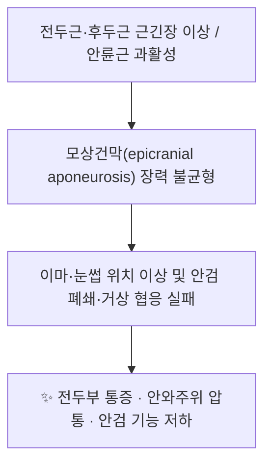

# 📍 [[양백]] (GB14, Yangbai)

> **핵심 요약 (Key Summary)**:
> [[양백]](GB14)은 [[족소양담경]]의 두면부 경혈로, 동공 직상·눈썹 중앙 상방 1촌의 [[전두근]](frontalis)과 [[모상건막]]이 놓인 전액부에 위치한다. 국소 감각은 [[안와상신경]](CN V1) 계통, 운동은 [[안면신경]](CN VII) 측두지가 담당하며, 국소 조직의 감각·자율신경 분포가 조직학적으로 보고되었다(PMID 35579008). 임상적으로는 [[구안와사]](주변성 안면신경마비), [[안와상신경통]], 전두부 [[긴장성 두통]] 및 안검 주위 기능 이상의 치료 타깃으로, [[침구]]·[[약침]] 자극과 전두근 [[도수치료]]가 함께 활용된다.

---
## 📌 목차
1. [해부학적 정밀 구조 및 지배 신경/혈관](#1-해부학적-정밀-구조-및-지배-신경혈관)
2. [생체역학·토크 분석 & 근막 사슬 (Biomechanical Synergy)](#2-생체역학토크-분석--근막-사슬-biomechanical-synergy)
3. [근막통증증후군(TP) & 연관통 패턴 (Travell & Simons)](#3-근막통증증후군tp--연관통-패턴-travell--simons)
4. [초음파 해부학(Sonoanatomy) 및 중재 시술 랜드마크](#4-초음파-해부학sonoanatomy-및-중재-시술-랜드마크)
5. [⭐ 원장님 심층 임상 고찰 및 원본 필기 (Clinical Pearls)](#5-원장님-심층-임상-고찰-및-원본-필기-clinical-pearls)
6. [관련 임상 질환 및 운동손상 증후군 총괄](#6-관련-임상-질환-및-운동손상-증후군-총괄)
7. [추나·도수치료(MET/PIR) & 침구·약침·재활 프로토콜](#7-추나도수치료metpir--침구약침재활-프로토콜)
8. [출처 및 학술 참고 문헌 (References)](#8-출처-및-학술-참고-문헌-references)

> [!warning] 경락 명칭 확인 필요
> 최초 작성 계획의 태그에는 "족양명담경"으로 기재되어 있었으나, GB14(陽白)는 **[[족소양담경]](足少陽膽經)** 의 두면부 경혈이다. 담경(膽經)의 두부 순행은 陽白 → 臨泣 → 目窓 → 正營 → 承靈 → 腦空 → 風池로 이어지며, 陽明胃經(ST)과는 별개 경락이다. 노트 태그는 **족소양담경**으로 정정하였다.

---
## 1. 해부학적 정밀 구조 및 지배 신경/혈관

| 항목 | 상세 내용 |
| :--- | :--- |
| **소속 경락** | [[족소양담경]](足少陽膽經) 제14번 혈. 전통 침구문헌에서는 [[양유맥]](陽維脈)과의 교회혈(交會穴)로 기재됨(교과서 근거, 제출 논문 근거 아님) |
| **표준 위치** | 전액부(前額部). 정면 주시 시 **동공 중앙의 직상방**, **눈썹 중앙(眉毛中央)에서 위로 1촌(寸)** 지점. 좌우 대칭 |
| **혈명 해석** | 陽=양기·드러남, 白=밝음·희다 → 눈을 밝게 하고 이마의 양기를 통하게 하는 의미로 해석 |
| **표층(천층)** | 피부 → 피하조직(이마의 얇은 피하 지방층) → [[전두근]](frontalis) 근복 |
| **심층(심부)** | [[모상건막]](epicranial aponeurosis, galea) → 전두골 골막(periosteum) |
| **국소 신경 분포(감각)** | [[안와상신경]](supraorbital n., 삼차신경 CN V1 안신경의 분지) 및 [[활차상신경]](supratrochlear n.) 계통의 지배를 받는 전액부 피부·피하조직. GB14·ST2·ST6 국소 조직의 감각 및 자율신경 분포가 조직학적으로 분석·보고되었다[2] |
| **국소 신경 분포(운동)** | [[안면신경]](CN VII)의 **측두지(temporal branch, 측두-안면 분지)** 가 전두근을 지배 |
| **혈관 공급** | [[안와상동맥]](supraorbital a.) 및 [[활차상동맥]](supratrochlear a.)의 천분지와 동명 정맥. 안와상혈관 신경다발은 안와상 절흔(supraorbital notch/foramen)을 통해 두개외로 나옴 |
| **자침 방향·깊이(교과서 기준)** | **수평자(平刺, 피하 횡자) 0.5~0.8촌** 또는 **직자 0.3~0.5촌**. 안면마비 치료에서는 하방 또는 상방으로 투자(透刺)하기도 함 |
| **위험 구조물** | 안와(orbit) 상연과 안와격막(orbital septum), 안구, 안와상·활차상 신경혈관다발. **안구 방향(하방·후방)의 깊은 자침은 안구 천자·안와내 혈종 위험** |

### 🔬 해부학 도해 및 단면도
* 이미지 자료는 제공되지 않아 임베드하지 않았다. 층별 구조는 아래 순서로 이해하면 된다.

```
[피부] → [피하조직+전두근] → [모상건막] → [전두골 골막]
                ↑ 안와상신경·활차상신경(감각)/안면신경 측두지(운동)
                ↑ 안와상동맥·활차상동맥(혈류)
```

* **핵심 포인트**: GB14는 "근육–건막–골막"의 3층이 0.5촌 이내에 압축되어 있는 **얇은 연부조직 구역**이다. 따라서 침 끝의 저항 변화(피부→근복→건막→골막)를 촉지 감각으로 구분하는 것이 안전 자침의 기본이 된다. 근복 두께·골막까지의 거리 등 **개별 정량 수치는 본 노트에서 근거 미확인**이며, 초음파로 환자별 확인이 권장된다.

---
## 2. 생체역학·토크 분석 & 근막 사슬 (Biomechanical Synergy)



* **전두근–후두근 짝힘 구조**: [[전두근]]은 기시부가 모상건막(전액부)이고, [[후두근]](occipitalis)은 후두골에서 기시하여 같은 건막에 정지한다. 두 근육은 **하나의 건막을 사이에 둔 길항·협응 단위**로, 전두근 수축은 건막을 후상방으로 견인하여 눈썹과 이마 피부를 거상시킨다.
* **모멘트 암과 토크 특성**: 전두근은 두개골 표면에 밀착된 **얇은 판상근(flat muscle)** 으로, 관절을 직접 가로지르지 않기 때문에 고전적 지레 토크보다는 **피부·근막 장력(tension) 조절** 기능이 지배적이다. 따라서 GB14 자극의 생체역학적 효과는 "관절 가동성 회복"보다 **국소 근긴장 정상화 및 표정 협응 회복**으로 해석하는 것이 타당하다.
* **근막 사슬 연계 (Myers Anatomy Trains 관점)**: 전두근–모상건막–후두근은 **표재성 후방선(Superficial Back Line, SBL)** 의 최상단 두개부 구간을 이룬다. 이 구간의 긴장은 경추 후면–후두하근–흉추 신전 패턴과 기능적으로 연결되므로, 만성 전두부 두통 환자에서는 **후두하근·상부 승모근 이완과 함께 전두근 이완**을 병행하는 접근이 임상적으로 사용된다(문헌 기반 일반 원칙, 본 주제 특정 논문 근거 아님).
* **국소 협응 근육**: [[안륜근]](orbicularis oculi) 상안검부, [[추미근]](corrugator supercilii)이 GB14 인근에서 함께 작동한다. 안면마비 회복기에는 이들 근육의 **비대칭 과긴장(연합운동, synkinesis)** 이 문제가 되므로, GB14 자극은 전두근 활성 회복과 동시에 안륜근 과활성을 조절하는 양방향 접근점이 된다.

---
## 3. 근막통증증후군(TP) & 연관통 패턴 (Travell & Simons)

* **해당 근육**: [[전두근]](frontalis) — GB14는 동공 직상, 즉 전두근 내측~중간 근복에 위치하여 전두근 발통점(TrP) 구역과 해부학적으로 근접한다(위치 기반 추정, GB14–TrP 일치에 대한 직접 문헌 근거는 **미확인**).
* **국소 압통점(TrP)**: 이마 하부·눈썹 상방에서 딱딱한 띠(taut band)와 압통 결절이 촉지되는 경우가 있으며, 압박 시 동측 전두부로 퍼지는 압통이 재현된다.
* **연관통 패턴**: 전두근 TrP의 연관통은 **동측 전두부 및 안와상 부위**, 경우에 따라 안구 주위로 투사되는 것으로 기술된다(Travell & Simons 기준). 임상적으로 "이마가 조여들고 눈이 무거운" 양상의 두통으로 표현된다.
* **감별 포인트**: 안와상신경통, 급성 녹내장, 측두동맥염, 부비동염 등 안면통의 다른 원인을 배제해야 하며, 안면마비 환자에서는 **회복기 연합운동에 의한 근긴장**과 원발성 TrP를 구분해야 한다.

> [!note] 이미지 미제공
> Travell & Simons 도판 등 참고 이미지가 제공되지 않아 이미지 임베드는 삽입하지 않았다.

---
## 4. 초음파 해부학(Sonoanatomy) 및 중재 시술 랜드마크

* **탐촉자 선택**: 전두근·건막·골막 등 얇은 천층 구조 평가에는 **고주파 선형 탐촉자(10~18 MHz 이상)** 가 적합하다(일반 원칙).
* **권장 스캔 뷰**
  * **종단(세로) 뷰**: 눈썹 상방에서 탐촉자를 시상면으로 위치 → 피부, 피하, 전두근, 모상건막, 전두골 골막의 **층별 순서**를 확인. 침이 피부에 대해 예각으로 들어갈 때 침 끝이 근복 내 또는 건막 상부에 있는지 실시간 확인.
  * **횡단(가로) 뷰**: 안와상 절흔을 기준으로 내측(활차상 신경혈관)과 외측(안와상 신경혈관)을 따라가며 **신경혈관다발의 주행**을 확인.
* **안전 마진 및 위험 구조물 회피**
  * **안와 상연(orbital rim)과 안와격막**을 반드시 확인하고, 침 끝이 안와격막을 넘어 **안와 내로 진입하지 않도록** 한다.
  * 안와상동맥·활차상동맥의 천분지는 이마 하부에서 비교적 천층을 주행하므로, 혈관 신호가 확인되면 자침 경로를 변경한다.
  * 시술 중 환자가 **안구 자극감·복시·시력 변화**를 호소하면 즉시 자침을 중단한다.
* **시술 후 확인**: 국소 부종·반상출혈·안검 부종 여부를 관찰한다. 초음파 유도하 GB14 자침의 효용성·정확도에 대한 정량 데이터는 본 노트에서 **근거 미확인**이다.

---
## 5. ⭐ 원장님 심층 임상 고찰 및 원본 필기 (Clinical Pearls)

> [!important] 원본 필기 미제공 안내
> 본 노트 작성 시 **원장님의 원본 임상 필기 자료가 제공되지 않았다.** 아래는 제출된 논문 및 일반 침구학 원칙에 근거한 정리이며, 원장님 고유의 배혈·자침 깊이·약침 처방 등은 **추후 원본 필기 확보 후 반드시 보완**해야 한다.

* **안면마비(구안와사) 접근의 근거**: 주변성 안면신경마비에 대한 **근거중심 침구 임상 권고**가 제시되어 있어[3], GB14를 포함한 안면부 국소 경혈 자극이 표준적 치료 구성의 일부로 정리되어 있음을 확인할 수 있다. 국소 혈위는 **이완기(급성기)에는 자극을 약하게, 회복기에는 적극적으로** 운용하는 것이 일반적이다.
* **아급성기 치료 전략**: 아급성기 주변성 안면마비에서 **제침(提鍼, pulling technique by needle stuck)** 을 적용한 임상 연구가 적외선 체열영상(infrared thermography)을 평가 지표로 사용하여 보고되었다[4]. 즉 안면부 온도 분포 변화를 객관적 지표로 삼아 자극 강도와 자침 부위를 조정하는 접근이 시도되고 있다.
* **감각·자율신경 관점**: GB14·ST2·ST6 국소 조직의 감각 및 자율신경 분포가 조직학적으로 보고된 바 있어[2], 안면부 경혈 자극이 단순 운동신경 자극을 넘어 **감각 입력 및 자율신경 조절** 경로에도 관여할 가능성이 제시된다. 다만 자율신경 조절의 구체 기전과 임상 효과 크기는 **근거 미확인**이다.
* **감별 진단의 중요성**: 다발성 뇌신경 손상 증례가 보고되어 있어[1], 이마·안검 주위 증상이 단순 말초성 안면신경마비가 아니라 **여러 뇌신경을 동시에 침범한 병변**일 수 있음을 항상 염두에 두어야 한다. 안구 운동 이상, 복시, 연하·발성 변화, 청각 증상 등이 동반되면 즉시 신경학적 평가로 전환한다.
* **자침 실무 팁(일반 원칙)**
  * 이마가 얇은 환자에서는 **피하 횡자(平刺)** 로 피부 아래에 침체를 눕히면 안와 내 진입 위험을 낮출 수 있다.
  * 자극 강도는 **환자의 표정 변화(눈썹 거상) 관찰**로 확인하고, 과도한 자극으로 인한 통증성 찡그림(안륜근·추미근 과수축)을 유발하지 않도록 조절한다.
  * 회복기 연합운동이 나타난 환자에서는 GB14 단독 강자극보다 **양측 배혈 + 원위 취혈** 중심으로 전환한다.

---
## 6. 관련 임상 질환 및 운동손상 증후군 총괄

| 임상 질환 / 증후군 | 병리적 연관 기전 | 주요 증상 및 이학적 검사 | 핵심 교정 타깃 |
| :--- | :--- | :--- | :--- |
| [[구안와사]](주변성 안면신경마비, Bell's palsy) | 안면신경(CN VII) 염증·부종에 의한 전두근 지배 손실 | 이마 주름 소실, 눈썹 거상 불가, 안검 폐쇄 불완전, 미각 저하 | 전두근 활성 회복, 안륜근 협응, GB14·주변 국소혈 자극[3] |
| 아급성기 안면마비 회복 지연 | 신경 재지배(reinnervation) 지연 및 연합운동 발생 | 좌우 비대칭, 연합운동, 안면부 체열 비대칭 | 제침(提鍼) 자극 및 체열영상 기반 평가[4] |
| 전두부 [[긴장성 두통]] | 전두근·후두하근 긴장 및 모상건막 장력 이상 | 이마 압박감, 눈썹 상방 압통, 후두부 뻣뻣함 | 전두근 이완, 후두하근·상부 승모근 병행 이완 |
| [[안와상신경통]](안와상 신경포착) | 안와상 절흔부 신경 압박 또는 자극 | 안와상 부위 방사통, 절흔부 압통, 이마 감각 저하 | 국소 자극 최소화, 신경 주행 확인 후 자침 |
| 안검하수·안검경련(안검 기능 이상) | 전두근·안륜근·상안검거근 협응 이상 | 눈꺼풀 처짐, 불수의적 안검 수축 | 근긴장 균형 조절, 국소 자극 강도 조절 |
| [[다발성 뇌신경 손상]] | 여러 뇌신경 동시 침범 | 복시·안구운동 제한·연하장애 등 동반 가능 | 안면 국소 치료 전 **신경학적 감별 필수**[1] |

* 표의 기전·증상 항목은 해부학 및 임상 일반 지식에 근거한 정리이며, 질환별 GB14 단독 치료 효과를 정량적으로 입증한 수치는 본 노트에서 **근거 미확인**이다.

---
## 7. 추나·도수치료(MET/PIR) & 침구·약침·재활 프로토콜

### 7-1. 침구 프로토콜
* **국소 배혈(안면부)**: [[양백]](GB14), [[찬죽]](BL2), [[어요]](EX-HN4), [[사죽공]](TE23), [[태양]](EX-HN5), [[사백]](ST2), [[지창]](ST4), [[협거]](ST6)
* **원위 배혈**: [[합곡]](LI4), [[족삼리]](ST36), [[태충]](LR3), [[풍지]](GB20)
* **자침법**: 이마는 **수평자(平刺) 0.5~0.8촌**, 급성기에는 輕刺, 회복기에는 적절한 得氣 유도. 안면마비 아급성기에는 **제침(提鍼) 기법**을 적용한 임상 연구가 보고되어 있다[4].
* **전침(電鍼)**: 이마–눈썹 구역에 저빈도·저강도 자극을 적용하는 방식이 흔히 쓰이나, GB14 전침의 최적 주파수·강도에 대한 본 논문 근거는 **미확인**. 연합운동이 있는 환자에서는 과자극을 피한다.

### 7-2. 약침 프로토콜
* 안면마비 회복기에서 국소(안면부) 약침은 **얕은 층(피하·근복 내)** 에 소량 주입하는 방식이 일반적이나, **GB14 약침의 특정 약재·용량·주입 깊이에 대한 근거는 제출 논문에서 확인되지 않음(근거 미확인)**. 시술 시 §4의 안와 상연 안전 마진을 반드시 준수한다.

### 7-3. 도수치료(MET/PIR) 및 자가 재활
* **전두근 이완(PIR/CR 기법)**: 환자가 눈썹을 위로 올려(전두근 등척성 수축) 5~7초 유지 → 호기와 함께 이완 → 이마 피부를 두 손가락으로 부드럽게 상방 스트로크. 2~3회 반복.
* **모상건막 스트레칭**: 전두근–모상건막–후두근 라인을 따라 이마에서 후두부까지 부드러운 마찰 자극으로 장력 분산.
* **안륜근·추미근 이완**: 연합운동이 있는 환자에서 안검 주위 과긴장을 완화하여 전두근 활성 회복을 방해하지 않도록 조정.
* **표정 훈련(바이오피드백)**: 거울을 이용해 **눈썹 거상 – 안검 폐쇄 – 미소**를 분리 연습하여 연합운동 억제.
* **재활 원칙**: 급성기에는 자극·운동 모두 저강도, 아급성기~회복기에는 체열영상 등 객관 지표를 참고하여 강도를 점진적으로 상향한다[4].

---
## 8. 출처 및 학술 참고 문헌 (References)

1. Yan J, Li R (2025). [Case of multiple cranial nerve injury]. *Zhongguo Zhen Jiu*. **PMID: 40518776**
2. Wang J, Cui JJ (2022). Sensory and autonomic innervation of the local tissues at traditional acupuncture point locations GB14, ST2 and ST6. *Acupunct Med*. **PMID: 35579008**
3. Zheng H, Li Y (2009). Evidence based acupuncture practice recommendations for peripheral facial paralysis. *Am J Chin Med*. **PMID: 19222110**
4. Xu X, Li X (2026). [Clinical efficacy of pulling technique by needle stuck for subacute peripheral facial paralysis based on infrared thermography]. *Zhongguo Zhen Jiu*. **PMID: 41558704**
5. **Standring, S. (2020)**. *Gray's Anatomy: The Anatomical Basis of Clinical Practice* (42nd ed.). Elsevier.
6. **Travell, J. G., & Simons, D. G. (1999)**. *Myofascial Pain and Dysfunction: The Trigger Point Manual*, Vol. 1.

> [!caution] 근거 수준 안내
> 본 노트에서 ①②③④로 표기된 내용은 상기 PubMed 문헌에 근거한다. 경혈 위치·자침 깊이·배혈 등 전통 침구학적 서술은 교과서 및 일반 임상 원칙에 해당하며, **GB14 단독 치료의 정량적 효과·약침 처방·도수치료 프로토콜에 대한 직접 근거는 확인되지 않아 "근거 미확인"으로 표시**하였다. 원장님 원본 필기 확보 시 §5를 우선 보완할 것.