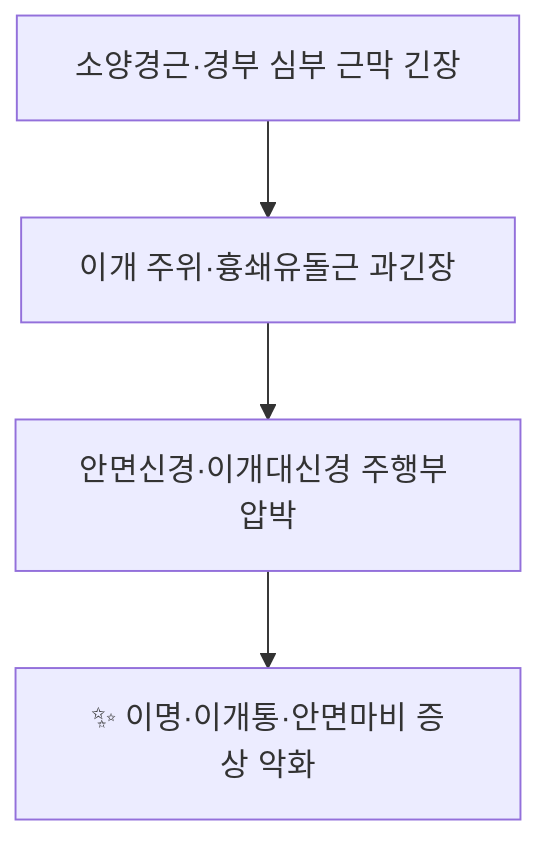

# 👂 [[예풍]] (翳風, TE17)

> **핵심 요약 (Key Summary)**:
> [[예풍]](翳風, TE17)은 [[수소양삼초경]]의 17번째 경혈로, 이수(耳垂) 뒤 [[유양돌기]]와 하악각 사이 함요부에 위치하며 심부에 [[안면신경]](제7뇌신경) 본간과 [[이하선]], [[이개대신경]](C2–C3) 및 후이개동·정맥이 주행한다.
> 임상적으로 [[이명]]·[[이롱]]·[[안면신경마비]]·[[연하장애]](중풍 후)에 다용되며, 최근 RCT에서 [[풍지]](GB20)와 배합한 [[전침]]이 급성기 중등도–중증 [[말초성 안면신경마비]]의 예후 개선에, [[염천]](CV23)과 배합한 심자(深刺)가 뇌졸중 후 [[연하장애]]의 삼킴 재활치료보다 우수한 효과를 보고하였다.
> 심부에 안면신경 본간과 주요 혈관이 위치하므로 자침 방향·깊이에 각별한 주의가 필요하다.

---
## 📌 목차
1. [해부학적 정밀 구조 및 지배 신경/혈관](#1-해부학적-정밀-구조-및-지배-신경혈관)
2. [생체역학·토크 분석 & 근막 사슬 (Biomechanical Synergy)](#2-생체역학토크-분석--근막-사슬-biomechanical-synergy)
3. [근막통증증후군(TP) & 연관통 패턴 (Travell & Simons)](#3-근막통증증후군tp--연관통-패턴-travell--simons)
4. [초음파 해부학(Sonoanatomy) 및 중재 시술 랜드마크](#4-초음파-해부학sonoanatomy-및-중재-시술-랜드마크)
5. [⭐ 원장님 심층 임상 고찰 및 원본 필기 (Clinical Pearls)](#5-⭐-원장님-심층-임상-고찰-및-원본-필기-clinical-pearls)
6. [관련 임상 질환 및 운동손상 증후군 총괄](#6-관련-임상-질환-및-운동손상-증후군-총괄)
7. [추나·도수치료(MET/PIR) & 침구·약침·재활 프로토콜](#7-추나도수치료metpir--침구약침재활-프로토콜)
8. [출처 및 학술 참고 문헌 (References)](#8-출처-및-학술-참고-문헌-references)

---
## 1. 해부학적 정밀 구조 및 지배 신경/혈관

> 본 노트는 근골격 템플릿을 [[경혈]]에 맞게 전환한 것으로, "기시/정지/신경/혈관" 항목을 **경혈 소재부의 표재·심부 해부 구조**로 재해석하여 기술한다.

| 항목 | 상세 내용 |
| :--- | :--- |
| **소속 경락** | [[수소양삼초경]] (手少陽三焦經) 17번째 경혈, 手少陽之脈의 經穴 |
| **표준 위치 (Location)** | 이수(耳垂) 뒤, [[유양돌기]](mastoid process)와 [[하악각]](angle of mandible) 사이의 함요부. 이개(耳介) 부착부 후하방 |
| **자침 방향·깊이** | 直刺 0.8–1.2寸(교과서 표준). 深刺 시 1.5寸 이상도 보고되나 안면신경·혈관 손상 위험 동반 |
| **지배 신경 (표재)** | [[이개대신경]] (Great auricular nerve, C2–C3), 이개측두신경(Auriculotemporal n., V3) |
| **지배 신경 (심부)** | [[안면신경]] (Facial nerve, CN VII) — [[경유공]](stylomastoid foramen)에서 본간이 이 혈의 심부를 통과 |
| **혈관 공급/주행** | [[후이개동맥]]·[[후이개정맥]] (posterior auricular a./v.), 심부에 [[외경동맥]] 및 [[상악동맥]] 분지, [[이하선]] 내 [[안면신경총]] |
| **인접 위험 구조물** | 안면신경 본간, 이하선, 후이개혈관, 경정맥구 등 |

### 🔬 해부학 도해 및 단면도
* ※ 본 노트에는 제공된 이미지가 없어 도해 임베드를 포함하지 않는다.
* [[예풍]]의 정밀 부착·주행 관계는 [[유양돌기]] 전연과 [[하악지]] 후연이 이루는 "함요 삼각"을 기준으로 이해하며, 이 함요가 곧 촉진 시 자침 지표가 된다.
* 심부로는 [[경유공]] → [[안면신경]] 본간 → 이하선 실질 순으로 이어지므로, 심자 시 안면신경 자극·손상 가능성을 항상 염두에 둔다.

---
## 2. 생체역학·토크 분석 & 근막 사슬 (Biomechanical Synergy)

[[예풍]]을 단일 근육의 토크 분석으로 환원하기는 어렵지만, 해당 부위는 [[흉쇄유돌근]]·[[후두이개근]]·[[이하선 근막]]·[[경근]](經筋)이 교차하는 "이개–경부 근막 사슬"의 결절점이다. 자침 자극은 이 사슬의 긴장을 조절하여 이개·이하선·경부로 이어지는 연부조직 긴장을 완화하는 것으로 해석된다.

* **분절별 모멘트 암과 토크**: 이개–하악–유양돌기 사이의 근막 장력 균형은 측두하악관절(TMJ) 및 경부 회전 토크와 연동된다. 직접적 토크 수치는 **근거 미확인**.
* **근막 사슬 연계 (Myers Anatomy Trains 응용)**: [[흉쇄유돌근]]–[[이하선 근막]]–[[이개근]]–[[측두근막]]으로 이어지는 측두–경부 사슬, 그리고 수소양경근의 "이개 후방 → 이개 → 외안각" 주행과 대응한다.

---
## 3. 근막통증증후군(TP) & 연관통 패턴 (Travell & Simons)

* ※ 제공된 이미지가 없어 도해 임베드를 포함하지 않는다.
* **발통점 및 연관통**: [[흉쇄유돌근]](SCM) 및 [[측두근]]의 위성 발통점(TrP)은 이개 주위·유양돌기·안면부로 연관통을 유발할 수 있다(Travell & Simons 기준). [[예풍]]은 이 이개 주위 연관통 패턴의 국소 치료혈로 활용된다.
* **감별 포인트**: 이개통이 [[이개대신경]] 영역을 따라 방사되면 경부 근막성, 안면 깊은 통증·안면근 약화가 동반되면 [[안면신경]] 병변을 우선 감별한다.

---
## 4. 초음파 해부학(Sonoanatomy) 및 중재 시술 랜드마크

* **초음파 스캔 뷰**: [[유양돌기]] 횡단면에서 표재–심부 순으로 피부 → 피하 → [[이하선]] 및 [[안면신경]] 분지 → [[경유공]] 주변 구조를 확인한다.
* **안전 마진**: [[예풍]]은 안면신경 본간이 심부에 위치하므로, 자침 시 **자침 깊이와 각도**를 제한하고 혈관(후이개동·정맥) 천자에 의한 혈종을 예방한다.
* **중재 시술 시 주의**: 초음파 유도하 시술 시 [[경유공]] 및 안면신경 주행을 실시간 확인하는 것이 권장된다. (심부 자침의 정확한 안전 깊이 수치는 **근거 미확인**)

---
## 5. ⭐ 원장님 심층 임상 고찰 및 원본 필기 (Clinical Pearls)

* **자침 감각과 방향**: [[예풍]]은 개구 상태에서 함요가 뚜렷해지므로, 환자에게 입을 살짝 벌리게 한 후 자침하면 위치 결정이 쉽다. 득기 시 이개 내부로 퍼지는 산창감(酸脹感)이 이상적이다.
* **배혈 전략**:
  * [[이명]]·[[이롱]]에는 [[예풍]]을 [[청궁]](SI19)·[[청회]](GB2)·[[중저]](TE3)·[[풍지]](GB20)와 배합한다.
  * [[말초성 안면신경마비]] 급성기에는 [[풍지]](GB20)와 배합한 [[전침]]이 예후 개선에 유리하다는 RCT 근거가 있다 (Liu & Guo, 2026; PMID: 42116775).
  * 중풍 후 [[연하장애]]에는 [[염천]](CV23)과 배합한 심자(深刺) 프로토콜을 고려한다 (Qin & Zhang, 2019; PMID: 30945493).
* **부작용 관리**: 심자·과자극 시 일시적 현훈, 이개 주위 혈종, 드물게 안면근 경련이 보고될 수 있으므로 자침 후 국소 관찰을 권장한다.
* ※ 상기 내용은 임상 실무 관점의 정리이며, 원장님 원본 필기(개별 환자 적용 노하우)의 세부 수치는 본 노트에서 **근거 미확인**으로 표시한다.

---
## 6. 관련 임상 질환 및 운동손상 증후군 총괄

| 임상 질환 / 증후군 | 병리적 연관 기전 | 주요 증상 및 이학적 검사 | 핵심 교정 타깃 |
| :--- | :--- | :--- | :--- |
| [[이명]] (Tinnitus) | 이개 주위·청신경 전도로 자극/경부 근막 긴장 | 이명·이롱, 선혈·배혈 데이터마이닝상 주요 관심혈 | 이개–경부 근막 이완, 예풍 배합 자침 |
| [[말초성 안면신경마비]] (구안와사) | 안면신경 염증·부종, 경유공 주변 압박 | 안면근 약화·안검불완전폐쇄 | 안면신경 자극(예풍·풍지 전침) |
| [[중풍 후 연하장애]] (Post-stroke dysphagia) | 연하 관련 근·신경 조절 저하 | 연하 곤란, 구음장애 | 염천+예풍 심자 + 재활 |
| [[이하선염]] / [[이개통]] | 이하선 실질 염증, 이개대신경 자극 | 이개 후방 압통·부종 | 국소 소염·경락 자극 |

---
## 7. 추나·도수치료(MET/PIR) & 침구·약침·재활 프로토콜

* **한의학 경혈 매핑**: [[예풍]](TE17), [[풍지]](GB20), [[청궁]](SI19), [[청회]](GB2), [[중저]](TE3), [[염천]](CV23)
* **자침 프로토콜(일반)**: 개구 상태에서 함요 확인 → 直刺 0.8–1.2寸 → 득기 후 15–20분 유침. 이명·안면마비에는 배혈 자침, 연하장애·안면마비 일부에는 [[전침]] 병용.
* **약침·중재**: 자침 반응이 부족한 이개통·경부 근막 긴장에는 국소 약침을 고려할 수 있으나, 예풍 심부에 안면신경·혈관이 위치하므로 초음파 유도 및 얕은 깊이 시술을 권장한다(구체적 약침 용량·농도는 **근거 미확인**).
* **근에너지기법 (MET)**: [[흉쇄유돌근]]·[[측두근]]·[[후두하근]]에 등척성 수축–이완(PIR)을 적용하여 이개–경부 근막 사슬 긴장을 완화한 뒤, 예풍 자침을 병행하는 순서가 실무적으로 유용하다.
* **재활 연계**: 안면신경마비에는 이개–안면부 근막 이완 + 표정근 능동 재활, 연하장애에는 삼킴 재활과 병행하는 전략이 논문 프로토콜과 부합한다.

---
## 8. 출처 및 학술 참고 문헌 (References)

1. **Huang, L., & Fan, Y. (2024).** Investigating acupoint selection and combinations of acupuncture for primary idiopathic tinnitus using data mining. *Medicine (Baltimore).* PMID: **38518013**. *(중복 등재 PMID: 38518013)*
2. **Qin, L., & Zhang, X. P. (2019).** [Deep acupuncture of Lianquan (CV23) and Yifeng (TE17) in combination with conventional acupuncture of other acupoints is superior to swallowing rehabilitation training in improving post-stroke dysphagia in apoplexy patients]. *Zhen Ci Yan Jiu.* PMID: **30945493**.
3. **Liu, J., & Guo, S. (2026).** [Effect of electroacupuncture at Yifeng (TE17) and Fengchi (GB20) on prognosis of moderate-to-severe peripheral facial paralysis in the acute stage: a randomized controlled trial]. *Zhongguo Zhen Jiu.* PMID: **42116775**.
4. **Chi, K. L., & Wen, J. (2023).** [Network visual data mining and analysis of literature on electroacupuncture treatment of post-stroke sequelae]. *Zhen Ci Yan Jiu.* PMID: **37247866**.
5. **Lee, K. H., & Kim, M. H. (2024).** Acupuncture for Tinnitus: A Scoping Review of Clinical Studies. *Complement Med Res.* PMID: **38531340**.
6. **Standring, S. (2020).** *Gray's Anatomy: The Anatomical Basis of Clinical Practice* (42nd ed.). Elsevier.
7. **Travell, J. G., & Simons, D. G. (1999).** *Myofascial Pain and Dysfunction: The Trigger Point Manual*, Vol. 1.