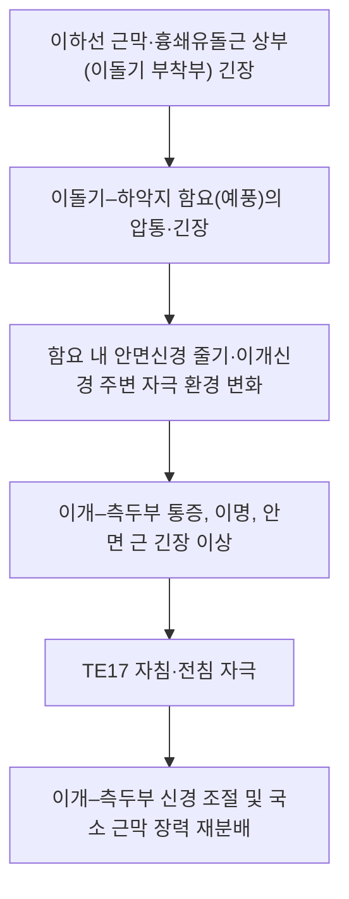

# 📍 [[경혈/예풍]] (Yifeng, TE17)

> **핵심 요약 (Key Summary)**:
> [[예풍]](TE17)은 [[이수]] 후방, [[이돌기]](유양돌기)와 [[하악지]] 후연 사이 함요부에 위치한 [[수소양삼초경]]의 경혈로, 표층에는 [[이개대신경]]·[[후이개동맥]]이, 심부에는 [[경유돌공]]을 막 나온 [[안면신경]] 줄기와 [[이하선]] 실질이 놓여 있어 **자침 안전 마진이 좁은 대표적 위험 혈위**다.
> 임상적으로는 [[이명]](PMID 38518013, 38531340), [[뇌졸중 후 연하곤란]](PMID 30945493), [[말초성 안면신경마비]] 급성기(PMID 42116775)에서 [[풍지]](GB20)·[[완골]](CV23) 등과 배합되어 사용되었고, 전침 문헌 네트워크 분석에서도 뇌졸중 후유증 처방의 구성 혈로 다루어졌다(PMID 37247866).
> 치료 타깃은 이개–측두부 신경 조절과 구인두·안면 근군의 기능 회복이며, 시술 시 **경상돌기 및 경부 대혈관 손상 회피**가 최우선이다.

---

## 📌 목차
1. [해부학적 정밀 구조 및 지배 신경/혈관](#1-해부학적-정밀-구조-및-지배-신경혈관)
2. [생체역학·토크 분석 & 근막 사슬 (Biomechanical Synergy)](#2-생체역학토크-분석--근막-사슬-biomechanical-synergy)
3. [근막통증증후군(TP) & 연관통 패턴 (Travell & Simons)](#3-근막통증증후군tp--연관통-패턴-travell--simons)
4. [초음파 해부학(Sonoanatomy) 및 중재 시술 랜드마크](#4-초음파-해부학sonoanatomy-및-중재-시술-랜드마크)
5. [⭐ 원장님 심층 임상 고찰 및 원본 필기 (Clinical Pearls)](#5-원장님-심층-임상-고찰-및-원본-필기-clinical-pearls)
6. [관련 임상 질환 및 운동손상 증후군 총괄](#6-관련-임상-질환-및-운동손상-증후군-총괄)
7. [추나·도수치료(MET/PIR) & 침구·약침·재활 프로토콜](#7-추나도수치료metpir--침구약침재활-프로토콜)
8. [출처 및 학술 참고 문헌 (References)](#8-출처-및-학술-참고-문헌-references)

---

## 1. 해부학적 정밀 구조 및 지배 신경/혈관

예풍은 **근육이 아니라 골성 함요부(이돌기–하악지 사이)에 위치한 경혈**이므로, 템플릿의 기시·정지 항목을 "취혈 표면 표지·심부 구조물"로 치환해 정리한다. 아래 표의 구조 서술은 교과서 해부학(Gray's Anatomy) 기준이며, **본 노트가 인용한 논문들에는 TE17의 해부학적 계측 데이터가 포함되어 있지 않아 수치·거리 값은 '근거 미확인'으로 표기**한다.

| 항목 | 상세 내용 |
| :--- | :--- |
| **경혈 코드·소속** | 예풍(翳風) · TE17(WHO 국제코드) / SJ17 / Triple Energizer 17 · [[수소양삼초경]] (교과서상 [[족소양담경]]과의 교회혈로 서술되나, 교회혈 여부의 현대적 검증 근거는 **근거 미확인**) |
| **표면 위치 (취혈)** | [[이수]](耳垂) 후방, [[이돌기]](유양돌기) 전연과 [[하악지]] 후연 사이의 함요부. 폐구(閉口) 상태에서 촉지되는 함요가 표준 표지이며, 개구 시 하악과두가 전방 이동하면서 함요가 좁아지므로 **폐구 상태 취혈**이 재현성이 높다. |
| **심부 구조물 (천층→심층)** | 피부 → 피하조직 → [[이하선]](parotid gland) 피막 및 실질 → [[경유돌공]] 직후의 [[안면신경]] 줄기 → [[경상돌기]] 및 경상돌기 부착근(경상설골근·경상돌기인두근) → 경부 심부 대혈관. |
| **신경 지배 (관련 신경)** | 운동성: [[안면신경]](CN VII) — 경유돌공 출구부에서 이하선 내 분지로 갈라지기 직전. 감각성: [[이개대신경]](great auricular n., C2–C3), [[이개측두신경]](auriculotemporal n., V3 분지). 교과서적으로 [[미주신경]] 이개지(Arnold 신경)가 이개강 부위에 분포하나 TE17과의 해부학적 거리 관계는 **근거 미확인**. |
| **혈관 공급·위험 혈관** | 천층: [[후이개동맥]](외경동맥계 분지), 후이개정맥. 심부: [[후하악정맥]](retromandibular v.) 및 이하선 내 정맥총, 경상돌기 내측의 [[내경정맥]]·[[내경동맥]]. 심자 시 대혈관 손상 가능성이 있어 **심도 제한**이 필요하다. |
| **자침 각도·심도 (교과서 기준)** | 직자 또는 미하방(微下方) 방향 0.5–1촌. 개인차·체형차가 크며, 초음파 유도 없이 1촌을 초과하는 심자는 경상돌기 저촉 및 혈관 손상 위험이 있어 권장되지 않는다. 구체적 안전 심도의 정량 근거는 **근거 미확인**. |
| **자침 안전 주의** | ① 안면신경 손상(일과성 안면마비 유발 가능) ② 경상돌기 자극 시 강한 방사감·불쾌감 ③ 심부 대혈관 천자 ④ 자침 후 국소 혈종. |

### 🔬 해부학 도해 및 단면도
이 노트에는 삽입된 도해 파일이 없으며, 위 표의 층서 서술은 Gray's Anatomy 기술에 근거한다.

---

## 2. 생체역학·토크 분석 & 근막 사슬 (Biomechanical Synergy)

예풍은 골성 함요부이므로 관절 토크 분석보다는 **두개–경부 근막 장력 전달**의 관점으로 접근한다. 아래 도식은 임상 추론용 개념도이며, **인용 논문들이 이 기전을 직접 검증한 것은 아니므로 기전 수준의 주장은 '근거 미확인'으로 해석해야 한다.**

* **국소 근막 연속성**: 예풍 부위는 [[이하선]] 피막과 [[흉쇄유돌근]] 상부(이돌기 부착부), [[측두근]]·[[교근]]을 덮는 측두–하악 근막과 연속된 층으로 이해된다. 따라서 경부·악관절 근막 긴장이 함요부 압통으로 표현될 수 있다(교과서적 개념, 정량 근거 **근거 미확인**).
* **근막 사슬 분류(McGill / Myers Anatomy Trains)**: 두개–경부 심부근막은 심부전방선 및 측두–하악 사슬과 기능적으로 연결된다는 서술이 있으나, **문헌별 사슬 명칭·경계 매핑에 이견이 있어 본 노트에서는 '근거 미확인'으로 유보**한다.
* **자세·운동학적 함의**: 두부 전방 자세·턱 내밈(jaw protrusion)은 이하선–이돌기 부위 근막 장력을 증가시켜 예풍 부위 압통을 악화시킬 수 있다는 것이 임상적 추론이나, 토크 값·근활성도 수치는 **근거 미확인**.

---

## 3. 근막통증증후군(TP) & 연관통 패턴 (Travell & Simons)

* **해당 부위 근육과의 관계**: 예풍 자체는 근육이 아니지만, **이돌기 부착부의 [[흉쇄유돌근]](SCM)** 및 **이하선 근막**이 인접한다. Travell & Simons Vol.1 기준으로 SCM의 흉골두 TrP는 전두부·안와·정수리로, 쇄골두 TrP는 **이개·이돌기 부위 및 어지럼**으로 연관통·자율신경 증상을 유발한다고 기술되어 있다. 즉 예풍 함요부 압통은 SCM TrP의 연관통 영역과 지리적으로 겹친다.
* **발통점 및 연관통**: 국소 압통점(TrP) 및 원격 방사통 패턴 (Travell & Simons 기준). 다만 **TE17 자체를 발통점으로 규정하거나 그 연관통 지도를 정량화한 자료는 본 노트의 인용 논문에서 확인되지 않음(근거 미확인)**.
* **감별 포인트**: 이개 후방 압통은 ① SCM 상부 TrP ② [[이하선]] 병변(염증·결석) ③ 이개 연골염 ④ 경추 상부 기능부전에 의한 이개부 연관통을 감별해야 한다. 이개 주위 부종·발적·발열이 동반되면 자침 전 감염성 병변을 먼저 배제한다.

---

## 4. 초음파 해부학(Sonoanatomy) 및 중재 시술 랜드마크

* **초음파 스캔 뷰 및 안전 마진**: 일반적으로 고주파 선형 탐촉자를 이돌기–하악지 사이에 횡단(transverse)으로 대고, ① [[이하선]] 실질과 그 내부의 정맥총, ② [[후하악정맥]], ③ [[경상돌기]]의 고에코 음영, ④ 색도플러상 [[후이개동맥]]·심부 대혈관을 확인한 뒤 자침 경로를 설정하는 접근이 이론적으로 가능하다.
* **한계 명시**: **본 노트가 인용한 6편의 논문에는 TE17의 초음파 해부학적 계측(피부–심부 거리, 혈관까지의 안전 마진 등) 자료가 포함되어 있지 않다. 따라서 위 스캔 프로토콜은 교과서적·일반적 중재 시술 원칙에 기반한 것이며, TE17 특이적 수치는 '근거 미확인'이다.**
* **실무 안전 원칙**: 초음파 미사용 시에는 0.5–1촌 이내 심도 유지, 저항감(경상돌기·골면 접촉)이 느껴지면 즉시 진침 중단, 자침 후 국소 압박 및 혈종 관찰을 권한다.
* **약침 시술 시**: 이하선 실질 내 주입은 피하는 것이 원칙이며, 약침 용량·농도에 대한 TE17 특이적 근거는 **근거 미확인**.

---

## 5. ⭐ 원장님 심층 임상 고찰 및 원본 필기 (Clinical Pearls)

* **취혈 팁**: 환자를 앉히거나 측와위로 두고 **폐구 상태**에서 이수 후방을 촉지한다. 손끝으로 이돌기 전연을 먼저 찾고, 하악지 후연 쪽으로 미끄러뜨려 "쏙 들어가는" 함요를 잡으면 재현성이 좋다. 개구 상태에서는 하악과두가 전방 이동해 함요가 좁아지므로 취혈 위치가 흔들린다.
* **자침 감각**: 정확한 함요에 놓으면 국소적 산창감과 함께 이개·측두부로 퍼지는 듯한 감각이 나타날 수 있다. 강한 전기 방사감(안면 근 연축, 귀 깊은 곳의 찌르는 감각)이 나타나면 **천자가 안면신경 또는 경상돌기 주변에 접촉한 신호**이므로 즉시 심도를 줄이거나 진침한다.
* **안면신경마비에서의 운용**: 급성기 중등도–중증 말초성 안면신경마비에서 [[풍지]](GB20)와 함께 **전침 자극**이 예후 개선 목적으로 연구된 바 있다(PMID 42116775). 다만 본 노트에서 자극 빈도·강도·치료 기간의 구체 파라미터는 확인할 수 없어 **근거 미확인**이며, 임상적으로는 초기 과자극을 피하고 저강도·단시간부터 반응을 보며 증량하는 접근이 안전하다.
* **연하곤란에서의 운용**: 뇌졸중 후 연하곤란에서 [[완골]](CV23)과 예풍의 **심자**를 다른 경혈의 통상 자침과 병용한 군이 연하 재활훈련 단독보다 연하 기능 개선에서 우세했다는 보고가 있다(PMID 30945493). 완골 심자는 기도 천자 위험이 있으므로 해부학적 랜드마크 확인이 필수이며, 두 혈을 동시에 심자할 때는 환자의 구역·기침 반사를 지속 관찰한다.
* **이명에서의 운용**: 이명 침 치료의 선혈·배혈 규칙이 데이터마이닝으로 분석된 연구(PMID 38518013)와 이명 침 치료 임상연구를 정리한 스코핑 리뷰(PMID 38531340)가 존재하나, **본 노트에서는 이명 처방에서 TE17이 선택된 구체적 빈도·가중치 수치를 확인할 수 없다(근거 미확인)**. 임상적으로는 이개 주위(이문·청궁·청회 등)와 예풍을 함께 잡아 국소 순환·신경 조절을 도모하는 방식이 널리 쓰인다.
* **금기·주의 필기**: 이개 주변 급성 염증, 이하선 종대, 경부 림프절 종대, 항응고제 복용 중 INR 상승 환자에서는 자침을 보류하거나 극히 천자한다. 어지럼을 호소하는 환자에서 SCM TrP와 경추 상부 기능부전을 반드시 함께 평가할 것.

---

## 6. 관련 임상 질환 및 운동손상 증후군 총괄

| 임상 질환 / 증후군 | 병리적 연관 기전 | 주요 증상 및 이학적 검사 | 핵심 교정 타깃 |
| :--- | :--- | :--- | :--- |
| [[이명]] (원발성 특발성) | 청각로 과흥분·중추 신경가소성 이상으로 설명되나 TE17 자극의 작용 기전은 **근거 미확인** | 지속적 이명, 이명 설문·청력검사, 이개 주위 압통 | 이개–측두부 배혈 + 예풍 (PMID 38518013, 38531340) |
| [[말초성 안면신경마비]] (중등도–중증, 급성기) | 안면신경 염증·부종 및 경유돌공 부위 압박 | 이마 주름 소실, 안구 폐쇄 불완전, 구각 처짐, House–Brackmann 등급 | 예풍 + [[풍지]] 전침 (PMID 42116775) |
| [[뇌졸중 후 연하곤란]] | 구인두 근 조절 및 연하 중추 기능 이상 | 연하 지연·기침·흡인, VFSS/임상 연하평가 | [[완골]] 심자 + 예풍 심자 (PMID 30945493) |
| [[뇌졸중 후유증]] (전침 처방 전반) | 상위운동신경원 손상 후 근긴장·운동 조절 이상 | 편마비, 경직, 일상생활동작 저하 | 전침 배혈 네트워크 분석상 구성 혈(PMID 37247866) |

---

## 7. 추나·도수치료(MET/PIR) & 침구·약침·재활 프로토콜

* **한의학 경혈 매핑**: [[예풍]](TE17), [[풍지]](GB20), [[완골]](CV23). 그 외 배혈은 본 노트의 인용 논문에서 구체 목록을 확인할 수 없어 **근거 미확인**.
* **배혈 원칙(인용 근거 기반)**
  * 이명: 예풍을 포함한 이개 주위 선혈 패턴이 데이터마이닝으로 분석됨(PMID 38518013), 이명 침 치료 임상연구 스코핑 리뷰(PMID 38531340).
  * 안면신경마비: **예풍 + 풍지 전침**(PMID 42116775).
  * 연하곤란: **완골 + 예풍 심자**를 통상 자침과 병용(PMID 30945493).
  * 뇌졸중 후유증 전침 처방: 문헌 네트워크 시각화 분석(PMID 37247866).
* **자침 프로토콜(안전 기준)**
  1. 폐구 상태에서 함요 확인 → 알코올 소독.
  2. 직자 또는 미하방 0.5–1촌 이내로 천자, 골면 저항 시 즉시 정지.
  3. 득기 후 15–20분 유침(구체적 유침 시간은 논문별 차이가 있어 **근거 미확인**), 전침 사용 시 저강도로 시작.
  4. 발침 후 국소 1–2분 압박, 혈종·어지럼 관찰.
* **근에너지기법 (MET) / 도수 접근**: 예풍 자침 전후로 [[흉쇄유돌근]]과 상부 승모근에 대해 **등척성 수축 후 이완(PIR)** 을 적용하면 이돌기 부착부 긴장이 줄어 함요 촉지가 명확해지고 자침 자극량을 낮출 수 있다. 등척성 수축은 5–10초, 호기 시 부드러운 신장, 3–5회 반복이 일반적 프로토콜이며, TE17 특이적 임상시험 근거는 **근거 미확인**.
* **재활 연계**: 연하곤란에서는 자침과 병행해 연하 재활훈련(PMID 30945493의 대조군 중재)을 유지하는 것이 기능 회복 관점에서 합리적이다. 안면신경마비에서는 안면 근 재교육·표정 훈련을 병행한다.
* **약침**: 이하선 실질·혈관 회피가 원칙이며, TE17 특이적 약침 용량·농도·주입 심도의 근거는 **근거 미확인**.

---

## 8. 출처 및 학술 참고 문헌 (References)

**인용 논문 (제공된 PubMed 데이터)**
1. Huang L, Fan Y (2024). Investigating acupoint selection and combinations of acupuncture for primary idiopathic tinnitus using data mining. *Medicine (Baltimore)*. PMID: **38518013**
2. Qin L, Zhang XP (2019). [Deep acupuncture of Lianquan (CV23) and Yifeng (TE17) in combination with conventional acupuncture of other acupoints is superior to swallowing rehabilitation training in improving post-stroke dysphagia in apoplexy patients]. *Zhen Ci Yan Jiu*. PMID: **30945493**
3. Liu J, Guo S (2026). [Effect of electroacupuncture at Yifeng (TE17) and Fengchi (GB20) on prognosis of moderate-to-severe peripheral facial paralysis in the acute stage: a randomized controlled trial]. *Zhongguo Zhen Jiu*. PMID: **42116775**
4. Chi KL, Wen J (2023). [Network visual data mining and analysis of literature on electroacupuncture treatment of post-stroke sequelae]. *Zhen Ci Yan Jiu*. PMID: **37247866**
5. Lee KH, Kim MH (2024). Acupuncture for Tinnitus: A Scoping Review of Clinical Studies. *Complement Med Res*. PMID: **38531340**

> 참고: 제공 목록의 5번 항목은 1번(Huang L, Fan Y, 2024, PMID 38518013)과 동일 논문이므로 중복 기재하지 않고 통합하였다.

**교과서 참조 (템플릿 지정 문헌 · PMID 없음)**
6. **Standring, S. (2020)**. *Gray's Anatomy: The Anatomical Basis of Clinical Practice* (42nd ed.). Elsevier. — 제1항 해부학적 층서·신경·혈관 서술의 근거.
7. **Travell, J. G., & Simons, D. G. (1999)**. *Myofascial Pain and Dysfunction: The Trigger Point Manual*, Vol. 1. — 제3항 흉쇄유돌근 TrP 연관통 서술의 근거.

**근거 수준 요약**: 본 노트에서 **수치로 제시된 임상적 결론은 없으며**, 인용 논문들은 각각 이명 선혈 데이터마이닝(PMID 38518013), 이명 침 치료 스코핑 리뷰(PMID 38531340), 뇌졸중 후 연하곤란 심자 병용(PMID 30945493), 급성기 안면신경마비 전침 RCT(PMID 42116775), 뇌졸중 후유증 전침 문헌 네트워크 분석(PMID 37247866)에 해당한다. 해부학적 계측값, 초음파 안전 마진, 약침 용량, 전침 파라미터, TrP 지도 등은 위 논문들에서 확인되지 않아 **근거 미확인**으로 표기하였다.