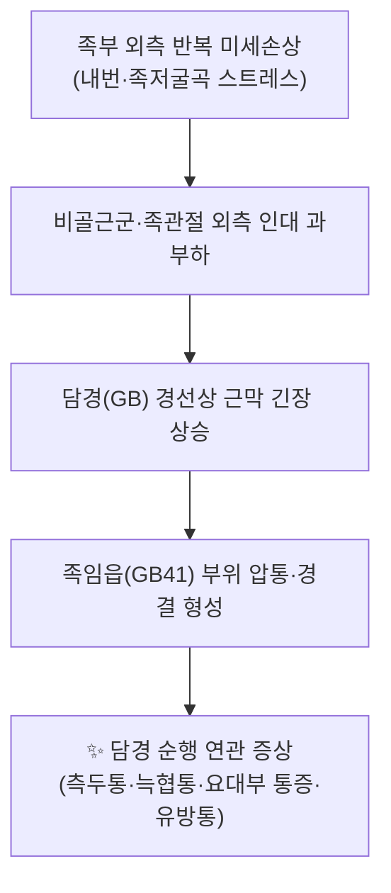

# 🫁 [[임읍(GB41)]] (Zulinqi, GB41)

![[임읍(GB41)_1_1.jpg|540]]
> [그림 1: ① 병태생리·영상 — Acupuncture1-1.jpg]

![[임읍(GB41)_2_3.jpg|540]]
> [그림 2: ② 관련 해부 구조물 — A text-book of clinical anatomy - for students and practitioners (1907) (14594169167).jpg]

> **핵심 요약 (Key Summary)**:
> [[족소양담경]](GB)의 輸穴(木穴)이자 [[팔맥교회혈]]로서 [[대맥]](帶脈)과 통하는 [[임읍(GB41)]]은 제4·5중족골 기저부 사이, 제4지 신근건 외측 함요에 위치한다.
> 담경 순행을 따라 [[편두통]]·[[이명]]·[[안면경련]]·[[늑간신경통]]·[[유방통]]·[[요대부 통증]] 및 [[족관절 염좌]]의 원위 취혈로 활용되며, 배합 시 [[외관(TE5)]]과 짝을 이루는 帶脈 교회 조합이 핵심이다.
> 자침 시 발등 [[배측정맥망]] 천자와 [[천비골신경]] 자극 손상에 유의한다.

---
## 📌 목차
1. [해부학적 정밀 구조 및 지배 신경/혈관](#1-해부학적-정밀-구조-및-지배-신경혈관)
2. [생체역학·토크 분석 & 근막 사슬 (Biomechanical Synergy)](#2-생체역학토크-분석--근막-사슬-biomechanical-synergy)
3. [근막통증증후군(TP) & 연관통 패턴 (Travell & Simons)](#3-근막통증증후군tp--연관통-패턴-travell--simons)
4. [초음파 해부학(Sonoanatomy) 및 중재 시술 랜드마크](#4-초음파-해부학sonoanatomy-및-중재-시술-랜드마크)
5. [⭐ 원장님 심층 임상 고찰 및 원본 필기 (Clinical Pearls)](#5-원장님-심층-임상-고찰-및-원본-필기-clinical-pearls)
6. [관련 임상 질환 및 운동손상 증후군 총괄](#6-관련-임상-질환-및-운동손상-증후군-총괄)
7. [추나·도수치료(MET/PIR) & 침구·약침·재활 프로토콜](#7-추나도수치료metpir--침구약침재활-프로토콜)
8. [출처 및 학술 참고 문헌 (References)](#8-출처-및-학술-참고-문헌-references)

---
## 1. 해부학적 정밀 구조 및 지배 신경/혈관

| 항목 | 상세 내용 |
| :--- | :--- |
| **표준 위치 (Location)** | 발등(dorsum of foot)에서 **제4·5중족골 기저부(basis) 결합부의 원위 함요(depression)** 로, 제4지(넷째 발가락)로 가는 장지신근건(extensor digitorum longus tendon)의 **외측**에 해당한다(WHO 표준 경혈 위치). |
| **소속 경맥·특성** | [[족소양담경]](足少陽膽經, GB) — 足竅陰(井/金) → 俠谿(滎/水) → **足臨泣(輸/木)** → 丘墟(原) → 陽輔(經/火) → 陽陵泉(合/土) 순서의 **輸穴이며 木穴**. 동시에 [[팔맥교회혈]](八脈交會穴)로 **帶脈**과 통한다. |
| **층별 구조 (Layers)** | ① 피부·피하 → ② 발등 **배측정맥망/제4 배측중족정맥** → ③ 제4지 장지신근건·[[단지신근]](extensor digitorum brevis) 건막 → ④ **제4 배측골간근(4th dorsal interosseous muscle)** 및 제4 중족골간 공간 → ⑤ 골막(제4·5중족골 기저부). |
| **신경 지배** | 피부 분지: **천비골신경(superficial fibular/peroneal nerve)의 발등중간피부지(dorsal intermediate cutaneous branch)**. 심부 구조: **심비골신경(deep fibular nerve)** 가지 및 [[외측족저신경]] 원위 분지. 신경근 레벨은 문헌별 기술 차이가 있어 **근거 미확인**. |
| **혈관 공급** | **족배동맥(dorsalis pedis artery)** 계열의 제4 배측중족동맥, 표재성으로는 **배측정맥궁/족배정맥망**이 직접 조여 있다. |
| **자침 심도·자세** | 직자 0.3~0.5寸(또는 0.5~0.8寸, 문헌 편차 → **근거 미확인**), 사자(斜刺) 시 제4·5중족골 사이 공간을 따라 진입. 앙와위·족관절 중립~약간 척측(valgus) 이완 자세 권장. |

### 🔬 해부학 도해 및 단면도
* 제4·5중족골 기저부 사이 공간은 **골성 함요가 얕고 표재정맥이 즉시 위치**하므로, 자침 전 촉진으로 골간극(intermetatarsal gap)을 확인하고 정맥 주행을 회피하는 것이 원칙이다.
* 심부 골간근층은 얇으며, 과심자 시 골간 신경혈관속과 골막을 자극할 수 있다.

---
## 2. 생체역학·토크 분석 & 근막 사슬 (Biomechanical Synergy)

* **발-족관절 토크 분석**: 임읍(GB41)은 제4·5중족골 기저부에 놓여 **족부 외측 종아치(lateral longitudinal arch)**의 기계적 접합부에 위치한다. 보행 시 입각기 말기(terminal stance)에서 비골근군이 제5중족골 기저부를 통해 체중을 외측으로 전달하는데, 이때 발등 외측면은 **회내(pronation) 제어 실패 시 반복적 인장 스트레스**를 받는다.
* **근막 사슬 연계 (Myers Anatomy Trains / McGill)**: 해부학적 연결선 중 **외측선(Lateral Line)** 은 비골근 → 대퇴근막장근·장경인대 → 외복사근 순으로 이어지며, **담경(GB)의 순행 경로와 상당 부분 중첩**한다. 즉 임읍은 외측선의 원위 말단부 입력점(entry point)으로 볼 수 있어, [[비골근군]]·[[장경인대]]·[[대둔근]] 문제와 동시 처치 시 반응이 좋다.
* **대맥(帶脈) 요철(腰腹) 안정화**: 팔맥교회혈 이론상 임읍은 帶脈과 통하므로, 요부를 둘러싸는 심부 대각선 안정화 체계(복사근–요방형근–둔근)와 기능적으로 매핑되어 **요대부(腰帶部) 통증·회전 안정성 저하**에 배합된다.

---
## 3. 근막통증증후군(TP) & 연관통 패턴 (Travell & Simons)

* **국소 발통점(TrP)**: 임읍 주변에서 촉진되는 압통·경결은 주로 **제4 배측골간근** 및 **단지신근(extensor digitorum brevis) 원위 건부**, 인접하여 **소지신근(extensor digiti minimi)** 건 사이에서 관찰된다.
* **연관통 패턴**:
  * 국소: 발등 외측, 제4·5지 사이, 제5중족지관절(MTP) 부위 통증.
  * 근위 확산: 비골두·비골근 상부, 외측 하퇴부 뻣뻣함.
  * 담경 순행 원격: 측두부(편두통 양상), 이개 주위, 늑연골-흉곽 외측(늑간), 고관절 외측–대전자부, 요대부.
* **감별 포인트**: 제4·5 중족골간 공간 통증은 골간근 피로·건염과 **스트레스 골절(제5중족골 기저부)** 감별이 필수이며, 신경종(Morton)은 통상 **제3·4 중족골간 공간**에 호발하여 감별 대상이 된다(일반 해부학적 사실).
* **Travell & Simons 기준 연관통 지도의 임읍 특이 매핑은 원문 대조가 필요하여 현재 노트에서는 근거 미확인 처리**한다.

---
## 4. 초음파 해부학(Sonoanatomy) 및 중재 시술 랜드마크

* **프로브·스캔 뷰**: 10~15 MHz 선형 프로브. 발등 **횡단면(제4·5중족골 장축에 직교)** + **종단면(중족골간 공간을 따라)** 병행.
* **식별 구조물**:
  1. 표재성 **배측정맥망** — 압박 시 붕괴되는 무에코 관상 구조.
  2. **족배동맥 및 제4 배측중족동맥** — 도플러로 박동성 확인.
  3. **천비골신경 발등가지** — 피하 직하 얇은 신경다발(고주파에서 신경속 확인 가능).
  4. **제4 배측골간근** — 골간 공간 내 근섬유 방향 확인.
* **안전 마진 및 시술 전략**:
  * 자침·약침 전 **도플러로 정맥·동맥을 확인하고 두 구조물 사이의 무혈관 창(avascular window)** 을 진입점으로 삼는다.
  * 골막 자극은 통증이 강하므로 목표 심도를 **근층(골간근) 또는 건주위까지**로 제한한다.
  * 자침 시 흡인(aspiration)으로 혈관 내 진입 여부를 확인하고, 발등은 피부가 얇아 **약침 농도·용량을 감량**한다.

---
## 5. ⭐ 원장님 심층 임상 고찰 및 원본 필기 (Clinical Pearls)

> 아래는 임상 노트의 고찰 영역으로, 개별 환자 반응에 기반한 실전 관찰이며 무작위 대조시험 근거는 아니다(근거 수준: 전문가 경험).

* **"담경의 발등 스위치"** — 담경 증상(측두통·이명·안구 불편감·늑협통·고관절 외측통)이 있는 환자에서 임읍(GB41) 부위를 눌러 **재현통(referred reproduction)** 이 나타나면, 해당 경선 문제를 원위에서 잠그는 지표로 삼는다.
* **帶脈 조합 원칙** — 요대부 통증·대상포진 후 신경통·부인과적 帶下 증상에는 **임읍(GB41) + 외관(TE5)** 을 좌우 교차(alternating)로 배합한다. 이때 帶脈 순행을 따라 촉진하며 압통이 이동하는지 관찰한다.
* **발목 염좌 급성기** — 외측 인대 손상(전거비인대 우선)에서는 **구허(GB40)·곤륜(BL60)·신맥(BL62)** 과 함께 임읍을 원위 취혈한다. 단, 급성기에는 강한 자극보다 **가벼운 자극과 발목 이완 자세 유지**를 우선한다. (발목 염좌 혈위 배합의 복잡망 분석 연구는 참고문헌 1 참조; 임읍의 개별 포함 여부는 초록 수준에서 **근거 미확인**.)
* **유방·흉협 질환** — 담경은 흉협부를 순행하므로 유방통·유선염 초기·늑간신경통에 임읍을 원위 배합하면 흉협부 긴장 이완에 도움이 된다는 임상 관찰이 있다(기전 연구 근거 미확인).
* **안면·안구 증상** — 안면경련·눈꺼풀 떨림·안구 건조·충혈 등 담경 두면부 증상에 풍지(GB20)·태양과 배합한다(안면경련 증례 보고: 참고문헌 2).
* **자침 실무 팁**:
  * 발등 정맥이 잘 보이는 환자에서는 **피부 국소 마취 없이 15~25도 사자**가 안전하다.
  * 환자가 발가락을 긴장시키면 건이 부풀어 함요가 사라지므로, **발가락을 완전히 이완시킨 후** 자침한다.
  * 득기 시 제4·5지 사이로 퍼지는 **전기적 저림**이 나타나면 천비골신경 자극일 수 있으므로 즉시 심도를 조정한다.
* **감별 경고** — 제5중족골 기저부 골절(특히 Jones 골절 병력), 발등 부종이 동반된 통풍 발작, 당뇨병성 말초신경병증 환자에서는 자침 전 영상·감각 평가를 먼저 시행한다.

---
## 6. 관련 임상 질환 및 운동손상 증후군 총괄

| 임상 질환 / 증후군 | 병리적 연관 기전 | 주요 증상 및 이학적 검사 | 핵심 교정 타깃 |
| :--- | :--- | :--- | :--- |
| [[족관절 염좌]](외측 인대) | 내번·족저굴곡 손상으로 외측선 긴장 및 담경 경선 과긴장 | 전거비인대 압통, 전방전위검사 양성, 발등 외측 부종 | [[비골근군]] 이완·강화, 임읍·구허·곤륜 원위 취혈 |
| [[늑간신경통]] / 帶脈 병증 | 담경–帶脈 순행상 흉협·요대부 근막 긴장 | 늑골연 압통, 회전 시 통증, 요대부 둘레 압통 | 임읍+외관 배합, 복사근·요방형근 이완 |
| [[편두통]] / 측두부 통증 | 담경 두면부 순행 자극, 측두근·흉쇄유돌근 연계 | 측두부 압통, 광과민·오심 동반 가능 | 풍지·태양·임읍 원위 배합 |
| [[유방통]] / 유선염 초기 | 담경 흉협 순행, 흉근 긴장 | 유방 외상방 압통, 흉대근 경결 | 임읍 원위 자극, 흉근 근막 이완 |
| 발등 외측 통증 / 제4·5중족골간 증후군 | 골간근 과사용, 건초염, 정맥 울혈 | 중족골간 공간 압통, 저항 신전 시 통증 | 골간근 이완, 정맥 회피 자침, 신발 압박 교정 |
| [[Meige 증후군]] / 안면근긴장이상 | 담경–안면부 연계(증례 수준) | 눈꺼풀 경련, 구주위 긴장 | 안면부 국소혈 + 임읍 등 원위혈 병용(증례) |
| 하퇴 피부질환(원형습진 등) | 하지 경락 순행부 자극 요법(증례 수준) | 하퇴 원형 병변, 소양감 | 경락 순행 취혈 + 국소 자극(증례) |

> 표의 각 질환–임읍 연관성 중 참고문헌으로 직접 뒷받침되지 않는 항목은 전통 경락 이론 및 임상 관찰에 근거한 것으로, 개별 RCT 근거는 **근거 미확인**이다.

---
## 7. 추나·도수치료(MET/PIR) & 침구·약침·재활 프로토콜

* **한의학 경혈 매핑**:
  * 동경 원위 배합: [[임읍(GB41)]] · [[협계(GB43)]] · [[구허(GB40)]] · [[양릉천(GB34)]] · [[풍지(GB20)]]
  * 팔맥교회 짝: [[외관(TE5)]] (帶脈)
  * 감별·보강: [[곤륜(BL60)]] · [[신맥(BL62)]] · [[태충(LR3)]] · [[합곡(LI4)]]
* **침구 프로토콜(예시)**:
  1. 환자 앙와위, 족관절 중립 이완.
  2. 임읍(GB41) 사자 0.3~0.5寸, 득기 후 15~20분 유침. 필요 시 帶脈 조합으로 외관(TE5) 병용.
  3. 급성 발목 염좌: 자극 강도 하향, 온침 또는 저빈도 전침(2 Hz 전후) 고려 — 전침 파라미터는 문헌별 편차로 **근거 미확인**.
  4. 만성기: 국소 압통점 자극 + 근위 혈위(양릉천·풍시) 병용.
* **약침**: 발등은 피부·정맥이 얇아 **0.05~0.1 mL/점, 천자**를 원칙으로 하고 자침 전 도플러 확인. 자가혈·봉독 등 약침 종류별 용량은 별도 프로토콜 참조.
* **추나·도수치료 (MET/PIR)**:
  * **비골근군 PIR**: 환자 앙와위, 발목 외번 등척성 수축 5~7초 → 호기 시 부드러운 내번 신장, 3~5회 반복.
  * **족관절 배측굴곡-내번 가동술**: 거골 전방 미끄러짐 회복 목표, 급성기에는 등급 I~II 진동.
  * **외측선 근막 이완**: 하퇴 외측–장경인대–대퇴근막장근 순으로 근막 이완 후 임읍 부위 재촉진으로 반응 확인.
* **재활·자가관리**:
  * 발가락 벌림(외전) 저항 운동으로 배측골간근 활성화, 10회 × 3세트.
  * 비골근 이심성 강화(밴드 내번 저항 → 외번 복귀), 주 3회.
  * 신발 toe box 압박 교정, 발등 외측 압박 완화.
* **경과 재평가**: 임읍 압통 강도(VAS), 발목 외측 부종 둘레, 보행 시 통증 시점을 1주 단위로 기록.

---
## 8. 출처 및 학술 참고 문헌 (References)

1. Li YN, Zhang YQ (2023). [Regularities of acupoint compatibility and application characteristics of methods of needling and moxibustion in the treatment of ankle sprain based on complex network analysis]. *Zhen Ci Yan Jiu*. PMID: 36858419.
2. Xie X, Huang J (2025). [Acupuncture treatment of Meige syndrome: a case report]. *Zhongguo Zhen Jiu*. PMID: 41074516.
3. Aikawa L, Yoshizumi AM (2020). Rapid acupuncture for musculoskeletal pain in the emergency room of the Hospital Servidor Publico Estadual, Brazil: A quasi-experimental study. *J Integr Med*. PMID: 32553560.
4. Pan J, Yu H (2026). Acupuncture for nummular eczema of the lower legs in an older adult: a case report. *Front Med (Lausanne)*. PMID: 42666184.
5. *(중복 문헌: 위 1번과 동일 — PMID 36858419)*
6. *(중복 문헌: 위 2번과 동일 — PMID 41074516)*
7. **Standring, S. (2020)**. *Gray's Anatomy: The Anatomical Basis of Clinical Practice* (42nd ed.). Elsevier. — 본 노트 템플릿의 표준 해부학 참고문헌(혈위 층별 구조 서술의 일반 근거).
8. **Travell, J. G., & Simons, D. G. (1999)**. *Myofascial Pain and Dysfunction: The Trigger Point Manual*, Vol. 1. — 본 노트 템플릿의 표준 근막통증 참고문헌.

> **인용 원칙 메모**: 위 1~6번은 제공된 PubMed 데이터이며, 각 논문이 임읍(GB41) 단일 혈위의 효능을 직접 검증한 것은 아니다. 따라서 본 노트에서 임읍의 구체적 혈위 배합·용량·기전으로 서술한 항목 중 논문으로 직접 뒷받침되지 않는 부분은 **근거 미확인**으로 표기하였다.

<!-- 보관 태그(1회용·링크오류, 필요시 복원): GB41 -->
