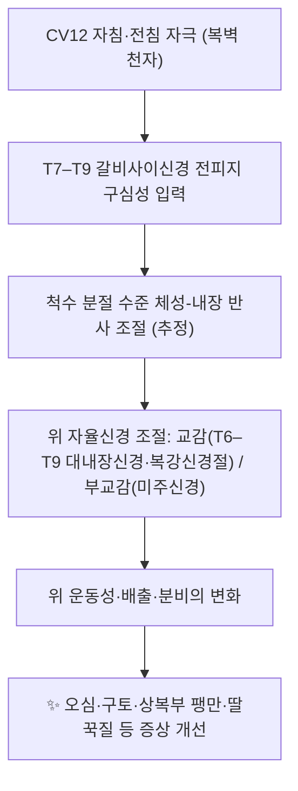

# 🫁 [[경혈/CV12 중완]] (Zhongwan, CV12)

> **핵심 요약 (Key Summary)**:
> [[중완(CV12)]]은 전복벽 정중선상 배꼽 상방 4촌(검상돌기–배꼽 중점)에 위치한 [[임맥]](Conception Vessel)의 12번째 경혈로, [[위]](胃)의 [[모혈]](募穴)·육부의 [[부회혈]](腑會穴)·임맥과 수태양소장경·수소양삼초경·족양명위경의 교회혈이다.
> [[백선]](linea alba)을 지나 심부에서 [[위]]·[[간]](좌엽)·[[횡행결장]]과 인접하며, [[갈비사이신경]] 전피지(T8–T9 추정)와 [[상복벽동맥]]계의 지배를 받는다.
> 임상적으로는 [[기능성 소화불량]], 위배출 이상, 오심·구토, 수술 후 [[지속성 딸꾹질]] 등 상부위장 증상의 핵심 타깃이며, [[족삼리]](ST36)·[[내관]](PC6) 배합 및 [[전침]]·[[약침]] 프로토콜에서 다용된다.

---
## 📌 목차
1. [해부학적 정밀 구조 및 지배 신경/혈관](#1-해부학적-정밀-구조-및-지배-신경혈관)
2. [생체역학·토크 분석 & 근막 사슬 (Biomechanical Synergy)](#2-생체역학토크-분석--근막-사슬-biomechanical-synergy)
3. [근막통증증후군(TP) & 연관통 패턴 (Travell & Simons)](#3-근막통증증후군tp--연관통-패턴-travell--simons)
4. [초음파 해부학(Sonoanatomy) 및 중재 시술 랜드마크](#4-초음파-해부학sonoanatomy-및-중재-시술-랜드마크)
5. [⭐ 원장님 심층 임상 고찰 및 원본 필기 (Clinical Pearls)](#5-원장님-심층-임상-고찰-및-원본-필기-clinical-pearls)
6. [관련 임상 질환 및 운동손상 증후군 총괄](#6-관련-임상-질환-및-운동손상-증후군-총괄)
7. [추나·도수치료(MET/PIR) & 침구·약침·재활 프로토콜](#7-추나도수치료metpir--침구약침재활-프로토콜)
8. [출처 및 학술 참고 문헌 (References)](#8-출처-및-학술-참고-문헌-references)

---
## 1. 해부학적 정밀 구조 및 지배 신경/혈관

| 항목 | 상세 내용 |
| :--- | :--- |
| **표준 위치 (Location)** | 전복벽 정중선(anterior median line) 상, 배꼽 상방 4 B-cun. 검상돌기 하단(흉골검돌관절)과 배꼽을 8촌으로 볼 때 그 **정중점**이 CV12에 해당한다. |
| **경락 소속 (Meridian)** | [[임맥]](Conception Vessel, CV/RN) — 임맥의 12번째 경혈 |
| **특정혈 분류** | ① [[위]]의 [[모혈]](胃募穴) ② 육부(六腑)의 [[부회혈]](腑會穴) ③ 임맥·수태양소장경·수소양삼초경·족양명위경의 **교회혈** ④ 배부의 [[위수]](BL21, 背兪穴)와 배합되는 복모(腹募) 짝 |
| **층별 구조 (Layers)** | 피부 → 피하조직(Camper 지방층·Scarpa 섬유층) → [[백선]](linea alba, 외복사근·내복사근·복횡근 건막의 교차 섬유판) → 복횡근막(transversalis fascia) → 복막전지방 → 벽쪽 [[복막]] |
| **신경 지배** | 제7–9 [[갈비사이신경]](intercostal nerve)의 전피지(anterior cutaneous branch) — 해당 높이는 대략 **T8–T9 피부분절** 수준으로 추정되나, 문헌에 따라 T7–T9로 기술되어 **분절 레벨은 근거 미확인** |
| **혈관 공급** | [[상복벽동맥]](superior epigastric a., 내흉동맥의 연속)의 복직근 심부 주행 가지 및 천복벽동맥(superficial epigastric a.)과의 문합, 주변 천공혈관(perforator), 제주위 정맥(paraumbilical v.)을 통한 문맥계 연결 |
| **심부 장기 관계** | 위(위체 하부·유문동), [[간]] 좌엽(검상인대 부위), [[횡행결장]], 대망(greater omentum) — 마른 체형에서는 천자 깊이에 따라 즉시 위벽과 접촉 가능 |
| **자침 심도(참고)** | 직자(直刺) 1.0–1.5촌이 교과서·WHO 표준경혈 위치 자료에서 통용. 일부 문헌은 1.0–2.0촌까지 기재하나 **심도 기준은 출처별 차이가 있어 근거 미확인**, 체형·복벽 두께에 따라 반드시 개별 조정 |

### 🔬 층별 단면(Cross-sectional) 구조 — 자침 경로 추적

1. **피부·피하조직**: 상복부 피부는 비교적 얇고, 피하지방 두께의 개인차가 자침 심도를 좌우하는 최대 변수다.
2. **[[백선]](linea alba)**: 정중선에서 좌우 복직근초가 교차하며 형성되는 섬유성 중격. 혈관·신경 분포가 상대적으로 적어 **비교적 무혈관·저저항 통로**로 작용한다.
3. **복횡근막 → 복막전지방 → 벽쪽 복막**: 이 3개 층을 통과하면 즉시 **복강 내 공간**이다. 따라서 1.0–1.5촌을 초과하는 심자는 복막 천자, 위·간·횡행결장 천자 위험으로 직결된다.
4. **장기 접촉면**: 위가 팽만된 상태(식후 즉시)에서는 위전벽이 CV12 직하방에 위치하므로 **식후 1–2시간 이내 심자 금기**가 임상적으로 중요하다.

### 🔬 한의학적 위치 결정 및 배혈 지형

* **인접 경혈 좌표계**: 배꼽 상방 4촌 = CV12(중완) / 5촌 = [[상완(CV13)]] / 6촌 = [[거궐(CV14)]] / 7촌 = [[구미(CV15)]] / 흉골검돌관절 = [[중정(CV16)]]. 즉 **CV12는 "검상돌기–배꼽 정중점"이라는 단일 랜드마크로 촉지 가능**하여 재현성이 높다.
* **모혈–배수혈 축**: 복부의 [[중완(CV12)]] ↔ 등의 [[위수(BL21)]]는 위(胃)의 기능 조절을 위한 전후(前後) 배합축을 이룬다. 소화기 프로토콜에서 복모배수(腹募背兪) 배합의 전형이다.

---
## 2. 생체역학·토크 분석 & 근막 사슬 (Biomechanical Synergy)

* **분절 상응(segmental correspondence) 가설**: 위의 교감신경 지배는 대략 T6–T9(대내장신경 → 복강신경절)에서 기원하며, CV12의 체성 입력 분절(T8–T9 추정)과 상당 부분 겹친다. 이 분절적 중첩이 체성-내장 반사(somato-visceral reflex)의 해부학적 배경이라는 설명이 통용되지만, **구체적 신경 회로는 동물·인체 연구가 혼재되어 있어 기전은 근거 미확인**이다.
* **복벽–복압 조절 사슬 (Myers Anatomy Trains 관점)**: CV12는 [[백선]] 위에 놓이며, 백선은 [[복직근]]·[[외복사근]]·[[내복사근]]·[[복횡근]] 건막이 수렴하는 **복부 심부 코어의 중심 봉합선**이다. 표재전방선(Superficial Front Line)이 흉골–복직근–치골로 이어지는 경로상, 중완 부위의 긴장은 흉곽 하강·골반 전방 경사와 연동될 수 있다.
* **복직근초의 구획 특성**: 궁상선(arcuate line, 대략 배꼽 상방 2–3촌) 이하에서는 복직근초 후벽이 결손되어 복막과 직접 인접한다. CV12는 궁상선보다 **상방**에 위치하므로 후벽이 존재하지만, 개인차·체형에 따라 안전 마진이 줄어들 수 있다.
* **호흡 역학**: 흡기 시 횡격막 하강과 함께 상복부가 전방 팽출되고, 호기 시 복횡근이 수축하며 복압을 조절한다. 중완 자침 시 **호기에 자입**하면 복벽 긴장이 낮아 통증이 감소한다는 임상 관행이 있으나, 이는 **정량적 근거 미확인**이다.

---
## 3. 근막통증증후군(TP) & 연관통 패턴 (Travell & Simons)

* **CV12 자체는 경혈이지 근육이 아니므로 "발통점(TrP)"을 갖지 않는다.** 임상적 혼동을 피하기 위해 다음 3가지를 구분한다.

| 구분 | 내용 | 임상적 의미 |
| :--- | :--- | :--- |
| **복직근 상부 TrP** | CV12 주변 상복부에서 촉지되는 [[복직근]]·[[복직근초]]의 발통점. 국소 통증 및 상복부 압통으로 표현됨 | 중완 압통으로 오인될 수 있음. Travell & Simons 원문의 상복부 연관통 세부 패턴은 **페이지 확인 필요(근거 미확인)** |
| **내장성 연관통(Head's zone)** | 위·담낭·췌장·간 등 상복부 장기의 내장 구심성 입력이 T7–T9 피부분절로 투사되어 상복부 통증·압통으로 나타남 | CV12 압통이 위장 질환의 **체성 표지(somatic marker)** 역할을 할 수 있음 |
| **경혈 압통(壓痛)** | 진단적 의미로 중완 압통을 소화기 허약·기체(氣滯)의 지표로 활용 | 정량적 진단 기준은 **근거 미확인**, 환자 보고와 촉진 소견에 의존 |

* **감별 포인트**: 중완 압통이 ① 국소 근육성(자세·복압 패턴 교정에 반응) ② 내장성(식이·소화 증상과 시간적 연동) ③ 피부·피하 감각 이상(피부분절 패턴) 중 어디에 속하는지 구분하는 것이 치료 방향 결정에 중요하다.
* **전벽 복막 자극통**: 자침이 벽쪽 [[복막]]을 자극하면 예리한 통증과 함께 국소 근긴장이 유발된다. 이는 TrP 통증이 아니라 **즉시 철침(撤鍼) 및 심도 조정의 신호**이다.

---
## 4. 초음파 해부학(Sonoanatomy) 및 중재 시술 랜드마크

### 스캔 기법
* **프로브**: 고주파 선형 탐촉자(7–12 MHz 이상)가 적합. 복벽은 천층 구조물이므로 고주파가 해상도 면에서 유리하다.
* **환자 자세**: 앙와위, 무릎 하방에 베개를 받쳐 복직근 긴장을 이완. 복식호기 말(mid-expiration)에 스캔하면 위 내용물·가스로 인한 음영이 줄어드는 경우가 있다.
* **스캔 단면**: ① **정중 횡단면(transverse, midline)** — 백선을 중심으로 좌우 복직근초 대칭 확인 ② **정중 종단면(longitudinal, midline)** — 검상돌기–배꼽 사이에서 CV12 위치 표지. CV12는 **검상돌기–배꼽의 중간 높이**에서 탐침한다.

### 층별 초음파 소견
| 층 | 초음파 양상 |
| :--- | :--- |
| 피부·피하 | 얇은 표피 고에코선 + 균질 저에코 지방층 |
| [[백선]] | 정중선의 **고에코 섬유성 띠**. 좌우 복직근 사이의 무근육 구역으로 확인 |
| 복직근 | 탐촉자 내외측에 저에코 근육층. CV12는 **근육 중심이 아니라 근육 사이 봉합선**에 위치 |
| 복횡근막·복막 | 심부의 얇은 고에코 선상 구조. 벽쪽 복막이 **복강과의 경계선** |
| 심부 | 위벽(5층 구조), 위 내용물·가스(강한 반향 및 음향 음영), 간 좌엽(간실질 균질 저에코) |

### 안전 마진 및 위험 구조물
* **상복벽혈관**: 복직근의 외측연 부근을 주행한다. 정중선에서 외측으로 벗어날수록 혈관 손상 위험이 증가하므로 **정중선 유지**가 기본 원칙이다.
* **복막 천자 회피**: 바늘 끝이 복막 고에코선을 넘지 않도록 **실시간 초음파 유도(in-plane)** 로 진입 깊이를 제어한다.
* **천자 위험군**: ① 저체중·마른 체형 ② 식후 즉시(위 팽만) ③ 복부 수술력·유착 ④ 복부 대동맥류 또는 복강 내 종괴 ⑤ 임신(복부 경혈 자침 자제) ⑥ 급성 복증(복막염·장폐색 의심) ⑦ 출혈 응고 장애·항응고제 복용.
* **임신 관련**: 임신 오심·구토에 대한 침 치료를 종합한 체계적 고찰·메타분석(Jin & Han, 2024, PMID **39214380**)이 존재하나, **해당 리뷰의 포함 연구들이 CV12 등 복부 경혈을 실제로 사용했는지, 그 개별 효과가 무엇인지는 이 논문 데이터만으로 확인되지 않는다(근거 미확인)**. 임신 중에는 복부 경혈 자침을 원칙적으로 자제하고 [[내관]](PC6)·[[족삼리]](ST36) 등 원위 혈 중심으로 접근하는 것이 일반적이다.

---
## 5. ⭐ 원장님 심층 임상 고찰 및 원본 필기 (Clinical Pearls)

> ⚠️ **원장님 원본 필기(수기 노트·증례 기록)는 본 노트에 아직 이관되지 않았습니다.** 아래는 현재까지 확인 가능한 문헌 근거 기반 임상 포인트만 정리한 것이며, 원본 필기 확보 시 이 섹션에 그대로 보존·추가할 것.

### ✅ 근거 기반 임상 포인트

1. **위배출 조절 — 경혈 배합의 가치 (Yue & Yuan, 2021, PMID 33825414)**
   전침을 이용해 **속성 위배출(rapid gastric emptying)** 을 다룬 연구에서 **족삼리(ST36) + 중완(CV12) 병용군**과 **중완(CV12) 단독군**을 비교하는 설계가 사용되었다. 이는 ① 중완 단독으로도 위배출 조절을 목표로 삼을 수 있음을 시사하고 ② **원위 혈(족삼리)과 국소 혈(중완)의 배합이 조절 효과에 차이를 만드는지**를 검증하려는 문제의식을 담고 있다. 다만 **각 군의 구체적 배출 지표 값과 통계적 유의성은 원문 확인이 필요하며, 본 노트에서는 근거 미확인으로 표기**한다. 임상적으로는 ST36 + CV12 배합을 기본 축으로 두고, 국소 자극에 반응이 더딘 경우 원위 혈·배수혈(위수 BL21)을 추가하는 전략이 합리적이다.

2. **당뇨 환자에서 전침의 혈당 강하 — 안전성 경고 (Chang & Lin, 1999, PMID 10064107)**
   당뇨 모델 래트에서 **중완(CV12) 전침이 인슐린 의존성 저혈당을 유발**하였다는 보고가 있다. 이는 동물 실험이므로 인체에 그대로 일반화할 수 없으나, **임상적으로 다음 원칙을 세울 근거가 된다**: ① 인슐린 또는 설폰요소제 복용자에게 중완 전침을 시행할 때는 **시술 전후 혈당 측정 및 저혈당 증상(식은땀·떨림·어지럼) 모니터링** ② 공복 상태 장시간 시술 회피 ③ 자율신경병증 동반 당뇨 환자는 증상 인지가 둔할 수 있어 보호자 동반 권장.

3. **수술 후 지속성 딸꾹질 — 3혈 프로토콜 (Xu & Qu, 2019, PMID 30843420)**
   인공관절 치환술(arthroplasty) 후 발생한 **지속성 딸꾹질(persistent hiccups)** 치료에서 **[[내관]](PC6)·[[중완]](CV12)·[[족삼리]](ST36)** 자침 프로토콜이 사용되었다. 딸꾹질은 횡격막·미주신경·교감신경 사슬의 흥분성 이상으로 설명되며, 3혈 조합은 **흉부–상복부–하지**에 걸친 분절적 접근이라는 점에서 재현성이 높은 편성이다. 수술 후 환자에서는 ① 통증·진통제로 인한 호흡 패턴 변화 ② 위 팽만 ③ 전해질 이상(저나트륨·저칼슘) 등 기저 원인 감별이 선행되어야 한다.

4. **소화기 증상 전반 및 종양 보조요법 맥락 (Zhang & Qiu, 2021, PMID 34421064)**
   암 환자에서 **한의학을 보조요법(adjunctive therapy)으로 활용하는 역할**을 다룬 종설이 있으며, 항암치료 관련 오심·식욕부진·피로 등의 관리 맥락에서 침구가 논의된다. 단, **이 문헌은 특정 경혈(CV12)의 개별 효과를 검증한 연구가 아니므로, 중완의 항암 보조 효과는 근거 미확인**으로 표기한다.

### 🖐️ 실전 자침·촉진 팁 (일반 원칙)

* **체위**: 앙와위 + 무릎 하방 베개. 복직근을 이완시켜 자입 저항을 낮춘다.
* **촉지 순서**: ① 흉골검돌관절 확인 → ② 배꼽 확인 → ③ 두 점의 중점 = CV12 → ④ 좌우 복직근 내측연 사이의 "골(骨)로 덮이지 않은 연부"를 확인.
* **자입**: 호기 말에 피부를 수직으로 통과, 백선 통과 시 저항감(막(膜) 통과감)이 있다. 환자가 **예리한 통증·당김·어깨로 뻗치는 통증**을 호소하면 즉시 심도를 줄인다(복막 자극 신호).
* **득기**: 중완 부위는 得氣感이 국소적이고 둔한 편이며, 위완부 온감·복부 이완감으로 표현되는 경우가 많다.
* **전침 파라미터**: 제공된 문헌들에서 전침이 사용되었으나, **주파수·강도·시간 등 구체적 파라미터는 본 노트에서 확인된 근거가 없다(근거 미확인)**. 단, 당뇨 환자에서는 위 안전성 경고를 우선 적용한다.
* **금기·주의**: 임신, 급성 복증, 복부 대동맥류, 식후 즉시, 복부 유착·수술 직후, 심한 복압 상승 상태.

---
## 6. 관련 임상 질환 및 운동손상 증후군 총괄

| 임상 질환 / 증후군 | 병리적 연관 기전 | 주요 증상 및 이학적 검사 | 핵심 교정 타깃 |
| :--- | :--- | :--- | :--- |
| [[기능성 소화불량]] | 위 수용성 이완 저하·배출 지연·내장 과민성 (추정) | 조기 포만, 식후 팽만, 상복부 통증·작열감, **CV12 압통** | [[중완(CV12)]], [[족삼리(ST36)]], [[내관(PC6)]], [[위수(BL21)]] |
| [[속성 위배출]](rapid gastric emptying) | 위 배출 촉진 및 자율신경 조절 이상 | 덤핑 유사 증상, 식후 어지럼·심계, 배출 지표 이상 | ST36 + CV12 전침 (PMID 33825414) |
| [[임신 오심·구토]](NVP) | HC / hCG·위장 운동 변화·자율신경 요인 | 오심·구토, 식욕 저하 | [[내관(PC6)]] 중심; 복부혈은 자제 (PMID 39214380) |
| [[수술 후 지속성 딸꾹질]] | 횡격막·미주신경 흥분성 이상, 위 팽만, 전해질 이상 | 48시간 이상 지속되는 딸꾹질, 야간 악화, 수면 장애 | PC6 + CV12 + ST36 (PMID 30843420) |
| [[당뇨병성 자율신경병증]]·저혈당 위험 | 인슐린 분비·혈당 조절 기전에 대한 전침 자극의 영향 (동물 모델) | 무증상 저혈당, 위마비, 식후 혈당 변동 | 자침 전후 **혈당 모니터링** (PMID 10064107) |
| [[암 관련 소화기 증상]] | 항암치료 독성, 점막염, 식욕 조절 이상 | 오심·구토·식욕부진·피로 | 한의학 보조요법 전반 (PMID 34421064, 개별 경혈 근거 미확인) |
| [[복직근 긴장·복압 불균형]] | 백선–복직근초 긴장 불균형, 호흡 패턴 이상 | 상복부 근긴장, 촉진 시 압통, 호흡 시 통증 | [[복횡근]] 활성화, 호흡 재교육, 근막 이완 |

---
## 7. 추나·도수치료(MET/PIR) & 침구·약침·재활 프로토콜

### 7-1. 한의학 경혈 매핑

* **국소(局部) 혈**: [[중완(CV12)]], [[상완(CV13)]], [[거궐(CV14)]], [[천추(ST25)]], [[기해(CV6)]], [[관원(CV4)]]
* **원위(遠位) 혈**: [[족삼리(ST36)]], [[내관(PC6)]], [[공손(SP4)]], [[태충(LR3)]], [[삼음교(SP6)]]
* **배수(背兪) 혈**: [[위수(BL21)]], [[비수(BL20)]], [[간수(BL18)]]
* **전형적 배합**: ① 위완통·소화불량 → CV12 + ST36 + PC6 + BL21 ② 딸꾹질 → PC6 + CV12 + ST36(PMID 30843420) ③ 위배출 조절 → CV12 ± ST36(PMID 33825414)

### 7-2. 자침·구법 프로토콜 (일반 원칙)

| 항목 | 권장 사항 | 비고 |
| :--- | :--- | :--- |
| 체위 | 앙와위, 무릎 하방 베개 | 복벽 이완 |
| 자입 방향 | 직자(수직) | 정중선 유지 |
| 심도 | 1.0–1.5촌 (교과서·표준자료 통용) | **체형별 조정 필수, 문헌 간 차이 있음** |
| 자극 | 得氣 후 5–10분 유침, 필요 시 염전 | — |
| 전침 | 국소–원위 배합 시 사용 | **파라미터 근거 미확인**, 당뇨 환자 주의 |
| 구법(灸) | 중완 부위 온구는 전통적으로 소화기 허한(虛寒)에 다용 | **전통 문헌 기준, 정량 근거 미확인** |
| 시술 전 확인 | 공복 여부, 식사 시각, 혈당, 임신, 복부 수술력 | 안전 체크리스트 |

### 7-3. 약침(藥鍬) 시술 시 고려사항

* CV12는 **복막과 위벽에 근접**하므로 약침 자입 깊이는 자침보다 보수적으로 설정한다.
* 약침액 주입 시 심부 주입은 **복막 자극·국소 염증 위험**을 높일 수 있다. 천층(피하·근막층) 주입을 원칙으로 하고, 실시간 초음파 유도를 병행하면 안전 마진 확보에 도움이 된다.
* **중완 약침의 특정 약침액·용량·농도에 대한 근거는 본 노트에서 확인되지 않음(근거 미확인).**

### 7-4. 도수치료·운동 프로토콜 (인접 구조 관점)

* **근에너지기법(MET / PIR) — 복직근**: 앙와위에서 환자가 짧은 호기 후 복부를 살짝 수축(등척성, 20–30% 강도) → 5–7초 유지 → 이완 시 술자가 부드럽게 늘림, 3–5회 반복. 중완 주변 압통이 근육성일 때 유효.
* **복횡근 활성화(abdominal drawing-in)**: 골반 중립에서 하복부를 부드럽게 함몰, 10초 유지 × 10회. 복압 조절 회복을 통해 상복부 과긴장을 간접 완화.
* **횡격막 호흡 재교육**: 흡기 시 하부 늑골 확장, 호기 시 복벽 이완. 중완 부위 압통이 호흡 패턴과 연동될 때 우선 적용.
* **흉추·늑골 가동성**: T7–T9 분절 및 하부 늑골의 가동 제한은 상복부 긴장과 연동될 수 있으므로 흉추 회전 가동술을 병행한다(기전은 **추정**).

---
## 8. 출처 및 학술 참고 문헌 (References)

1. Jin B, Han Y. (2024). *Acupuncture for nausea and vomiting during pregnancy: A systematic review and meta-analysis.* Complement Ther Med. **PMID: 39214380**
2. Yue G, Yuan X. (2021). *Effect of electroacupuncture at different acupoints in treating rapid gastric emptying: Zusanli (ST36) plus Zhongwan (CV12) versus Zhongwan (CV12) alone.* J Tradit Chin Med. **PMID: 33825414**
3. Chang SL, Lin JG. (1999). *An insulin-dependent hypoglycaemia induced by electroacupuncture at the Zhongwan (CV12) acupoint in diabetic rats.* Diabetologia. **PMID: 10064107**
4. Xu J, Qu Y. (2019). *Treatment of persistent hiccups after arthroplasty: effects of acupuncture at PC6, CV12 and ST36.* Acupunct Med. **PMID: 30843420**
5. Zhang X, Qiu H. (2021). *The positive role of traditional Chinese medicine as an adjunctive therapy for cancer.* Biosci Trends. **PMID: 34421064**
   * (※ 제공 목록에서 2번·5번 항목이 동일 PMID 34421064로 중복 기재되어 있어 1회로 통합함.)
6. **Standring, S. (2020)**. *Gray's Anatomy: The Anatomical Basis of Clinical Practice* (42nd ed.). Elsevier.
7. **Travell, J. G., & Simons, D. G. (1999)**. *Myofascial Pain and Dysfunction: The Trigger Point Manual*, Vol. 1.

> **근거 표기 원칙 안내**: 본 노트에서 "근거 미확인"으로 표시한 항목은 ① 제공된 논문만으로는 확인되지 않거나 ② 교과서·표준자료 간 기술 차이가 있거나 ③ 동물 실험 결과로서 인체 일반화가 어려운 내용이다. 임상 적용 시 원문 및 기관 지침을 반드시 재확인할 것.

<!-- 보관 태그(1회용·링크오류, 필요시 복원): CV12 -->
