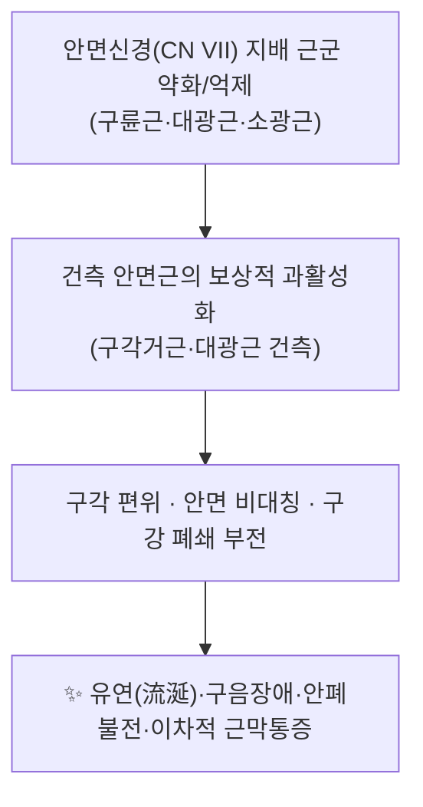

# 📍 [[경혈/족양명위경/지창]] (Dicang, ST4)

> **핵심 요약 (Key Summary)**:
> 지창(地倉, ST4)은 [[족양명위경]]의 제4혈로, 구각(입꼬리) 외측 약 0.4촌에 위치하며 [[구륜근]]·[[대광근]]·[[소광근]] 등 구각 주변 안면 표정근이 지배 영역이다.
> 안면신경(CN VII)의 협지·하악연지 지배를 받는 구각 주변 근군의 기능 회복을 표적으로 하여, [[말초성 안면마비]]([[구안와사]], [[벨마비]])의 구각 편위·유연(流涎)·구음장애 및 중추성 안면마비의 잔여 증상에 빈용된다.
> 임상적으로는 地倉透頰車(지창투협거) 형태의 투자와 [[전침]], [[피내침]] 병용이 자주 쓰이나, 지창 단독 자극의 효과를 정면으로 검증한 연구는 **근거 미확인**이다.

---

## 📌 목차
1. [해부학적 정밀 구조 및 지배 신경/혈관](#1-해부학적-정밀-구조-및-지배-신경혈관)
2. [생체역학·토크 분석 & 근막 사슬 (Biomechanical Synergy)](#2-생체역학토크-분석--근막-사슬-biomechanical-synergy)
3. [근막통증증후군(TP) & 연관통 패턴 (Travell & Simons)](#3-근막통증증후군tp--연관통-패턴-travell--simons)
4. [초음파 해부학(Sonoanatomy) 및 중재 시술 랜드마크](#4-초음파-해부학sonoanatomy-및-중재-시술-랜드마크)
5. [⭐ 원장님 심층 임상 고찰 및 원본 필기 (Clinical Pearls)](#5-⭐-원장님-심층-임상-고찰-및-원본-필기-clinical-pearls)
6. [관련 임상 질환 및 운동손상 증후군 총괄](#6-관련-임상-질환-및-운동손상-증후군-총괄)
7. [추나·도수치료(MET/PIR) & 침구·약침·재활 프로토콜](#7-추나도수치료metpir--침구약침재활-프로토콜)
8. [출처 및 학술 참고 문헌 (References)](#8-출처-및-학술-참고-문헌-references)

---
## 1. 해부학적 정밀 구조 및 지배 신경/혈관

지창은 근육이 아니라 **경혈(acupoint)** 이므로, 템플릿의 '기시–정지' 항목을 자침 목표 구조물(구각 주변 근군)과 취혈·자침 조건 중심으로 치환해 정리한다. 아래 내용은 표준 경혈학·해부학 교과서 기술을 기준으로 하며, 개체 변이와 문헌별 기재 차이가 있는 항목은 별도로 표시하였다.

| 항목 | 상세 내용 |
| :--- | :--- |
| **소속 경맥** | [[족양명위경]] (足陽明胃經, Stomach Meridian) 제4혈 · 국제 표준 코드 **ST4** |
| **혈명(穴名) 해석** | 地(땅·하부) + 倉(곳간) — 구각에 위치하여 수곡(水穀)이 모이는 '곳간'에 비유한 명명으로 해석됨 |
| **표준 위치** | 안면부, 구각(입꼬리) 외측 약 **0.4촌** 지점. 정면에서 눈동자 중심을 지나는 수직선상에 해당 |
| **취혈 조건** | **입을 다문 상태(정지 상태)** 에서 취혈. 입을 벌리면 구각 자체가 외측·하방으로 이동하므로, 자침 시 환자에게 입을 다물게 하는 것이 표준 |
| **자침법** | 平刺(평자)/사자 방향으로 **0.5~1촌** 수준이 교과서에 기재되며, 임상에서는 **地倉透頰車(ST6 방향 투자)** 형태가 흔히 쓰인다. 안면부 특성상 提插(제삽)보다 捻轉(염전) 위주로 자극 (세부 심도·각도는 문헌별 기재 차이 있음) |
| **교회혈(交會穴)** | 手足陽明經과 陽蹻脈의 교회혈로 기재됨 (전통 침구학 교과서 기준) |
| **지배 신경** | **안면신경(CN VII)** — 구륜근은 주로 협지(buccal branch), 대광근·소광근은 하악연지(marginal mandibular branch) 지배로 기술됨. 구각 피부의 **감각**은 삼차신경(CN V) 하악지(V3) 담당 |
| **혈관 공급** | **안면동맥(facial artery)** 및 안면정맥의 구각 주위 분지 — 상·하순동맥으로 이어지는 구역. 안면동맥의 주행·분지 양상은 개체 변이가 큼 |
| **표적 근군(자침 심부)** | [[구륜근]](orbicularis oris), [[대광근]](depressor anguli oris), [[소광근]](depressor labii inferioris), [[상순거근]]·구각거근 등 구각–상순 복합체 |
| **근막층** | 피부 → 피하조직 및 **SMAS(표재근막계)** → 표정근 → 구강 점막하 조직 순으로 천층~심층 구성 |

**임상적 요점**
- 지창은 "구각의 방향과 긴장"을 조절하는 혈위로, 안면마비에서 **병측 구각의 하수**와 **건측 구각의 견인**을 구분해 자침 방향과 염전 자극을 조정한다.
- 안면부는 혈관이 풍부하고 조직 저항이 적어 **자침 후 출혈·멍(반상출혈)** 이 잦으므로, 발침 시 건조 멸균 솜으로 국소 압박을 권장한다.
- 표정근은 피부·점막과 함께 움직이므로, 자침 후 환자가 말하거나 웃는 동안 침이 걸리거나 통증이 생길 수 있어 **입을 다문 편안한 상태 유지**를 안내한다.

---
## 2. 생체역학·토크 분석 & 근막 사슬 (Biomechanical Synergy)

안면 표정근은 관절을 움직이는 근육이 아니므로 고전적 의미의 '관절 토크' 분석 대상은 아니다. 대신 **구각을 중심으로 한 근육 간 짝힘(force couple)** 과 **구강 주변 근막 연속성**이 안면 대칭·구음·섭식 기능을 결정한다.

* **구각의 힘 평형(force couple)**: 구각 위치는 상방 견인군(구각거근, 상순거근, 소협골근, 대협골근)과 하방 견인군(대광근, 하순방형근)의 벡터 합으로 결정된다. 안면신경 손상 시 하방 견인군의 상대적 우세 또는 상방 견인군의 소실로 구각이 하수·내측 편위되며, 이때 지창은 **구각의 국소 정렬을 회복시키는 자극점**으로 활용된다.
* **근막 사슬 연계 (Myers Anatomy Trains 관점)**: 표정근은 SMAS를 통해 목 전방의 천층근막(광경근, 흉쇄유돌근 피막)과 연속된다. 따라서 구각 주변 지창·협거·견정 등은 광경근 긴장 및 경추–악관절(JTM) 부하와 기능적으로 연결해 해석할 수 있다. 다만 지창과 원격 근막 사슬의 인과관계를 정량화한 연구는 **근거 미확인**이다.
* **모멘트 관점 정리**: 안면부는 모멘트 암이 매우 짧아(수 mm~수 cm) 근수축력보다 **피부·점막의 장력 분포**가 결과 변위에 크게 기여한다. 이 때문에 근에너지기법(MET) 같은 능동 신장보다, 침 자극 후 **능동 표정 재훈련(미소 짓기, 입술 오므리기 등)** 을 병행하는 것이 기능 회복에 합리적이다.

---
## 3. 근막통증증후군(TP) & 연관통 패턴 (Travell & Simons)

* **발통점 및 연관통**: 지창의 자침 심부에 위치한 [[구륜근]]·[[대광근]]은 Travell & Simons의 근막통증 매뉴얼에서 각각 독립적 발통점(TrP)을 갖는 근육으로 다뤄진다. 구륜근 TrP는 입술 국소 통증·작열감, 대광근 TrP는 하악 전치부 및 구각 부위로의 연관통 양상이 기술된다. (개별 연관통 지도는 판본에 따라 세부 표현 차이가 있음)
* **임상 감별 포인트**: 구각 주위 통증·압통이 안면마비의 후유 자각증상인지, 근막성 통증인지, 삼차신경(V3) 병변인지, 치성·악관절 기원인지를 감별해야 한다. 감별이 불확실할 때 단순 근막통증으로 단정하면 뇌신경 병변을 놓칠 수 있다.
* **주의**: 단순 구각부 방사통을 안면마비로 오인하는 경우, 반대로 안면마비를 단순 TrP로 오인하는 경우가 모두 가능하므로 이학적 검사(안면부 근력, 이마 주름, 안륜근 폐안, 이개 주름 소실 여부 등)를 우선 시행한다.
* 지창 자극이 TrP 압통 역치를 직접 변화시킨다는 정량적 근거는 **근거 미확인**이며, 본 노트에서는 안면 기능 회복 목적의 경혈 자극 맥락에서 서술한다.

---
## 4. 초음파 해부학(Sonoanatomy) 및 중재 시술 랜드마크

* **탐촉자 선택**: 안면부는 표재성이므로 고주파 선형 탐촉자(통상 10 MHz 이상)를 사용해 피부–SMAS–표정근–점막하층의 층 구조를 확인한다.
* **핵심 랜드마크 3가지**
  1. **안면동맥(facial artery)** — 구각 외측을 따라 상행하는 박동성 혈관. 도플러로 확인하고 **침 끝을 혈관 내강에 두지 않도록** 하며, 자침 시 혈관 주행을 회피한다.
  2. **안면정맥(facial vein)** — 동맥보다 얇고 압박에 잘 눌리며 주행 변이가 있다. 반상출혈 위험 인자로 간주한다.
  3. **안면신경 분지(협지·하악연지)** — 초음파로 직접 분지 전체를 추적하기는 어려우나, 하악 하연부의 하악연지 주행을 염두에 두고 깊은 자침을 피한다.
* **안전 마진**: 구각은 구강 점막과 매우 근접하여, 과도한 각도로 깊게 자침하면 점막 천공 가능성이 있다. 지창 자침은 **피부면에 대해 낮은 각도의 평자(平刺)** 가 안전하며, 자침 중 환자가 입을 벌리게 하면 침이 점막으로 밀려 들어갈 수 있어 주의한다.
* **체열영상과의 조합**: Xu X, Li X (2026, PMID: 41558704)은 **적외선 체열영상(infrared thermography)** 을 활용해 아급성 말초성 안면마비 환자에서 자침 후 견인(pulling) 기법의 임상 효능을 평가하였다. 즉 안면부 온도 비대칭을 자극 전후 반응 평가 지표로 삼는 접근이 보고된 바 있으며, 지창 등 안면부 혈위 자극의 반응 평가에 참고할 수 있다.
* 초음파 유도로 지창 자침의 정확도 또는 안전성이 개선된다는 직접 비교 연구는 **근거 미확인**이다.

---
## 5. ⭐ 원장님 심층 임상 고찰 및 원본 필기 (Clinical Pearls)

> 이 항목은 원장님의 실제 임상 필기와 치료 노하우를 보존·축적하기 위한 공간이다. 아래는 **제공된 논문 및 표준 경혈학 지식에 근거한 실전 적용 틀**이며, 원장님 개인의 고유 기법·용량·경험치는 원본 필기로 추가 보완이 필요하다.

* **1) 자침 방향을 '증상 방향'에 맞춘다**: 구각이 하수된 병측에는 지창에서 **상방·외측(구각거근·상순거근 방향)** 으로 사자하여 상방 견인군을 활성 목표로 삼고, 구각이 견인된 경우에는 **협거 방향 투자**로 하방·외측 긴장을 분산시키는 방향으로 조정한다. (임상 응용 원칙, 정량 비교 근거 미확인)
* **2) 급성기–회복기 자극 강도 조절**: 급성기에는 안면부 자극을 약하게, 원위 취혈([[합곡]] LI4, [[태충]] LR3, [[족삼리]] ST36 등) 비중을 높이고, 회복기로 갈수록 지창·협거·양백·사죽공 등 국소 자극 강도를 올린다. 전침을 쓰는 경우 강도 차이가 결과와 뇌간 흥분성에 영향을 준다는 보고가 있으므로(Huang JP, Zhong CX, 2025, PMID: 41443919), 환자 내약성에 맞춰 자극량을 단계 조정한다.
* **3) 전침 단독보다 병용 전략**: Jiang Y, Zhang D (2026, PMID: 42185063)은 안면마비 중증도로 층화한 무작위 대조 시험에서 **전침 + 피내침(intradermal acupuncture) 병용**을 평가하였다. 외래 순응도가 낮은 환자에서는 피내침을 유지 요법으로 붙이고, 내원 시 전침을 병행하는 방식이 실용적이다.
* **4) 아급성기 정체 환자 관리**: 발병 2~4주 이후 회복 정체가 보일 때, 적외선 체열영상 기반 평가와 자침 후 견인 기법을 병용한 접근(Xu X, Li X, 2026, PMID: 41558704)을 참고하여 **좌우 온도차 및 구각 편위 정도를 객관 지표로 기록**하면서 치료 강도를 재설정한다.
* **5) 안전·감별 최우선**: Yan J, Li R (2025, PMID: 40518776)은 **다발성 뇌신경 손상 증례**를 보고하였다. 안면부 증상만 보고 곧바로 말초성 안면마비로 단정하지 말고, 뇌신경 다발 침범 징후(복시, 연하곤란, 구음장애, 이명·청력 변화, 어지럼 등)가 있으면 즉시 신경학적 평가로 전환한다. 특히 **이마 주름 소실·안륜근 마비를 동반한 진행성 또는 비전형 경과**는 중추 병변 감별이 필요하다.
* **6) 환자 교육 포인트**: 지창 자침 후 국소 멍·부종이 흔하므로 시술 전 설명하고, 자가 안면 마사지·표정 재훈련(입술 오므리기, 미소 유지, 볼 부풀리기)을 과제로 부여한다. 안면부 온찜질은 급성기 염증성 상태에서 피하도록 안내한다(온도·시기별 근거는 **근거 미확인**).
* **7) 한의학적 변증 연결**: 지창은 위경(陽明經)의 안면부 혈로 "陽明經筋의 안면부 순행" 개념과 연결해, 안면 근긴장·구각 문제를 陽明經筋 실조로 해석하는 전통적 관점을 참고할 수 있다. 다만 이 해석과 현대 신경생리 지표를 직접 연결한 연구는 **근거 미확인**이다.

---
## 6. 관련 임상 질환 및 운동손상 증후군 총괄

| 임상 질환 / 증후군 | 병리적 연관 기전 | 주요 증상 및 이학적 검사 | 핵심 교정 타깃 |
| :--- | :--- | :--- | :--- |
| [[말초성 안면마비]] ([[벨마비]], [[구안와사]]) | 안면신경(CN VII) 염증·부종에 의한 전도 차단 → 구각 주변 표정근 약화 | 구각 하수·편위, 이마 주름 소실, 안폐불전, 미각 이상, 유연(流涎). 검사: 안면근력 등급, 폐안 완전성, 이개 주름 | 병측 구륜근·대광근·소광근 활성화, 건측 과긴장 이완. 지창·협거·양백·사죽공 |
| [[중추성 안면마비]] (뇌졸중 등) | 상위 운동신경로 병변 → 하안면 위주 근약화, 이마·안륜근은 상대적 보존 | 이마 주름 보존, 하안면 위주 하수, 동반 편마비·구음장애·연하곤란 | 신경학적 평가 우선(급성기 감별), 회복기 잔여 구각 증상에 지창 활용 |
| [[다발성 뇌신경 손상]] | 여러 뇌신경 동시 침범(병인 다양) | 복시·연하곤란·구음장애·안면감각 이상 등 복합 소견. 안면 단일 증상으로 보이지 않는 경우 많음 | 안면부 자극 이전에 **뇌신경 감별 및 전문 평가**(Yan & Li, 2025, PMID: 40518776) |
| [[구각 주위 근막통증]] | 구륜근·대광근 TrP 및 SMAS 층 긴장 | 구각·하악 전치부 국소 통증, 압통점, 개구 시 불편감 | 국소 발통점 자극 및 주변 근 이완(지창·협거 주변) |
| [[유연(流涎) 및 구음장애]] | 구강 폐쇄 부전 및 구각 정렬 소실 | 침 흘림, 발음 명료도 저하, 저작·섭식 어려움 | 구륜근 폐쇄력 훈련, 지창·인중·승장 계열 병용 |
| [[삼차신경통]] / 안면 감각 이상 | 삼차신경(V3) 자극·병변 (안면신경과 감각 경로가 다름) | 발작성 전격통, 구각부 감각 저하 | 감별 필수 — 안면마비와 치료 전략 상이 |

---
## 7. 추나·도수치료(MET/PIR) & 침구·약침·재활 프로토콜

* **한의학 경혈 매핑(안면 국소)**: [[지창]] ST4, [[협거]] ST6, [[양백]] GB14, [[사죽공]] TE23, [[찬죽]] BL2, [[예풍]] TE17, [[인중]] GV26(증상에 따라), [[승장]] CV24
* **한의학 경혈 매핑(원위)**: [[합곡]] LI4, [[태충]] LR3, [[족삼리]] ST36, [[삼간]] LI3(변증에 따라) — 안면부 자극 강도를 낮춰야 하는 급성기에 비중을 높인다.
* **자침 프로토콜(단계별)**
  1. **급성기(발병 ~1–2주)**: 안면부는 약자극·염전 위주, 원위 취혈 중심. 안면부 발침 시 압박 지혈.
  2. **아급성기(2–4주)**: 지창투협거 등 투자 도입, 전침 병용 시작. 자극 강도는 환자 내약성 기준으로 단계 상향(Huang & Zhong, 2025, PMID: 41443919). 적외선 체열영상 등으로 좌우 차이 기록(Xu & Li, 2026, PMID: 41558704).
  3. **회복기·후유기(4주 이후)**: 지창·협거 중심 국소 자극 + 피내침 유지 병용(Jiang & Zhang, 2026, PMID: 42185063), 표정 재훈련·구강 폐쇄 훈련 병행. 한의학적 치료(침·약침·한약 등)를 병용한 증례들이 보고되어 있다(Jeong & Kim, 2018, PMID: 30652048).
  4. **근거 기반 권고 틀**: 말초성 안면마비에 대한 침 치료 권고안 문헌이 존재하나(Zheng & Li, 2009, PMID: 19222110), 지창 개별 혈위의 용량·자극 강도에 대한 세부 권고는 원문 확인 필요.
* **근에너지기법 (MET) / 도수 접근**
  - 안면 근육에는 직접적인 등척성 저항 기법보다 **능동 보조 가동(표정 훈련)** 이 현실적이다. 원장님 임상에서는 좌우 대칭 목표로 "미소 유지 5~10초" 등 저부하 반복 과제를 자주 처방하는 형태가 적합하다(구체 세트·반복 수는 환자별 조정, 정량 근거 **근거 미확인**).
  - 경추 상부·악관절 기능 제한이 안면 근긴장에 영향을 줄 수 있으므로, [[흉쇄유돌근]]·[[광경근]] 및 상부 경추 가동성 평가를 병행한다.
* **약침·기타**: 안면부는 약침 시술 시 혈관·신경 분지와 점막 근접성 때문에 천자 깊이·용량을 보수적으로 설정해야 한다. 지창 부위 약침의 안전성·유효성을 정면으로 평가한 제공 논문은 없으므로 **근거 미확인**으로 표시한다.

---
## 8. 출처 및 학술 참고 문헌 (References)

**제공 논문 (PubMed)**
1. Yan J, Li R (2025). [Case of multiple cranial nerve injury]. *Zhongguo Zhen Jiu*. PMID: 40518776
2. Zheng H, Li Y (2009). Evidence based acupuncture practice recommendations for peripheral facial paralysis. *Am J Chin Med*. PMID: 19222110
3. Huang JP, Zhong CX (2025). [Therapeutic effect of electroacupuncture at different intensities on peripheral facial paralysis and its influence on brainstem excitability]. *Zhen Ci Yan Jiu*. PMID: 41443919
4. Xu X, Li X (2026). [Clinical efficacy of pulling technique by needle stuck for subacute peripheral facial paralysis based on infrared thermography]. *Zhongguo Zhen Jiu*. PMID: 41558704
5. Jeong HI, Kim KH (2018). Korean Medicine for Treating Facial Palsy: A Literature Review of Case Reports. *J Pharmacopuncture*. PMID: 30652048
6. Jiang Y, Zhang D (2026). [Electroacupuncture combined with intradermal acupuncture for Bell's palsy: a stratified randomized controlled trial based on facial paralysis severity]. *Zhen Ci Yan Jiu*. PMID: 42185063

**일반 해부학·근막통증 참조 (템플릿 기본 문헌)**
7. **Standring, S. (2020)**. *Gray's Anatomy: The Anatomical Basis of Clinical Practice* (42nd ed.). Elsevier.
8. **Travell, J. G., & Simons, D. G. (1999)**. *Myofascial Pain and Dysfunction: The Trigger Point Manual*, Vol. 1.

> **표기 원칙 안내**: 본 노트에서 수치·기전을 확인할 수 없는 항목은 '근거 미확인'으로 명시하였다. 제공 논문의 세부 결과(혈위 구성, 자극 강도 수치, 반응률 등)는 원문 확인 후 보완하며, 지창(ST4) 단독 자극의 효능을 검증한 연구는 현재 제공 문헌 범위 내에서 확인되지 않는다.