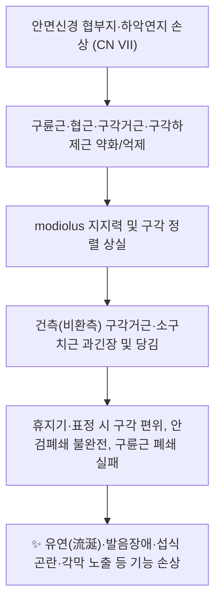

# 💉 [[지창]] (Dicang, 地倉, ST4)

> **핵심 요약 (Key Summary)**:
> [[지창]](ST4)은 구각(입꼬리) 외측 0.4寸, 동공 중심 직하에 위치한 [[족양명위경]]의 안면부 경혈로, 표층은 [[구륜근]]·[[협근]] 등 표정근과 [[modiolus]](구각건결절)에 직접 닿아 있다.
> 지배 신경은 [[안면신경]](CN VII) 협부지·하악연지이며, 이 혈은 [[말초성 안면신경마비]](구안와사)·[[구각편위]]·유연(流涎)의 국소 핵심 자침점이다.
> 자침은 구각 또는 [[협거]](ST6) 방향으로 사자·투자하며, 안면동맥·이하선관 등 위험 구조물을 피하는 안전 각도 설정이 필수다.

---
## 📌 목차
1. [해부학적 정밀 구조 및 지배 신경/혈관](#1-해부학적-정밀-구조-및-지배-신경혈관)
2. [생체역학·토크 분석 & 근막 사슬 (Biomechanical Synergy)](#2-생체역학토크-분석--근막-사슬-biomechanical-synergy)
3. [근막통증증후군(TP) & 연관통 패턴 (Travell & Simons)](#3-근막통증증후군tp--연관통-패턴-travell--simons)
4. [초음파 해부학(Sonoanatomy) 및 중재 시술 랜드마크](#4-초음파-해부학sonoanatomy-및-중재-시술-랜드마크)
5. [⭐ 원장님 심층 임상 고찰 및 원본 필기 (Clinical Pearls)](#5-원장님-심층-임상-고찰-및-원본-필기-clinical-pearls)
6. [관련 임상 질환 및 운동손상 증후군 총괄](#6-관련-임상-질환-및-운동손상-증후군-총괄)
7. [추나·도수치료(MET/PIR) & 침구·약침·재활 프로토콜](#7-추나도수치료metpir--침구약침재활-프로토콜)
8. [출처 및 학술 참고 문헌 (References)](#8-출처-및-학술-참고-문헌-references)

---
## 1. 해부학적 정밀 구조 및 지배 신경/혈관

> **템플릿 필드 조정 안내**: 본 노트의 대상은 근육이 아니라 **경혈(經穴)**이므로, 근골격계 템플릿의 「기시(Origin) / 정지(Insertion)」 항목은 경혈 특성상 해당 사항이 없다. 대신 경혈 특유의 **위치 좌표 · 자침 각도/깊이 · 표층/심층 구조물 · 위험 구조물** 항목으로 치환하여 동일한 표 구조를 유지하였다.

| 항목 | 상세 내용 |
| :--- | :--- |
| **혈명 · 코드** | 지창(地倉), ST4, 족양명위경(足陽明胃經) 제4혈. 「지창」은 곡식 창고[倉]를 땅[地]에 비유한 혈명으로, 위경(胃經)의 곡기를 받드는 안면 요충이라는 의미. |
| **소속 경락** | [[족양명위경]] (足陽明胃經, Foot-Yangming Stomach Meridian) |
| **위치 (Location)** | 얼굴부, **구각(입꼬리) 외측 0.4寸**, 동공 중심에서 수직으로 내려온 선상. 표준 경혈 위치(WHO 계열)와 한국·중국 교과서 간에 구각 외측 거리를 0.4寸 또는 「구각 옆 0.4寸·동공 직하」로 기술하는 차이가 있어 자침 전 재확인 권장. 인접혈은 [[협거]](ST6, 하악각 전상방), [[대영]](ST5), [[승장]](CV24). |
| **표층 구조물** | 피부 → 피하조직(얼굴 표정근 상부의 얇은 SMAS층) → **[[구륜근]](口輪筋, orbicularis oris)** 및 그 상·하방으로 모여드는 표정근 섬유. |
| **심층 구조물** | **[[modiolus]](구각건결절)** — 구각에서 외측 약 1 cm 지점에 위치하는 섬유근성 결절로, [[구륜근]] · [[협근]](buccinator) · [[구각거근]](levator anguli oris) · [[구각하제근]](depressor anguli oris) · [[소구치근]](risorius) · [[대협골근]](zygomaticus major) 등이 교차·부착한다. 지창 자침의 침 끝은 통상 이 modiolus 주변 섬유체에 도달한다. 더 심부로는 협지방패(buccal fat pad), 교근(masseter) 전연이 위치한다. |
| **신경 지배 (운동)** | **[[안면신경]](CN VII)** — 측두지·협돌지(광대지)·**협부지(buccal branch)**·**하악연지(marginal mandibular branch)**·경부지 중 구각 주위는 특히 협부지와 하악연지가 담당. 핵은 교뇌(뇌교) 안면신경운동핵. → 지창은 안면신경 말초 병변(말초성 안면신경마비) 평가·치료의 핵심 표적. |
| **신경 지배 (감각)** | **[[삼차신경]](CN V)** — 구각·하순 부위는 주로 하악지(V3)의 협신경(buccal nerve)·이신경(mental nerve) 영역. 즉 **운동은 VII, 감각은 V**라는 안면부의 이중 신경 체계를 반드시 구분해야 한다. |
| **혈관 공급 / 위험 구조** | **[[안면동맥]](facial artery)** 및 **하순동맥(inferior labial artery)**, 상순동맥의 구각 주위 분지, **안면정맥 → 구각정맥** 계열. 안면동맥은 구각 외측 약 1 cm 내외에서 주행이 변동성이 커(굴곡·사행), 자침 및 주입 시 **혈종·혈관 내 주입** 위험이 있다. 또한 심부에는 **이하선관(Stensen's duct)** 개구부(제2대구치 상방)와 구강 점막이 근접한다. |
| **자침법 (刺針法)** | 통상 **사자(斜刺) 또는 횡자(平刺) 0.5~0.8寸**, 안면마비 치료 시 **구각을 향해, 또는 [[협거]](ST6) 방향으로 투자(透刺) 1~1.5寸**하는 기법이 전통적으로 쓰인다. 깊이·각도는 문헌별 기술 차이가 있으므로 **침 끝이 구강 점막을 뚫지 않도록** 천자 방향을 조절한다(근거 미확인: 개별 문헌의 정확한 寸수·각도 수치는 원문 확인 필요). |
| **금기 · 주의** | 안면부는 瘢痕灸(반흔구) 금지. 자침 후 국소 혈종·멍, 감염 주의. 안면부 자극은 통증·자율신경 반응이 예민하므로 자극량 조절 필요. |

**핵심 정리**: 지창은 「해부학적으로는 구륜근-협근 복합체와 modiolus」, 「신경학적으로는 안면신경 협부지·하악연지」, 「임상적으로는 구각 편위·유연」이 하나의 축으로 연결되는 경혈이다. 따라서 안면마비 환자를 볼 때 **① 운동(VII) ② 감각(V) ③ 구각 정렬 ④ 구륜근 폐쇄력 ⑤ 유연 여부**를 함께 기록하는 것이 이 혈의 활용도를 결정한다.

---
## 2. 생체역학·토크 분석 & 근막 사슬 (Biomechanical Synergy)

안면 표정근은 사지 근육과 달리 **관절 토크보다 「연부조직 장력 균형(soft-tissue tension balance)」** 으로 기능한다. 구각은 상방(대협골근·구각거근·상순거근)과 하방(구각하제근·하순하제근), 후방(협근·소구치근), 그리고 원주 방향(구륜근)의 힘이 **modiolus 한 점에서 벡터 합성**되는 구조이며, 지창(ST4)은 이 벡터 합성점에 가장 근접한 경혈이다.

* **벡터 균형 관점**: 구각 편위는 「환측 약화 + 건측 과긴장」의 **합성 벡터**로 이해해야 하며, 단순히 환측만 자극하는 접근은 건측 과긴장을 간과할 수 있다. 지창 자침 시 환측·건측 자극 강도를 구분하는 임상적 판단이 필요하다.
* **modiolus 중심화 실패**: modiolus는 구륜근·협근·거근·하제근이 교차하는 섬유근성 결절로, 이 지점의 장력이 무너지면 구륜근의 원주 방향 폐쇄력이 떨어져 **유연·발음장애(특히 ㅍ·ㅂ 계열)** 가 발생한다.
* **근막 사슬 연계 (Myers Anatomy Trains 관점)**: 표정근은 독립 근육이 아니라 SMAS(얕은근막근육계)를 통해 **이마-눈둘레-볼-입둘레-목(광경근)** 으로 이어지는 **얼굴의 표재성 근막 연속체**로 작동한다. 따라서 지창 자극은 국소 구각뿐 아니라 [[협거]](ST6)·[[양백]](GB14)·[[사죽공]](TE23)·[[예풍]](TE17) 등 안면 근막 사슬 전체의 긴장 재분배와 함께 설계하는 것이 합리적이다. (사슬 개념은 표준 해부·근막학 문헌 기준이며, 지창 단독의 정량적 토크 수치는 근거 미확인.)
* **토크·모멘트**: 안면 표정근은 근 복(腹)이 매우 짧고 지렛대 팔이 1 cm 미만인 「미세 토크 근」이므로, 사지 근육처럼 중량·각도별 토크 곡선을 적용하기 어렵다. 임상적으로는 **근전도·표정 대칭성·구각 이동 거리**로 기능을 평가하는 편이 실용적이다(정량 프로토콜 근거 미확인).

---
## 3. 근막통증증후군(TP) & 연관통 패턴 (Travell & Simons)

* **발통점(TrP) 및 연관통**: 지창 주변의 [[구륜근]], [[협근]], [[소구치근]], 그리고 심부의 [[교근]]에 존재하는 TrP는 안면·구강 주위에 국소 및 원격 연관통을 유발하는 것으로 Travell & Simons 분류상 기술되어 있다. 대표적으로 구륜근 TrP는 입술·구각 부위의 국소 통증과 「입 안이 꺼지는 듯한」 이상감각, 협근 TrP는 볼·잇몸·하악 부위 통증 및 저작 시 불편감, 교근 TrP는 하악각·치아·귀·눈썹 부위로의 연관통을 나타낸다.
* **임상 감별 포인트**: 안면마비 환자의 환측 근육은 **저긴장·위축** 방향으로 가고, 건측·만성기에는 **과긴장성 TrP**가 형성되기 쉽다. 따라서 지창 주변 촉진 시 **① 위축성 저긴장 ② 과긴장성 TrP ③ 섬유화(만성기)** 를 구분하여 접근해야 한다.
* **주의**: 안면부 TrP 자극(지압·침)은 삼차신경 자극을 통해 자율신경 반응(눈물·콧물·얼굴 홍조)을 유발할 수 있으므로 강자극은 피한다.
* 특정 근육의 정밀 연관통 지도 및 정량적 압통역치 수치는 Travell & Simons 원전(Vol. 1) 해당 장을 직접 확인할 것 — 본 노트에서는 **근거 미확인**으로 표시한다.

---
## 4. 초음파 해부학(Sonoanatomy) 및 중재 시술 랜드마크

* **프로브 및 스캔 뷰**: 고주파 선형 프로브(7~15 MHz 이상)를 사용하여 구각을 중심으로 **횡단면(transverse)** 과 **종단면(longitudinal)** 을 모두 확보한다. 안면부는 표층 구조물이 얇아 초점(focus)을 피부 직하로 올려야 구륜근·협근 층이 분리되어 보인다.
* **층별 확인 구조물(천→심)**:
  1. 피부 · 피하조직
  2. 구륜근 / 구각 주위 표정근 및 modiolus 주변 섬유체
  3. 협지방패(buccal fat pad) — 볼록하고 압박에 변형되는 저에코 지방층
  4. 교근(masseter) — 근섬유 방향이 뚜렷한 저에코 근층, 하악골 표면의 고에코선
* **안전 마진 및 위험 구조물 회피**:
  * **안면동맥(facial artery)**: 구각 외측 부근을 주행하며, 도플러로 확인 시 박동성 신호. 주행 변동성이 크므로 **시술 전 도플러 확인 필수**. 동맥 내 주입·천자 시 혈종 및 국소 괴사 위험.
  * **안면정맥 → 구각정맥** 계열: 압박 시 변형되는 저에코 관상 구조.
  * **이하선관(Stensen's duct)**: 제2대구치 상방의 구강 내 개구부로 이어지며, 협근을 관통한다. 심부·후방 자침 시 손상 주의.
  * **구강 점막**: 침이 구강 내로 관통하면 점막 자극·감염 위험. 초음파로 침 끝 위치를 실시간 확인하면 천자 깊이를 안전하게 제한할 수 있다.
* **약침·중재 시술 랜드마크 요약**: 구각 → modiolus(외측 약 1 cm) → 협지방패 → 교근 전연의 순서를 초음파로 확인한 뒤, **침 끝을 표정근 층 내에 유지**하는 것이 안전 원칙이다. 안면부 약침은 용량·농도·주입 속도를 최소화하는 것이 권장되나, 지창 혈에 대한 정량적 약침 프로토콜은 **근거 미확인**이다.

---
## 5. ⭐ 원장님 심층 임상 고찰 및 원본 필기 (Clinical Pearls)

* **① 자침 방향은 반드시 「구각을 향해」**: 지창은 위치 특성상 자침 방향이 곧 치료 설계다. 구각 편위가 있는 환자에서 환측 지창은 **구각 또는 협거(ST6) 방향으로 사자·투자**하여 침체가 modiolus와 구륜근 섬유를 관통하도록 한다. 수직으로 깊게 찌르면 구강 점막 천공 또는 안면동맥 손상 위험이 커지므로 피한다.
* **② 「지창–협거」 축으로 사고하기**: 전통적으로 **地倉透頰車(지창→협거 투자)** 가 구안와사 국소 처방의 기본 골격으로 쓰여 왔다. 이때 지창은 「구륜근·modiolus」, 협거는 「교근·하악각」을 담당하는 한 쌍으로 이해하면 자극 위치를 잡기 쉽다. 두 혈을 동시에 자극하면 구각 정렬과 저작·볼 근육의 긴장 균형을 함께 다룰 수 있다.
* **③ 환측과 건측을 구분하라**: 임상에서 가장 흔한 실수는 환측만 자극하는 것이다. 실제 구각은 **환측 약화 + 건측 과긴장**의 합력으로 반대 방향으로 당겨져 있으므로, 건측의 과긴장(소구치근·구각거근)을 완화하고 환측의 구륜근·협근 활성을 유도하는 **비대칭 설계**가 필요하다.
* **④ 급성기 자극량 조절**: 발병 초기(대략 1주 이내)에는 안면부 자극을 과도하게 하지 않는 견해와, 조기에 적극 개입하는 견해가 공존한다. **어느 쪽이 우월한지에 대한 본 노트 수준의 근거는 확인되지 않음(근거 미확인)** — 환자 통증·부종·자율신경 반응을 보며 개별 조정할 것. 전침 사용 시 **자극 강도에 따라 치료 효과와 뇌간 흥분성(뇌간 흥분도) 지표가 달라진다**는 연구 보고가 있으므로(Huang & Zhong, 2025), 강도는 「환자가 견디는 최소 유효 강도」를 원칙으로 단계적으로 올린다. 강도별 구체적 우열 수치는 **원문 확인 필요**.
* **⑤ 아급성기에는 기법을 바꿔라**: 아급성기 말초성 안면신경마비에서 **침을 걸어 당기는 提拉(제라) 계열 자침 기법**의 임상 효능이 적외선 체열영상(infrared thermography)을 기반으로 보고되었다(Xu & Li, 2026). 즉 회복 정체기에는 단순 유침보다 **자극 기법의 변화**가 의미를 가질 수 있다. 다만 대조군 설정·체열 지표의 정량적 변화값 등은 **원문 확인 필요**.
* **⑥ 유연(流涎) 관리 = 구륜근 폐쇄 재교육**: 지창 자극만으로 침 흘림이 해결되지는 않는다. 입술을 다물고 「ㅁ·ㅂ·ㅍ」 발음을 반복하는 **구륜근 폐쇄 재교육**과 빨대·저항 훈련을 병행하고, 자침은 그 재교육의 감각 입력을 강화하는 수단으로 위치시킨다.
* **⑦ 안면부 온구(灸)는 溫灸로 한정**: 안면부는 반흔구 금지. 온구 또는 무연 온구를 사용할 경우 화상·색소침착에 주의하고, 급성 염증기에는 생략한다.
* **⑧ 감별을 게을리하지 말 것 — 다발성 뇌신경 손상 경고**: 안면마비 환자에서 **미각 저하, 청각 과민·이명, 어지럼·안진, 이개 포진, 연하·발성 장애** 등 다른 뇌신경 증상이 동반되면 단순 벨마비로 단정하지 말고 중추 병변·다발성 뇌신경 손상·바이러스성(람세이헌트) 감별이 필요하다. 실제로 **다발성 뇌신경 손상 증례**가 보고된 바 있다(Yan & Li, 2025). (증례의 구체적 손상 신경 목록 및 경과는 원문 확인 필요.)
* **⑨ 기록의 표준화**: 내원 시마다 **House-Brackmann 등급(또는 유사 안면신경 기능 등급)** + 구각 편위 거리 + 안검폐쇄 완전성 + 유연 여부를 기록하면, 지창 중심 처방의 효과를 객관적으로 추적할 수 있다. 안면신경마비에 대한 근거기반 침구 임상 권고안이 제시된 바 있으므로(Zheng & Li, 2009), 처방 구성 시 이를 기준선으로 참조한다. 권고안 내 지창의 구체적 등급·권고 강도는 **원문 확인 필요**.

---
## 6. 관련 임상 질환 및 운동손상 증후군 총괄

| 임상 질환 / 증후군 | 병리적 연관 기전 | 주요 증상 및 이학적 검사 | 핵심 교정 타깃 |
| :--- | :--- | :--- | :--- |
| [[말초성 안면신경마비]] (벨마비) | 안면신경(CN VII) 말초 병변 → 표정근 일측 약화, modiolus 지지 상실 | 구각 편위, 안검폐쇄 불완전, 이마 주름 소실, 미각 저하. **House-Brackmann 등급**, 안면 대칭성 평가 | 환측 [[지창]]·[[협거]] 자극, 건측 과긴장 완화, 구륜근 재교육 |
| [[람세이헌트 증후군]] | 대상포진 바이러스(VZV)의 슬신경절 침범 → 안면신경 + 청신경 등 동반 | 이개·외이도 포진, 이통, 어지럼·이명 동반 | 항바이러스 병행 + 안면 국소 자침([[지창]]·[[예풍]]) — 감별 우선 |
| [[다발성 뇌신경 손상]] | 단일 신경으로 국한되지 않는 복수 뇌신경 병변(중추·감염·혈관성 등) | 안면마비 + 미각·청각·연하·안구운동 이상 복합 | 단순 안면마비 처방 금지, 신경학적 감별 및 협진 (Yan & Li, 2025 증례) |
| [[구각편위]] / [[유연]](流涎) | 구륜근 폐쇄력 저하 + modiolus 중심화 실패 | 휴지기·표정 시 구각 비대칭, 침 흘림, 「ㅁ·ㅂ·ㅍ」 발음 곤란 | 환측 [[지창]]·[[구륜근]] 활성화, 발음·저항 재교육 |
| [[교근]] 근막통증증후군 | 저작근 과긴장 및 TrP → 안면·치아·귀 연관통 | 하악각 압통, 개구 제한, 이통·치통 양상 통증 | [협거]]·[[교근]] TrP 이완, 야간 이갈이 관리 |
| [[삼차신경통]] (감별 대상) | 삼차신경(CN V) 발작성 통전통 | 전기 충격양 안면통, 유발점(trigger zone) 존재 | 운동(VII)과 감각(V)의 구분 — 지창 자극 전 감별 필수 |
| [[안면근 긴장이상]](구각 긴장) | 표정근 과활성 및 근긴장 이상 | 표정 시 구각·눈둘레 비수의도 수축 | 국소 자극 최소화, 보툴리눔 등 전문 치료 영역 |

---
## 7. 추나·도수치료(MET/PIR) & 침구·약침·재활 프로토콜

### 7-1. 한의학 경혈 매핑
* **국소(안면) 혈**: [[지창]](ST4), [[협거]](ST6), [[대영]](ST5), [[양백]](GB14), [[사죽공]](TE23), [[찬죽]](BL2), [[예풍]](TE17), [[어요]](EX-HN4)
* **원격(사지·체간) 혈**: [[합곡]](LI4, 對側 또는 雙側), [[태충]](LR3), [[족삼리]](ST36), [[내정]](ST44) — 위경(胃經)의 원격 배혈 개념을 활용한 구성
* **배혈 원칙**: 「국소 근위혈 + 원격혈」의 기본 구조에, 안면마비의 병기(급성·아급성·만성)에 따라 자극량과 기법(단순 유침 / 전침 / 제라 기법)을 달리한다.

### 7-2. 침구 프로토콜 (근거 연계)
* **근거기반 권고안 참조**: 말초성 안면신경마비에 대한 근거기반 침구 임상 권고안(Zheng & Li, 2009)이 제시되어 있으므로, 처방 구성과 치료 기간 설정 시 기준선으로 삼는다. (지창의 구체적 권고 등급은 원문 확인 필요.)
* **전침 자극 강도**: 전침의 자극 강도에 따라 말초성 안면신경마비 치료 효과 및 **뇌간 흥분성**에 차이가 나타난다는 연구 보고(Huang & Zhong, 2025). → 강도는 저강도에서 시작하여 환자 반응을 보며 조정하고, 강도 선택의 근거는 원문 확인.
* **아급성기 제라(提拉) 기법**: 아급성기 말초성 안면신경마비에서 침을 걸어 당기는 기법의 임상 효능이 적외선 체열영상을 기반으로 평가된 보고(Xu & Li, 2026). → 회복 정체기 환자에서 기법 전환 옵션으로 고려.
* **다발성 뇌신경 손상 감별**: 안면 증상이 다른 뇌신경 증상을 동반할 경우 다발성 뇌신경 손상 증례(Yan & Li, 2025)를 염두에 두고 감별·협진 우선.

### 7-3. 도수치료·운동치료 (안면 표정근 특화)
* **MET/PIR 적용의 한계**: 안면 표정근은 근 복이 짧고 관절을 가로지르지 않으므로, 사지 근육에서 쓰는 **근에너지기법(MET)·PIR(등척성 후 이완)을 그대로 적용하기 어렵다**. 안면부에 대한 MET의 정량적 근거는 **근거 미확인**이며, 임상적으로는 아래의 「능동 표정 재교육」이 실질적 대응이다.
  * **구륜근 폐쇄 훈련**: 입술 다물기 → 저항(압설자) 유지 5초 → 이완, 반복.
  * **협근·볼 훈련**: 공기 볼록하게 하기, 좌우 볼 교대 부풀리기, 빨대 빨기.
  * **대칭 표정 훈련**: 거울을 보며 미소·입술 오므리기(ㅗ·ㅜ)·이 드러내기(ㅣ)를 건측과 비교하며 수행.
  * **구각 거상 훈련**: 검지로 환측 구각을 위로 보조한 뒤 스스로 미소 짓기(유도 피드백).
* **연부조직 이완**: 안면·경부 근막 이완, 협근 구강 내 마사지(장갑 착용 후 볼 안쪽에서 외부로), 흉쇄유돌근·광경근 이완을 병행하면 안면 근막 사슬의 긴장 재분배에 도움이 된다(정량적 근거는 미확인).

### 7-4. 약침·기타
* **약침**: 안면부는 혈관·신경 밀도가 높고 부피가 작아 **저용량·저농도** 원칙이 요구된다. 자침 전 도플러로 안면동맥을 확인하고, 지창 주변에서는 표정근 층 내 주입을 유지한다. 지창 혈 특이적 약침 처방 및 용량의 근거는 **근거 미확인**.
* **온구·전자봉**: 급성기 이후 회복 정체기에서 온구를 보조적으로 활용할 수 있으나 반흔구는 금지, 화상 주의.

---
## 8. 출처 및 학술 참고 문헌 (References)

1. **Yan J, Li R (2025)**. [Case of multiple cranial nerve injury]. *Zhongguo Zhen Jiu*. PMID: 40518776 — 안면 증상 감별 시 다발성 뇌신경 손상 가능성을 시사하는 증례 보고.
2. **Huang JP, Zhong CX (2025)**. [Therapeutic effect of electroacupuncture at different intensities on peripheral facial paralysis and its influence on brainstem excitability]. *Zhen Ci Yan Jiu*. PMID: 41443919 — 전침 자극 강도에 따른 말초성 안면신경마비 치료 효과 및 뇌간 흥분성 변화.
3. **Zheng H, Li Y (2009)**. Evidence based acupuncture practice recommendations for peripheral facial paralysis. *Am J Chin Med*. PMID: 19222110 — 말초성 안면신경마비에 대한 근거기반 침구 임상 권고안.
4. **Xu X, Li X (2026)**. [Clinical efficacy of pulling technique by needle stuck for subacute peripheral facial paralysis based on infrared thermography]. *Zhongguo Zhen Jiu*. PMID: 41558704 — 아급성기 말초성 안면신경마비에서 제라(提拉) 자침 기법의 임상 효능 및 적외선 체열영상 기반 평가.

> ※ 참고 논문 목록에 중복 기재된 항목(Huang & Zhong, 2025 = PMID 41443919 / Zheng & Li, 2009 = PMID 19222110)은 위와 같이 1건으로 통합하여 정리하였다.

5. **Standring, S. (2020)**. *Gray's Anatomy: The Anatomical Basis of Clinical Practice* (42nd ed.). Elsevier. — 안면 표정근의 부착, modiolus, 안면신경(CN VII) 분지, 안면동맥 주행의 해부학적 기준.
6. **Travell, J. G., & Simons, D. G. (1999)**. *Myofascial Pain and Dysfunction: The Trigger Point Manual*, Vol. 1. — 구륜근·협근·교근 등 안면·저작근 TrP 및 연관통 패턴.

> **근거 표기 원칙**: 본 노트에서 「근거 미확인」으로 표시한 항목(자침 寸수·각도의 문헌 간 차이, 전침 강도별 우열, 지창 특이적 약침 용량, 안면부 MET의 정량적 효과, TrP 압통역치 수치 등)은 인용 논문에서 직접 확인되지 않은 내용이므로, 실제 임상 적용 전 원문 및 표준 교과서를 재확인할 것.