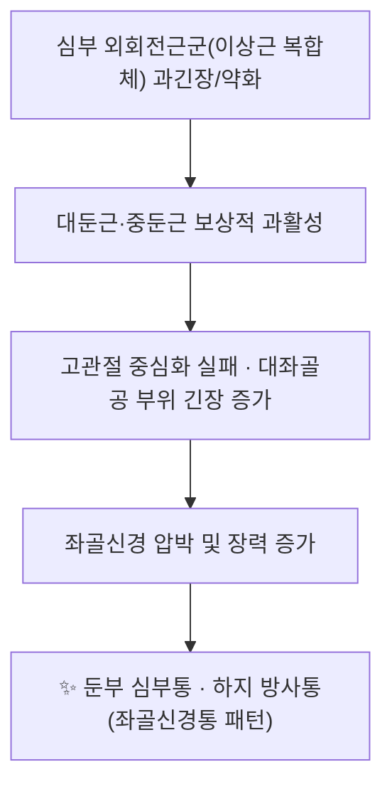

# 🪡 [[질변(BL54)]] (Zhibian, BL54)

![[질변(BL54)_1.jpg|540]]
> [그림 1: ① 병태생리·영상 — Electro-diagnostic test of a 22 year-old female patient complaining of right sided <b>piriformis muscle syndrome</b> sin]
![[질변(BL54)_2.jpg|540]]
> [그림 2: ② 관련 해부 구조물 — Photograph of the dissected male cadaver of the right <b>gluteal region</b> and back of the thigh showing high bifurcati]

> **핵심 요약 (Key Summary)**:
> [[질변(BL54)]]은 [[족태양방광경]]의 제54번째 경혈로, 천골 정중릉에서 3촌 외측·제4천골후공 높이의 [[둔부]] 심부에 위치하며 표층은 [[대둔근]], 심층은 [[이상근]]과 [[좌골신경]]·[[하둔동맥]]·[[상둔동맥]]에 인접한다.
> 따라서 [[좌골신경통]]·[[이상근 증후군]] 등 둔부 심부 통증과 하지 방사통의 핵심 자침점이며, [[전침]]·[[약침]]·[[추나요법]]과 병용된다.
> 최근에는 초음파 유도 자침 및 질변→수도([[수도(ST28)]]) 투자법이 방광 조절 기능·골반 통증·부인과 영역에서 연구되고 있으나, 일부는 동물실험 단계로 임상 근거가 제한적이다.

---
## 📌 목차
1. [해부학적 정밀 구조 및 지배 신경/혈관](#1-해부학적-정밀-구조-및-지배-신경혈관)
2. [생체역학·토크 분석 & 근막 사슬 (Biomechanical Synergy)](#2-생체역학토크-분석--근막-사슬-biomechanical-synergy)
3. [근막통증증후군(TP) & 연관통 패턴 (Travell & Simons)](#3-근막통증증후군tp--연관통-패턴-travell--simons)
4. [초음파 해부학(Sonoanatomy) 및 중재 시술 랜드마크](#4-초음파-해부학sonoanatomy-및-중재-시술-랜드마크)
5. [⭐ 원장님 심층 임상 고찰 및 원본 필기 (Clinical Pearls)](#5-원장님-심층-임상-고찰-및-원본-필기-clinical-pearls)
6. [관련 임상 질환 및 운동손상 증후군 총괄](#6-관련-임상-질환-및-운동손상-증후군-총괄)
7. [추나·도수치료(MET/PIR) & 침구·약침·재활 프로토콜](#7-추나도수치료metpir--침구약침재활-프로토콜)
8. [출처 및 학술 참고 문헌 (References)](#8-출처-및-학술-참고-문헌-references)

---
## 1. 해부학적 정밀 구조 및 지배 신경/혈관

| 항목 | 상세 내용 |
| :--- | :--- |
| **혈위 명칭·소속** | 질변(秩邊), 秩 = 차례·서열, 邊 = 가(가장자리). 방광경 둔부 구역의 최하단 혈(54번)로, 이후 [[합양(BL55)]]부터 하지로 내려간다. |
| **표준 위치 (Location)** | 엉덩이(둔부) 부위, [[천골]](sacrum) 정중천골릉(median sacral crest)에서 **3촌 외측**, **제4천골후공(4th posterior sacral foramen)과 같은 높이**. [[팔료혈]](BL31~BL34) 열의 연장선상 하단에 해당한다. |
| **표층 구조 (Superficial)** | 피부 → 피하조직 → [[천요근막]](thoracolumbar fascia) 및 둔근막 → [[대둔근]](gluteus maximus) |
| **심층 구조 (Deep)** | [[이상근]](piriformis), [[하쌍자근]], [[상쌍자근]] / 내측으로 [[천골신경총]](sacral plexus), [[좌골신경]](sciatic nerve), [[음부신경]], [[내음부동맥]] |
| **신경 지배 (표층)** | [[하둔신경]](inferior gluteal nerve, L5–S2) → [[대둔근]] |
| **신경 지배 (심층)** | [[이상근신경]](nerve to piriformis, S1–S2, 천골신경총 분지) → [[이상근]] / [[좌골신경]]은 L4–S3 신경근에서 기원 |
| **혈관 공급** | [[상둔동맥]](superior gluteal a.) 및 [[하둔동맥]](inferior gluteal a.) — 모두 [[내장골동맥]](internal iliac a.) 분지. 동반 정맥이 대좌골공 부위에서 신경과 함께 주행한다. |
| **자침 각·깊이** | 직자(直刺) 1.5~3촌(교재 및 임상 관행에 따라 1.5~2촌 또는 2~3촌으로 기술이 갈린다 — **세부 수치 근거 미확인**). 심층에서 좌골신경 자극 시 하지로 방전감이 나타나며 이를 득기의 지표로 본다. |
| **위험 구조물** | 천자 방향이 내측·전방으로 깊어지면 [[골반강]] 내 [[직장]]·[[방광]]·여성의 경우 [[자궁]]·[[난소]]에 접근하므로 방향 이탈에 주의. 항응고제 복용자, 임산부, 출혈 경향 환자에서 심자 시 주의가 필요하다(일반적 금기 원칙이며 BL54 특이 근거는 **미확인**). |

### 🔬 해부학 도해 및 단면도 (천자 경로 층 구조)

시상·횡단면 기준으로 자침 경로를 층별로 정리하면 다음과 같다.

1. **피부·피하** — 둔부 지방층이 두꺼워 체표 랜드마크(천골 정중릉·후상장골극)를 먼저 촉지하는 것이 정확도를 좌우한다.
2. **대둔근** — 둔부 표층의 대근육으로, 혈위는 대둔근 섬유 아래에 놓인다.
3. **이상근** — 대좌골공(greater sciatic foramen)을 채우듯 주행하며, 좌골신경과의 해부학적 관계가 임상적으로 가장 중요하다.
4. **좌골신경 및 하둔혈관** — 이상근 하연을 지나 후대퇴부로 하행하며, 둔부 심부 통증·방사통의 병리 지점이 된다.

---
## 2. 생체역학·토크 분석 & 근막 사슬 (Biomechanical Synergy)

* **모멘트 암과 토크**: 고관절 신전·외회전 시 대둔근과 이상근은 대좌골공 주변에서 합력 벡터를 형성한다. 대둔근이 약화되면(하둔신경 지배, L5–S2) 심부 외회전근군에 토크 부하가 가중되고, 그 결과 [[이상근]] 과긴장 → 좌골신경 압박이라는 악순환이 만들어진다.
* **고관절 굴곡 각도에 따른 작용 전환**: 이상근이 고관절 굴곡 60° 이상에서 내회전근으로 전환한다는 기술은 전통적 견해이며, 최근 생체역학 연구에서는 이분법적 전환보다 지속적 외회전 안정화 역할이 강조된다 — **논쟁 중, 근거 미확인**.
* **근막 사슬 연계 (Myers Anatomy Trains / McGill)**
  * **심부 종선(Deep Longitudinal Sling)**: 천골 → 대둔근 → 대퇴이두근 → 비골근 → 족저. 천골-둔부-후방 하지의 장력 연속선으로, BL54는 이 사슬의 천골 기점부에 놓인다.
  * **나선선(Spiral Line)**: 둔부 외회전근군을 경유하여 체간-하지 회전 제어에 관여.
  * **후방 기능선(Back Functional Line)**: 대둔근-광배근 연결을 통해 반대측 둔부와 교차 연결되어, 편측 BL54 압통 시 반대측 둔부 통증이나 체간 회전 제한이 동반될 수 있다.

---
## 3. 근막통증증후군(TP) & 연관통 패턴 (Travell & Simons)

* **[[이상근]] 발통점(TrP)**: 천골 외측·둔부 심부에 위치하며, 직접 압박 시 엉덩이 깊은 곳의 둔통과 함께 [[천장관절]] 및 [[고관절]] 후방으로 통증이 퍼진다. 좌골신경을 통한 **하지 후면 방사통**이 특징이며, [[대둔근]] TrP와 감별이 필요하다.
* **[[대둔근]] 발통점(TrP)**: 혈위 표층 근육으로, 좌골결절 부근과 천골 외측에 압통점이 형성되며 둔부 국소통을 주로 만든다. 이상근 병변과 동시 존재하는 경우가 흔하여 **"이중 병변(double lesion)"** 형태로 나타난다.
* **연관통 감별 포인트**: 좌골신경 자극성 통증은 하지 후면·비골두 이하까지 방사되는 반면, 대둔근 TrP는 주로 둔부에 국한된다. [[추간판 탈출증]]에 의한 신경근성 통증(피부분절 분포, SLR 양성)과의 감별이 반드시 선행되어야 한다.
* **참고**: 이상근 증후군 환자의 전기진단 소견은 상단 그림 1과 같이 둔부 심부 근육의 이상 소견 평가에 활용된다.

---
## 4. 초음파 해부학(Sonoanatomy) 및 중재 시술 랜드마크

* **초음파 유도 자침의 근거**: Dai J, Zhang X (2024)는 **초음파 유도 하 질변(BL54) 자침**이 여성의 방광 조절 기능 개선에 활용될 수 있음을 임상 연구로 보고하였다(World J Urol, PMID: 38710872). 이는 맹목적 자침에 비해 심부 구조물 식별과 안전 확보에 유리함을 시사한다.
* **주요 스캔 랜드마크**
  * **천골 정중릉·후상장골극(PSIS)** — 혈위 3촌 외측 좌표 설정의 기준점.
  * **대좌골공** — 천골과 이상근이 이루는 공간으로, 좌골신경·하둔혈관이 통과.
  * **이상근(횡단 단면)** — 대둔근 심부에서 근섬유 주행이 관찰되며, 비후·부종 평가에 유용.
  * **좌골신경** — 이상근 하연의 편평한 고에코 신경 구조로, 자침 시 직접 천자 회피 대상.
* **안전 마진(Safety Margin)**
  * 좌골신경 직접 천자 시 신경내 주사·혈종 위험이 있으므로, 초음파상 신경 주행이 확인되면 **0.5~1cm 이상 이격**을 두고 접근하는 것이 일반적 권고이나, 정확한 수치 기준은 **근거 미확인**.
  * 하둔동맥·상둔동맥 분지가 혈위 심층에 위치하므로 출혈 경향 환자에서는 세침·짧은 자침을 우선 고려한다.
* **초음파 유도 시 임상적 이점**: 혈위 심도가 개인차(둔부 지방 두께)가 크므로, 초음파로 목표 심도를 확인하면 득기 재현성이 올라간다.

---
## 5. ⭐ 원장님 심층 임상 고찰 및 원본 필기 (Clinical Pearls)

> 아래는 원장님 원본 필기가 **제공되지 않은 상태**에서, 상기 논문 및 해부학적 근거를 바탕으로 정리한 임상 고찰이다. 원본 필기 확인 후 보완이 필요하다.

* **혈위 선택 원칙**: 둔부 심부통 + 하지 후면 방사통 조합에서 [[환도(GB30)]]·[[위중(BL40)]]·[[곤륜(BL60)]]과 함께 3~4혈 배합이 전통적으로 쓰인다. BL54는 환도(GB30)보다 **내측·하방**에 위치하여 이상근·천골신경총 병변에 더 직접적으로 접근한다는 인식이 있다.
* **득기 판단**: 자침 후 하지로 퍼지는 방전감(電擊感)이 나타나면 좌골신경 자극 반응으로 해석하며, 이를 치료 반응의 지표로 삼는다. 다만 과도한 자극은 신경 자극 증상 악화로 이어질 수 있으므로 강자극·반복 염전은 피한다.
* **투자법(透刺) 활용의 경계**: 논문들에서 사용된 **질변 → 수도(ST28) 투자법**은 골반강을 관통하는 심부 자침으로, 동물실험 및 임상 프로토콜 단계에서 연구되고 있다. 실제 임상 적용 시 해부학적 위험이 크므로 초음파 유도 및 숙련된 시술 조건이 전제되어야 하며, 일반 외래에서의 무분별한 적용은 권장되지 않는다(**위험도·적응증에 대한 정량 근거 미확인**).
* **회자법(恢刺法) 장침**: Li SS, Wu YC (2020)는 이상근 증후군에서 **회자법 장침** 치료를 보고하였다(PMID: 32705835). 이상근에 대한 심부 도달을 목표로 하는 자법으로, 일반 직자보다 침 길이·자침 심도 선택이 중요하다.
* **전침·온침 병용**: 둔부 심부 근긴장에는 전침(저주파) 또는 온침을 병용하면 근이완 효과를 기대할 수 있다는 것이 전통적 활용이나, BL54 단독 전침의 정량적 효과 크기는 **근거 미확인**.
* **감별 진단 우선순위**: ① 요추 신경근병증(추간판 탈출) → ② 이상근 증후군 → ③ 천장관절 기능장애 → ④ 고관절 내병변. BL54 치료 반응이 3~4회에도 없으면 상위 원인 재평가를 권한다.

---
## 6. 관련 임상 질환 및 운동손상 증후군 총괄

| 임상 질환 / 증후군 | 병리적 연관 기전 | 주요 증상 및 이학적 검사 | 핵심 교정 타깃 |
| :--- | :--- | :--- | :--- |
| [[이상근 증후군]] | 이상근 비후·경련 → 대좌골공에서 좌골신경 압박 | 둔부 심부통, 앉은 자세 악화, FAIR 검사·Pace 검사 양성 | [[이상근]] 이완 + [[대둔근]] 강화 |
| [[좌골신경통]] | 좌골신경 압박·장력 증가(둔부 기원 또는 요추 기원) | 둔부→하지 후면 방사통, SLR 양성 | BL54·GB30·BL40 배합 자침 |
| [[혼합치핵]] 수술 후 통증 | 골반저·항문 주위 수술 창상 및 근긴장 | 술 후 VAS 상승, 배변 시 통증 | BL54 → ST28 투자 + 진통제 병용 (PMID: 40297489, *프로토콜 단계*) |
| [[원발성 월경통]] | NOD1/RIP2/NF-κB 신호경로 매개 염증 (랫드 모델) | 월경 주기성 하복통 | BL54 → ST28 투자 (PMID: 39943763, **전임상**) |
| [[조기난소부전]] | SIRT1/PGC-1α/Nrf2 신호경로 관련 산화스트레스 조절 (랫드 모델) | 난소 기능 저하, 호르몬 저하 | BL54 → ST28 투자 (PMID: 39401830, **전임상**) |
| 여성 방광 조절 기능 저하 | 방광 조절 기능 관련 골반저·신경 조절 이상 | 배뇨 조절 기능 저하 | 초음파 유도 BL54 자침 (PMID: 38710872) |

> ⚠️ 위 표에서 랫드 모델 연구(원발성 월경통·조기난소부전)는 **동물실험 단계**로, 인체 임상 적용 근거는 아직 확립되지 않았다.

---
## 7. 추나·도수치료(MET/PIR) & 침구·약침·재활 프로토콜

### 7-1. 한의학 경혈 매핑
* **본혈**: [[질변(BL54)]] — 둔부 심부·좌골신경 병변의 주 치료혈
* **배합혈**
  * [[수도(ST28)]] — BL54에서 투자할 때의 목표혈(하복부·골반강 접근)
  * [[환도(GB30)]] — 둔부 외측, 좌골신경 주행상 배합
  * [[위중(BL40)]] — 하지 후면 방사통 시 원격 취혈
  * [[곤륜(BL60)]] — 방광경 원격혈, 요통·하지통 배합
  * [[팔료혈]]([[상료(BL31)]]·[[차료(BL32)]]·[[중료(BL33)]]·[[하료(BL34)]]) — 천골공 자극, 골반저 질환 배합
  * [[승부(BL36)]]·[[합양(BL55)]] — 방광경 하행선 연결
* **자침 기법 요약**
  * 직자 1.5~3촌(심도는 체형·지방 두께에 따라 조정)
  * [[전침]]: 둔부 심부 근긴장에 저주파 자극 병용
  * [[투자법]]: BL54 → ST28 (연구 프로토콜 수준, 초음파 유도 권장)
  * [[회자법(恢刺法)]] 장침: 이상근 증후군 대상 (PMID: 32705835)

### 7-2. 근에너지기법 (MET / PIR)
* **이상근 PIR (Post-Isometric Relaxation)**
  1. 환자를 복와위·고관절 굴곡 및 외회전(FAIR 자세에 준함)으로 위치시킨다.
  2. 저항에 대항해 고관절 외회전을 20~30% 강도로 5~7초 등척성 수축.
  3. 호기 시 부드럽게 내회전·신장 방향으로 이완 유도, 3~5회 반복.
* **대둔근 MET**: 고관절 신전 방향으로 등척성 수축 후 이완을 유도하여 표층 과활성을 조절.
* **천장관절 가동성 회복**: 둔부 심부 근이완 후 천골의 nutation/counternutation 정렬을 재교육한다.

### 7-3. 약침·재활
* **약침**: [[약침]] 치료가 근긴장·통증 조절에 활용되나, **BL54 특이 약침 임상 근거는 본 노트에서 확인되지 않음(근거 미확인)**. 시술 시 심부 혈관·신경 손상 회피를 위한 초음파 병용을 고려한다.
* **재활 운동 프로토콜**
  * 심부 외회전근(이상근·쌍자근) 강화: 측와위 외회전, 클램셸 변형
  * 대둔근 강화: 브리징, 힙 익스텐션
  * 신경 활주 운동(Neurodynamic sliding): 좌골신경 긴장 완화 목적
  * 둔부 심부 스트레칭: FAIR 자세 스트레칭 (앉아서 시행)
* **주의사항**: 급성 신경 압박 증상(근력 저하·감각 소실 진행)이 있으면 자침·도수보다 영상 검사 및 감별 진단이 우선이다.

---
## 8. 출처 및 학술 참고 문헌 (References)

1. **Wang T, Gao JQ (2025)**. "Zhibian (BL54) to Shuidao (ST28)" Acupuncture Manipulation Combined with Analgesics in Postoperative Pain Management for Patients with Mixed Hemorrhoids: A Randomized Controlled Trial Protocol. *J Pain Res*. PMID: 40297489
2. **Yin LY, Feng HM (2024)**. [Effects of penetration needling from "Zhibian" (BL54) to "Shuidao" (ST28) on SIRT1/PGC-1α/Nrf2 signaling pathway in rats with premature ovarian insufficiency]. *Zhen Ci Yan Jiu*. PMID: 39401830
3. **Dai J, Zhang X (2024)**. Clinical study on improving the function of female bladder in controlling urine by acupuncture Zhibian (BL54) under ultrasound guidance. *World J Urol*. PMID: 38710872
4. **Jin X, Zhang Y (2025)**. [Analgesic effect of "Zhibian" (BL54)-toward-"Shuidao" (ST28) needling technique of acupuncture on primary dysmenorrhea based on NOD1/RIP2/NF-κB signaling pathway in the rats]. *Zhongguo Zhen Jiu*. PMID: 39943763
5. **Li SS, Wu YC (2020)**. [Effect of elongated-needle by Hui-puncture method on piriformis syndrome]. *Zhen Ci Yan Jiu*. PMID: 32705835
6. **Standring, S. (2020)**. *Gray's Anatomy: The Anatomical Basis of Clinical Practice* (42nd ed.). Elsevier.
7. **Travell, J. G., & Simons, D. G. (1999)**. *Myofascial Pain and Dysfunction: The Trigger Point Manual*, Vol. 1.

<!-- 보관 태그(1회용·링크오류, 필요시 복원): 방광경, BL54 -->
