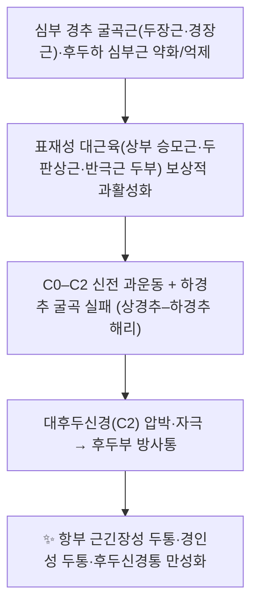

# 🫁 [[경혈/천주]] (天柱 · BL10)

> **핵심 요약 (Key Summary)**:
> [[천주]](天柱, BL10)는 [[족태양방광경]]의 항부(項部) 경혈로, 후발제 상 0.5촌([[아문]] GV15)과 같은 높이에서 정중선 외측 1.3촌, [[승모근]] 상부 섬유 외측연의 함요부에 위치한다.
> 심부에 [[두판상근]]·[[반극근 두부]]·[[후두하근군]]이 층을 이루고, [[대후두신경]](C2 후지)과 [[후두동맥]]이 인접하며 더 깊은 내측으로는 [[추골동맥]]과 [[연수]]가 있어 **상내측 방향 심자 시 치명적 위험**이 있다.
> 임상적으로 [[경항통]], [[후두신경통]], [[경인성 두통]], [[편두통]], [[전정성 편두통]]의 핵심 자침·[[약침]] 타깃이며, [[추나요법]]·[[MET]]과 병용되는 항부 치료의 중심 혈위다.

---
## 📌 목차
1. [해부학적 정밀 구조 및 지배 신경/혈관](#1-해부학적-정밀-구조-및-지배-신경혈관)
2. [생체역학·토크 분석 & 근막 사슬 (Biomechanical Synergy)](#2-생체역학토크-분석--근막-사슬-biomechanical-synergy)
3. [근막통증증후군(TP) & 연관통 패턴 (Travell & Simons)](#3-근막통증증후군tp--연관통-패턴-travell--simons)
4. [초음파 해부학(Sonoanatomy) 및 중재 시술 랜드마크](#4-초음파-해부학sonoanatomy-및-중재-시술-랜드마크)
5. [⭐ 원장님 심층 임상 고찰 및 원본 필기 (Clinical Pearls)](#5-원장님-심층-임상-고찰-및-원본-필기-clinical-pearls)
6. [관련 임상 질환 및 운동손상 증후군 총괄](#6-관련-임상-질환-및-운동손상-증후군-총괄)
7. [추나·도수치료(MET/PIR) & 침구·약침·재활 프로토콜](#7-추나도수치료metpir--침구약침재활-프로토콜)
8. [출처 및 학술 참고 문헌 (References)](#8-출처-및-학술-참고-문헌-references)

---
## 1. 해부학적 정밀 구조 및 지배 신경/혈관

[[천주]]는 근육·건이 아니라 **경혈(經穴)** 개념이므로, 템플릿의 기시/정지 항목을 경혈 특성에 맞게 재구성하여 정리한다.

| 항목 | 상세 내용 |
| :--- | :--- |
| **소속 경맥** | [[족태양방광경]] (足太陽膀胱經, BL) — 항부 제2선(제1선은 독맥·[[아문]]·[[풍부]]) |
| **표준 위치** | 후두부(項部), [[아문]](GV15, 후발제 상 0.5촌)과 **같은 높이**에서 후정중선 외측 **1.3촌**, [[승모근]](상부 섬유) 외측연의 함요부 |
| **표층 구조** | 피부 → 피하조직 → [[승모근]](상부 섬유, 정지부: 후두골 상항선·상항선 최외측) |
| **심부 구조** | [[두판상근]](splenius capitis) → [[반극근 두부]](semispinalis capitis) → [[후두하삼각]] 경계부([[상두사근]], [[대후두직근]]) 및 [[제1경추]](환추) 후궁·후결절 |
| **지배 신경** | [[대후두신경]](greater occipital nerve, C2 후지), [[소후두신경]](C2–C3, 경신경총), [[제3후두신경]](C3 후지), 심부 [[후두하신경]](C1 후지), [[승모근]] 운동은 [[부신경]](CN XI) |
| **혈관 공급** | [[후두동맥]](occipital artery, 외경동맥 분지), 동반 [[후두정맥]] |
| **⚠️ 위험 구조물** | 심부 내측으로 [[추골동맥]](V3 분절, 환추 후궁 상방 주행) 및 [[대후두공]]–[[연수]](medulla oblongata) |
| **자침 방향·깊이** | 직자 또는 하방(하내측)으로 사자, 통상 **0.5–0.8촌**. **상방·상내측으로의 심자 금지** — 대후두공을 통해 연수 손상 가능 |

### 🔬 해부학 도해 및 단면 구조 (층별 서술)

이미지 자료는 확보되지 않아 도해 대신 **층별 단면 서술**로 대체한다.

* **피부~피하**: 후두부 모발이 시작되는 후발제 부위로, 피하 지방층이 얇고 천층에 [[대후두신경]] 종말지가 표층으로 올라온다(신경 자극에 의한 강한 방사감의 해부학적 근거).
* **제1층(천층)**: [[승모근]] 상부 섬유가 후두골 상항선에 부착하며 항부에서는 얇은 판상 구조를 이룬다.
* **제2층**: [[두판상근]] — 유양돌기와 후두골 상항선 하방에 부착, 항부 회전·측굴의 주동근.
* **제3층**: [[반극근 두부]] — 흉추 횡돌기에서 기시해 후두골 상·하항선 사이에 정지하는 두꺼운 근육으로, 천주 자침 시 침 끝이 통과하는 주요 층.
* **제4층(최심층)**: [[후두하삼각]]의 [[대후두직근]]·[[소후두직근]]·[[상두사근]], 그리고 [[제1경추]] 후궁. 천주은 환추 후결절 높이 부근에 놓인다.
* **최심부 위험 구역**: 환추 후궁 위를 지나 대후두공으로 들어가는 [[추골동맥]] V3 분절과, 그 내측의 [[연수]]. 자침 깊이·각도 오류 시 뇌간 손상 및 추골동맥 손상 위험이 있다.

> 📌 자침 각도·깊이의 해부학적 안전 범위에 대해서는 사체 해부 연구(Yao & Lin, 2016; PMID: 29071933)가 「항부 4개 경혈(Nape Four Acupoints)」의 자침 경로를 다룬 바 있으나, **천주 단독의 각도·깊이 수치에 대한 구체 값은 원문 확인이 필요하여 근거 미확인으로 표기**한다.

---
## 2. 생체역학·토크 분석 & 근막 사슬 (Biomechanical Synergy)

천주는 **후두–상경추(C0–C2) 복합체의 역학적 중심**에 놓인다. 상경추는 전체 경추 회전의 약 절반을 담당하는 분절로, 이 부위의 심부 굴곡 안정화 실패는 곧 후두하부 과긴장으로 이어진다.

* **분절별 모멘트 암과 토크**: 머리 무게(약 4.5–5 kg)는 C0–C1에서 가장 긴 모멘트 암을 형성하며, 두부 전방 이동(forward head) 시 상부 승모근·두판상근의 신전 토크 부담이 기하급수적으로 증가한다. 천주은 이 토크 부하가 최종적으로 집중되는 **후두골 부착부–근육–환추** 축상에 위치한다. *(구체적 수치 모델링은 근거 미확인)*
* **근막 사슬 연계 (Myers Anatomy Trains)**: 천주는 **후방 표재선(Superficial Back Line, SBL)** 의 두개측 종단부에 해당한다. SBL은 후두골 상항선 → 척추 극돌기 → 천골 → 좌골결절 → 슬와 → 아킬레스건 → 족저근막으로 이어지므로, **족저근막·종아리·햄스트링의 긴장이 천주 부위 긴장으로 상행 전이**될 수 있다. 또한 **후방 심층선(Deep Back Line)** 을 통해 후두하근–극간근–다열근 축과 연결된다.
* **임상적 함의**: 천주 압통은 국소 문제가 아니라 **SBL 상행 사슬 전체**의 긴장 분포를 반영할 수 있으므로, 항부만 치료하면 재발이 잦다.

---
## 3. 근막통증증후군(TP) & 연관통 패턴 (Travell & Simons)

> ※ 트라벨·사이먼스 도해 원본 이미지는 미확보로 텍스트로 대체한다.

천주 부위는 경혈 위치와 **트리거포인트(TrP) 형성 부위가 상당히 중첩**된다. 즉 임상에서 「천주 압통」으로 표현되는 소견은 해부학적으로 다음 근육들의 TrP일 가능성이 높다.

* **상부 승모근(Upper Trapezius) TrP**
  * 위치: 후두골 상항선 부착부 하방, 승모근 외측연 — 천주 혈위와 가장 근접.
  * 연관통: **후두부 → 측두부 → 안와 주변 → 하악각**으로 방사되는 일측성 두통 양상.
  * 특징: 목덜미 무거움, 머리를 한쪽으로 기울이는 습관과 동반.
* **두판상근(Splenius Capitis) TrP**
  * 연관통: **정수리(top of head)** 및 후두부 심부.
  * 특징: 목 회전 제한, 유양돌기 주변 압통.
* **반극근 두부(Semispinalis Capitis) TrP**
  * 연관통: 후두부에서 **눈 뒤(ocular/retro-orbital)** 로 확산되는 통증.
  * 특징: 「머리가 무겁고 뒤에서 눌리는 느낌」의 전형적 호소.
* **후두하근군(Suboccipital Group) TrP**
  * 연관통: 후두 기저부 → 두개 측면, C1–C2 부위 심부 압통.
  * 특징: [[대후두신경]] 자극으로 인한 두피 이질통(allodynia) 유발 가능. 전정성 편두통 환자에서 두피 이질통이 주요 치료 표적이라는 보고가 있다(Aydemir & Ardıç, 2025; PMID: 40693647).

* **발통점 및 연관통 요약**: 국소 압통점(TrP)은 천주 함요부 자체에 형성되며, 연관통은 **후두–측두–안와–정수리**로 퍼지는 패턴을 보인다(Travell & Simons 기준).

---
## 4. 초음파 해부학(Sonoanatomy) 및 중재 시술 랜드마크

천주는 **후두부·상경추 심부에 위험 혈관과 뇌간이 인접**하므로, 약침·주입 요법 시 초음파 유도 또는 엄격한 각도 제한이 요구된다.

* **프로브 위치 및 스캔 뷰**
  * 항부 횡단면(transverse view): 후두골 상항선 하방에서 승모근–두판상근–반극근 두부 층을 순차 확인.
  * 종단면(longitudinal view): 후두 기저부에서 C2 후결절까지 주행을 따라가며 심부 두께 파악.
* **핵심 랜드마크**
  * [[제2경추]](axis) 극돌기 및 [[제1경추]](atlas) 후궁 — 천주 높이와 깊이의 기준점.
  * [[후두동맥]] 주행 — 약침 주입 시 혈관 내 주입 회피를 위해 도플러로 확인.
  * [[대후두신경]] — 표층 주행 경로 확인(신경 자극 목적 시 표적).
  * [[추골동맥]] — 환추 후궁 상방 주행, **최우선 회피 구조물**.
* **안전 마진**
  * 침 끝을 **상내측으로 향하지 않도록** 하고, 골 접촉 감각(환추 후궁·후두골)을 확인한 후 추가 심자를 삼간다.
  * 심자 시 뇌간·추골동맥 손상 위험. 통상 권장 깊이(0.5–0.8촌)를 초과하는 자침은 피한다.
* **경혈 주입 요법 관련 근거**
  * 저용량 보툴리눔톡신 A(BoNT-A) **경혈 주입**이 전정성 편두통의 두통·현훈·이질통 조절에 활용된 연구가 있다(Aydemir & Ardıç, 2025; PMID: 40693647). 동일 저자·동일 제목의 중복 등재(PMID 40693647이 참고문헌 목록에 2회 기재) — 문헌 관리 시 중복 제거 필요.
  * 편두통에 대한 오나보툴리눔톡신 A 경혈 주입 연구도 보고되어 있다(Hou & Xie, 2015; PMID: 26529014).
  * 일본에서 **항견부 통증(이른바 카타코리, katakori)** 에 다혈위 경혈 주입과 그 해부학적 안전성을 함께 다룬 연구가 있다(Terayama & Yamazaki, 2015; PMID: 26046784). 다만 **천주 포함 여부 및 혈위별 주입 깊이·용량의 세부 수치는 근거 미확인**.
  * 경인성 두통(cervicogenic headache)의 침구 치료 혈위 조합 특성을 **복잡네트워크 분석**으로 규명한 연구가 있다(Wang & Tan, 2025; PMID: 41116994). 항부·후두부 혈위가 네트워크 핵심 노드로 도출되었을 가능성이 있으나, **천주 단독의 기여도·순위는 원문 확인 필요(근거 미확인)**.

---
## 5. ⭐ 원장님 심층 임상 고찰 및 원본 필기 (Clinical Pearls)

> ※ 본 항목은 원장님 임상 필기 보존 영역이다. 아래는 임상 관찰·운용 원칙을 정리한 것이며, 개별 수치나 통계적 근거는 별도 표기하지 않는 한 **근거 미확인**으로 본다.

* **"천주는 목의 혈이 아니라 머리의 혈이다."**
  천주 압통을 호소하는 환자를 단순 경항통으로만 보면 재발한다. 천주 압통은 대개 **후두부 두통, 눈 뒤 뻐근함, 어지럼, 두피 이질통**을 동반하므로, 두개–상경추 축 문제로 접근해야 한다.
* **촉진 순서 원칙(3단계)**
  1. 후두골 상항선을 따라 승모근 부착부를 훑어 **최대 압통점**을 찾는다.
  2. 천주 함요부에서 **상내측으로 압을 가했을 때 방사통이 재현되는지** 확인한다(대후두신경 자극 여부).
  3. C1–C2 회전 검사로 상경추 가동성 제한을 평가한다 — 천주 압통이 있어도 **상경추 가동성이 정상이면** 주 원인은 하경추·흉추 또는 SBL 하부일 수 있다.
* **자침 시 술기 포인트**
  * 침 끝은 **하방 또는 하내측**으로. 상내측 심자는 절대 금기.
  * 자침 후 「머리 전체가 퍼지는 듯한」 득기감은 대후두신경 자극에 의한 정상 반응이나, **강한 전격통·어지럼·구역**은 즉시 발침하고 이상 반응을 관찰한다.
  * 환자가 시술 중 어지럼·이명·시야 흐림을 호소하면 **추골동맥 관련 이상 반응 가능성**을 염두에 두고 즉시 중단한다.
* **약침 운용**
  * 천주 약침은 **소량·천자** 원칙. 심부 주입은 추골동맥·뇌간 위험 때문에 피한다.
  * 전정성 편두통·편두통에서 경혈 주입 요법이 두통·현훈·이질통 지표를 개선했다는 보고가 있으므로(Aydemir & Ardıç, 2025; PMID: 40693647 / Hou & Xie, 2015; PMID: 26529014), **난치성 두통·현훈 환자에서 천주를 포함한 항부 혈위 주입을 고려**할 수 있다. 단, 용량·주기·혈위 조합의 표준화는 아직 근거 미확인.
* **환자 교육 멘트**
  * "목 뒤가 아니라 **머리 뒤가 당기는 느낌**이 어떤지"를 먼저 묻는다. 천주 문제 환자는 대개 「머리가 뒤에서 잡아당겨진다」고 표현한다.
  * 스마트폰·모니터 사용 시 **턱을 당기는(tuck) 습관**과 **수면 베개 높이**를 반드시 함께 교정한다. 국소 치료만으로는 재발률이 높다.
* **배합 운용 철학**
  * 급성 방사통·두통이 심하면 **천주 + 풍지 + 아문** 중심의 항부 근위 취혈.
  * 만성·재발성은 **천주 + 후계(SI3)·곤륜(BL60)** 등 원위 취혈을 반드시 병용하여 상하(上下) 배합을 완성한다.

---
## 6. 관련 임상 질환 및 운동손상 증후군 총괄

| 임상 질환 / 증후군 | 병리적 연관 기전 | 주요 증상 및 이학적 검사 | 핵심 교정 타깃 |
| :--- | :--- | :--- | :--- |
| [[경항통]] (Neck Pain) | 상부 승모근·두판상근 과활성 및 후두하부 긴장 | 목덜미 통증·회전 제한, 천주 압통 | 승모근 이완 + 심부 경추 굴곡근 강화 |
| [[후두신경통]] (Occipital Neuralgia) | [[대후두신경]](C2)이 후두하근·승모근 부착부에서 압박 | 후두부 전격통, 두피 이질통, 신경 압출부 압통 | 후두하근 이완, 상경추 가동성 회복 |
| [[경인성 두통]] (Cervicogenic Headache) | 상경추 기능장애(C1–C2) 및 항부 근막 긴장이 삼차-경추 복합체로 전이 | 편측 후두–측두 통증, 목 운동 시 두통 유발, 상경추 회전 제한 | C1–C2 추나·가동술 + 항부 근막 이완 |
| [[긴장성 두통]] (Tension-type Headache) | 항부·후두부 근막 긴장의 만성화 | 양측 머리 조이는 통증, 천주·상항선 압통 | SBL 전반 이완 + 자세 교육 |
| [[편두통]] (Migraine) | 삼차혈관계 활성화 + 경추부 구심성 입력 | 박동성 두통, 오심·광공포 | 천주 포함 항부 혈위 자침·약침 (Hou & Xie, 2015) |
| [[전정성 편두통]] (Vestibular Migraine) | 삼차혈관계 + 전정계 연관, 두피 이질통 동반 | 반복성 현훈, 두통, 두피 이질통 | 경혈 주입 요법 포함 복합 접근 (Aydemir & Ardıç, 2025) |
| [[이른바 카타코리]](Katakori, 항견부통증) | 항견부 다근육 긴장 및 근막 통증 | 목·어깨 결림, 승모근 압통 | 항견부 다혈위 자침·주입 (Terayama & Yamazaki, 2015) |
| [[추골동맥 손상]] (위험 합병증) | 천주 상내측 심자 시 V3 분절 손상 | 시술 중 어지럼·이명·시야 이상·구역 | **심자 금기, 각도 제한** |

---
## 7. 추나·도수치료(MET/PIR) & 침구·약침·재활 프로토콜

### 1) 한의학 경혈 매핑

* **주혈**: [[천주]] (BL10)
* **근위 배합**: [[풍지]] (GB20), [[아문]] (GV15), [[풍부]] (GV16), [[완골]] (GB12), [[대추]] (GV14), [[견정]] (GB21)
* **원위 배합**: [[후계]] (SI3, 독맥 통), [[곤륜]] (BL60, 족태양방광경 경혈), [[합곡]] (LI4), [[태충]] (LR3), [[열결]] (LU7)
* **응용**: 항부 4개 경혈(천주·풍지·아문·풍부)은 해부학적으로 자침 경로가 인접하여, 사체 연구에서 이들의 삽입 경로가 해부학적으로 분석된 바 있다(Yao & Lin, 2016; PMID: 29071933).

### 2) 도수치료 (MET / PIR)

* **상부 승모근 MET**: 앉은 자세에서 환자가 어깨를 들어 올리는 방향으로 **약 20–30% 힘의 등척성 수축**을 5–7초 유지 → 호기 시 부드럽게 신장. 3–5회 반복.
* **두판상근·반극근 두부 MET**: 경부 측굴·회전 등척성 수축 후 이완기 신장.
* **후두하근 PIR**: 앙와위에서 치료사가 후두부를 부드럽게 견인·굴곡하고, 환자가 저항하는 등척성 수축 후 이완.
* **상경추(C1–C2) 가동술**: 회전 제한이 확인될 때 저속·저진폭 가동술. **추골동맥 이상 여부 선별 후 시행**.
* **SBL 사슬 이완**: 비복근·햄스트링·족저근막 이완을 병행하면 천주 부위 긴장 재발이 줄어든다.

### 3) 침구 치료 프로토콜

* **자침**: 천주 직자 또는 하방 사자, 0.5–0.8촌. **상내측 심자 금기**.
* **전침**: 천주–풍지 또는 천주–견정 배합, 경항통·경인성 두통에 활용(자극 강도는 환자 내성에 맞춰 조절).
* **온침/뜸**: 풍한(風寒)형 항강에 응용.
* **경혈 주입(약침)**: 전정성 편두통·편두통·항견부 통증에서 경혈 주입 요법이 보고되어 있으므로(Aydemir & Ardıç, 2025; PMID: 40693647 / Hou & Xie, 2015; PMID: 26529014 / Terayama & Yamazaki, 2015; PMID: 26046784), 난치성 증례에서 고려 가능. 단 **심부 주입은 회피**하고, 천자·소량 원칙을 지킨다.

### 4) 재활 운동

* **심부 경추 굴곡근 강화**: 크랜-경추(curl-up) 변형, 턱 당기기(chin tuck) 10초 유지 × 10회.
* **견갑 안정화**: 하부 승모근·전거근 강화로 상부 승모근 우세 패턴 교정.
* **흉추 가동성**: 폼롤러 흉추 신전, 벽 천사 운동.
* **자세·환경 교정**: 모니터 높이, 베개 높이, 스마트폰 사용 자세.

---
## 8. 출처 및 학술 참고 문헌 (References)

1. Aydemir G, Ardıç FN (2025). Efficacy of Low-Dose BoNT-A Acupoint Injections in Managing Headache, Vertigo, and Allodynia in Vestibular Migraine. *J Int Adv Otol*. **PMID: 40693647**
2. Hou M, Xie JF (2015). Acupoint injection of onabotulinumtoxin A for migraines. *Toxins (Basel)*. **PMID: 26529014**
3. Wang CH, Tan TY (2025). [Clinical application characteristics of acupuncture and moxibustion in treatment of cervicogenic headache based on complex network analysis]. *Zhen Ci Yan Jiu*. **PMID: 41116994**
4. Yao X, Lin XM (2016). [Anatomical Study on Acupuncture Needle-insertion Routes of the "Nape Four Acupoints" in Human Corpse]. *Zhen Ci Yan Jiu*. **PMID: 29071933**
5. Aydemir G, Ardıç FN (2025). Efficacy of Low-Dose BoNT-A Acupoint Injections in Managing Headache, Vertigo, and Allodynia in Vestibular Migraine. *J Int Adv Otol*. **PMID: 40693647** *(참고문헌 목록상 1번과 동일 문헌의 중복 기재)*
6. Terayama H, Yamazaki H (2015). Multi-Acupuncture Point Injections and Their Anatomical Study in Relation to Neck and Shoulder Pain Syndrome (So-Called Katakori) in Japan. *PLoS One*. **PMID: 26046784**
7. **Standring, S. (2020)**. *Gray's Anatomy: The Anatomical Basis of Clinical Practice* (42nd ed.). Elsevier.
8. **Travell, J. G., & Simons, D. G. (1999)**. *Myofascial Pain and Dysfunction: The Trigger Point Manual*, Vol. 1.

> ⚠️ **표기 원칙**: 본 노트에서 인용한 학술 근거는 상기 PubMed 문헌으로 한정하였다. 자침 깊이·각도, 약침 용량·주기, 혈위 조합의 통계적 우위 등 구체적 수치는 원문 확인이 되지 않은 항목에 대해 **「근거 미확인」**으로 명시하였다.