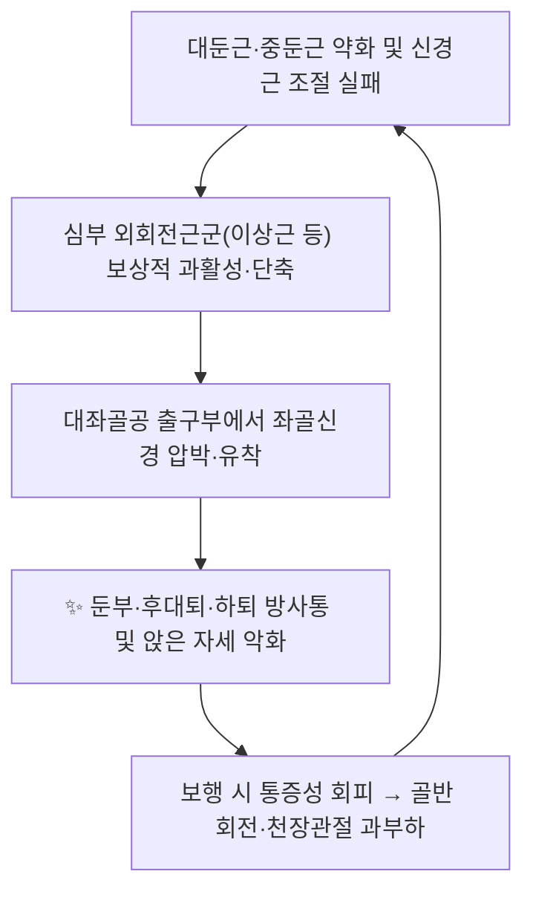

# 📍 [[환도]] (Huantiao, GB30)

> **핵심 요약 (Key Summary)**:
> [[환도]](GB30)는 [[대전자]]와 [[천골열공]]을 잇는 선의 외측 1/3 지점에 위치한 [[족소양담경]] 제30번째 경혈로, [[대둔근]]·[[중둔근]]·[[이상근]]을 관통하여 [[좌골신경]] 주위 심부에 도달하는 둔부의 대표 심자혈이다.
> 임상적으로 [[심부둔부증후군]], [[이상근증후군]], [[좌골신경통]], [[대전자통증증후군]]에서 통증·방사통의 핵심 치료 타깃이며, 장침(長針)·전침(電針)·온침 및 추나 안압·유법([[압유법]])의 주요 자극점으로 활용된다.
> 동물실험 및 소규모 임상연구에서 신경재생 촉진·척수 후각 염증신호 조절 가능성이 보고되었으나, 표본 규모와 종간 차이로 임상 근거 수준은 제한적이다.

---
## 📌 목차
1. [해부학적 정밀 구조 및 지배 신경/혈관](#1-해부학적-정밀-구조-및-지배-신경혈관)
2. [생체역학·토크 분석 & 근막 사슬 (Biomechanical Synergy)](#2-생체역학토크-분석--근막-사슬-biomechanical-synergy)
3. [근막통증증후군(TP) & 연관통 패턴 (Travell & Simons)](#3-근막통증증후군tp--연관통-패턴-travell--simons)
4. [초음파 해부학(Sonoanatomy) 및 중재 시술 랜드마크](#4-초음파-해부학sonoanatomy-및-중재-시술-랜드마크)
5. [⭐ 원장님 심층 임상 고찰 및 원본 필기 (Clinical Pearls)](#5-원장님-심층-임상-고찰-및-원본-필기-clinical-pearls)
6. [관련 임상 질환 및 운동손상 증후군 총괄](#6-관련-임상-질환-및-운동손상-증후군-총괄)
7. [추나·도수치료(MET/PIR) & 침구·약침·재활 프로토콜](#7-추나도수치료metpir--침구약침재활-프로토콜)
8. [출처 및 학술 참고 문헌 (References)](#8-출처-및-학술-참고-문헌-references)

---

## 1. 해부학적 정밀 구조 및 지배 신경/혈관

환도는 단순한 "둔부의 한 점"이 아니라, 표재성 대둔근층에서 시작해 심부 외회전근군과 좌골신경을 향해 수직으로 관통하는 **해부학적 통로(deep gluteal corridor)** 에 놓인 경혈이다. 따라서 취혈 위치와 자침 각도·심도에 따라 도달하는 구조물이 완전히 달라진다.

### 1-1. 취혈 및 경혈학적 기본 정보

| 항목 | 상세 내용 |
| :--- | :--- |
| **표준 위치 (WHO 기준)** | 엉덩이 부위, [[대전자]](greater trochanter) 최상단과 [[천골열공]](sacral hiatus)을 잇는 선상에서 **외측 1/3과 내측 2/3의 교점** |
| **체표 랜드마크 보조** | 앙와위에서 고관절을 굴곡·외전하면 대전자가 내려가고 둔부가 이완되어 심자 시 좌골신경 손상 위험이 줄어든다는 전통적 취혈법이 있다(복와위 취혈이 일반적) |
| **경락 소속** | [[족소양담경]](足少陽膽經) 제30번째 경혈(GB30) |
| **교회혈(전통 이론)** | 족소양담경과 [[족태양방광경]]의 교회혈로 설명된다 |
| **자침법** | 직자(直刺) 2~3촌(전통 문헌 기준). 체격이 크고 둔부 지방층이 두꺼운 경우 심자, 왜소한 체형은 감량 |
| **득기(得氣) 감각** | 국소 둔중감, 또는 하지 후면·외측으로의 방사감(전격감). **방사감이 좌골신경 자극에 의한 것인지 득기인지 감별이 임상적으로 중요** |
| **금기·주의** | 심부 내측·전방 방향으로 과도하게 자입하면 [[대좌골공]]을 통해 골반강 내 구조물(직장, 하둔혈관)에 도달할 수 있어 회피해야 한다 |

### 1-2. 층별 관통 구조물 (Superficial → Deep)

| 층위 | 구조물 | 관련 신경 | 관련 혈관 |
| :--- | :--- | :--- | :--- |
| 1층 | 피부, 피하조직, 천요막 | [[후대퇴피신경]], [[상둔피신경]] | 천둔동맥 분지 |
| 2층 | [[대둔근]] (gluteus maximus) | [[하둔신경]] (L5~S2) | [[하둔동맥]] |
| 3층 (상방) | [[중둔근]] (gluteus medius) / [[소둔근]] | [[상둔신경]] (L4~S1) | [[상둔동맥]] |
| 4층 (심부) | [[이상근]] (piriformis) 및 상·하쌍자근, 폐쇄근군 | [[이상근신경]] (S1~S2) | 이상근 주위 혈관망 |
| 5층 (최심부) | [[좌골신경]] 및 그 주위 지방조직 | 좌골신경 (L4~S3) | 하둔동맥·내음부동맥 |

### 1-3. 지배 신경 및 혈관 상세

| 항목 | 상세 내용 |
| :--- | :--- |
| **운동 지배** | 대둔근 → [[하둔신경]] (L5~S2) / 중·소둔근 → [[상둔신경]] (L4~S1) / 이상근 → [[이상근신경]] (S1~S2) |
| **감각 지배** | 둔부 외측은 상둔피신경(L1~L3), 하방은 후대퇴피신경(S1~S3)이 담당 |
| **주요 동맥** | [[하둔동맥]](inferior gluteal artery), [[상둔동맥]], [[대퇴외측회선동맥]](transverse branch) |
| **주요 정맥** | 하둔정맥, 상둔정맥 (골반 내 정맥총과 교통) |
| **임상적 함의** | 혈관·신경이 모두 심부에 몰려 있어 **심자 시 해부학 지식 없이는 혈종·신경손상 위험**이 있다 |

### 🔬 층별 해부학 및 인접 신경혈관 주행 관계 (텍스트 정리)

환도를 3촌 심자하면 침첨은 통상 대둔근 → 이상근 순으로 통과하며, 좌골신경은 **이상근 하방(infrapiriformis)** 에서 대좌골공을 빠져나와 대퇴 후면으로 주행한다. 즉 환도 혈위는 좌골신경이 골반을 떠나 처음으로 "손이 닿는 위치"에 오는 지점에 해당하므로, 좌골신경 병변에 대한 원위 자극점이 아니라 **근위 자극점(proximal stimulation site)** 으로 기능한다.

---

## 2. 생체역학·토크 분석 & 근막 사슬 (Biomechanical Synergy)

환도의 생체역학적 의미는 **고관절 외회전·신전 토크의 중심**이라는 점에 있다. 대둔근은 고관절 신전의 주동근이며, 중둔근은 단각(單脚) 지지 시 골반의 전두면 안정성을 담당한다. 이 두 근육이 억제되면 심부 외회전근(이상근 등)이 보상적으로 과활성화되고, 이상근의 단축·경직은 좌골신경을 압박하여 둔부–후대퇴 방사통을 만든다.

* **시상면 토크**: 고관절 신전 시 대둔근의 모멘트 암은 고관절 굴곡 각도에 따라 변하며, 굴곡 0~15° 구간에서 최대 신전 토크가 발생한다. 따라서 환도 자극 후 재활은 **고관절 중립~경도 굴곡 범위의 신전 강화**부터 시작하는 것이 생리적이다(구체적 토크 수치는 근거 미확인).
* **전두면 안정성**: 중둔근이 약화되면 유각기(swing phase)에 골반이 반대측으로 하강하는 [[트렌델렌버그 징후]]가 나타난다.
* **근막 사슬 연계 (Myers Anatomy Trains 관점)**: 심부 종선(Deep Longitudinal Line)과 나선선(Spiral Line)이 천장관절–이상근–대퇴근막장근–경골을 연결한다고 설명된다. 즉 둔부 심부의 제한은 하지 전체의 회전 정렬에 연쇄적으로 영향을 준다.
* **앉은 자세의 압력**: 좌골결절에 체중이 실리는 좌위에서 이상근과 좌골신경이 동시에 압박되므로, 이상근증후군 환자는 **오래 앉아 있으면 악화, 걷기 시작하면 다소 완화**되는 양상을 보인다(전형적 임상 양상, 개별 근거 수준 미확인).

---

## 3. 근막통증증후군(TP) & 연관통 패턴 (Travell & Simons)

둔부에서 환도 주위에 통증을 유발하는 근육은 대둔근 하나가 아니라 **다층의 근육군**이다. 임상에서는 어느 근육의 발통점이 방사통의 주원인인지 감별하는 것이 치료 효율을 결정한다.

| 근육 | 발통점(TrP) 위치 | 연관통 패턴 | 감별 포인트 |
| :--- | :--- | :--- | :--- |
| [[이상근]] | 천골 외측면 심부, 대전자–천골열공 중간 심부 | 천장관절, 둔부 중앙, 후대퇴 상부. 심하면 하퇴까지 | FAIR 검사, Freiberg, Pace, 좌위 이상근 검사 |
| [[대둔근]] | 천골 후면, 장골 후면, 둔부 주름 | 둔부, 천골, 둔부 하방 경계 | 앉기 시작 시 통증, 계단 오르기 시 악화 |
| [[중둔근]] | 장골능 하방, 대전자 상방 | 둔부 외측 → 대퇴 외측 | 단각 지지 시 통증, 트렌델렌버그 |
| [[소둔근]] | 대전자 내측 심부 | 대퇴 외측 → 하퇴 외측 → **발목까지** ("가짜 좌골신경통") | 방사통이 피부분절과 불일치, 발가락 저림 없음 |
| 상·하쌍자근 | 이상근 하방 심부 | 회음부·항문 주위·골반저 | 골반저 통증과 중복, 내진 시 압통 |

* **발통점 및 연관통**: Travell & Simons 기준에서 소둔근의 연관통은 대퇴 외측에서 하퇴 외측, 심지어 외과(外踝)까지 내려가 **진성 좌골신경통과 혼동되기 쉽다**. 감별의 핵심은 (1) 피부분절 분포와의 불일치, (2) 신경학적 결손(근력 저하·반사 소실)의 부재, (3) 통증이 자세·근육 사용에 따라 변동하는 점이다.
* **환도의 역할**: 위 근육군은 모두 환도 주위에 모여 있어, 환도 자침 또는 안압·유법(按壓揉法) 자극은 이 다층 근육군에 대한 **동시 접근점**으로 활용된다. 실제로 좌골신경통 모델 흰쥐에서 환도에 대한 추나 안압·유법 자극이 척수 후각의 NF-κB p65 단백 발현에 영향을 주었다는 보고가 있다(PMID: 37366093).

---

## 4. 초음파 해부학(Sonoanatomy) 및 중재 시술 랜드마크

둔부 심부는 지방층 두께의 개인차가 크고 좌골신경이 바로 아래에 있어, 맹목적 심자는 이론상 위험하다. 초음파 유도는 안전성과 정확도를 모두 높인다.

* **탐촉자 선택**: 곡선형 탐촉자(curvilinear, 2~5 MHz). 둔부 지방층이 두꺼워 고주파 선형 탐촉자로는 좌골신경이 잘 보이지 않는 경우가 많다.
* **환자 자세**: 복와위(prone) 또는 측와위. 고관절을 약간 내회전시키면 이상근이 이완되어 좌골신경 관찰이 쉬워진다.
* **스캔 랜드마크**:
  1. [[대전자]] 최상단과 [[천골열공]]을 확인하여 환도 표면 위치를 결정.
  2. 횡단면에서 [[대둔근]] 바로 심부, [[대퇴방형근]](quadratus femoris) 상방에 편평한 과에코성(hyperechoic) 다발 구조로 보이는 것이 [[좌골신경]]이다.
  3. 좌골신경의 **상방에 놓이는 근육이 이상근**이며, 이상근 비후·주위 유착은 초음파에서 저에코성 변화로 관찰될 수 있다.
* **안전 마진**:
  * 침첨이 좌골신경 초막을 직접 관통하지 않도록 **신경 주위(paraneural)에 위치**시키고, 방사통이 과도하게 강하게 유발되면 즉시 심도를 줄인다.
  * 내측 심부로 자입 시 [[대좌골공]]을 통과해 골반강 내 구조물에 도달할 수 있으므로 **내측 방향 심자는 금지**한다.
  * 하둔동맥·정맥이 동반 주행하므로 출혈성 소인이 있는 환자에서는 심자를 신중히 한다.
* **시술 후 관찰**: 하지 저림의 악화, 근력 저하, 국소 혈종 여부를 확인한다.

---

## 5. ⭐ 원장님 심층 임상 고찰 및 원본 필기 (Clinical Pearls)

> 아래는 환도 혈위에 대한 임상 정리와 실전 운용 원칙을 구조화한 것이다. **문헌으로 검증되지 않은 추론적 항목은 [근거 미확인]으로 명시**하였으며, 원장님 필기 원본이 확보되면 이 섹션에 그대로 보존한다.

* **① 체위가 반은 치료다**: 복와위에서 고관절을 약간 외회전·굴곡시켜 둔부 근육군을 이완시킨 뒤 취혈한다. 근긴장이 남아 있는 상태에서 심자하면 침이 근섬유를 관통하면서 통증만 유발하고 득기질이 떨어진다. [임상 추론, 근거 미확인]
* **② "방사감 3초 원칙"**: 득기 방사감이 하지로 퍼지더라도 전격성 저림이 3초 이상 지속되면 침을 후퇴시킨다. 이는 좌골신경 자극 신호와 치료적 득기를 구분하는 실전적 기준이다. [임상 추론, 근거 미확인]
* **③ 심자는 3촌, 그러나 체형이 우선**: 왜소한 여성에서 3촌 심자는 체표~좌골신경 간 거리를 고려할 때 과심이 될 수 있다. 초음파 계측 없이 시술할 경우 **2촌 자입 후 환자 반응을 확인하며 증량**하는 방식이 안전하다. [임상 추론, 근거 미확인]
* **④ 침 단독보다 자세 교육**: 이상근·심부둔부증후군은 자세 의존성이 강해, 환도를 자극한 뒤에도 좌위 시간·운전·계단 사용 습관을 교정하지 않으면 재발이 잦다. 침 치료 후 **즉시 둔부 신전 강화 운동(대둔근 브리징)** 을 교육하면 효과 지속에 유리하다. [임상 추론, 근거 미확인]
* **⑤ 병변 감별의 우선순위**: 요추 추간판 탈출증, 척추관 협착증, 천장관절 기능부전, 대전자 통증증후군을 먼저 배제한다. 환도 압통만으로 좌골신경통으로 단정하면 원인 병변을 놓친다.
* **⑥ 배합혈의 원칙**: 원위–근위 배합으로 **환도(근위) + 양릉천 또는 위중·승부(원위)** 를 조합한다. 동물실험에서도 환도와 양릉천(ST34)의 병용이 말초신경 재생을 촉진했다는 보고가 있으며(PMID: 37664821), 환도와 족삼리(ST36) 전침 병용이 에너지 대사 향상을 통해 신경재생을 촉진했다는 보고가 있다(PMID: 40874859).
* **⑦ 뇌졸중 후 하지 운동 회복**: 급성 뇌허혈 마우스 모델에서 환도 전침 사전조건화(per-conditioning)가 운동기능 회복에 영향을 주었다는 보고(PMID: 39875020)가 있어, 중추성 하지 위약 환자에서 보조적 자극점으로 고려할 수 있다. 단, 동물 모델 결과의 임상 외삽에는 주의가 필요하다.

---

## 6. 관련 임상 질환 및 운동손상 증후군 총괄

| 임상 질환 / 증후군 | 병리적 연관 기전 | 주요 증상 및 이학적 검사 | 핵심 교정 타깃 |
| :--- | :--- | :--- | :--- |
| [[이상근증후군]] | 이상근 비후·경련이 좌골신경을 대좌골공 출구부에서 압박 | 둔부 심부통, 좌위·회전 시 악화, FAIR/Freiberg/Pace 양성 | 이상근 이완(MET/PIR) + 대둔근 강화 |
| [[심부둔부증후군]] | 심부 외회전근군과 좌골신경의 유착·포착 | 둔부 후방 통증, 좌위 통증, 방사통은 있으나 신경학적 결손 경미 | 근막 유리, 좌골신경 가동화, 환도 심자 |
| [[좌골신경통]] (요추성) | L4~S3 신경근 압박 | 방사통이 피부분절을 따름, SLR 양성, 근력·반사 저하 | 요추 감압·협착 교정 + 환도 배합 자침 |
| [[대전자통증증후군]] | 중둔근·소둔근 건 부착부 병변 | 대전자 국소 압통, 측와위 시 악화 | 중둔근 강화, hip abductor 재교육 |
| [[대둔근 근막통증증후군]] | 대둔근 TrP 및 좌위 압박 | 둔부 주름·천골 통증, 계단 상행 시 악화 | 대둔근 이완 및 신전 강화 |
| [[천장관절 기능부전]] | 둔부 심부 근육군 긴장과 골반 회전 불균형 | PSIS 부위 통증, Gaenslen/FABER 검사 | 골반 안정화, 이상근 이완 |
| [[뇌졸중 후 하지 위약]] | 중추성 운동 조절 손상 | 편측 하지 근력 저하, 보행 이상 | 환도–족삼리 전침 자극 (동물 근거) |

---

## 7. 추나·도수치료(MET/PIR) & 침구·약침·재활 프로토콜

### 7-1. 한의학 경혈 매핑 및 배합혈

* **주혈**: [[환도]] (GB30)
* **근위 배합**: [[질변]](BL54), [[거료]](GB29), [[환중]](GB30과 위중 사이의 경험혈), [[아시혈]](대전자 주위 압통점)
* **원위 배합**: [[양릉천]](GB34), [[위중]](BL40), [[승부]](BL36), [[곤륜]](BL60), [[족삼리]](ST36)
* **전침 배합**: 환도 + 양릉천(PMID: 37664821), 환도 + 족삼리(PMID: 40874859). 구체적 주파수·전류 강도·자극 시간은 해당 연구 초록·본문 미확인으로 **근거 미확인**.
* **특기**: 환도는 전통적으로 馬丹陽 天星十二穴 중 하나로 꼽히며, 고전 문헌에서 요퇴통·하지 위약·한습비(寒濕痺)에 활용되었다(고전 문헌 근거, PMID 없음).

### 7-2. 침구 시술 프로토콜 (예시 프레임)

| 단계 | 내용 | 비고 |
| :--- | :--- | :--- |
| 1. 체위 | 복와위, 고관절 경도 외회전, 베개로 복부 지지 | 둔부 이완 유도 |
| 2. 취혈 | 대전자 최상단–천골열공 연결선 외측 1/3 | 촉진으로 압통·결절 확인 |
| 3. 자입 | 직자 2~3촌, 서서히 자입 | 체형에 따라 심도 조절 |
| 4. 득기 | 둔중감 및 하지로의 온화한 확산감 | 전격성 저림 지속 시 후퇴 |
| 5. 자극 | 수기 염전 또는 전침 20~30분 | 전침 파라미터는 근거 미확인 |
| 6. 병용 | 온침(TDP) 또는 약침(자하거·봉독 등, 환자 상태에 따라) | 약침 농도·용량은 근거 미확인 |

* **장침 회자법(恢刺法) 활용**: 이상근증후군에서 장침을 이용한 회자법이 보고된 바 있다(PMID: 32705835). 회자법은 《영추(靈樞)》의 고전 자법으로, 건(腱) 옆에 자입하여 앞뒤로 제삽(提揷)하며 근긴장을 완화하는 방식으로 설명된다.
* **병용 치료**: 이상근증후군에서 환도 배합 자침을 부가 치료로 사용한 무작위 대조시험이 보고되었다(PMID: 42343514). 저자·연도·설계 정보는 제공된 메타데이터 기준이며, 효과 크기(유효율, VAS 변화 등)는 **근거 미확인**.

### 7-3. 추나·도수치료

* **환도 안압·유법(按壓揉法)**: 좌골신경통 모델 흰쥐에서 환도에 대한 안압·유법이 척수 후각 NF-κB p65 단백 발현에 영향을 준 것으로 보고되었다(PMID: 37366093). 이는 둔부 국소 자극이 **중추 수준의 염증 신호 조절**에 관여할 가능성을 시사한다. 다만 동물 모델 결과이며, 사람에서의 임상적 의미와 자극 강도·시간은 **근거 미확인**.
* **근에너지기법 (MET)**: 이상근에 대해 환자를 앙와위·고관절 굴곡–내전–내회전(FAIR) 자세로 두고, 등척성 외회전 수축을 5~10초 시행 후 호기와 함께 이완하며 가동범위를 증량한다. 3~5회 반복.
* **PIR(수축–이완 후 이완)**: 중둔근·대둔근에 적용. 등척성 수축 후 이완 시 부드럽게 신장.
* **좌골신경 가동화(neural mobilization)**: 신경 긴장 징후가 경미한 경우에만 저강도로 시행. 신경 자극 증상이 강하면 금기.
* **자가 운동**: 대둔근 브리징, 사이드라이 클램쉘, 힙 힌지 교육. 좌위 30분마다 기립·스트레칭.

---

## 8. 출처 및 학술 참고 문헌 (References)

**제공 논문 (PubMed)**

1. Huang HZ, Lyu LJ (2023). [Intervention effect of Tuina pressing and kneading the Huantiao (GB30) acupoint on NF-κB p65 protein at spinal cord dorsal horn in sciatica rats]. *Zhongguo Gu Shang*. PMID: 37366093
2. Ji Q, Zhang N (2025). Electroacupuncture at Huantiao (GB30) and Zusanli (ST36) acupoints promotes peripheral nerve regeneration by enhancing energy metabolism in mice. *Neuroreport*. PMID: 40874859
3. Ji Q, Shan F (2023). Acupuncture on "Huantiao" (GB30) and "Yanglingquan" (GB34) acupoints promotes nerve regeneration in mice model of peripheral nerve injury. *IBRO Neurosci Rep*. PMID: 37664821
4. Fu JL, Zhang JJ (2025). Effects of electroacupuncture per-conditioning at Huantiao on motor function recovery in acute cerebral ischemia mice. *Physiol Behav*. PMID: 39875020
5. Chang X, Wang Q (2026). [Accompanied needling at Huantiao (GB30) as an adjunctive therapy for piriformis syndrome: a randomized controlled trial]. *Zhongguo Zhen Jiu*. PMID: 42343514
6. Li SS, Wu YC (2020). [Effect of elongated-needle by Hui-puncture method on piriformis syndrome]. *Zhen Ci Yan Jiu*. PMID: 32705835

**일반 참고 문헌 (교과서)**

1. **Standring, S. (2020)**. *Gray's Anatomy: The Anatomical Basis of Clinical Practice* (42nd ed.). Elsevier.
2. **Travell, J. G., & Simons, D. G. (1999)**. *Myofascial Pain and Dysfunction: The Trigger Point Manual*, Vol. 1.

---

> [!warning] 근거 수준 및 해석 주의
> - 본 노트의 기전 설명 중 **동물실험(랫드·마우스) 결과**는 사람에서의 효능을 직접 의미하지 않는다.
> - 제공된 논문은 **제목·서지 정보만 확인된 상태**이므로, 구체적 수치(자침 심도, 전침 주파수, VAS 변화량, 유효율, 표본 수 등)는 본문에 기재하지 않았으며 필요 시 **근거 미확인**으로 표시하였다.
> - 고전 문헌(馬丹陽 天星十二穴, 《영추》 회자법 등)에 기반한 내용은 PMID가 부여된 현대 논문과 구분하여 서술하였다.

---
## 📎 개념 학습 보충 (2026-09-24 논문 연계)

- **요추 척추관 협착증 약침 프로토콜의 병용 둔부 혈위(2026-09-24 리뷰 1번)**: Integrative Medicine Research 2026;15(3 Part A):101323, [PMID: 42099446](https://pubmed.ncbi.nlm.nih.gov/42099446/) — 기본 축은 L1~L5 협척혈([[협척혈(EX-B2)]]) + [[신수(BL23)]]·[[대장수(BL25)]]·[[방광수(BL28)]] 이었고, 실제 시술 빈도에서 **환도(GB30)가 협척혈 EX-B7·BL24 다음으로 둔부 혈위로 병용**됐다(둔부·하지로 내려가는 통증 축 담당).
- **배치 의도**: 협척혈(요추 근육·후관절) → 배수혈(분절) → 환도(둔부·[[좌골신경통]] 통로)로 **상부에서 하부로 이어지는 해석선**을 만든다 → [[약침]]
- **시술 메모**: 심부 둔부 시술이므로 좌골신경 자극(하지로의 방사감) 여부를 확인하며 주입하고, 항응고제 복용자에서는 출혈 위험을 평가한다.
- 관련: [[약침]] · [[신경인성 파행]] · [[이상근 증후군]] · [[좌골신경통]] · [[척추관 협착증]] · [[2026-09-24_통합의학약리학_심층리뷰]] 1번

<!-- 보관 태그(1회용·링크오류, 필요시 복원): 자침 -->
