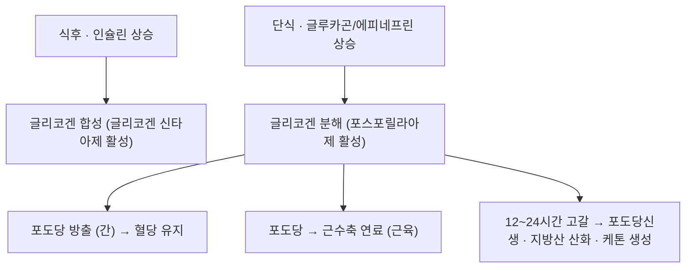

# 🥗 글리코겐 (Glycogen)

> **핵심 요약 (Key Summary)**:
> - 📍 **정체**: 포도당이 α-1,4 결합으로 곁가지(α-1,6)를 이룬 **가지형 포도당 저장 고분자**. 간·골격근에 저장된다.
> - 🚩 **기능**: 간 글리코겐은 **혈당 유지**(전신 공급), 근 글리코겐은 **근수축 연료**(국소 사용)로 역할이 다르다.
> - 🛠️ **임상 의의**: 단식 12~24시간에 간 글리코겐이 고갈되면 포도당신생·지방산 산화·[[케톤체]] 생성이 시작된다. 운동 강도·지구력의 핵심 변수다 (Roach PJ 등, *Biochem J* 2012;441(3):763-787, [PMID 22248338](https://pubmed.ncbi.nlm.nih.gov/22248338/)).
> - ⚠️ **주의**: 저탄수화물·공복·격렬한 운동을 겹치면 글리코겐 고갈이 빠르고, 당뇨 환자에서는 저혈당 위험이 커진다.

---

## 📌 목차
1. [기본 정보 & 구조](#1-기본-정보--구조)
2. [합성·분해 조절](#2-합성분해-조절)
3. [생리 기능](#3-생리-기능)
4. [임상 의의](#4-임상-의의)
5. [논문 연결](#5-논문-연결)
6. [함께 보기](#6-함께-보기)

---

## 1. 기본 정보 & 구조

* **구조**: 포도당 단위가 α-1,4 결합으로 선형 사슬을 이루고 α-1,6 결합으로 곁가지를 형성. 가지가 많아 분해·합성이 빠르다
* **저장량(성인 기준 개략)**: 간 약 80~120 g, 골격근 약 300~400 g. 간은 농도가 높고(약 5~8%), 근육은 총량이 많다
* **수분 결합**: 글리코겐 1 g당 약 3 g의 물을 함께 저장 → 저장 시 체중 증가

---

## 2. 합성·분해 조절

* **합성**: 인슐린 → 글리코겐 신타아제 활성화 (식후 저장)
* **분해**: [[글루카곤]]·에피네프린 → 포스포릴라아제 활성화
* **기관 차이**: 간은 분해한 포도당을 **혈중으로 내보내** 전신(특히 뇌)에 공급하고, 근육은 **자기 연료로만** 쓴다 (포도당-6-포스파타아제 부재)

---

## 3. 생리 기능

* **혈당 항상성**: 간 글리코겐이 식간·야간 혈당을 유지하는 완충 장치
* **운동 연료**: 근 글리코겐은 고강도 운동의 주 연료. 고갈되면 피로·수행능 저하
* **단식 생리**: 고갈 시점부터 포도당신생(간)·지방산 산화·[[케톤체]] 생성이 켜진다

---

## 4. 임상 의의

| 관련 상태 | 연관 기전 | 임상 적용 |
| :--- | :--- | :--- |
| [[제2형 당뇨병]] | 간 글리코겐·당신생 조절 이상 | 혈당 조절·운동 처방 |
| [[간헐적 단식]] | 단식 12~24시간에 고갈 | 단식 강도·저혈당 감시 |
| 운동수행 | 근 글리코겐 고갈 → 피로 | 탄수화물 보충 전략 |
| [[저혈당]] | 저장 고갈 + 약물 | 인슐린·설폰요소제 감시 |

* **단식과의 연결**: [[간헐적 단식]] 기전의 출발점이 바로 글리코겐 고갈이다 — [PMID 40533200](https://pubmed.ncbi.nlm.nih.gov/40533200/)
* **운동과의 연결**: [[저항운동]]·[[유산소운동]] 중 글리코겐 소비와 회복이 수행능을 좌우한다

---

## 5. 논문 연결

1. **Roach PJ, Depaoli-Roach AA, Hurley TD, Tagliabracci VS (2012)**. *Glycogen and its metabolism: some new developments and old themes*. **Biochemical Journal**, 441(3):763-787. [PMID 22248338](https://pubmed.ncbi.nlm.nih.gov/22248338/)
   - **[연구 요약]**: 글리코겐 합성·분해 조절과 관련 질환을 정리한 대표 리뷰.
2. **Semnani-Azad Z, et al. (2025)**. *Intermittent fasting strategies and their effects on body weight and other cardiometabolic risk factors*. **BMJ**, 2025;389:e082007. [PMID 40533200](https://pubmed.ncbi.nlm.nih.gov/40533200/)
   - **[연구 요약]**: 단식 기간 글리코겐 저장 고갈 → 지방산 산화·케톤 생성이 단식 생리의 축임을 서술.

---

## 6. 함께 보기
- [[포도당]] · [[글루카곤]] · [[인슐린]] · [[케톤체]] · [[간헐적 단식]] · [[격일단식]] · [[저혈당]] · [[제2형 당뇨병]] · [[ATP]] · [[젖산]]
- 관련 논문: [[2026-10-10_대사노인질환_심층리뷰]] 3번 · [[2026-10-10_대사노인질환_개념학습]]
