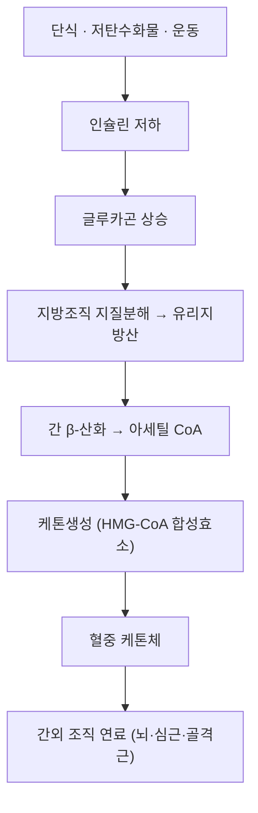

# 🥗 케톤체 (Ketone Bodies)

> **핵심 요약 (Key Summary)**:
> - 📍 **정체**: 간 미토콘드리아에서 지방산 β-산화로 만들어진 아세틸 CoA가 케톤생성 경로를 거쳐 만드는 수용성 연료 분자. **아세토아세트산 · β-하이드록시부티레이트(BHB) · 아세톤** 3종이다.
> - 🚩 **기능**: 포도당이 부족할 때 뇌·심근·골격근의 대체 연료로 쓰인다. BHB는 단순 연료를 넘어 **신호 대사체**로 작용한다 — HDAC 억제, NLRP3 인플라마솜 억제 등 (Newman JC, Verdin E, *Annu Rev Nutr* 2017;37:51-76, [PMID 28826372](https://pubmed.ncbi.nlm.nih.gov/28826372/)).
> - 🛠️ **임상 의의**: [[간헐적 단식]]·케톤식이에서 상승한다. [[SGLT2 억제제]] 복용자·당뇨에서는 [[정상혈당 케톤산증]] 위험의 핵심 지표다.
> - ⚠️ **주의**: 케톤체 상승이 항상 정상은 아니다. 혈당이 정상이어도 케톤이 높으면 정상혈당 케톤산증을 배제해야 한다.

---

## 📌 목차
1. [정의 & 생성](#1-정의--생성)
2. [대사 경로](#2-대사-경로)
3. [생리 기능 & 신호전달](#3-생리-기능--신호전달)
4. [임상 의의](#4-임상-의의)
5. [논문 연결](#5-논문-연결)
6. [함께 보기](#6-함께-보기)

---

## 1. 정의 & 생성

* **3종**: 아세토아세트산(acetoacetate), β-하이드록시부티레이트(BHB, β-hydroxybutyrate), 아세톤(acetone, 호기로 배출)
* **생성 부위**: 간 미토콘드리아 (HMG-CoA 합성효소가 속도조절 단계). 간은 케톤을 만들지만 **스스로는 잘 쓰지 못하고**, 뇌·심근·골격근 등 **간외 조직이 연료로 사용**한다
* **물리 특성**: 수용성이어서 알부민 운반 없이 혈중을 이동한다 (지방산과 다름)

---

## 2. 대사 경로

* 출발 신호는 [[글루카곤]] 상승 + 인슐린 저하다. [[글리코겐]] 저장이 고갈되는 시점(단식 12~24시간 부근)부터 케톤 생성이 뚜렷해진다
* **BHB/아세토아세트산 비**: 혈중에서는 BHB가 우세하다

---

## 3. 생리 기능 & 신호전달

* **에너지 연료**: 포도당 공급이 제한될 때 뇌가 쓸 수 있는 대체 연료. 심근은 케톤을 효율 좋은 연료로 사용한다
* **신호 대사체**: BHB는 ① HDAC(히스톤 탈아세틸화효소) 억제 ② [[NLRP3]] 인플라마솜 억제 ③ 산화 스트레스 저항 등 **신호 기능**을 가진다 ([PMID 28826372](https://pubmed.ncbi.nlm.nih.gov/28826372/))
* **대사 유연성**: [[간헐적 단식]]의 기전 정리에서 글리코겐 고갈 → 지방산 산화·케톤 생성이 대사 유연성 향상 축으로 제시된다 — [PMID 40533200](https://pubmed.ncbi.nlm.nih.gov/40533200/)

---

## 4. 임상 의의

* **단식·케톤식이**: 케톤체 상승이 목표 생리로 여겨진다. 단, 장기 이득 근거는 제한적이다
* [[정상혈당 케톤산증]]: [[SGLT2 억제제]] 복용자에서 혈당이 정상이어도 케톤이 상승할 수 있다 → 단식 병용 시 상담 필수
* [[당뇨병성 케톤산증]]: 인슐린 부족 시 케톤 과다 → 산증
* **검사**: 혈중 BHB 또는 소변 케톤 측정. 정상혈당 케톤산증 감별의 핵심 지표

---

## 5. 논문 연결

1. **Newman JC, Verdin E (2017)**. *β-Hydroxybutyrate: A Signaling Metabolite*. **Annual Review of Nutrition**, 37:51-76. [PMID 28826372](https://pubmed.ncbi.nlm.nih.gov/28826372/)
   - **[연구 요약]**: BHB가 HDAC 억제·NLRP3 억제 등 신호 대사체로 작용함을 정리한 리뷰.
2. **Semnani-Azad Z, et al. (2025)**. *Intermittent fasting strategies and their effects on body weight and other cardiometabolic risk factors*. **BMJ**, 2025;389:e082007. [PMID 40533200](https://pubmed.ncbi.nlm.nih.gov/40533200/)
   - **[연구 요약]**: 단식 기간 글리코겐 고갈·지방산 산화·케톤 생성이 단식 생리의 축임을 서술.

---

## 6. 함께 보기
- [[간헐적 단식]] · [[격일단식]] · [[시간제한식이]] · [[글리코겐]] · [[글루카곤]] · [[자유지방산]] · [[SGLT2 억제제]] · [[정상혈당 케톤산증]] · [[당뇨병성 케톤산증]] · [[케톤혈증]] · [[NLRP3]] · [[AMPK]]
- 관련 논문: [[2026-10-10_대사노인질환_심층리뷰]] 3번 · [[2026-10-10_대사노인질환_개념학습]]
