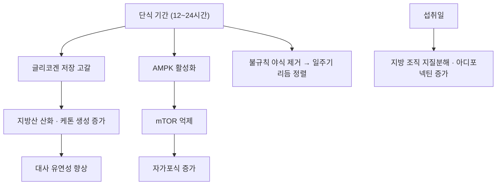

# 🥗 간헐적 단식 (Intermittent Fasting, IF)

> ⚠️ 이 노트는 전통적 '영양소'가 아니라 **식이 전략(섭취 시간 구조)** 을 다룬다. 구성 영양소가 아니라 **언제 먹는가**를 조작하는 중재이므로, 영양학 분류의 식이요법 하위 폴더에 둔다.

> **핵심 요약 (Key Summary)**:
> - 📍 **정체**: 단식 기간과 섭취 기간을 교대하거나 하루 섭취 시간창을 제한하는 식이 전략. 대표 3유형은 [[격일단식]], [[시간제한식이]], 종일단식이다.
> - 🚩 **근거의 핵심**: 무작위시험 99편·6,582명 네트워크 메타분석에서 모든 간헐적 단식 전략과 지속적 열량제한은 자유식이보다 체중을 줄였다. 다만 지속적 열량제한보다 우월했던 것은 [[격일단식]]뿐이었고(-1.29 kg), **24주 이상 추적에서는 그 차이가 사라졌다** — [PMID 40533200](https://pubmed.ncbi.nlm.nih.gov/40533200/).
> - 🛠️ **임상 위치**: [[HbA1c]]는 전략 간 차이가 없었다. 체중 감량의 선택지로 설명하되, 약물 대체로 말하지 않는다.
> - ⚠️ **주의**: 인슐린·설폰요소제 복용자는 단식일 저혈당 위험, [[SGLT2 억제제]] 복용자는 케톤산증 위험이 있다. 노인·[[근감소증]]·노쇠에서는 근손실 위험을 먼저 본다.

---

## 📌 목차
1. [정의 & 분류](#1-정의--분류)
2. [작용 기전](#2-작용-기전)
3. [임상 적용 & 용량](#3-임상-적용--용량)
4. [주의·금기·중단 기준](#4-주의금기중단-기준)
5. [논문 연결](#5-논문-연결)
6. [함께 보기](#6-함께-보기)

---

## 1. 정의 & 분류

* **정의**: 단식(섭취 제한) 기간과 섭취 기간을 교대하거나, 하루 중 섭취 시간창을 제한하는 식이 전략. 총 열량을 줄이는 방식과 독립적으로 **시간 구조**를 조작한다.
* **주요 유형**
  * [[격일단식]] (Alternate-Day Fasting, ADF) — 단식일과 섭취일을 하루씩 교대
  * [[시간제한식이]] (Time-Restricted Eating, TRE) — 하루 섭취 시간창을 제한 (예: 8시간 섭취·16시간 단식, 또는 10~12시간 창)
  * **종일단식** (Whole-Day Fasting) — 주 1~2회 등 특정 요일 24시간 단식
* **대조 개념**: 지속적 열량제한(continuous energy restriction) — 매일 일정량을 덜 먹는 통상적 감량. 자유식이(ad libitum)는 대조군.

---

## 2. 작용 기전

* **단식기**: [[글리코겐]] 저장이 고갈되고 지방산 산화·[[케톤체]] 생성이 증가하며, [[AMPK]] 활성화·[[mTOR]] 억제·[[자가포식]] 증가로 대사 유연성이 좋아진다
* **섭취일**: 지방 조직의 지질분해와 [[아디포넥틴]] 증가가 이어지고, 불규칙한 야식이 사라지며 일주기 리듬 정렬이 회복된다
* **⚠️ 해석의 핵심**: 이 분석의 대부분 결과는 **총 섭취 열량 감소**로 설명된다. '단식이라는 시간 구조 자체'의 추가 이득은 제한적으로 해석해야 한다 ([PMID 27810402](https://pubmed.ncbi.nlm.nih.gov/27810402/))

---

## 3. 임상 적용 & 용량

| 항목 | 내용 |
| :--- | :--- |
| **1차 목표** | 체중 감량 (대사 지표 개선은 부차적) |
| **검증된 시행 예** | 주 3회 **비연속** 단식일 · 12주 (인슐린 치료 T2DM 46명, INTERFAST-2) |
| **체중 효과** | ADF가 지속적 열량제한보다 -1.29 kg, [[시간제한식이]]보다 -1.69 kg, 종일단식보다 -1.05 kg 더 감소 |
| **장기(≥24주)** | 간헐적 단식과 지속적 열량제한의 차이 소실 — 자유식이 대비 이득만 남음 |
| **HbA1c·HDL** | 전략 간 차이 없음 |
| **노인·근감소증** | ADF보다 [[시간제한식이]](야식·야간 간식 제거, 섭취창 10~12시간)로 시작 |
| **필수 병행** | [[단백질]] 1.0~1.2 g/kg 배분 + 주 2회 하체 저항운동 |

* **진료실 적용 원칙**: 특정 전략을 권하기 전에 **해당 시험의 구체 섭취창·단식일 열량**을 원문에서 확인해 적용한다. '간헐적 단식'이라는 이름만으로 동일하게 지도할 수 없다
* **감량 모니터링**: 감량 4주·12주에 악력·의자 일어서기 시간을 재면 근육 손실을 조기에 잡는다

---

## 4. 주의·금기·중단 기준

* **약물 병용 위험**
  * 인슐린·설폰요소제(글리벤클라미드·글리메피리드) 복용자 → 단식일 **저혈당** 위험. 반드시 의료 감독·용량 조정
  * [[SGLT2 억제제]] 복용자 → [[정상혈당 케톤산증]] 위험 상담
* **대상 제외**: 임신·수유, 1형 당뇨병, 섭식장애 병력, 체중감소가 문제되는 [[근감소증]]·노쇠 환자, 투석 환자
* **중단 기준**: 단식일에 어지럼·심한 두통·기력 저하·집중력 저하가 지속되면 중단하고 섭취창을 완화한다
* **노인 주의**: 격일단식의 추가 감량이 지방이 아니라 **근육**에서 나올 수 있다

---

## 5. 논문 연결

1. **Semnani-Azad Z, et al. (2025)**. *Intermittent fasting strategies and their effects on body weight and other cardiometabolic risk factors: systematic review and network meta-analysis of randomised clinical trials*. **BMJ**, 2025;389:e082007 (정정: BMJ 2025;390:r1737). [PMID 40533200](https://pubmed.ncbi.nlm.nih.gov/40533200/) · [PMC12175170](https://pmc.ncbi.nlm.nih.gov/articles/PMC12175170/)
   - **[연구 요약]**: 무작위시험 99편·6,582명 NMA — ADF가 지속적 열량제한보다 -1.29 kg(중등도 근거). ≥24주에서는 차이 소실. HbA1c·HDL은 전략 간 차이 없음.
2. **Obermayer A, et al. (2023)**. *Efficacy and Safety of Intermittent Fasting in People With Insulin-Treated Type 2 Diabetes (INTERFAST-2) — A Randomized Controlled Trial*. **Diabetes Care**, 46(2):463-468. [PMID 36508320](https://pubmed.ncbi.nlm.nih.gov/36508320/)
   - **[연구 요약]**: 인슐린 치료 T2DM 46명, 주 3회 비연속 단식일 12주 — HbA1c -7.3 mmol/mol 대 +0.1, 중증 저혈당 없음.
3. **Mattson MP, et al. (2017)**. *Impact of intermittent fasting on health and disease processes*. **Ageing Research Reviews**, 39:46-58. [PMID 27810402](https://pubmed.ncbi.nlm.nih.gov/27810402/)
   - **[연구 요약]**: 단식의 대사·세포 적응(AMPK·mTOR·자가포식) 기전 리뷰.
4. **Longo VD, Panda S (2016)**. *Fasting, Circadian Rhythms, and Time-Restricted Feeding in Healthy Lifespan*. **Cell Metabolism**, 23(6):1048-1059. [PMID 27304506](https://pubmed.ncbi.nlm.nih.gov/27304506/)
   - **[연구 요약]**: 시간제한섭식과 일주기 리듬 정렬의 대사 효과 리뷰.

---

## 6. 함께 보기
- [[격일단식]] · [[시간제한식이]] · [[케톤체]] · [[자가포식]] · [[글리코겐]] · [[mTOR]] · [[AMPK]] · [[아디포넥틴]] · [[인슐린 저항성]] · [[비만]] · [[제2형 당뇨병]] · [[단백질]] · [[근감소증]] · [[저항운동]] · [[SGLT2 억제제]] · [[정상혈당 케톤산증]] · [[네트워크 메타분석]] · [[GRADE 근거수준]]
- 관련 논문: [[2026-10-10_대사노인질환_심층리뷰]] 3번 · [[2026-10-10_대사노인질환_개념학습]]
