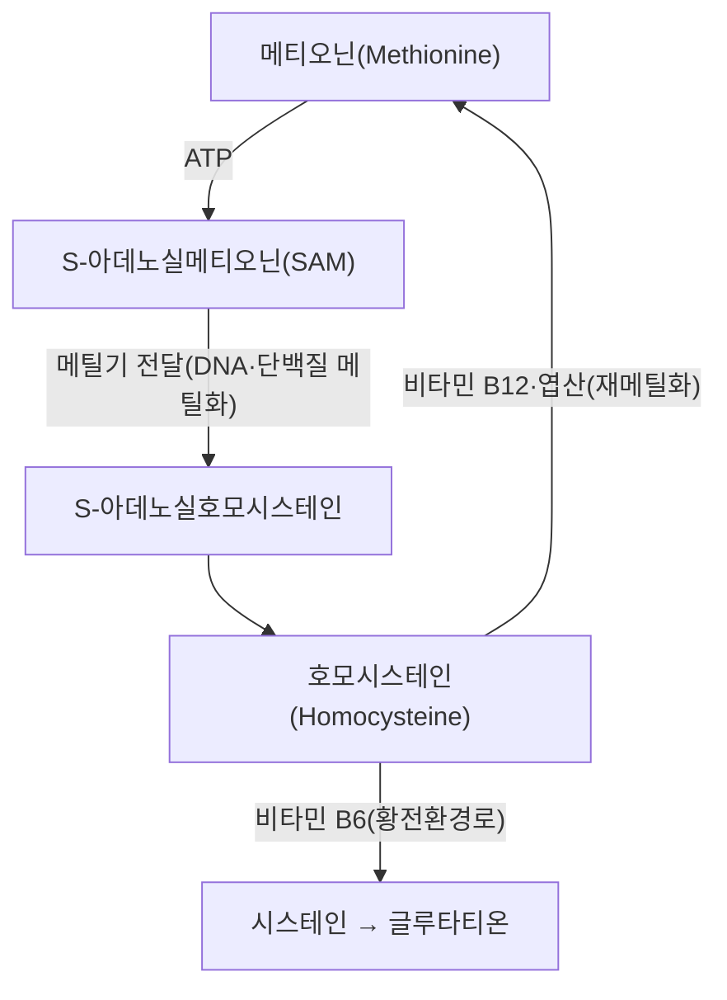

---
aliases:
  - Methionine
  - L-Methionine
  - 메티오닌
  - 메치오닌
tags:
  - 영양학
  - 아미노산
  - 대사경로
---

# 🧬 메티오닌 (Methionine)

> **핵심 3줄 요약 (Key Summary)**:
> - 🧪 정의 & 분류: 황(S)을 함유한 필수 아미노산으로, 음식(육류·생선·계란 등 단백질)을 통해서만 공급 가능. 메티오닌-호모시스테인 회로(황전환 경로, transsulfuration pathway)의 출발 물질로, DNA 메틸화 등 체내 메틸화 반응의 핵심 메틸기(-CH₃) 공급원.
> - 🎯 핵심 대사 경로: 메티오닌이 SAM(S-아데노실메티오닌)으로 활성화되어 메틸기를 DNA·단백질 등에 전달하면 호모시스테인이 생성되며, [[비타민 B12]]·엽산에 의한 재메틸화로 메티오닌으로 회귀하거나, [[비타민 B6]]에 의해 [[시스테인]]으로 전환되어 무독화됨.
> - 🩺 임상적 의의: 호모시스테인 대사 이상은 고호모시스테인혈증을 유발해 혈관 내피 손상·죽상경화·인지기능 저하와 연관되며, 비타민 B군(B6·B12·엽산) 결핍 시 이 경로가 정체되는 것이 다수 본초(단삼 등)의 혈관 보호 기전 논의에서도 언급됨.
> - ⚠️ 참고: 메티오닌은 특정 본초 유래 성분이 아닌 인체 보편의 필수 아미노산·대사 중간체이므로, 본 노트는 영양학·생화학적 개념으로 다룹니다.

---

## 📌 목차
1. [기본 화학 정보](#1-기본-화학-정보-chemical-identity)
2. [메티오닌-호모시스테인 대사 경로](#2-메티오닌-호모시스테인-대사-경로)
3. [임상적 연계 및 볼트 내 관련 노트](#3-임상적-연계-및-볼트-내-관련-노트)
4. [출처 및 학술 참고 문헌 (References)](#4-출처-및-학술-참고-문헌-references)

---

## 1. 기본 화학 정보 (Chemical Identity)

> [!abstract]+ 🧪 3D 분자 구조 (Interactive 3D Viewer)
> <iframe src="https://molecule-viewer-rho.vercel.app/?cid=6137" style="width: 100%; height: 600px; border: none; border-radius: 12px; box-shadow: 0 4px 20px rgba(0,0,0,0.15);" allowfullscreen></iframe>

| 항목 | 상세 내용 |
| :--- | :--- |
| **분자식 / 분자량** | C₅H₁₁NO₂S / 약 149.21 g/mol |
| **PubChem CID** | [6137](https://pubchem.ncbi.nlm.nih.gov/compound/L-Methionine) (L-형) |
| **분류** | 필수 아미노산(황 함유) |

---

## 2. 메티오닌-호모시스테인 대사 경로

메티오닌은 ATP와 결합해 SAM(S-아데노실메티오닌)으로 활성화되며, SAM은 DNA·히스톤·신경전달물질 등에 메틸기(-CH₃)를 전달하는 체내 주요 메틸기 공여체로 작용합니다. 메틸기를 전달하고 남은 S-아데노실호모시스테인은 가수분해되어 호모시스테인이 되며, 이는 두 경로로 처리됩니다: ① [[비타민 B12]]와 엽산의 도움으로 메틸기를 재공급받아 메티오닌으로 회귀(재메틸화 경로), ② [[비타민 B6]]의 도움으로 시스테인으로 전환되어 [[글루타티온]] 합성에 사용되는 황전환 경로(transsulfuration pathway).

---

## 3. 임상적 연계 및 볼트 내 관련 노트

* **호모시스테인 축적의 병리적 의미**: 비타민 B6·B12·엽산이 부족하면 호모시스테인이 세포 내에 축적되어 혈관내피세포를 손상시키고 염증을 유발하는 것으로 논의되며, 이는 [[단삼]] 노트에서 다뤄지는 혈관 내피 보호 기전(살비아놀산 B) 논의와도 연결됩니다.
* **볼트 내 관련 개념**: [[호모시스테인]], [[비타민 B12]], [[비타민 B6]], [[엽산]], [[글루타티온]], [[시스테인]] 노트와 상호 연계되어 있습니다.

---

## 4. 출처 및 학술 참고 문헌 (References)

1. **Vitamin B12, folate, and the methionine remethylation cycle-biochemistry, pathways, and regulation**. PMID: [30693532](https://pubmed.ncbi.nlm.nih.gov/30693532/)
   - **[연구 요약]**: 비타민 B12·엽산에 의한 메티오닌 재메틸화 경로의 생화학·조절 기전을 정리한 리뷰.
2. **Homocysteine metabolism**. PMID: [10448523](https://pubmed.ncbi.nlm.nih.gov/10448523/)
   - **[연구 요약]**: 호모시스테인 대사 전반(재메틸화·황전환 경로)을 정리한 고전적 리뷰.
3. **The methionine-homocysteine cycle and its effects on cognitive diseases**. PMID: [12611557](https://pubmed.ncbi.nlm.nih.gov/12611557/)
   - **[연구 요약]**: 메티오닌-호모시스테인 회로와 인지기능 질환의 연관성을 논의한 리뷰.

---

> 📎 인체 필수 아미노산으로서의 기초 생리·황전환경로 강의 기록은 볼트 내 기존 노트 [[methionine]](영양학 폴더)도 함께 참고.
